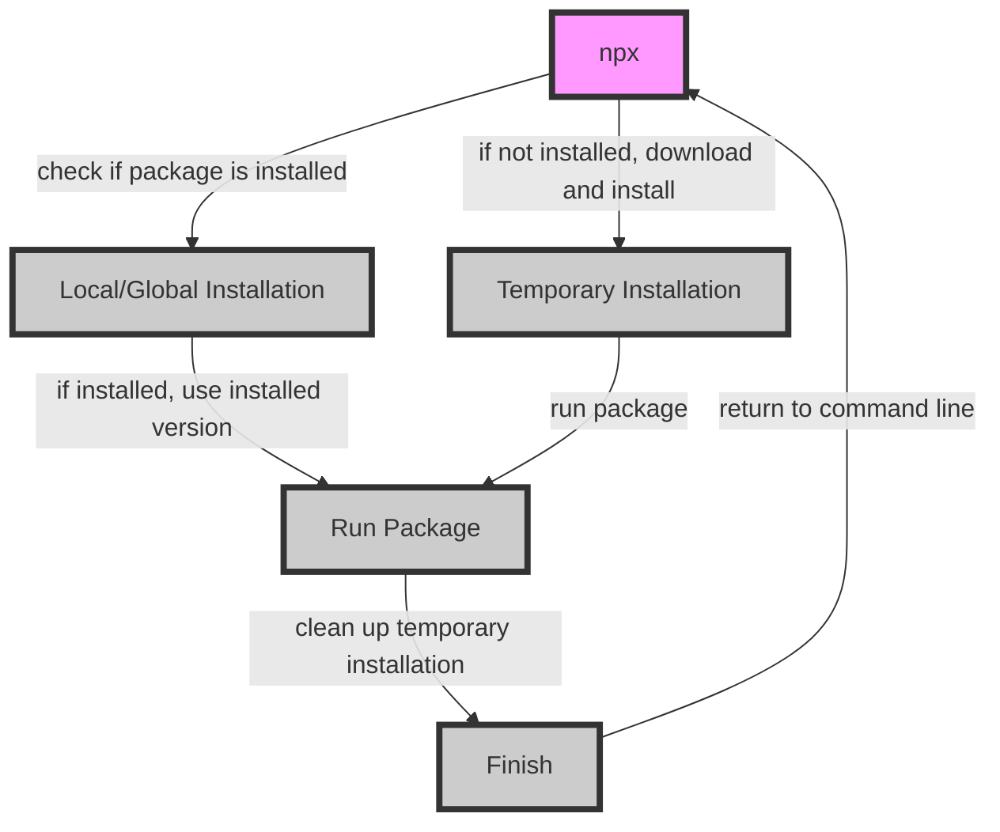

## Introduction
**npx** is a package runner tool that comes bundled with **npm**, the package manager for **Node.js**. It allows developers to run packages without installing them locally or globally. **npx** is a powerful tool that has changed the way developers work with packages, making it easier to try out new packages and tools without cluttering their system with unnecessary installations. In this section, we will explore what **npx** is, why it matters, and its real-world relevance.

> **Note:** **npx** was first introduced in **npm** version 5.2.0, and it has been a game-changer for developers who want to try out new packages without installing them.

## Core Concepts
To understand **npx**, we need to define some key terms:
* **Package**: a collection of code, metadata, and dependencies that can be installed and used by other packages.
* **npm**: the package manager for **Node.js**, which allows developers to install, update, and manage packages.
* **npx**: a package runner tool that allows developers to run packages without installing them locally or globally.

> **Tip:** **npx** is not just limited to running packages; it can also be used to run scripts and commands.

## How It Works Internally
When you run a package with **npx**, here's what happens under the hood:
1. **npx** checks if the package is installed locally or globally. If it is, **npx** will use the installed version.
2. If the package is not installed, **npx** will download and install it temporarily in a cache directory.
3. **npx** will then run the package, passing any arguments and options to the package.
4. Once the package has finished running, **npx** will clean up the temporary installation.

> **Warning:** Be careful when using **npx** with packages that require root access or have security implications, as **npx** will run the package with the same permissions as the current user.

## Code Examples
### Example 1: Basic Usage
```javascript
// Run the 'create-react-app' package to create a new React app
npx create-react-app my-app
```
This will create a new React app in a directory called `my-app`.

### Example 2: Running a Script
```javascript
// Run a script from a package
npx cowsay "Hello World!"
```
This will run the `cowsay` script and print "Hello World!" in a cow-themed ASCII art.

### Example 3: Advanced Usage
```javascript
// Run a package with arguments and options
npx eslint --init
```
This will run the `eslint` package and initialize a new configuration file.

## Visual Diagram

This diagram illustrates the internal workflow of **npx**.

> **Note:** The diagram shows the different steps involved in running a package with **npx**, from checking if the package is installed to cleaning up the temporary installation.

## Comparison
| Approach | Time Complexity | Space Complexity | Pros | Cons | Best For |
| --- | --- | --- | --- | --- | --- |
| **npx** | O(1) | O(1) | Easy to use, no installation required | Limited control over package version | Running packages without installing them |
| **npm install** | O(n) | O(n) | More control over package version, can be used for dependencies | Requires installation, can clutter system | Installing packages for long-term use |
| **yarn** | O(n) | O(n) | Faster installation, better dependency management | Limited support for some packages | Installing packages for long-term use |
| **pnpm** | O(n) | O(n) | Faster installation, better dependency management | Limited support for some packages | Installing packages for long-term use |

> **Tip:** **npx** is best used for running packages that don't require installation or have security implications.

## Real-world Use Cases
1. **Create React App**: **npx** is used to create new React apps with the `create-react-app` package.
2. **ESLint**: **npx** is used to run the `eslint` package for linting and formatting code.
3. **Cowsay**: **npx** is used to run the `cowsay` script for printing ASCII art.

> **Interview:** Can you explain the difference between **npx** and **npm install**? How would you use **npx** in a real-world scenario?

## Common Pitfalls
1. **Security Risks**: Using **npx** with packages that require root access or have security implications can be risky.
2. **Package Versioning**: **npx** may not always use the latest version of a package, which can lead to compatibility issues.
3. **Temporary Installation**: **npx** may not always clean up the temporary installation, which can lead to clutter and security risks.

> **Warning:** Be careful when using **npx** with packages that have security implications or require root access.

## Interview Tips
1. **What is **npx****?**: **npx** is a package runner tool that comes bundled with **npm**.
2. **How does **npx** work?**: **npx** checks if a package is installed locally or globally, and if not, downloads and installs it temporarily.
3. **What are the benefits of using **npx****?**: **npx** is easy to use, requires no installation, and can be used for running packages without installing them.

> **Tip:** When answering questions about **npx**, be sure to explain its benefits and how it works internally.

## Key Takeaways
* **npx** is a package runner tool that comes bundled with **npm**.
* **npx** allows developers to run packages without installing them locally or globally.
* **npx** checks if a package is installed locally or globally, and if not, downloads and installs it temporarily.
* **npx** is easy to use, requires no installation, and can be used for running packages without installing them.
* **npx** has security implications and should be used with caution.
* **npx** is best used for running packages that don't require installation or have security implications.
* The time complexity of **npx** is O(1), and the space complexity is O(1).
* **npx** is a powerful tool that has changed the way developers work with packages.