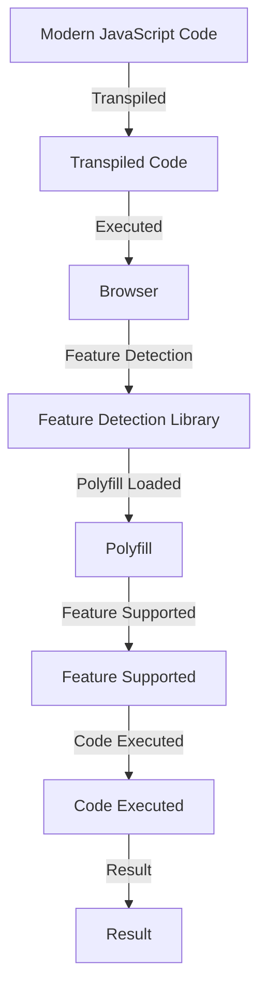

## Introduction
The **transpiling polyfill strategy** is a technique used in frontend development to ensure that modern JavaScript code can run on older browsers that do not support the latest features. This is achieved by using a polyfill, which is a piece of code that replicates the behavior of a newer feature, and a transpiler, which converts the modern code into a compatible format for older browsers. This strategy is crucial for developers who want to use the latest JavaScript features while still supporting a wide range of browsers.

In real-world scenarios, developers often encounter situations where they need to support older browsers, such as Internet Explorer, while still using modern JavaScript features like **async/await** or **destructuring**. The transpiling polyfill strategy provides a solution to this problem, allowing developers to write modern code while still ensuring compatibility with older browsers.

> **Note:** The transpiling polyfill strategy is not limited to JavaScript alone, but can also be applied to other programming languages, such as TypeScript or CoffeeScript.

## Core Concepts
To understand the transpiling polyfill strategy, it's essential to grasp the following core concepts:

* **Polyfill**: A piece of code that replicates the behavior of a newer feature, allowing older browsers to support it.
* **Transpiler**: A tool that converts modern code into a compatible format for older browsers.
* **Babel**: A popular transpiler that converts modern JavaScript code into compatible code for older browsers.
* **Feature detection**: The process of determining whether a browser supports a particular feature or not.

> **Tip:** When using the transpiling polyfill strategy, it's essential to use a feature detection library, such as Modernizr, to determine whether a browser supports a particular feature or not.

## How It Works Internally
The transpiling polyfill strategy works by using a transpiler, such as Babel, to convert modern code into a compatible format for older browsers. The transpiler uses a set of plugins, known as **presets**, to determine which features to support.

Here's a step-by-step breakdown of how it works:

1. The developer writes modern JavaScript code using the latest features.
2. The transpiler, such as Babel, is configured to use a preset that supports the desired features.
3. The transpiler converts the modern code into a compatible format for older browsers.
4. The polyfill is used to replicate the behavior of any features that are not supported by the older browser.

> **Warning:** When using the transpiling polyfill strategy, it's essential to ensure that the polyfill is correctly configured and loaded before the modern code is executed.

## Code Examples
Here are three complete and runnable code examples that demonstrate the transpiling polyfill strategy:

### Example 1: Basic Usage
```javascript
// Modern JavaScript code using async/await
async functionExample() {
  try {
    const response = await fetch('https://api.example.com/data');
    const data = await response.json();
    console.log(data);
  } catch (error) {
    console.error(error);
  }
}

// Transpiled code using Babel
functionExample() {
  return Promise.resolve().then(function () {
    return fetch('https://api.example.com/data');
  }).then(function (response) {
    return response.json();
  }).then(function (data) {
    console.log(data);
  }).catch(function (error) {
    console.error(error);
  });
}
```

### Example 2: Real-World Pattern
```javascript
// Modern JavaScript code using destructuring
function getUserData() {
  const { name, email } = {
    name: 'John Doe',
    email: 'john.doe@example.com'
  };
  console.log(name, email);
}

// Transpiled code using Babel
function getUserData() {
  var _ref = {
    name: 'John Doe',
    email: 'john.doe@example.com'
  };
  var name = _ref.name;
  var email = _ref.email;
  console.log(name, email);
}
```

### Example 3: Advanced Usage
```javascript
// Modern JavaScript code using dynamic imports
function loadModule() {
  import('./module.js').then(function (module) {
    console.log(module);
  });
}

// Transpiled code using Babel
function loadModule() {
  return Promise.resolve().then(function () {
    return import(/* webpackChunkName: "module" */ './module.js');
  }).then(function (module) {
    console.log(module);
  });
}
```

## Visual Diagram

The above diagram illustrates the transpiling polyfill strategy, showing how modern JavaScript code is transpiled into compatible code for older browsers, and how the polyfill is used to replicate the behavior of unsupported features.

## Comparison
Here's a comparison table showing the different approaches to supporting older browsers:

| Approach | Time Complexity | Space Complexity | Pros | Cons | Best For |
| --- | --- | --- | --- | --- | --- |
| Transpiling Polyfill Strategy | O(n) | O(n) | Supports modern features, compatible with older browsers | Increases code size, requires feature detection | Large-scale applications, enterprise environments |
| Feature Detection | O(1) | O(1) | Fast and efficient, detects feature support | Limited to feature detection, does not provide polyfill | Small-scale applications, simple feature detection |
| Browser Sniffing | O(1) | O(1) | Fast and efficient, detects browser type | Limited to browser detection, does not provide polyfill | Legacy applications, simple browser detection |
| Manual Polyfill | O(n) | O(n) | Provides custom polyfill, supports modern features | Requires manual implementation, increases code size | Small-scale applications, custom polyfill implementation |

> **Interview:** When asked about the transpiling polyfill strategy, be prepared to explain the benefits and drawbacks of using this approach, as well as the different tools and techniques involved.

## Real-world Use Cases
Here are three real-world use cases for the transpiling polyfill strategy:

1. **Google**: Google uses the transpiling polyfill strategy to support older browsers in their web applications, such as Google Maps and Google Drive.
2. **Facebook**: Facebook uses the transpiling polyfill strategy to support older browsers in their web applications, such as Facebook and Instagram.
3. **Microsoft**: Microsoft uses the transpiling polyfill strategy to support older browsers in their web applications, such as Office Online and Outlook.com.

## Common Pitfalls
Here are four common pitfalls to watch out for when using the transpiling polyfill strategy:

1. **Incorrect Polyfill Configuration**: Failing to correctly configure the polyfill can result in unsupported features not being replicated.
```javascript
// Incorrect polyfill configuration
import 'babel-polyfill';
```
```javascript
// Correct polyfill configuration
import 'babel-polyfill/dist/polyfill';
```
2. **Insufficient Feature Detection**: Failing to use feature detection can result in unsupported features being used, causing errors.
```javascript
// Insufficient feature detection
function example() {
  // Use unsupported feature
}
```
```javascript
// Correct feature detection
function example() {
  if (window.Promise) {
    // Use supported feature
  } else {
    // Use polyfill
  }
}
```
3. **Inadequate Error Handling**: Failing to handle errors can result in unexpected behavior or crashes.
```javascript
// Inadequate error handling
function example() {
  try {
    // Code that may throw an error
  } catch (error) {
    // Ignore error
  }
}
```
```javascript
// Correct error handling
function example() {
  try {
    // Code that may throw an error
  } catch (error) {
    // Handle error
    console.error(error);
  }
}
```
4. **Inconsistent Code Style**: Failing to maintain a consistent code style can result in confusion or errors.
```javascript
// Inconsistent code style
function example() {
  // Use inconsistent naming convention
  var fooBar = 'example';
}
```
```javascript
// Correct code style
function example() {
  // Use consistent naming convention
  var fooBar = 'example';
}
```

> **Tip:** When using the transpiling polyfill strategy, it's essential to follow best practices, such as using feature detection and error handling, to ensure reliable and maintainable code.

## Interview Tips
Here are three common interview questions related to the transpiling polyfill strategy, along with weak and strong answers:

1. **What is the transpiling polyfill strategy?**
Weak answer: "It's a way to make modern code work on older browsers."
Strong answer: "The transpiling polyfill strategy is a technique used to ensure that modern JavaScript code can run on older browsers that do not support the latest features. It involves using a transpiler, such as Babel, to convert modern code into a compatible format for older browsers, and a polyfill to replicate the behavior of unsupported features."
2. **How do you handle feature detection in your code?**
Weak answer: "I use a library like Modernizr to detect features."
Strong answer: "I use a combination of feature detection libraries, such as Modernizr, and manual feature detection to ensure that my code is compatible with a wide range of browsers. I also use techniques like progressive enhancement to provide a basic experience for older browsers and enhance it for modern browsers."
3. **What are some common pitfalls to watch out for when using the transpiling polyfill strategy?**
Weak answer: "I'm not sure, but I think it's just a matter of using the right tools and following best practices."
Strong answer: "Some common pitfalls to watch out for when using the transpiling polyfill strategy include incorrect polyfill configuration, insufficient feature detection, inadequate error handling, and inconsistent code style. To avoid these pitfalls, I follow best practices, such as using feature detection and error handling, and maintaining a consistent code style."

> **Warning:** When answering interview questions related to the transpiling polyfill strategy, be prepared to provide specific examples and explain the trade-offs and limitations of different approaches.

## Key Takeaways
Here are ten key takeaways to remember when using the transpiling polyfill strategy:

* **Use a transpiler**, such as Babel, to convert modern code into a compatible format for older browsers.
* **Use a polyfill** to replicate the behavior of unsupported features.
* **Use feature detection** to determine whether a browser supports a particular feature or not.
* **Use error handling** to handle errors and unexpected behavior.
* **Maintain a consistent code style** to avoid confusion or errors.
* **Use progressive enhancement** to provide a basic experience for older browsers and enhance it for modern browsers.
* **Test your code** thoroughly to ensure compatibility and reliability.
* **Use a combination of tools and techniques** to ensure compatibility and reliability.
* **Follow best practices** to avoid common pitfalls and ensure maintainable code.
* **Stay up-to-date** with the latest developments and best practices in the field of frontend development.

> **Note:** The transpiling polyfill strategy is a powerful technique for ensuring compatibility and reliability in frontend development, but it requires careful consideration and attention to detail to avoid common pitfalls and ensure maintainable code.