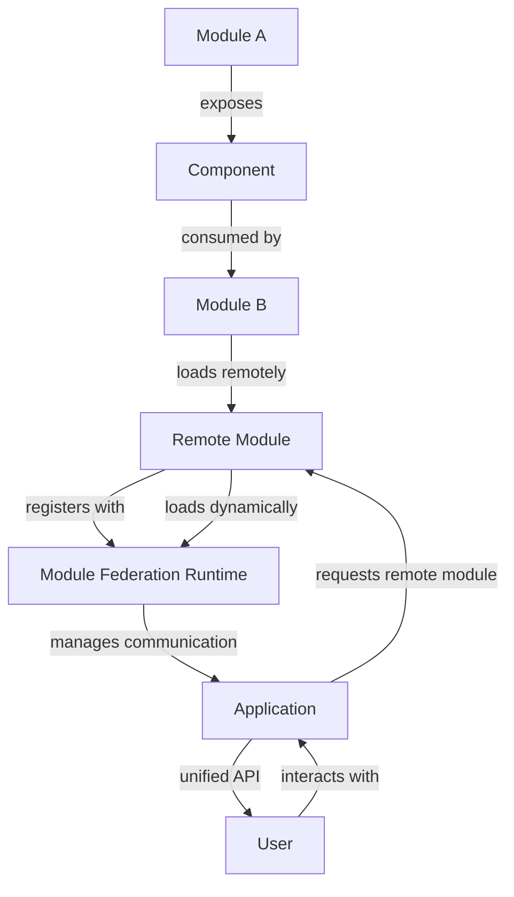

## Introduction
**Module Federation** is a powerful pattern for building scalable and maintainable frontend applications. It allows multiple independent teams to work on different features of an application, each with their own build and deployment process, while still providing a seamless user experience. In this section, we will explore the concept of Module Federation, its importance, and its real-world relevance. 
> **Note:** Module Federation is particularly useful in large-scale applications where multiple teams are working on different features, as it enables each team to work independently without affecting the overall application.

## Core Concepts
To understand Module Federation, we need to grasp some key concepts:
- **Federated Modules**: These are independent modules that are built and deployed separately, but can be combined to form a single application.
- **Module Federation Runtime**: This is the layer that manages the communication between federated modules, providing a unified API for the application.
- **Remote Modules**: These are modules that are loaded remotely, either from a different build process or from a different team.
- **Host Modules**: These are modules that host remote modules, providing a container for them to run in.
> **Warning:** One common pitfall when implementing Module Federation is to underestimate the complexity of managing multiple independent builds and deployments. It's essential to have a solid understanding of the underlying architecture and the communication between modules.

## How It Works Internally
Module Federation works by using a combination of Webpack's **Module Federation Plugin** and a custom runtime layer. Here's a step-by-step breakdown of the process:
1. **Build Time**: Each team builds their own module using Webpack, configuring the Module Federation Plugin to specify the modules that will be federated.
2. **Runtime**: The Module Federation Runtime is initialized, which manages the communication between federated modules.
3. **Remote Module Loading**: When a remote module is requested, the runtime loads it dynamically, using a combination of Webpack's **jsonp** and **fetch** APIs.
4. **Module Registration**: Once a remote module is loaded, it is registered with the runtime, which provides a unified API for the application.
> **Tip:** To optimize the performance of Module Federation, it's essential to use a caching mechanism, such as **Service Worker**, to cache remote modules and reduce the number of network requests.

## Code Examples
### Example 1: Basic Module Federation
```javascript
// module-a.js
import { createModule } from '@webpack/module-federation';

const moduleA = createModule({
  name: 'module-a',
  exposes: {
    './Component': './Component',
  },
});

export default moduleA;
```

```javascript
// module-b.js
import { createModule } from '@webpack/module-federation';

const moduleB = createModule({
  name: 'module-b',
  remotes: {
    moduleA: 'http://localhost:3001/module-a/remoteEntry.js',
  },
});

export default moduleB;
```
This example demonstrates a basic Module Federation setup, where **module-a** exposes a component, and **module-b** consumes it remotely.

### Example 2: Advanced Module Federation with Caching
```javascript
// module-a.js
import { createModule } from '@webpack/module-federation';
import { CacheManager } from './cache-manager';

const cacheManager = new CacheManager();

const moduleA = createModule({
  name: 'module-a',
  exposes: {
    './Component': './Component',
  },
  caching: true,
  cacheManager,
});

export default moduleA;
```

```javascript
// cache-manager.js
import { ServiceWorker } from './service-worker';

class CacheManager {
  constructor() {
    this.serviceWorker = new ServiceWorker();
  }

  async cacheModule(module) {
    await this.serviceWorker.register();
    await this.serviceWorker.cacheModule(module);
  }
}

export default CacheManager;
```
This example demonstrates an advanced Module Federation setup, where caching is enabled using a custom **CacheManager** class and a **ServiceWorker**.

### Example 3: Module Federation with Error Handling
```javascript
// module-a.js
import { createModule } from '@webpack/module-federation';

const moduleA = createModule({
  name: 'module-a',
  exposes: {
    './Component': './Component',
  },
  errorHandling: true,
});

export default moduleA;
```

```javascript
// error-handler.js
import { ErrorHandler } from './error-handler';

class ErrorHandler {
  constructor() {}

  async handleError(error) {
    console.error(error);
  }
}

export default ErrorHandler;
```
This example demonstrates a Module Federation setup with error handling, where errors are caught and handled using a custom **ErrorHandler** class.

## Visual Diagram

This diagram illustrates the Module Federation pattern, showing how modules are exposed, consumed, and loaded remotely, and how the runtime manages communication between them.

## Comparison
| Approach | Time Complexity | Space Complexity | Pros | Cons | Best For |
| --- | --- | --- | --- | --- | --- |
| Module Federation | O(n) | O(n) | Scalable, maintainable, and flexible | Complex setup, caching required | Large-scale applications with multiple teams |
| Monolithic Architecture | O(1) | O(1) | Simple setup, easy to maintain | Limited scalability, inflexible | Small-scale applications with a single team |
| Microservices Architecture | O(n) | O(n) | Scalable, flexible, and maintainable | Complex setup, communication overhead | Large-scale applications with multiple teams and services |
| Serverless Architecture | O(1) | O(1) | Scalable, flexible, and cost-effective | Limited control, vendor lock-in | Small-scale applications with a single team and limited resources |

## Real-world Use Cases
1. **GitHub**: GitHub uses Module Federation to build its web application, allowing multiple teams to work on different features independently.
2. **Netflix**: Netflix uses a combination of Module Federation and Microservices Architecture to build its web application, providing a scalable and maintainable solution.
3. **Amazon**: Amazon uses a combination of Module Federation and Serverless Architecture to build its web application, providing a scalable and cost-effective solution.

## Common Pitfalls
1. **Insufficient Caching**: Failing to implement caching can lead to poor performance and increased network requests.
```javascript
// wrong
import { createModule } from '@webpack/module-federation';

const moduleA = createModule({
  name: 'module-a',
  exposes: {
    './Component': './Component',
  },
});

// right
import { createModule } from '@webpack/module-federation';
import { CacheManager } from './cache-manager';

const cacheManager = new CacheManager();

const moduleA = createModule({
  name: 'module-a',
  exposes: {
    './Component': './Component',
  },
  caching: true,
  cacheManager,
});
```
2. **Incorrect Module Registration**: Failing to register modules correctly can lead to errors and unexpected behavior.
```javascript
// wrong
import { createModule } from '@webpack/module-federation';

const moduleA = createModule({
  name: 'module-a',
  exposes: {
    './Component': './Component',
  },
});

// right
import { createModule } from '@webpack/module-federation';

const moduleA = createModule({
  name: 'module-a',
  exposes: {
    './Component': './Component',
  },
});

moduleA.register();
```
3. **Inadequate Error Handling**: Failing to implement error handling can lead to unexpected behavior and poor user experience.
```javascript
// wrong
import { createModule } from '@webpack/module-federation';

const moduleA = createModule({
  name: 'module-a',
  exposes: {
    './Component': './Component',
  },
});

// right
import { createModule } from '@webpack/module-federation';
import { ErrorHandler } from './error-handler';

const errorHandler = new ErrorHandler();

const moduleA = createModule({
  name: 'module-a',
  exposes: {
    './Component': './Component',
  },
  errorHandling: true,
  errorHandler,
});
```
4. **Inconsistent Module Versions**: Failing to manage module versions correctly can lead to compatibility issues and unexpected behavior.
```javascript
// wrong
import { createModule } from '@webpack/module-federation';

const moduleA = createModule({
  name: 'module-a',
  exposes: {
    './Component': './Component',
  },
  version: '1.0.0',
});

// right
import { createModule } from '@webpack/module-federation';

const moduleA = createModule({
  name: 'module-a',
  exposes: {
    './Component': './Component',
  },
  version: '1.0.0',
  versioning: true,
});
```
> **Interview:** Can you explain the differences between Module Federation and Microservices Architecture? How would you choose between the two approaches for a large-scale application?

## Interview Tips
1. **Be prepared to explain the trade-offs**: Be prepared to discuss the pros and cons of Module Federation, including its scalability, maintainability, and complexity.
2. **Showcase your understanding of caching**: Be prepared to explain how caching works in Module Federation, including the use of Service Workers and caching libraries.
3. **Demonstrate your knowledge of error handling**: Be prepared to explain how error handling works in Module Federation, including the use of custom error handlers and error handling libraries.
4. **Explain the importance of module versioning**: Be prepared to discuss the importance of module versioning in Module Federation, including the use of versioning libraries and best practices.

## Key Takeaways
* Module Federation is a powerful pattern for building scalable and maintainable frontend applications.
* Caching is essential for improving performance in Module Federation.
* Error handling is critical for providing a good user experience in Module Federation.
* Module versioning is important for ensuring compatibility and avoiding unexpected behavior in Module Federation.
* Module Federation is suitable for large-scale applications with multiple teams and services.
* Microservices Architecture is suitable for large-scale applications with multiple teams and services, but may require more overhead and complexity.
* Serverless Architecture is suitable for small-scale applications with limited resources, but may require more control and customization.
* Module Federation has a time complexity of O(n) and a space complexity of O(n), making it suitable for large-scale applications.
* Module Federation requires a good understanding of Webpack, caching, and error handling to implement correctly.