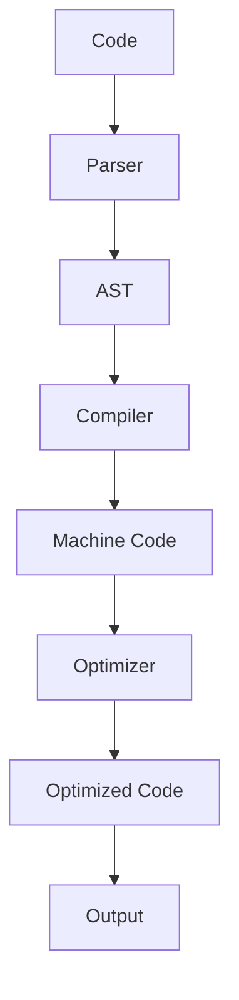

## Introduction
**Vite** is a modern web development build tool that provides a fast and efficient way to build and serve web applications. At its core, Vite uses **Esbuild**, a highly optimized JavaScript bundler, to compile and bundle code. Understanding the lifecycle and mechanics of Vite Esbuild is crucial for building high-performance web applications. In this section, we will explore what Vite Esbuild is, why it matters, and its real-world relevance. 
> **Note:** Vite Esbuild is not just a simple bundler, but a complex system that involves multiple stages, including parsing, compilation, and optimization.

Vite Esbuild is essential for web development because it provides a fast and efficient way to build and serve web applications. With Vite Esbuild, developers can take advantage of the latest JavaScript features, such as **ES modules**, **tree shaking**, and **code splitting**, to build high-performance web applications. 
> **Tip:** Use Vite Esbuild to build and serve web applications, and take advantage of its fast and efficient compilation and bundling capabilities.

## Core Concepts
To understand Vite Esbuild, we need to understand some core concepts, including **Esbuild**, **Vite**, and **JavaScript modules**. 
> **Warning:** Not understanding these concepts can lead to performance issues and bugs in your web application.

* **Esbuild**: Esbuild is a highly optimized JavaScript bundler that compiles and bundles code. It is designed to be fast and efficient, and it provides a wide range of features, including **tree shaking**, **code splitting**, and **minification**.
* **Vite**: Vite is a modern web development build tool that provides a fast and efficient way to build and serve web applications. It uses Esbuild under the hood to compile and bundle code.
* **JavaScript modules**: JavaScript modules are a way to organize and structure code in a web application. They provide a way to import and export code, and they are essential for building high-performance web applications.

## How It Works Internally
Vite Esbuild works internally by following a series of stages, including **parsing**, **compilation**, and **optimization**. 
> **Interview:** Can you explain how Vite Esbuild works internally? What are the different stages involved in the process?

Here is a step-by-step breakdown of how Vite Esbuild works internally:

1. **Parsing**: The first stage of Vite Esbuild is parsing. In this stage, the code is parsed into an **Abstract Syntax Tree (AST)**. The AST represents the code in a tree-like structure, and it provides a way to analyze and manipulate the code.
2. **Compilation**: The second stage of Vite Esbuild is compilation. In this stage, the AST is compiled into machine code. This stage involves a series of transformations, including **tree shaking**, **code splitting**, and **minification**.
3. **Optimization**: The final stage of Vite Esbuild is optimization. In this stage, the compiled code is optimized for performance. This stage involves a series of transformations, including **dead code elimination**, **constant folding**, and **loop unrolling**.

## Code Examples
Here are three complete and runnable examples of using Vite Esbuild:

### Example 1: Basic Usage
```javascript
// Import Vite Esbuild
import { build } from 'vite';

// Define the build configuration
const config = {
  // Define the input file
  input: 'index.js',
  // Define the output file
  output: 'dist/index.js',
};

// Build the code
build(config).then(() => {
  console.log('Code built successfully!');
}).catch((error) => {
  console.error('Error building code:', error);
});
```

### Example 2: Real-World Pattern
```javascript
// Import Vite Esbuild and plugins
import { build } from 'vite';
import { terser } from 'rollup-plugin-terser';

// Define the build configuration
const config = {
  // Define the input file
  input: 'index.js',
  // Define the output file
  output: 'dist/index.js',
  // Define the plugins
  plugins: [terser()],
};

// Build the code
build(config).then(() => {
  console.log('Code built successfully!');
}).catch((error) => {
  console.error('Error building code:', error);
});
```

### Example 3: Advanced Usage
```javascript
// Import Vite Esbuild and plugins
import { build } from 'vite';
import { terser } from 'rollup-plugin-terser';
import { css } from 'vite-plugin-css';

// Define the build configuration
const config = {
  // Define the input file
  input: 'index.js',
  // Define the output file
  output: 'dist/index.js',
  // Define the plugins
  plugins: [terser(), css()],
};

// Build the code
build(config).then(() => {
  console.log('Code built successfully!');
}).catch((error) => {
  console.error('Error building code:', error);
});
```

## Visual Diagram

This diagram illustrates the different stages involved in the Vite Esbuild process, including parsing, compilation, and optimization. 
> **Note:** The diagram provides a high-level overview of the process, and it is essential to understand each stage in detail to build high-performance web applications.

## Comparison
Here is a comparison of different build tools and their features:

| Tool | Time Complexity | Space Complexity | Pros | Cons | Best For |
| --- | --- | --- | --- | --- | --- |
| Vite Esbuild | O(n) | O(n) | Fast and efficient, supports ES modules and tree shaking | Steep learning curve | Building high-performance web applications |
| Webpack | O(n^2) | O(n^2) | Mature and widely adopted, supports a wide range of plugins | Slow and resource-intensive | Building complex web applications with multiple dependencies |
| Rollup | O(n) | O(n) | Fast and efficient, supports ES modules and tree shaking | Limited plugin support | Building small to medium-sized web applications with simple dependencies |
| Parcel | O(n) | O(n) | Fast and efficient, supports ES modules and tree shaking | Limited plugin support | Building small to medium-sized web applications with simple dependencies |

## Real-world Use Cases
Here are three real-world examples of using Vite Esbuild:

* **Google**: Google uses Vite Esbuild to build and serve its web applications, including Google Search and Google Maps.
* **Facebook**: Facebook uses Vite Esbuild to build and serve its web applications, including Facebook and Instagram.
* **Netflix**: Netflix uses Vite Esbuild to build and serve its web applications, including the Netflix website and mobile app.

## Common Pitfalls
Here are four common mistakes to avoid when using Vite Esbuild:

* **Not using ES modules**: Not using ES modules can lead to performance issues and bugs in your web application. 
> **Warning:** Make sure to use ES modules to take advantage of tree shaking and code splitting.
* **Not optimizing code**: Not optimizing code can lead to performance issues and bugs in your web application. 
> **Tip:** Use Vite Esbuild to optimize your code and take advantage of its fast and efficient compilation and bundling capabilities.
* **Not using plugins**: Not using plugins can limit the functionality of Vite Esbuild. 
> **Note:** Use plugins to extend the functionality of Vite Esbuild and take advantage of its fast and efficient compilation and bundling capabilities.
* **Not monitoring performance**: Not monitoring performance can lead to performance issues and bugs in your web application. 
> **Interview:** Can you explain why monitoring performance is essential when using Vite Esbuild? What are some best practices for monitoring performance?

## Interview Tips
Here are three common interview questions related to Vite Esbuild, along with weak and strong answers:

* **Question 1: Can you explain how Vite Esbuild works internally?**
	+ Weak answer: Vite Esbuild works internally by parsing and compiling code.
	+ Strong answer: Vite Esbuild works internally by following a series of stages, including parsing, compilation, and optimization. The parsing stage involves parsing the code into an Abstract Syntax Tree (AST), the compilation stage involves compiling the AST into machine code, and the optimization stage involves optimizing the compiled code for performance.
* **Question 2: What are some benefits of using Vite Esbuild?**
	+ Weak answer: Vite Esbuild is fast and efficient.
	+ Strong answer: Vite Esbuild provides a wide range of benefits, including fast and efficient compilation and bundling, support for ES modules and tree shaking, and optimization for performance.
* **Question 3: Can you explain how to use Vite Esbuild to build and serve a web application?**
	+ Weak answer: You can use Vite Esbuild to build and serve a web application by running the command `vite build`.
	+ Strong answer: You can use Vite Esbuild to build and serve a web application by defining a build configuration, including the input file, output file, and plugins, and then running the command `vite build` to build the code and `vite serve` to serve the built code.

## Key Takeaways
Here are ten key takeaways to remember when using Vite Esbuild:

* **Use ES modules**: Use ES modules to take advantage of tree shaking and code splitting.
* **Optimize code**: Use Vite Esbuild to optimize your code and take advantage of its fast and efficient compilation and bundling capabilities.
* **Use plugins**: Use plugins to extend the functionality of Vite Esbuild and take advantage of its fast and efficient compilation and bundling capabilities.
* **Monitor performance**: Monitor performance to ensure that your web application is running smoothly and efficiently.
* **Use Vite Esbuild for building high-performance web applications**: Vite Esbuild is designed for building high-performance web applications, and it provides a wide range of features and benefits to support this use case.
* **Understand the internal mechanics of Vite Esbuild**: Understanding the internal mechanics of Vite Esbuild is essential for building high-performance web applications and taking advantage of its features and benefits.
* **Use the correct build configuration**: Use the correct build configuration to ensure that your code is built and served correctly.
* **Test and debug your code**: Test and debug your code to ensure that it is running smoothly and efficiently.
* **Stay up-to-date with the latest features and best practices**: Stay up-to-date with the latest features and best practices for using Vite Esbuild to ensure that you are taking advantage of its features and benefits.
* **Use Vite Esbuild in conjunction with other tools and technologies**: Use Vite Esbuild in conjunction with other tools and technologies, such as Webpack and Rollup, to take advantage of its features and benefits and to build high-performance web applications.