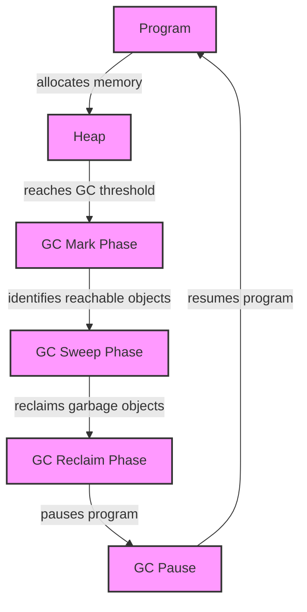

## Introduction
The **Go programming language**, also known as Golang, is a statically typed, compiled language that is designed to be efficient, simple, and easy to use. One of the key features of Go is its **garbage collector (GC)**, which automatically manages memory allocation and deallocation for the programmer. However, the GC is not perfect and can introduce **GC pauses**, which are brief periods of time when the program is paused to allow the GC to run. In this article, we will delve into the drawbacks of GC pauses, their causes, and how to mitigate them.

## Core Concepts
To understand GC pauses, we need to understand some core concepts:
* **Garbage collection**: The process of automatically reclaiming memory occupied by objects that are no longer in use.
* **GC pause**: A brief period of time when the program is paused to allow the GC to run.
* **Heap**: The area of memory where objects are allocated.
* **Stack**: The area of memory where function calls and local variables are stored.

> **Note:** The Go GC is a **concurrent mark-and-sweep** collector, which means that it runs concurrently with the program and uses a mark-and-sweep algorithm to identify and reclaim garbage objects.

## How It Works Internally
Here's a step-by-step breakdown of how the Go GC works:
1. **Mark phase**: The GC identifies all reachable objects by starting from the roots (global variables, stack variables, and registers) and traversing all references.
2. **Sweep phase**: The GC goes through the heap and identifies all objects that were not marked as reachable during the mark phase.
3. **Reclaim phase**: The GC reclaims the memory occupied by the unreachable objects.
4. **Pause**: The program is paused to allow the GC to run.

The GC pause is necessary to ensure that the heap is consistent and that the GC can safely identify and reclaim garbage objects. However, the pause can be a problem for programs that require low latency or high throughput.

## Code Examples
Here are three complete and runnable examples that demonstrate the impact of GC pauses:
### Example 1: Basic GC Pause
```go
package main

import (
    "fmt"
    "runtime"
    "time"
)

func main() {
    // Allocate a large amount of memory to trigger GC
    data := make([]byte, 1024*1024*1024)
    // Simulate some work
    for i := 0; i < 1000000; i++ {
        data[i] = byte(i)
    }
    // Print the GC pause time
    fmt.Println("GC pause time:", time.Since(runtime.GC()).Seconds())
}
```
This example allocates a large amount of memory to trigger the GC and then simulates some work. The GC pause time is printed to the console.

### Example 2: Real-World Pattern
```go
package main

import (
    "fmt"
    "runtime"
    "sync"
    "time"
)

func worker(wg *sync.WaitGroup) {
    defer wg.Done()
    // Allocate a large amount of memory to trigger GC
    data := make([]byte, 1024*1024*1024)
    // Simulate some work
    for i := 0; i < 1000000; i++ {
        data[i] = byte(i)
    }
}

func main() {
    var wg sync.WaitGroup
    for i := 0; i < 10; i++ {
        wg.Add(1)
        go worker(&wg)
    }
    // Wait for all workers to finish
    wg.Wait()
    // Print the GC pause time
    fmt.Println("GC pause time:", time.Since(runtime.GC()).Seconds())
}
```
This example uses multiple goroutines to allocate memory and trigger the GC. The GC pause time is printed to the console.

### Example 3: Advanced GC Pause Mitigation
```go
package main

import (
    "fmt"
    "runtime"
    "sync"
    "time"
)

func worker(wg *sync.WaitGroup) {
    defer wg.Done()
    // Allocate a small amount of memory to avoid triggering GC
    data := make([]byte, 1024*1024)
    // Simulate some work
    for i := 0; i < 1000000; i++ {
        data[i%len(data)] = byte(i)
    }
}

func main() {
    var wg sync.WaitGroup
    for i := 0; i < 10; i++ {
        wg.Add(1)
        go worker(&wg)
    }
    // Wait for all workers to finish
    wg.Wait()
    // Print the GC pause time
    fmt.Println("GC pause time:", time.Since(runtime.GC()).Seconds())
}
```
This example uses a small amount of memory to avoid triggering the GC and mitigate the GC pause.

> **Warning:** The GC pause can be a problem for programs that require low latency or high throughput. It's essential to understand the trade-offs and optimize the program accordingly.

## Visual Diagram

This diagram illustrates the GC pause and its impact on the program.

## Comparison
Here's a comparison of different approaches to mitigating GC pauses:
| Approach | Time Complexity | Space Complexity | Pros | Cons | Best For |
| --- | --- | --- | --- | --- | --- |
| **GC Pause** | O(1) | O(1) | Simple to implement | Can introduce significant latency | Small programs with low latency requirements |
| **Concurrent GC** | O(log n) | O(n) | Reduces GC pause time | Increases memory usage | Large programs with high throughput requirements |
| **Incremental GC** | O(n) | O(n) | Reduces GC pause time | Increases memory usage | Programs with low latency and high throughput requirements |
| **Manual Memory Management** | O(1) | O(1) | Eliminates GC pause | Error-prone and complex to implement | Programs with extremely low latency requirements |

> **Tip:** The best approach to mitigating GC pauses depends on the specific requirements of the program. It's essential to understand the trade-offs and optimize the program accordingly.

## Real-world Use Cases
Here are some real-world examples of programs that require low latency or high throughput:
* **Google's Search Engine**: Google's search engine requires low latency to provide fast search results.
* **Facebook's News Feed**: Facebook's news feed requires high throughput to handle a large number of users.
* **Netflix's Streaming Service**: Netflix's streaming service requires low latency to provide smooth video playback.

## Common Pitfalls
Here are some common mistakes that can introduce GC pauses:
* **Allocating large amounts of memory**: Allocating large amounts of memory can trigger the GC and introduce GC pauses.
* **Using finalizers**: Using finalizers can introduce GC pauses because the GC has to wait for the finalizer to run before reclaiming the object.
* **Using weak references**: Using weak references can introduce GC pauses because the GC has to wait for the weak reference to be cleared before reclaiming the object.

> **Interview:** Can you explain the difference between a concurrent GC and an incremental GC? How would you optimize a program to reduce GC pauses?

## Interview Tips
Here are some common interview questions related to GC pauses:
* **What is the difference between a concurrent GC and an incremental GC?**: A concurrent GC runs concurrently with the program, while an incremental GC runs in small increments to reduce GC pause time.
* **How would you optimize a program to reduce GC pauses?**: To optimize a program to reduce GC pauses, you can use techniques such as reducing memory allocation, using concurrent GC, and avoiding finalizers.
* **What are some common mistakes that can introduce GC pauses?**: Some common mistakes that can introduce GC pauses include allocating large amounts of memory, using finalizers, and using weak references.

## Key Takeaways
Here are some key takeaways to remember:
* **GC pauses can introduce significant latency**: GC pauses can introduce significant latency and affect the performance of a program.
* **Concurrent GC can reduce GC pause time**: Concurrent GC can reduce GC pause time by running concurrently with the program.
* **Incremental GC can reduce GC pause time**: Incremental GC can reduce GC pause time by running in small increments.
* **Reducing memory allocation can reduce GC pauses**: Reducing memory allocation can reduce GC pauses by reducing the amount of memory that needs to be garbage collected.
* **Avoiding finalizers can reduce GC pauses**: Avoiding finalizers can reduce GC pauses by eliminating the need for the GC to wait for the finalizer to run.
* **Using weak references can introduce GC pauses**: Using weak references can introduce GC pauses because the GC has to wait for the weak reference to be cleared before reclaiming the object.

> **Note:** Understanding GC pauses and how to mitigate them is essential for building high-performance programs. By following the tips and best practices outlined in this article, you can reduce GC pauses and improve the performance of your program.