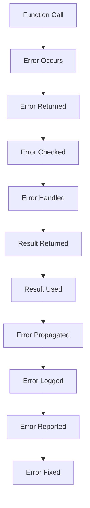

## Introduction
The **Go programming language**, also known as **Golang**, has a unique approach to error handling. Unlike many other languages, Go does not have a built-in exception mechanism. Instead, it relies on manual error handling using **error types** and **multiple return values**. This design choice has both advantages and disadvantages, which we will explore in this article. In real-world production systems, understanding Go's error handling mechanisms is crucial for writing robust and reliable code. For example, companies like **Google**, **Netflix**, and **Dropbox** all use Go in their production environments and must navigate its error handling landscape.

## Core Concepts
In Go, an **error** is a value that implements the **error interface**, which is defined as:
```go
type error interface {
    Error() string
}
```
This interface has a single method, **Error**, which returns a string describing the error. The **errors** package provides a **New** function for creating new error values:
```go
func New(text string) error {
    return &errorString{text}
}
```
A **errorString** is a simple struct that implements the **error** interface:
```go
type errorString struct {
    s string
}

func (e *errorString) Error() string {
    return e.s
}
```
The **fmt** package provides functions like **Errorf** for creating error values with formatted strings:
```go
func Errorf(format string, a ...interface{}) error {
    return errors.New(fmt.Sprintf(format, a...))
}
```
> **Note:** Go's error handling is designed to be explicit and manual, encouraging developers to handle errors as close to the point of occurrence as possible.

## How It Works Internally
When a function returns an error, it is typically done using a **multiple return value**:
```go
func foo() (string, error) {
    // ...
    if err != nil {
        return "", err
    }
    return "result", nil
}
```
The **error** value is returned as a separate value from the main result. The caller can then check the **error** value to determine if an error occurred:
```go
result, err := foo()
if err != nil {
    // handle error
}
```
> **Warning:** Failing to check the **error** value can lead to silent failures and make debugging more difficult.

## Code Examples
### Example 1: Basic Error Handling
```go
package main

import (
    "errors"
    "fmt"
)

func divide(a, b float64) (float64, error) {
    if b == 0 {
        return 0, errors.New("division by zero")
    }
    return a / b, nil
}

func main() {
    result, err := divide(10, 0)
    if err != nil {
        fmt.Println(err)
    } else {
        fmt.Println(result)
    }
}
```
### Example 2: Real-World Error Handling
```go
package main

import (
    "database/sql"
    "errors"
    "fmt"
)

func getUser(id int) (*User, error) {
    db, err := sql.Open("mysql", "user:password@tcp(localhost:3306)/database")
    if err != nil {
        return nil, err
    }
    defer db.Close()

    row := db.QueryRow("SELECT * FROM users WHERE id = ?", id)
    if row == nil {
        return nil, errors.New("user not found")
    }

    var user User
    err = row.Scan(&user.ID, &user.Name, &user.Email)
    if err != nil {
        return nil, err
    }

    return &user, nil
}

func main() {
    user, err := getUser(1)
    if err != nil {
        fmt.Println(err)
    } else {
        fmt.Println(user)
    }
}
```
### Example 3: Advanced Error Handling with Wrapping
```go
package main

import (
    "errors"
    "fmt"
)

type wrappedError struct {
    error
    msg string
}

func wrapError(err error, msg string) error {
    return &wrappedError{err, msg}
}

func foo() error {
    return errors.New("original error")
}

func main() {
    err := foo()
    err = wrapError(err, "wrapped error")
    fmt.Println(err)
}
```
> **Tip:** Using **wrapped errors** can help provide additional context and debugging information.

## Visual Diagram

This diagram illustrates the flow of error handling in a Go program, from the occurrence of an error to its handling and propagation.

## Comparison
| Approach | Time Complexity | Space Complexity | Pros | Cons | Best For |
| --- | --- | --- | --- | --- | --- |
| Manual Error Handling | O(1) | O(1) | Explicit, flexible | Verbose, error-prone | Go programs, systems requiring high reliability |
| Exception-Based Error Handling | O(log n) | O(n) | Concise, easy to use | Implicit, less flexible | Languages like Java, C++, systems requiring rapid development |
| Error Codes | O(1) | O(1) | Simple, efficient | Limited expressiveness | Systems with simple error handling requirements |
| Retry Mechanisms | O(n) | O(n) | Robust, fault-tolerant | Complex, resource-intensive | Distributed systems, cloud computing |

> **Interview:** Can you explain the trade-offs between manual error handling and exception-based error handling? How would you choose between these approaches in a real-world project?

## Real-world Use Cases
1. **Google's Cloud Storage**: Uses Go's manual error handling to ensure robust and reliable data storage and retrieval.
2. **Netflix's API Gateway**: Employs a combination of manual error handling and retry mechanisms to provide a highly available and fault-tolerant API gateway.
3. **Dropbox's File Sync**: Utilizes Go's error handling mechanisms to ensure seamless and reliable file synchronization across devices.

## Common Pitfalls
1. **Unchecked Errors**: Failing to check the **error** value returned by a function can lead to silent failures and make debugging more difficult.
```go
func foo() (string, error) {
    // ...
    return "", errors.New("error occurred")
}

func main() {
    result, _ := foo() // unchecked error
    fmt.Println(result)
}
```
2. **Error Swallowing**: Ignoring or swallowing errors can make it difficult to diagnose and fix issues.
```go
func foo() error {
    // ...
    return errors.New("error occurred")
}

func main() {
    err := foo()
    if err != nil {
        // swallow error
    }
}
```
3. **Incorrect Error Wrapping**: Failing to properly wrap errors can lead to loss of context and debugging information.
```go
func foo() error {
    // ...
    return errors.New("error occurred")
}

func main() {
    err := foo()
    err = wrapError(err, "") // incorrect error wrapping
    fmt.Println(err)
}
```
4. **Inadequate Error Logging**: Failing to log errors can make it difficult to diagnose and fix issues.
```go
func foo() error {
    // ...
    return errors.New("error occurred")
}

func main() {
    err := foo()
    if err != nil {
        // inadequate error logging
    }
}
```
> **Warning:** These pitfalls can lead to serious issues and should be avoided in production code.

## Interview Tips
1. **What is the difference between manual error handling and exception-based error handling?**: A good answer should discuss the trade-offs between these approaches, including explicitness, flexibility, and conciseness.
2. **How do you handle errors in a Go program?**: A strong answer should describe the use of **error** values, **multiple return values**, and **error wrapping**.
3. **What are some common pitfalls to avoid when handling errors in Go?**: A good answer should discuss unchecked errors, error swallowing, incorrect error wrapping, and inadequate error logging.

## Key Takeaways
* Go's manual error handling is explicit and flexible, but can be verbose and error-prone.
* **Error** values and **multiple return values** are used to handle errors in Go.
* **Wrapped errors** can provide additional context and debugging information.
* Error handling should be done as close to the point of occurrence as possible.
* **Unchecked errors**, **error swallowing**, **incorrect error wrapping**, and **inadequate error logging** are common pitfalls to avoid.
* Go's error handling mechanisms are well-suited for systems requiring high reliability and robustness.
* The time complexity of manual error handling is O(1), while the space complexity is also O(1).
* The time complexity of exception-based error handling is O(log n), while the space complexity is O(n).