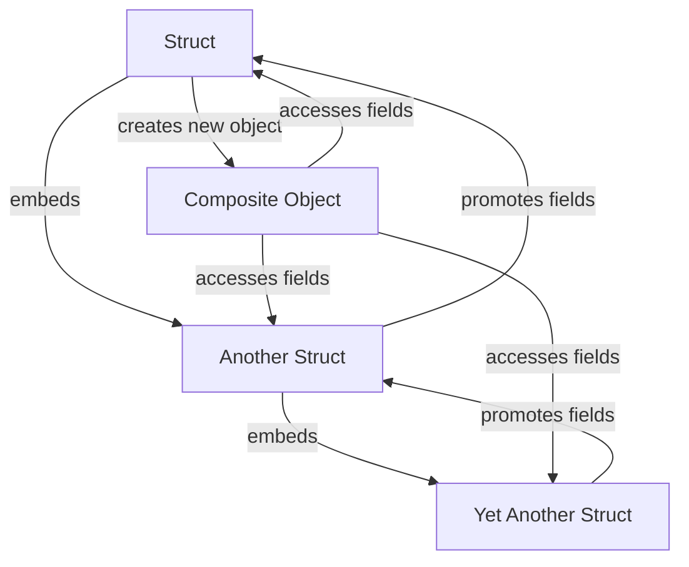

## Introduction
The Go programming language, also known as Golang, has a unique approach to object-oriented programming (OOP). Unlike other languages, Go does not support inheritance in the classical sense. Instead, it uses a composition-only approach, where objects are composed of other objects rather than inheriting their properties. This design choice has significant implications for software development and is a key aspect of the Go language.

> **Note:** The lack of inheritance in Go is a deliberate design choice, intended to promote a more modular and flexible approach to programming. By using composition instead of inheritance, developers can create more complex objects by combining simpler ones, rather than relying on a rigid hierarchy of classes.

In real-world applications, the composition-only approach has proven to be highly effective. For example, the Go standard library uses composition extensively to build complex data structures and algorithms. By understanding how composition works in Go, developers can write more efficient, scalable, and maintainable code.

## Core Concepts
To understand the composition-only approach in Go, it's essential to grasp the following core concepts:

* **Structs**: In Go, a struct is a collection of fields, which can be thought of as a container for data. Structs are the building blocks of Go's composition-only approach.
* **Embedding**: Embedding is the process of including one struct within another. This allows developers to create complex objects by combining simpler ones.
* **Composition**: Composition is the act of creating a new object by combining multiple structs. This approach promotes a more modular and flexible way of programming.

> **Tip:** When using composition in Go, it's essential to understand the difference between embedding and composition. Embedding is a way to include one struct within another, while composition is the act of creating a new object by combining multiple structs.

## How It Works Internally
To understand how the composition-only approach works internally, let's take a closer look at the Go language's under-the-hood mechanics.

When a struct is embedded within another, the embedded struct's fields are promoted to the outer struct. This means that the outer struct can access the embedded struct's fields directly.

Here's a step-by-step breakdown of how composition works in Go:

1. **Struct definition**: A struct is defined with a set of fields.
2. **Embedding**: Another struct is embedded within the first struct.
3. **Field promotion**: The embedded struct's fields are promoted to the outer struct.
4. **Composition**: A new object is created by combining multiple structs.

> **Warning:** When using composition in Go, it's essential to avoid circular dependencies between structs. Circular dependencies can lead to infinite recursion and crashes.

## Code Examples
Here are three complete and runnable examples that demonstrate the composition-only approach in Go:

### Example 1: Basic Composition
```go
// Define a simple struct
type Person struct {
    name string
    age  int
}

// Define a struct that embeds Person
type Employee struct {
    Person
    department string
}

func main() {
    // Create a new Employee object
    employee := Employee{
        Person: Person{
            name: "John Doe",
            age:  30,
        },
        department: "Sales",
    }

    // Access the employee's fields
    fmt.Println(employee.name)  // Output: John Doe
    fmt.Println(employee.age)    // Output: 30
    fmt.Println(employee.department)  // Output: Sales
}
```

### Example 2: Composition with Multiple Structs
```go
// Define a struct for Address
type Address struct {
    street string
    city   string
    state  string
    zip    string
}

// Define a struct for Person
type Person struct {
    name string
    age  int
    Address
}

// Define a struct for Employee that embeds Person
type Employee struct {
    Person
    department string
}

func main() {
    // Create a new Employee object
    employee := Employee{
        Person: Person{
            name: "John Doe",
            age:  30,
            Address: Address{
                street: "123 Main St",
                city:   "Anytown",
                state:  "CA",
                zip:    "12345",
            },
        },
        department: "Sales",
    }

    // Access the employee's fields
    fmt.Println(employee.name)  // Output: John Doe
    fmt.Println(employee.age)    // Output: 30
    fmt.Println(employee.street)  // Output: 123 Main St
    fmt.Println(employee.city)    // Output: Anytown
    fmt.Println(employee.state)    // Output: CA
    fmt.Println(employee.zip)      // Output: 12345
    fmt.Println(employee.department)  // Output: Sales
}
```

### Example 3: Advanced Composition with Interfaces
```go
// Define an interface for Shape
type Shape interface {
    area() float64
}

// Define a struct for Circle that implements Shape
type Circle struct {
    radius float64
}

func (c Circle) area() float64 {
    return 3.14 * c.radius * c.radius
}

// Define a struct for Rectangle that implements Shape
type Rectangle struct {
    width  float64
    height float64
}

func (r Rectangle) area() float64 {
    return r.width * r.height
}

// Define a struct that embeds multiple Shapes
type CompositeShape struct {
    shapes []Shape
}

func (c CompositeShape) area() float64 {
    var totalArea float64
    for _, shape := range c.shapes {
        totalArea += shape.area()
    }
    return totalArea
}

func main() {
    // Create a new CompositeShape object
    compositeShape := CompositeShape{
        shapes: []Shape{
            Circle{radius: 5},
            Rectangle{width: 4, height: 6},
        },
    }

    // Calculate the total area
    totalArea := compositeShape.area()
    fmt.Println(totalArea)  // Output: 78.54
}
```

## Visual Diagram


The diagram illustrates the composition-only approach in Go, where structs are embedded within each other to create complex objects. The `Struct` node represents a simple struct, which embeds `Another Struct`. `Another Struct` embeds `Yet Another Struct`, and so on. The fields of the embedded structs are promoted to the outer struct, allowing the composite object to access them directly.

> **Interview:** When asked about the composition-only approach in Go, be sure to explain the difference between embedding and composition. Emphasize the benefits of using composition, such as promoting modular and flexible code.

## Comparison
Here's a comparison table that highlights the differences between the composition-only approach in Go and other languages:

| Approach | Time Complexity | Space Complexity | Pros | Cons | Best For |
| --- | --- | --- | --- | --- | --- |
| Composition-only (Go) | O(1) | O(1) | Promotes modular code, flexible, and efficient | Limited support for inheritance | Systems programming, concurrent programming |
| Inheritance (Java, C++) | O(n) | O(n) | Supports code reuse, polymorphism | Tight coupling between classes, fragility | Object-oriented programming, large-scale systems |
| Mixins (Python) | O(1) | O(1) | Supports code reuse, flexible | Limited support for inheritance | Scripting, rapid prototyping |
| Prototypes (JavaScript) | O(1) | O(1) | Supports code reuse, flexible | Limited support for inheritance | Web development, dynamic programming |

## Real-world Use Cases
Here are three real-world examples of using the composition-only approach in Go:

1. **Google's Go standard library**: The Go standard library uses composition extensively to build complex data structures and algorithms. For example, the `container/list` package uses composition to create a doubly-linked list.
2. **Netflix's Go-based microservices**: Netflix uses Go to build microservices that handle billions of requests per day. By using composition, Netflix's engineers can create complex systems that are modular, flexible, and efficient.
3. **Dropbox's Go-based file system**: Dropbox uses Go to build a distributed file system that handles millions of files per day. By using composition, Dropbox's engineers can create a scalable and efficient file system that meets the needs of their users.

## Common Pitfalls
Here are four common pitfalls to avoid when using the composition-only approach in Go:

1. **Circular dependencies**: Avoid creating circular dependencies between structs, as this can lead to infinite recursion and crashes.
2. **Tight coupling**: Avoid tightly coupling structs together, as this can make the code inflexible and difficult to maintain.
3. **Over-embedding**: Avoid over-embedding structs, as this can lead to complex and difficult-to-understand code.
4. **Lack of documentation**: Avoid failing to document the composition relationships between structs, as this can make the code difficult to understand and maintain.

> **Tip:** When using composition in Go, make sure to document the composition relationships between structs clearly and concisely. This will help other developers understand the code and avoid common pitfalls.

## Interview Tips
Here are three common interview questions related to the composition-only approach in Go, along with weak and strong answers:

1. **What is the difference between embedding and composition in Go?**
	* Weak answer: "Embedding is when you put one struct inside another, and composition is when you put multiple structs together."
	* Strong answer: "Embedding is the process of including one struct within another, while composition is the act of creating a new object by combining multiple structs. Composition promotes a more modular and flexible approach to programming."
2. **How do you handle inheritance in Go?**
	* Weak answer: "You can't handle inheritance in Go because it doesn't support it."
	* Strong answer: "Go doesn't support inheritance in the classical sense, but you can use composition to achieve similar results. By embedding structs within each other, you can create complex objects that inherit behavior from multiple sources."
3. **What are the benefits of using composition in Go?**
	* Weak answer: "Composition is better than inheritance because it's more flexible."
	* Strong answer: "Composition promotes a more modular and flexible approach to programming, which makes the code easier to maintain and understand. It also allows for more efficient use of memory and CPU resources, making it well-suited for systems programming and concurrent programming."

## Key Takeaways
Here are six key takeaways to remember when using the composition-only approach in Go:

* **Composition promotes modular code**: By using composition, you can create complex objects that are modular and flexible.
* **Embedding is not the same as composition**: Embedding is the process of including one struct within another, while composition is the act of creating a new object by combining multiple structs.
* **Avoid circular dependencies**: Circular dependencies can lead to infinite recursion and crashes, so make sure to avoid them when using composition.
* **Document composition relationships clearly**: Documenting the composition relationships between structs clearly and concisely will help other developers understand the code and avoid common pitfalls.
* **Use composition to achieve inheritance-like behavior**: By embedding structs within each other, you can create complex objects that inherit behavior from multiple sources.
* **Composition is well-suited for systems programming and concurrent programming**: The composition-only approach in Go is well-suited for systems programming and concurrent programming, as it promotes a more modular and flexible approach to programming.