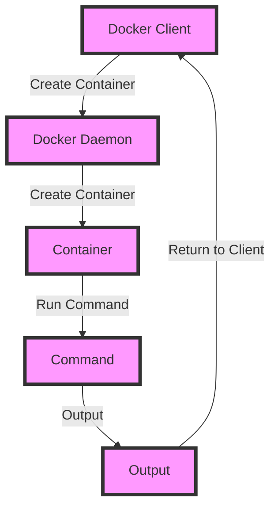

## Introduction
The Go programming language, also known as Golang, has gained immense popularity in recent years due to its simplicity, efficiency, and scalability. One of the primary reasons for its widespread adoption is the vast number of famous projects built using Go. In this overview, we will delve into some of the most notable projects, including Docker, Kubernetes, Terraform, Prometheus, and Hugo. These projects have revolutionized the way we approach software development, deployment, and management. 
> **Note:** Go's design goals, such as simplicity, reliability, and performance, make it an ideal choice for building complex systems and infrastructure tools.

## Core Concepts
To understand the significance of these projects, it's essential to grasp the core concepts and terminology associated with them. 
* **Containerization**: a lightweight and portable way to deploy applications, ensuring consistency across different environments.
* **Orchestration**: the process of automating the deployment, scaling, and management of containers.
* **Infrastructure as Code (IaC)**: a paradigm that treats infrastructure configuration as code, allowing for version control, reuse, and automation.
* **Monitoring and Alerting**: the process of collecting metrics and logs from systems and applications, triggering alerts when predefined conditions are met.
* **Static Site Generation**: a technique for building websites by generating static HTML files from templates and content.

## How It Works Internally
Let's take a brief look at how each of these projects works internally:
* **Docker**: uses a client-server architecture, where the Docker daemon runs on the host machine, and clients interact with it using the Docker CLI. Docker uses a layered file system to store images and containers.
* **Kubernetes**: employs a distributed architecture, with a control plane (API server, scheduler, and controller manager) and worker nodes (running pods and containers). Kubernetes uses etcd for storing cluster state.
* **Terraform**: relies on a plugin-based architecture, where providers (e.g., AWS, Azure) implement the IaC functionality. Terraform uses a state file to track infrastructure configuration.
* **Prometheus**: utilizes a pull-based model, where the Prometheus server scrapes metrics from targets (applications and services). Prometheus stores data in a time-series database.
* **Hugo**: uses a template-based approach, where content and templates are combined to generate static HTML files. Hugo supports various theme engines and plugins.

## Code Examples
Here are three complete and runnable code examples, demonstrating the usage of these projects:
### Example 1: Basic Docker Usage
```go
package main

import (
	"fmt"
	"log"

	"github.com/docker/docker/api/types"
	"github.com/docker/docker/api/types/container"
	"github.com/docker/docker/client"
)

func main() {
	// Create a new Docker client
	cli, err := client.NewEnvClient()
	if err != nil {
		log.Fatal(err)
	}

	// Pull the official Golang image
	img, err := cli.ImagePull(context.Background(), "golang:alpine", types.ImagePullOptions{})
	if err != nil {
		log.Fatal(err)
	}

	// Create a new container from the pulled image
 конт, err := cli.ContainerCreate(context.Background(), &container.Config{
		Image: "golang:alpine",
		Cmd:   []string{"echo", "Hello, World!"},
	}, nil, nil, "")
	if err != nil {
		log.Fatal(err)
	}

	// Start the container
	if err := cli.ContainerStart(context.Background(), конт.ID, types.ContainerStartOptions{}); err != nil {
		log.Fatal(err)
	}

	// Wait for the container to finish
	status, err := cli.ContainerWait(context.Background(), конт.ID, container.WaitConditionNotRunning)
	if err != nil {
		log.Fatal(err)
	}

	fmt.Println(status)
}
```
### Example 2: Kubernetes Deployment
```go
package main

import (
	"context"
	"fmt"
	"log"

	metav1 "k8s.io/apimachinery/pkg/apis/meta/v1"
	"k8s.io/client-go/kubernetes"
	"k8s.io/client-go/rest"
)

func main() {
	// Create a new Kubernetes client
	config, err := rest.InClusterConfig()
	if err != nil {
		log.Fatal(err)
	}

	clientset, err := kubernetes.NewForConfig(config)
	if err != nil {
		log.Fatal(err)
	}

	// Create a new deployment
	deployment := &appsv1.Deployment{
		ObjectMeta: metav1.ObjectMeta{
			Name: "example-deployment",
		},
		Spec: appsv1.DeploymentSpec{
			Replicas: 3,
			Selector: &metav1.LabelSelector{
				MatchLabels: map[string]string{
					"app": "example",
				},
			},
			Template: corev1.PodTemplateSpec{
				ObjectMeta: &metav1.ObjectMeta{
					Labels: map[string]string{
						"app": "example",
					},
				},
				Spec: corev1.PodSpec{
					Containers: []corev1.Container{
						{
							Name:  "example",
							Image: "golang:alpine",
							Command: []string{
								"echo",
								"Hello, World!",
							},
						},
					},
				},
			},
		},
	}

	// Create the deployment
	if _, err := clientset.AppsV1().Deployments("default").Create(context.TODO(), deployment, metav1.CreateOptions{}); err != nil {
		log.Fatal(err)
	}

	fmt.Println("Deployment created")
}
```
### Example 3: Terraform Configuration
```terraform
# Configure the AWS provider
provider "aws" {
  region = "us-west-2"
}

# Create a new EC2 instance
resource "aws_instance" "example" {
  ami           = "ami-0c94855ba95c71c99"
  instance_type = "t2.micro"
  vpc_security_group_ids = [aws_security_group.example.id]
}

# Create a new security group
resource "aws_security_group" "example" {
  name        = "example-sg"
  description = "Allow inbound traffic on port 22"

  ingress {
    from_port   = 22
    to_port     = 22
    protocol    = "tcp"
    cidr_blocks = ["0.0.0.0/0"]
  }
}
```
> **Warning:** When using Terraform, make sure to handle the state file securely, as it contains sensitive information about your infrastructure.

## Visual Diagram

This diagram illustrates the basic workflow of Docker, where a client creates a container, which is then run by the Docker daemon.

## Comparison
| Project | Purpose | Complexity | Scalability |
| --- | --- | --- | --- |
| Docker | Containerization | Medium | High |
| Kubernetes | Orchestration | High | Very High |
| Terraform | Infrastructure as Code | Medium | High |
| Prometheus | Monitoring and Alerting | Medium | High |
| Hugo | Static Site Generation | Low | Medium |
> **Tip:** When choosing a project, consider the complexity and scalability requirements of your use case.

## Real-world Use Cases
Here are some real-world examples of companies using these projects:
* **Docker**: used by companies like Netflix, PayPal, and Uber to containerize their applications.
* **Kubernetes**: used by companies like Google, Amazon, and Microsoft to orchestrate their containerized applications.
* **Terraform**: used by companies like HashiCorp, AWS, and Azure to manage their infrastructure as code.
* **Prometheus**: used by companies like Google, Netflix, and Dropbox to monitor and alert their systems.
* **Hugo**: used by companies like Google, Microsoft, and GitHub to generate static websites.

## Common Pitfalls
Here are some common mistakes to avoid when using these projects:
* **Docker**: not using a `Dockerfile` to build images, leading to inconsistent and hard-to-reproduce containers.
* **Kubernetes**: not properly configuring pod security policies, leading to security vulnerabilities.
* **Terraform**: not handling the state file securely, leading to sensitive information exposure.
* **Prometheus**: not properly configuring alerting rules, leading to false positives or false negatives.
* **Hugo**: not using a theme engine, leading to inconsistent and hard-to-maintain website layouts.

## Interview Tips
Here are some common interview questions and tips for these projects:
* **Docker**: What is the difference between a Docker image and a Docker container? 
> **Interview:** A strong answer should explain the concept of images as templates and containers as runtime instances.
* **Kubernetes**: How do you scale a deployment in Kubernetes? 
> **Interview:** A strong answer should explain the use of the `kubectl scale` command and the importance of proper pod security policies.
* **Terraform**: How do you handle the state file in Terraform? 
> **Interview:** A strong answer should explain the importance of secure state file handling and the use of remote state backends.
* **Prometheus**: What is the difference between a metric and a label in Prometheus? 
> **Interview:** A strong answer should explain the concept of metrics as time-series data and labels as key-value pairs.
* **Hugo**: How do you optimize the performance of a Hugo-generated website? 
> **Interview:** A strong answer should explain the use of caching, minification, and compression to improve website performance.

## Key Takeaways
Here are the key takeaways from this overview:
* **Docker**: a lightweight and portable way to deploy applications, ensuring consistency across different environments.
* **Kubernetes**: an orchestration system for automating the deployment, scaling, and management of containers.
* **Terraform**: a tool for managing infrastructure as code, allowing for version control, reuse, and automation.
* **Prometheus**: a monitoring and alerting system for collecting metrics and logs from systems and applications.
* **Hugo**: a static site generator for building websites by generating static HTML files from templates and content.
* **Containerization**: a paradigm for packaging applications and their dependencies into a single container.
* **Orchestration**: the process of automating the deployment, scaling, and management of containers.
* **Infrastructure as Code**: a paradigm for treating infrastructure configuration as code, allowing for version control, reuse, and automation.
* **Monitoring and Alerting**: the process of collecting metrics and logs from systems and applications, triggering alerts when predefined conditions are met.
* **Static Site Generation**: a technique for building websites by generating static HTML files from templates and content.
> **Note:** Understanding these concepts and projects is essential for building scalable, efficient, and reliable systems.