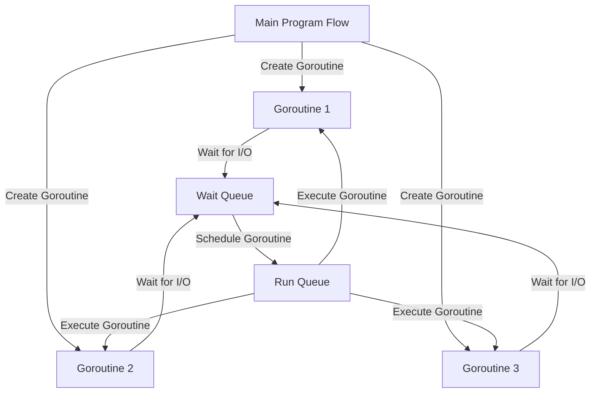

## Introduction
**Go** and **Node.js** are two of the most popular programming languages used for building scalable and high-performance systems. Go, also known as Golang, is a statically typed language developed by Google, while Node.js is a JavaScript runtime built on Chrome's V8 engine. Both languages have their strengths and weaknesses, and understanding their differences is crucial for choosing the right tool for the job. In this article, we will delve into the performance and use cases of Go and Node.js, providing a comprehensive comparison of the two languages.

> **Note:** Go and Node.js are both designed for building concurrent and scalable systems, but they approach this goal from different angles. Go focuses on simplicity, reliability, and performance, while Node.js emphasizes flexibility, ease of use, and a vast ecosystem of libraries and frameworks.

## Core Concepts
To understand the performance and use cases of Go and Node.js, it's essential to grasp the core concepts of each language. Go is built around the idea of **goroutines**, which are lightweight threads that can run concurrently with the main program flow. Node.js, on the other hand, uses an **event-driven** approach, where the program responds to events and callbacks to handle concurrent operations.

* **Goroutines**: Goroutines are functions that can run concurrently with the main program flow. They are scheduled by the Go runtime and can be used to perform tasks such as I/O operations, network requests, and computations. The time complexity of creating a goroutine is O(1), and the space complexity is O(1) as well, since goroutines are lightweight and do not require a lot of memory.
* **Event-driven programming**: Node.js uses an event-driven approach to handle concurrent operations. The program responds to events and callbacks to perform tasks such as I/O operations, network requests, and computations. The time complexity of handling an event in Node.js is O(1), and the space complexity is O(1) as well, since events are handled asynchronously and do not block the main program flow.

> **Warning:** While goroutines and event-driven programming can both be used to build concurrent systems, they have different performance characteristics. Goroutines can provide better performance for CPU-bound tasks, while event-driven programming can be more suitable for I/O-bound tasks.

## How It Works Internally
To understand the performance differences between Go and Node.js, it's essential to look under the hood and see how each language works internally. Go uses a **scheduler** to manage goroutines and schedule them for execution. The scheduler uses a **run queue** to keep track of goroutines that are ready to run and a **wait queue** to keep track of goroutines that are waiting for I/O operations to complete.

Node.js, on the other hand, uses an **event loop** to manage events and callbacks. The event loop uses a **callback queue** to keep track of callbacks that need to be executed and a **timer queue** to keep track of timers that need to be executed.

The time complexity of scheduling a goroutine in Go is O(log n), where n is the number of goroutines, and the space complexity is O(n), since the scheduler needs to keep track of all goroutines. The time complexity of handling an event in Node.js is O(1), and the space complexity is O(1) as well, since events are handled asynchronously and do not block the main program flow.

## Code Examples
Here are three complete and runnable code examples that demonstrate the use of Go and Node.js for building concurrent systems:

### Example 1: Basic Goroutine in Go
```go
package main

import (
	"fmt"
	"time"
)

func main() {
	// Create a goroutine that sleeps for 1 second
	go func() {
		time.Sleep(1 * time.Second)
		fmt.Println("Goroutine finished")
	}()

	// Print a message from the main program flow
	fmt.Println("Main program flow")

	// Wait for the goroutine to finish
	time.Sleep(2 * time.Second)
}
```

### Example 2: Event-driven Programming in Node.js
```javascript
const fs = require('fs');

// Define a function that reads a file asynchronously
function readFile(filename) {
	fs.readFile(filename, (err, data) => {
		if (err) {
			console.error(err);
		} else {
			console.log(data.toString());
		}
	});
}

// Read a file asynchronously
readFile('example.txt');
```

### Example 3: Advanced Concurrency in Go
```go
package main

import (
	"fmt"
	"sync"
)

func main() {
	// Create a wait group to wait for all goroutines to finish
	var wg sync.WaitGroup

	// Create 10 goroutines that sleep for 1 second each
	for i := 0; i < 10; i++ {
		wg.Add(1)
		go func(i int) {
			time.Sleep(1 * time.Second)
			fmt.Printf("Goroutine %d finished\n", i)
			wg.Done()
		}(i)
	}

	// Wait for all goroutines to finish
	wg.Wait()
}
```

## Visual Diagram

This diagram illustrates the process of creating goroutines, waiting for I/O operations to complete, and scheduling goroutines for execution.

> **Tip:** The `sync` package in Go provides a `WaitGroup` type that can be used to wait for all goroutines to finish. This can be useful for synchronizing the execution of multiple goroutines.

## Comparison
Here is a comparison of Go and Node.js in terms of performance and use cases:

| Approach | Time Complexity | Space Complexity | Pros | Cons | Best For |
| --- | --- | --- | --- | --- | --- |
| Goroutines | O(log n) | O(n) | Lightweight, efficient | Limited control over scheduling | CPU-bound tasks |
| Event-driven programming | O(1) | O(1) | Flexible, easy to use | Limited control over execution order | I/O-bound tasks |
| Threads | O(1) | O(n) | Flexible, easy to use | Heavyweight, inefficient | CPU-bound tasks |
| Async/await | O(1) | O(1) | Easy to use, readable | Limited control over execution order | I/O-bound tasks |

> **Interview:** What are the trade-offs between using goroutines and event-driven programming for building concurrent systems? How would you choose between these approaches for a given problem?

## Real-world Use Cases
Here are three real-world use cases for Go and Node.js:

1. **Google's Cloud Infrastructure**: Google uses Go to build its cloud infrastructure, including the Google Cloud Platform and Google Compute Engine. Go's performance, reliability, and simplicity make it an ideal choice for building scalable and concurrent systems.
2. **Netflix's API Gateway**: Netflix uses Node.js to build its API gateway, which handles millions of requests per day. Node.js's event-driven programming model and vast ecosystem of libraries and frameworks make it an ideal choice for building scalable and concurrent systems.
3. **Dropbox's File System**: Dropbox uses Go to build its file system, which handles billions of files and petabytes of data. Go's performance, reliability, and simplicity make it an ideal choice for building scalable and concurrent systems.

## Common Pitfalls
Here are four common pitfalls to avoid when using Go and Node.js:

1. **Deadlocks**: Deadlocks can occur when two or more goroutines are blocked, waiting for each other to release a resource. To avoid deadlocks, use channels and mutexes to synchronize access to shared resources.
2. **Starvation**: Starvation can occur when a goroutine is unable to access a shared resource due to other goroutines holding onto it for an extended period. To avoid starvation, use channels and mutexes to synchronize access to shared resources.
3. **Livelocks**: Livelocks can occur when two or more goroutines are constantly trying to access a shared resource, but are unable to do so due to other goroutines holding onto it. To avoid livelocks, use channels and mutexes to synchronize access to shared resources.
4. **Callback Hell**: Callback hell can occur when using event-driven programming in Node.js, where the code becomes difficult to read and maintain due to the large number of callbacks. To avoid callback hell, use async/await and promises to simplify the code.

> **Warning:** Deadlocks, starvation, and livelocks can be difficult to debug and can have significant performance implications. Use channels and mutexes to synchronize access to shared resources and avoid these pitfalls.

## Interview Tips
Here are three common interview questions for Go and Node.js, along with tips for answering them:

1. **What are the trade-offs between using goroutines and event-driven programming for building concurrent systems?**
	* Weak answer: "Goroutines are lightweight and efficient, while event-driven programming is flexible and easy to use."
	* Strong answer: "Goroutines provide better performance for CPU-bound tasks, while event-driven programming is more suitable for I/O-bound tasks. However, goroutines can be more difficult to use and require more expertise, while event-driven programming can be more prone to callback hell."
2. **How would you choose between Go and Node.js for a given problem?**
	* Weak answer: "I would choose Go for CPU-bound tasks and Node.js for I/O-bound tasks."
	* Strong answer: "I would consider the specific requirements of the problem, including the type of task, the level of concurrency required, and the expertise of the team. I would also consider the performance, reliability, and simplicity of each language and choose the one that best fits the needs of the problem."
3. **What are some common pitfalls to avoid when using Go and Node.js?**
	* Weak answer: "Deadlocks, starvation, and livelocks can occur when using goroutines, while callback hell can occur when using event-driven programming."
	* Strong answer: "Deadlocks, starvation, and livelocks can be avoided by using channels and mutexes to synchronize access to shared resources. Callback hell can be avoided by using async/await and promises to simplify the code. Additionally, it's essential to consider the performance implications of each language and choose the one that best fits the needs of the problem."

## Key Takeaways
Here are ten key takeaways to remember when using Go and Node.js:

* Go is a statically typed language that provides better performance for CPU-bound tasks.
* Node.js is a JavaScript runtime that provides better performance for I/O-bound tasks.
* Goroutines are lightweight and efficient, but can be more difficult to use and require more expertise.
* Event-driven programming is flexible and easy to use, but can be more prone to callback hell.
* Channels and mutexes can be used to synchronize access to shared resources and avoid deadlocks, starvation, and livelocks.
* Async/await and promises can be used to simplify the code and avoid callback hell.
* Go's performance, reliability, and simplicity make it an ideal choice for building scalable and concurrent systems.
* Node.js's event-driven programming model and vast ecosystem of libraries and frameworks make it an ideal choice for building scalable and concurrent systems.
* The choice between Go and Node.js depends on the specific requirements of the problem, including the type of task, the level of concurrency required, and the expertise of the team.
* It's essential to consider the performance implications of each language and choose the one that best fits the needs of the problem.