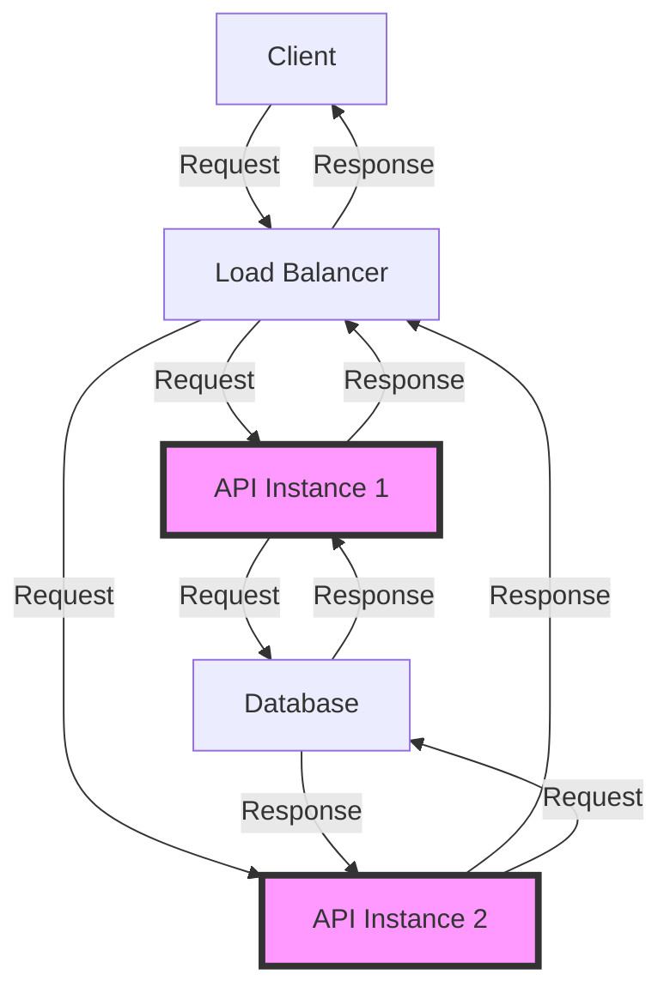

## Introduction
High-performance APIs and microservices are crucial components of modern software systems. They enable developers to build scalable, flexible, and maintainable applications that can handle a large volume of requests and data. In this section, we will explore the concept of high-performance APIs and microservices, their importance, and real-world relevance. 
> **Note:** High-performance APIs and microservices are essential for building modern software systems that require scalability, flexibility, and maintainability.

High-performance APIs are designed to handle a large volume of requests and data while providing fast response times and low latency. They are typically built using lightweight protocols such as HTTP/2, gRPC, or GraphQL, and are optimized for performance using techniques such as caching, load balancing, and content delivery networks (CDNs). 
> **Tip:** Use caching mechanisms, such as Redis or Memcached, to improve the performance of your APIs by reducing the number of database queries and computations.

Microservices, on the other hand, are a software development technique that structures an application as a collection of small, independent services. Each microservice is responsible for a specific business capability and can be developed, tested, and deployed independently. This approach enables developers to build complex systems that are more scalable, flexible, and maintainable.
> **Warning:** Microservices can introduce additional complexity and overhead, such as service discovery, communication, and fault tolerance, which must be carefully managed to ensure the overall system's performance and reliability.

Real-world examples of high-performance APIs and microservices can be seen in companies such as Netflix, Amazon, and Google, which use these technologies to build scalable and flexible systems that can handle a large volume of requests and data. 
> **Interview:** Can you explain the difference between a monolithic architecture and a microservices architecture? How do you decide which approach to use for a given project?

## Core Concepts
In this section, we will explore the core concepts of high-performance APIs and microservices, including their definitions, mental models, and key terminology.

* **API**: An Application Programming Interface (API) is a set of defined rules that enable different applications to communicate with each other. APIs can be used to retrieve data, send data, or perform actions on behalf of a user.
* **Microservice**: A microservice is a small, independent service that is responsible for a specific business capability. Microservices are typically developed, tested, and deployed independently, and communicate with each other using APIs.
* **Service discovery**: Service discovery is the process of finding and connecting to a microservice in a distributed system. This can be done using techniques such as DNS, load balancing, or service registries.
* **Load balancing**: Load balancing is the process of distributing incoming requests across multiple instances of a microservice to improve responsiveness, reliability, and scalability.
* **Caching**: Caching is the process of storing frequently accessed data in a fast, accessible location to reduce the number of requests made to a microservice.

## How It Works Internally
In this section, we will explore the internal mechanics of high-performance APIs and microservices, including their under-the-hood mechanics and step-by-step breakdown.

When a request is made to a high-performance API, the following steps occur:

1. **Request reception**: The request is received by a load balancer or a reverse proxy, which directs the request to a available instance of the API.
2. **Authentication and authorization**: The API instance authenticates and authorizes the request, checking the user's credentials and permissions.
3. **Request processing**: The API instance processes the request, retrieving data from a database or performing computations as needed.
4. **Response generation**: The API instance generates a response, which is then sent back to the client.
5. **Caching**: The response is cached in a fast, accessible location to reduce the number of requests made to the API.

When a request is made to a microservice, the following steps occur:

1. **Service discovery**: The client discovers the location of the microservice using a service registry or DNS.
2. **Request sending**: The client sends the request to the microservice, which receives and processes the request.
3. **Response generation**: The microservice generates a response, which is then sent back to the client.
4. **Load balancing**: The response is load balanced across multiple instances of the microservice to improve responsiveness and reliability.

## Code Examples
In this section, we will explore three complete and runnable code examples that demonstrate the concepts of high-performance APIs and microservices.

### Example 1: Basic API using Go
```go
package main

import (
	"encoding/json"
	"fmt"
	"log"
	"net/http"
)

type User struct {
	ID       string `json:"id"`
	Username string `json:"username"`
	Email    string `json:"email"`
}

func main() {
	http.HandleFunc("/users", func(w http.ResponseWriter, r *http.Request) {
		users := []User{
			{ID: "1", Username: "john", Email: "john@example.com"},
			{ID: "2", Username: "jane", Email: "jane@example.com"},
		}

		json.NewEncoder(w).Encode(users)
	})

	log.Fatal(http.ListenAndServe(":8080", nil))
}
```
This example demonstrates a basic API using Go that returns a list of users in JSON format.

### Example 2: Microservice using Go and gRPC
```go
package main

import (
	"context"
	"fmt"
	"log"

	"google.golang.org/grpc"

	pb "example/proto"
)

type userService struct{}

func (s *userService) GetUser(ctx context.Context, req *pb.GetUserRequest) (*pb.GetUserResponse, error) {
	user := &pb.User{
		Id:       req.GetId(),
		Username: "john",
		Email:    "john@example.com",
	}

	return &pb.GetUserResponse{User: user}, nil
}

func main() {
	srv := grpc.NewServer()
	pb.RegisterUserServiceServer(srv, &userService{})

	log.Fatal(srv.Serve(&http.Server{Addr: ":50051"}))
}
```
This example demonstrates a microservice using Go and gRPC that returns a user object in response to a `GetUser` request.

### Example 3: Load Balancing using Go and HAProxy
```go
package main

import (
	"fmt"
	"log"
	"net/http"
)

func main() {
	http.HandleFunc("/healthcheck", func(w http.ResponseWriter, r *http.Request) {
		w.WriteHeader(http.StatusOK)
	})

	log.Fatal(http.ListenAndServe(":8080", nil))
}

// HAProxy configuration
// frontend http
//     bind *:80
//     default_backend nodes

// backend nodes
//     mode http
//     balance roundrobin
//     server node1 127.0.0.1:8080 check
//     server node2 127.0.0.1:8081 check
```
This example demonstrates load balancing using Go and HAProxy, where multiple instances of the API are load balanced using a round-robin algorithm.

## Visual Diagram

This diagram illustrates the architecture of a high-performance API with load balancing and multiple instances.

## Comparison
| Approach | Time Complexity | Space Complexity | Pros | Cons | Best For |
| --- | --- | --- | --- | --- | --- |
| Monolithic Architecture | O(1) | O(1) | Simple, easy to develop and test | Limited scalability, flexibility | Small applications |
| Microservices Architecture | O(n) | O(n) | Scalable, flexible, maintainable | Complex, difficult to develop and test | Large applications |
| Load Balancing | O(1) | O(1) | Improves responsiveness, reliability | Increases complexity, overhead | High-traffic applications |
| Caching | O(1) | O(1) | Improves performance, reduces requests | Increases complexity, overhead | Frequently accessed data |

## Real-world Use Cases
* **Netflix**: Netflix uses a microservices architecture to build its video streaming platform, with multiple services responsible for different capabilities such as user authentication, content recommendation, and video encoding.
* **Amazon**: Amazon uses a combination of monolithic and microservices architectures to build its e-commerce platform, with multiple services responsible for different capabilities such as product search, order processing, and inventory management.
* **Google**: Google uses a microservices architecture to build its search engine, with multiple services responsible for different capabilities such as query processing, indexing, and ranking.

## Common Pitfalls
* **Over-engineering**: Over-engineering can lead to unnecessary complexity, overhead, and maintenance costs. 
> **Warning:** Avoid over-engineering by focusing on simplicity, modularity, and scalability.
* **Under-engineering**: Under-engineering can lead to performance, reliability, and scalability issues. 
> **Tip:** Use load balancing, caching, and content delivery networks (CDNs) to improve performance and reduce latency.
* **Lack of monitoring and logging**: Lack of monitoring and logging can make it difficult to detect and diagnose issues. 
> **Note:** Use monitoring and logging tools such as Prometheus, Grafana, and ELK to detect and diagnose issues.
* **Insufficient testing**: Insufficient testing can lead to bugs, errors, and security vulnerabilities. 
> **Interview:** Can you explain the importance of testing in software development? How do you ensure that your code is thoroughly tested?

## Interview Tips
* **What is the difference between a monolithic architecture and a microservices architecture?**: A monolithic architecture is a single, self-contained unit that includes all the components of an application, while a microservices architecture is a collection of small, independent services that communicate with each other using APIs.
* **How do you decide which approach to use for a given project?**: The choice of architecture depends on the project's requirements, complexity, and scalability needs. A monolithic architecture may be suitable for small, simple applications, while a microservices architecture may be more suitable for large, complex applications.
* **What are some common challenges and pitfalls of building high-performance APIs and microservices?**: Common challenges and pitfalls include over-engineering, under-engineering, lack of monitoring and logging, and insufficient testing.

## Key Takeaways
* **High-performance APIs and microservices are essential for building modern software systems**: They enable developers to build scalable, flexible, and maintainable applications that can handle a large volume of requests and data.
* **Monolithic architectures are simple, but limited in scalability and flexibility**: They may be suitable for small, simple applications, but can become complex and difficult to maintain as the application grows.
* **Microservices architectures are scalable, flexible, and maintainable, but complex and difficult to develop and test**: They require careful planning, design, and implementation to ensure that the system is reliable, secure, and performant.
* **Load balancing and caching can improve performance and reduce latency**: They can help to distribute incoming requests across multiple instances of an API or microservice, and reduce the number of requests made to a database or external service.
* **Monitoring and logging are essential for detecting and diagnosing issues**: They can help to identify performance bottlenecks, security vulnerabilities, and other issues that can affect the reliability and availability of a system.
* **Testing is crucial for ensuring the quality and reliability of a system**: It can help to detect bugs, errors, and security vulnerabilities, and ensure that the system meets the required standards and specifications.
* **Over-engineering and under-engineering can lead to unnecessary complexity, overhead, and maintenance costs**: They can make the system more difficult to develop, test, and maintain, and can lead to performance, reliability, and scalability issues.
* **A balanced approach that considers simplicity, modularity, and scalability is essential for building high-performance APIs and microservices**: It can help to ensure that the system is reliable, secure, and performant, and can meet the required standards and specifications.