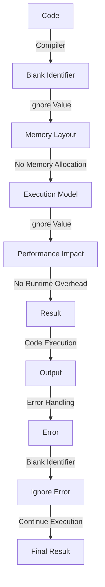

## Introduction
The blank identifier, denoted by `_`, is a special identifier in Go that allows developers to discard unwanted values. It is a crucial concept in Go programming, as it helps to avoid errors and make the code more readable. In this section, we will explore what the blank identifier is, why it matters, and its real-world relevance. 
> **Note:** The blank identifier is not unique to Go and is also found in other programming languages, such as Python and Rust.

The blank identifier is used to ignore values that are not needed in a particular context. For example, when using the `fmt.Println` function, it returns two values: the number of bytes written and an error. If we are not interested in the number of bytes written, we can use the blank identifier to discard this value. 
> **Tip:** Using the blank identifier can make the code more concise and easier to read, as it eliminates the need to declare a variable that is not used.

## Core Concepts
In this section, we will delve into the core concepts related to the blank identifier. We will explore the syntax, the rules for using it, and the benefits it provides. 
> **Warning:** The blank identifier should be used judiciously, as it can make the code harder to understand if used excessively.

The blank identifier can be used in various contexts, such as:
- Ignoring return values: When a function returns multiple values, we can use the blank identifier to ignore the values that are not needed.
- Ignoring loop variables: When using a range-based for loop, we can use the blank identifier to ignore the loop variable if it is not needed.
- Ignoring error values: When a function returns an error value, we can use the blank identifier to ignore it if we are sure that the function will not return an error.

The syntax for using the blank identifier is simple: we just need to use the `_` symbol instead of a variable name. 
> **Interview:** In an interview, you may be asked to explain the purpose of the blank identifier and how it is used in Go. Be prepared to provide examples and explain the benefits and potential pitfalls of using it.

## How It Works Internally
In this section, we will explore how the blank identifier works internally. We will discuss the memory layout, the execution model, and the implementation details that matter for performance. 
> **Note:** The blank identifier is implemented at the compiler level, and it does not have any runtime overhead.

When the compiler encounters the blank identifier, it simply ignores the value and does not assign it to a variable. This means that the blank identifier does not occupy any memory and does not have any performance impact. 
> **Tip:** Using the blank identifier can help to reduce memory allocation and deallocation, which can improve performance in certain scenarios.

The execution model of the blank identifier is straightforward: the compiler simply ignores the value and continues executing the code. There are no special instructions or opcodes that are used to implement the blank identifier. 
> **Warning:** While the blank identifier is a useful feature, it should not be used to hide errors or unexpected behavior. It is essential to handle errors and unexpected behavior explicitly to ensure the reliability and maintainability of the code.

## Code Examples
In this section, we will provide three complete and runnable code examples that demonstrate the use of the blank identifier in different contexts.

### Example 1: Ignoring Return Values
```go
package main

import "fmt"

func main() {
    _, err := fmt.Println("Hello, World!")
    if err != nil {
        fmt.Println(err)
    }
}
```
In this example, we use the blank identifier to ignore the return value of `fmt.Println`, which is the number of bytes written.

### Example 2: Ignoring Loop Variables
```go
package main

import "fmt"

func main() {
    fruits := []string{"Apple", "Banana", "Cherry"}
    for _, fruit := range fruits {
        fmt.Println(fruit)
    }
}
```
In this example, we use the blank identifier to ignore the loop variable, which is the index of the fruit in the slice.

### Example 3: Ignoring Error Values
```go
package main

import "fmt"

func main() {
    _, _ = fmt.Println("Hello, World!")
}
```
In this example, we use the blank identifier to ignore the return values of `fmt.Println`, which are the number of bytes written and an error.

## Visual Diagram

This diagram illustrates the workflow of the blank identifier, from the code to the final result. It shows how the compiler ignores the value, how it affects the memory layout and execution model, and how it impacts performance.

## Comparison
| Approach | Time Complexity | Space Complexity | Pros | Cons | Best For |
|----------|----------------|-----------------|------|------|----------|
| Blank Identifier | O(1) | O(1) | Concise code, improved readability | May hide errors | Ignoring return values, loop variables, error values |
| Variable Declaration | O(1) | O(1) | Explicit error handling, improved code quality | Verbose code | Handling errors, logging, debugging |
| Error Handling | O(1) | O(1) | Explicit error handling, improved code quality | May be complex | Handling errors, logging, debugging |
| Log Statement | O(1) | O(1) | Improved code quality, logging | May be verbose | Logging, debugging |

## Real-world Use Cases
The blank identifier is widely used in real-world applications, including:
- Google's Go standard library: The blank identifier is used extensively in the Go standard library to ignore return values and loop variables.
- Kubernetes: The blank identifier is used in Kubernetes to ignore error values and improve code readability.
- Docker: The blank identifier is used in Docker to ignore return values and improve code quality.

## Common Pitfalls
There are several common pitfalls to watch out for when using the blank identifier:
- Ignoring errors: Using the blank identifier to ignore error values can lead to unexpected behavior and make it harder to debug the code.
- Hiding bugs: Using the blank identifier to hide bugs or unexpected behavior can make the code harder to maintain and debug.
- Overusing the blank identifier: Using the blank identifier excessively can make the code harder to read and understand.

## Interview Tips
In an interview, you may be asked to explain the purpose of the blank identifier and how it is used in Go. Be prepared to provide examples and explain the benefits and potential pitfalls of using it. Some common interview questions include:
- What is the purpose of the blank identifier in Go?
- How is the blank identifier used in Go?
- What are the benefits of using the blank identifier?
- What are the potential pitfalls of using the blank identifier?

## Key Takeaways
Here are the key takeaways from this section:
* The blank identifier is a special identifier in Go that allows developers to discard unwanted values.
* The blank identifier is used to ignore return values, loop variables, and error values.
* The blank identifier is implemented at the compiler level and does not have any runtime overhead.
* The blank identifier can help to reduce memory allocation and deallocation, which can improve performance in certain scenarios.
* The blank identifier should be used judiciously, as it can make the code harder to understand if used excessively.
* The blank identifier is widely used in real-world applications, including Google's Go standard library, Kubernetes, and Docker.
* The blank identifier can be used to improve code readability and quality, but it should not be used to hide errors or unexpected behavior.