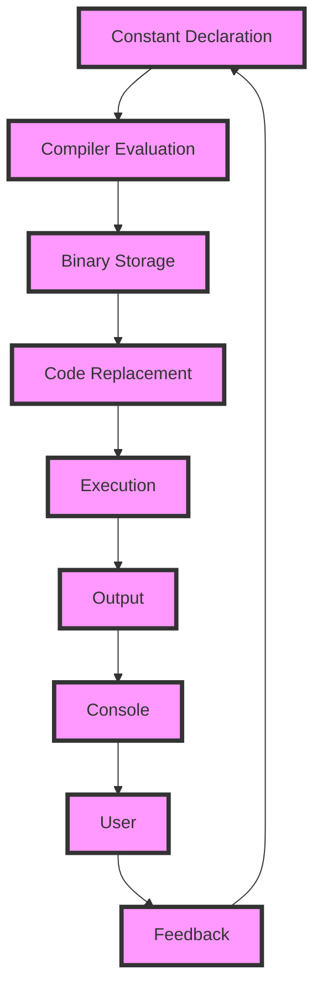

## Introduction
Constants in programming are values that do not change during the execution of a program. They are used to make the code more readable, maintainable, and efficient. In Go, constants are declared using the `const` keyword. Constants can be used to define enumerations, which are sets of named values. In this section, we will explore how to use constants and enumerations in Go, and why they are important.

> **Note:** Constants are evaluated at compile-time, which means that they can be used in contexts where variables cannot, such as in array declarations.

## Core Concepts
Constants in Go are declared using the `const` keyword followed by the name of the constant and its value. The type of the constant is optional and can be inferred by the compiler. For example:
```go
const PI = 3.14
const MAX_SIZE int = 1024
```
Enumerations in Go are not built-in, but they can be implemented using constants. The `iota` keyword is used to create a sequence of constants with incrementing values. For example:
```go
const (
    MONDAY = iota
    TUESDAY
    WEDNESDAY
    THURSDAY
    FRIDAY
    SATURDAY
    SUNDAY
)
```
> **Tip:** The `iota` keyword can be used to create a sequence of constants with incrementing values. This is useful for creating enumerations.

## How It Works Internally
When a constant is declared, the compiler evaluates its value and stores it in the binary. The constant is then replaced with its value in the code. For example:
```go
const PI = 3.14
func main() {
    println(PI)
}
```
The compiler will replace `PI` with its value `3.14` in the code, resulting in:
```go
func main() {
    println(3.14)
}
```
The `iota` keyword works by incrementing a counter for each constant declaration. The counter starts at 0 and increments by 1 for each constant. For example:
```go
const (
    MONDAY = iota
    TUESDAY
    WEDNESDAY
    THURSDAY
    FRIDAY
    SATURDAY
    SUNDAY
)
```
The compiler will evaluate the constants as follows:
```go
const (
    MONDAY = 0
    TUESDAY = 1
    WEDNESDAY = 2
    THURSDAY = 3
    FRIDAY = 4
    SATURDAY = 5
    SUNDAY = 6
)
```
> **Warning:** The `iota` keyword can only be used with constants declared in a single block. If you try to use `iota` with constants declared in separate blocks, the compiler will report an error.

## Code Examples
### Example 1: Basic Constant Declaration
```go
package main

import "fmt"

const PI = 3.14

func main() {
    fmt.Println(PI)
}
```
This code declares a constant `PI` with value `3.14` and prints it to the console.

### Example 2: Enumeration using `iota`
```go
package main

import "fmt"

const (
    MONDAY = iota
    TUESDAY
    WEDNESDAY
    THURSDAY
    FRIDAY
    SATURDAY
    SUNDAY
)

func main() {
    fmt.Println(MONDAY)
    fmt.Println(TUESDAY)
    fmt.Println(WEDNESDAY)
}
```
This code declares an enumeration using `iota` and prints the values of the first three constants to the console.

### Example 3: Advanced Constant Declaration with Type
```go
package main

import "fmt"

const (
    MAX_SIZE int = 1024
    MIN_SIZE int = 1
)

func main() {
    fmt.Println(MAX_SIZE)
    fmt.Println(MIN_SIZE)
}
```
This code declares two constants `MAX_SIZE` and `MIN_SIZE` with type `int` and prints their values to the console.

## Visual Diagram

The diagram shows the flow of constant declaration, compiler evaluation, and code execution. The constant is declared, evaluated by the compiler, stored in the binary, and replaced in the code. The code is then executed, and the output is printed to the console.

> **Interview:** Can you explain the difference between a constant and a variable in Go? How do you declare a constant in Go?

## Comparison
| Approach | Time Complexity | Space Complexity | Pros | Cons | Best For |
| --- | --- | --- | --- | --- | --- |
| Constant Declaration | O(1) | O(1) | Simple, efficient, and readable | Limited to compile-time evaluation | Small, fixed values |
| Variable Declaration | O(1) | O(1) | Flexible, dynamic, and reusable | May lead to bugs and performance issues | Large, dynamic values |
| Enumeration using `iota` | O(1) | O(1) | Efficient, readable, and maintainable | Limited to sequential values | Enumerations with sequential values |
| Struct Declaration | O(1) | O(n) | Flexible, dynamic, and reusable | May lead to complexity and performance issues | Complex, dynamic data structures |

## Real-world Use Cases
* **Google's Go Programming Language**: Go uses constants to define the values of built-in functions and types. For example, the `len` function returns the length of a string or array, which is defined as a constant.
* **Amazon's Go SDK**: The Go SDK uses constants to define the values of API endpoints and parameters. For example, the `aws-sdk-go` package defines constants for the AWS API endpoints and parameters.
* **Netflix's Go Client**: The Go client uses constants to define the values of API endpoints and parameters. For example, the `netflix-go-client` package defines constants for the Netflix API endpoints and parameters.

## Common Pitfalls
* **Incorrect Constant Declaration**: Declaring a constant with an invalid or inconsistent type can lead to compilation errors or runtime bugs.
* **Incorrect Enumeration**: Using `iota` incorrectly can lead to unexpected values or behavior.
* **Incorrect Code Replacement**: Failing to replace constants in the code can lead to incorrect behavior or performance issues.
* **Incorrect Output**: Failing to print the correct output can lead to incorrect results or behavior.

> **Warning:** Incorrect constant declaration or enumeration can lead to compilation errors or runtime bugs. Always verify the correctness of your constants and enumerations.

## Interview Tips
* **What is the difference between a constant and a variable in Go?**: A constant is a value that does not change during the execution of a program, while a variable is a value that can change during the execution of a program.
* **How do you declare a constant in Go?**: A constant is declared using the `const` keyword followed by the name of the constant and its value.
* **What is the purpose of `iota` in Go?**: `iota` is used to create a sequence of constants with incrementing values.

## Key Takeaways
* Constants are values that do not change during the execution of a program.
* Constants can be declared using the `const` keyword.
* `iota` is used to create a sequence of constants with incrementing values.
* Constants can be used to define enumerations.
* Constants are evaluated at compile-time.
* Constants can be used to improve code readability and maintainability.
* Constants can be used to optimize code performance.
* Incorrect constant declaration or enumeration can lead to compilation errors or runtime bugs.
* Always verify the correctness of your constants and enumerations.