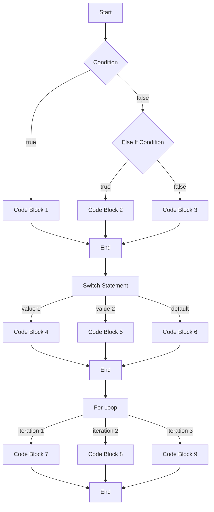

## Introduction
Control flow is a fundamental concept in programming that determines the order in which a program's code is executed. In Go, control flow is achieved using **if-else** statements, **for** loops, and **switch** statements. These statements allow developers to make decisions, repeat tasks, and handle different cases, making their code more efficient and effective. Understanding control flow is crucial for any programmer, as it enables them to write robust, scalable, and maintainable code. In this section, we will delve into the world of control flow in Go, exploring its core concepts, internal mechanics, and practical applications.

## Core Concepts
Control flow in Go can be broken down into three primary components: **if-else** statements, **for** loops, and **switch** statements. Each of these components serves a specific purpose and is used in different contexts.

*   **If-else** statements are used to make decisions based on conditions. They consist of an **if** clause, an optional **else if** clause, and an optional **else** clause.
*   **For** loops are used to repeat a block of code for a specified number of iterations. They can be used with arrays, slices, maps, and strings.
*   **Switch** statements are used to handle different cases based on the value of a variable. They consist of a **switch** keyword, a variable, and multiple **case** clauses.

> **Note:** In Go, the **if-else** statement does not require parentheses around the condition, unlike some other programming languages.

## How It Works Internally
When a Go program is executed, the control flow statements are evaluated by the Go runtime. Here's a step-by-step breakdown of how it works:

1.  The Go compiler parses the source code and generates an abstract syntax tree (AST).
2.  The AST is then analyzed by the Go runtime, which determines the control flow of the program.
3.  The Go runtime executes the program, following the control flow determined in the previous step.
4.  When an **if-else** statement is encountered, the condition is evaluated, and the corresponding block of code is executed.
5.  When a **for** loop is encountered, the loop variable is initialized, and the loop body is executed for the specified number of iterations.
6.  When a **switch** statement is encountered, the value of the variable is compared to the values in the **case** clauses, and the corresponding block of code is executed.

> **Tip:** Understanding the internal mechanics of control flow can help you write more efficient and effective code.

## Code Examples
Here are three complete and runnable examples of control flow in Go:

### Example 1: Basic If-Else Statement
```go
package main

import "fmt"

func main() {
    x := 5
    if x > 10 {
        fmt.Println("x is greater than 10")
    } else {
        fmt.Println("x is less than or equal to 10")
    }
}
```
This example demonstrates a basic **if-else** statement in Go. The condition `x > 10` is evaluated, and the corresponding block of code is executed.

### Example 2: For Loop with Array
```go
package main

import "fmt"

func main() {
    fruits := [3]string{"apple", "banana", "cherry"}
    for i := 0; i < len(fruits); i++ {
        fmt.Println(fruits[i])
    }
}
```
This example demonstrates a **for** loop in Go. The loop variable `i` is initialized to 0, and the loop body is executed for the length of the `fruits` array.

### Example 3: Switch Statement with Map
```go
package main

import "fmt"

func main() {
    scores := map[string]int{
        "John":  90,
        "Alice": 95,
        "Bob":   80,
    }
    for name, score := range scores {
        switch {
        case score >= 90:
            fmt.Printf("%s scored A\n", name)
        case score >= 80:
            fmt.Printf("%s scored B\n", name)
        default:
            fmt.Printf("%s scored C\n", name)
        }
    }
}
```
This example demonstrates a **switch** statement in Go. The value of the `score` variable is compared to the values in the **case** clauses, and the corresponding block of code is executed.

## Visual Diagram

This diagram illustrates the control flow of a Go program, including **if-else** statements, **switch** statements, and **for** loops.

> **Warning:** Failing to understand control flow can lead to bugs and performance issues in your code.

## Comparison
Here's a comparison of different control flow statements in Go:

| Statement | Time Complexity | Space Complexity | Pros | Cons | Best For |
| --- | --- | --- | --- | --- | --- |
| If-Else | O(1) | O(1) | Simple, efficient | Limited flexibility | Simple decisions |
| For Loop | O(n) | O(1) | Flexible, reusable | Can be slow for large datasets | Iterating over arrays, slices, maps |
| Switch | O(1) | O(1) | Efficient, readable | Limited to discrete values | Handling different cases |

> **Interview:** What's the difference between a **for** loop and a **while** loop in Go? (Answer: A **for** loop is used for iterating over a range of values, while a **while** loop is used for repeating a block of code until a condition is met.)

## Real-world Use Cases
Here are three real-world examples of control flow in Go:

1.  **Google's Go compiler**: The Go compiler uses control flow statements to parse and analyze the source code, determining the control flow of the program.
2.  **Netflix's user authentication system**: Netflix's user authentication system uses control flow statements to validate user credentials and handle different authentication scenarios.
3.  **Dropbox's file synchronization algorithm**: Dropbox's file synchronization algorithm uses control flow statements to determine which files to synchronize and how to handle conflicts.

## Common Pitfalls
Here are four common mistakes to avoid when using control flow statements in Go:

1.  **Incorrect condition**: Using an incorrect condition in an **if-else** statement can lead to unexpected behavior.
2.  **Infinite loop**: Failing to update the loop variable in a **for** loop can cause an infinite loop.
3.  **Missing break**: Failing to include a **break** statement in a **switch** statement can cause the program to continue executing after the switch statement.
4.  **Nested control flow**: Using nested control flow statements can make the code harder to read and maintain.

> **Tip:** Use a consistent coding style and follow best practices to avoid common pitfalls.

## Interview Tips
Here are three common interview questions related to control flow in Go, along with sample answers:

1.  **What's the difference between a **for** loop and a **while** loop in Go?**
    *   Weak answer: "A **for** loop is used for iterating over a range of values, while a **while** loop is used for repeating a block of code until a condition is met."
    *   Strong answer: "A **for** loop is used for iterating over a range of values, while a **while** loop is used for repeating a block of code until a condition is met. In Go, we typically use **for** loops for iterating over arrays, slices, maps, and strings, while **while** loops are used for more complex scenarios."
2.  **How do you optimize a **for** loop in Go?**
    *   Weak answer: "I use a **for** loop with a range of values."
    *   Strong answer: "I use a **for** loop with a range of values, and I also consider using a **switch** statement or a **map** to reduce the number of iterations. Additionally, I use caching and memoization to reduce the number of computations."
3.  **What's the best way to handle errors in a **switch** statement in Go?**
    *   Weak answer: "I use a **default** clause to handle errors."
    *   Strong answer: "I use a **default** clause to handle errors, and I also consider using a **panic** statement to handle unexpected errors. Additionally, I use error handling mechanisms such as **err** variables and **error** types to handle errors in a more robust way."

## Key Takeaways
Here are ten key takeaways to remember when working with control flow in Go:

*   **If-else** statements are used for making decisions based on conditions.
*   **For** loops are used for iterating over a range of values.
*   **Switch** statements are used for handling different cases based on the value of a variable.
*   Control flow statements can be nested to create more complex logic.
*   **Break** statements are used to exit a **switch** statement or a **loop**.
*   **Continue** statements are used to skip to the next iteration of a **loop**.
*   **Return** statements are used to exit a function and return a value.
*   Error handling is crucial when working with control flow statements.
*   **Panic** statements are used to handle unexpected errors.
*   **Recovery** mechanisms are used to handle panics and recover from errors.

> **Note:** Understanding control flow is essential for writing robust, scalable, and maintainable code in Go. By following best practices and avoiding common pitfalls, you can write efficient and effective code that meets the needs of your users.