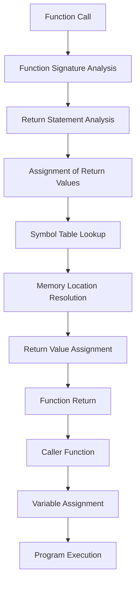

## Introduction
Named return values are a fundamental concept in the Go programming language. They allow functions to return multiple values with explicit names, making the code more readable, maintainable, and self-documenting. This feature is particularly useful when a function needs to return multiple values, such as error codes, status messages, or data structures. In this section, we will explore the importance of named return values, their real-world relevance, and why every engineer needs to know this concept.

Named return values are essential in Go because they promote clarity and conciseness in code. By assigning names to return values, developers can easily understand the purpose of each value without having to consult documentation or comments. This feature is also useful for reducing errors, as it eliminates the need to remember the order of return values. In real-world scenarios, named return values are used extensively in Go's standard library, such as in the `fmt` package, where functions like `fmt.Println` and `fmt.Printf` return named values like `error` and `int`.

## Core Concepts
To understand named return values, it's essential to grasp the following core concepts:

*   **Return statements**: In Go, a return statement is used to exit a function and return control to the caller. The return statement can include one or more values.
*   **Named return values**: When a function returns multiple values, each value can be assigned a name. These names are specified in the function signature, after the parameter list.
*   **Short variable declarations**: In Go, the `:=` operator is used for short variable declarations. This operator can be used to declare and initialize variables in a single statement.

A key terminology to remember is the concept of **bare return**, which refers to the practice of returning values without specifying their names in the return statement. Bare returns are allowed only when the return values have been named in the function signature.

## How It Works Internally
When a function returns named values, Go's compiler generates code that assigns the returned values to the corresponding named variables. This process involves the following steps:

1.  **Function signature analysis**: The compiler analyzes the function signature to determine the names of the return values.
2.  **Return statement analysis**: The compiler analyzes the return statement to determine the values being returned.
3.  **Assignment of return values**: The compiler generates code that assigns the returned values to the corresponding named variables.

Under the hood, Go's compiler uses a mechanism called **symbol tables** to keep track of named return values. A symbol table is a data structure that maps names to memory locations. When a function returns named values, the compiler uses the symbol table to resolve the names to their corresponding memory locations.

## Code Examples
Here are three complete and runnable code examples that demonstrate the use of named return values in Go:

### Example 1: Basic Usage
```go
package main

import "fmt"

// Function with named return values
func greet(name string) (greeting string, err error) {
    if name == "" {
        err = fmt.Errorf("name cannot be empty")
        return
    }
    greeting = fmt.Sprintf("Hello, %s!", name)
    return
}

func main() {
    greeting, err := greet("John")
    if err != nil {
        fmt.Println(err)
    } else {
        fmt.Println(greeting)
    }
}
```
In this example, the `greet` function returns two named values: `greeting` and `err`. The `main` function calls `greet` and assigns the returned values to variables using the `:=` operator.

### Example 2: Real-World Pattern
```go
package main

import (
    "database/sql"
    "fmt"
)

// Function to retrieve a user from a database
func getUser(id int) (user *User, err error) {
    db, err := sql.Open("mysql", "user:password@tcp(localhost:3306)/database")
    if err != nil {
        return
    }
    defer db.Close()

    row := db.QueryRow("SELECT * FROM users WHERE id = ?", id)
    user = &User{}
    err = row.Scan(&user.ID, &user.Name, &user.Email)
    if err != nil {
        return
    }
    return
}

type User struct {
    ID    int
    Name  string
    Email string
}

func main() {
    user, err := getUser(1)
    if err != nil {
        fmt.Println(err)
    } else {
        fmt.Println(user)
    }
}
```
In this example, the `getUser` function returns two named values: `user` and `err`. The `main` function calls `getUser` and assigns the returned values to variables using the `:=` operator.

### Example 3: Advanced Usage
```go
package main

import (
    "fmt"
    "sync"
)

// Function to perform concurrent operations
func concurrentOperations() (results []int, err error) {
    var wg sync.WaitGroup
    results = make([]int, 5)

    for i := range results {
        wg.Add(1)
        go func(index int) {
            defer wg.Done()
            // Perform some operation
            results[index] = index * 2
        }(i)
    }
    wg.Wait()
    return
}

func main() {
    results, err := concurrentOperations()
    if err != nil {
        fmt.Println(err)
    } else {
        fmt.Println(results)
    }
}
```
In this example, the `concurrentOperations` function returns two named values: `results` and `err`. The `main` function calls `concurrentOperations` and assigns the returned values to variables using the `:=` operator.

> **Tip:** When using named return values, make sure to specify the names in the function signature to avoid confusion.

## Visual Diagram

This diagram illustrates the internal mechanics of named return values in Go. It shows how the compiler analyzes the function signature and return statement, assigns return values to named variables, and resolves memory locations using symbol tables.

## Comparison
Here is a comparison of named return values with other approaches:

| Approach | Time Complexity | Space Complexity | Pros | Cons | Best For |
| --- | --- | --- | --- | --- | --- |
| Named Return Values | O(1) | O(1) | Readable, maintainable, self-documenting | Limited to Go language | Go programming |
| Error Codes | O(1) | O(1) | Simple, efficient | Error-prone, limited information | C-style programming |
| Exception Handling | O(log n) | O(n) | Robust, flexible | Verbose, performance overhead | Object-oriented programming |
| Tuple Return | O(1) | O(1) | Simple, efficient | Limited to simple cases | Functional programming |

> **Note:** The time and space complexities listed are approximate and may vary depending on the specific implementation.

## Real-world Use Cases
Here are three real-world use cases of named return values:

1.  **Database Querying**: In a web application, you may need to retrieve data from a database using a SQL query. The query function can return named values like `results` and `err` to indicate the outcome of the query.
2.  **File I/O**: When reading or writing files, you may need to handle errors and return values like `bytesRead` and `err` to indicate the success or failure of the operation.
3.  **Network Communication**: In a networked application, you may need to send or receive data over a network connection. The send or receive function can return named values like `bytesTransferred` and `err` to indicate the outcome of the operation.

> **Warning:** When using named return values, make sure to handle errors properly to avoid crashes or unexpected behavior.

## Common Pitfalls
Here are four common pitfalls to watch out for when using named return values:

1.  **Uninitialized Return Values**: If you forget to initialize a return value, it may contain garbage data or cause unexpected behavior.
2.  **Incorrect Return Value Order**: If you return values in the wrong order, it may cause errors or unexpected behavior.
3.  **Missing Error Handling**: If you forget to handle errors properly, it may cause crashes or unexpected behavior.
4.  **Inconsistent Naming**: If you use inconsistent naming conventions for return values, it may cause confusion or errors.

Here is an example of incorrect code that demonstrates these pitfalls:
```go
func greet(name string) (greeting string, err error) {
    // Uninitialized return value
    // Incorrect return value order
    return err, greeting
}

func main() {
    // Missing error handling
    greeting, _ := greet("John")
    fmt.Println(greeting)
}
```
And here is an example of correct code that avoids these pitfalls:
```go
func greet(name string) (greeting string, err error) {
    // Initialize return values
    greeting = ""
    err = nil

    // Perform some operation
    if name == "" {
        err = fmt.Errorf("name cannot be empty")
        return
    }
    greeting = fmt.Sprintf("Hello, %s!", name)
    return
}

func main() {
    // Handle errors properly
    greeting, err := greet("John")
    if err != nil {
        fmt.Println(err)
    } else {
        fmt.Println(greeting)
    }
}
```
> **Tip:** Use consistent naming conventions for return values to avoid confusion or errors.

## Interview Tips
Here are three common interview questions related to named return values, along with sample answers:

1.  **What are named return values, and how do they work in Go?**

    Weak answer: "Named return values are a way to return multiple values from a function. I think they work by assigning names to the return values in the function signature."
    Strong answer: "Named return values are a feature in Go that allows functions to return multiple values with explicit names. They work by assigning names to the return values in the function signature, which are then used to assign the returned values to variables in the caller function. This feature promotes clarity and conciseness in code, making it easier to understand and maintain."
2.  **How do you handle errors when using named return values?**

    Weak answer: "I think you can just ignore the error return value and hope for the best."
    Strong answer: "When using named return values, it's essential to handle errors properly to avoid crashes or unexpected behavior. You should always check the error return value and handle it accordingly, such as by logging the error or returning an error to the caller function."
3.  **Can you give an example of a real-world scenario where named return values are useful?**

    Weak answer: "I think named return values are useful when you need to return multiple values from a function."
    Strong answer: "One real-world scenario where named return values are useful is when retrieving data from a database. The query function can return named values like `results` and `err` to indicate the outcome of the query, making it easier to handle errors and process the results."

> **Interview:** Be prepared to explain the benefits and trade-offs of using named return values, as well as provide examples of how to use them effectively in real-world scenarios.

## Key Takeaways
Here are ten key takeaways to remember when using named return values in Go:

*   **Named return values promote clarity and conciseness in code**.
*   **Use named return values to return multiple values from a function**.
*   **Always handle errors properly when using named return values**.
*   **Use consistent naming conventions for return values**.
*   **Named return values are limited to the Go language**.
*   **Error codes are an alternative to named return values, but they are error-prone and limited**.
*   **Exception handling is another alternative, but it is verbose and has performance overhead**.
*   **Tuple return is a simple and efficient alternative, but it is limited to simple cases**.
*   **Named return values have a time complexity of O(1) and a space complexity of O(1)**.
*   **Use named return values to improve code readability and maintainability**.

By following these key takeaways and best practices, you can effectively use named return values in your Go programs to improve code readability, maintainability, and performance.