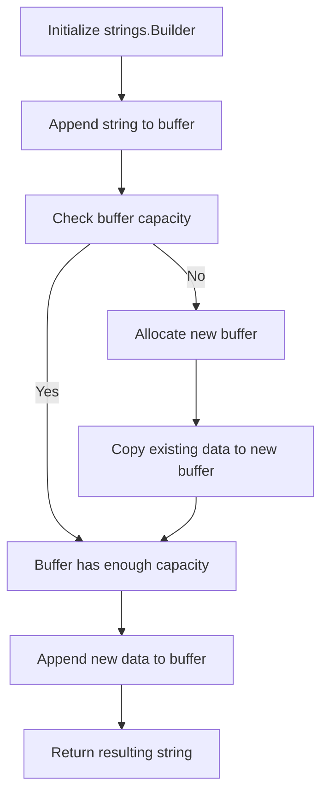

## Introduction
The `strings.Builder` type in Go is a powerful tool for efficient string concatenation. It was introduced in Go 1.10 as a replacement for the `bytes.Buffer` type, which was commonly used for string building. The `strings.Builder` type provides a more efficient and convenient way to build strings, especially when working with large amounts of data. In this section, we will explore what the `strings.Builder` type is, why it matters, and its real-world relevance.

The `strings.Builder` type is a mutable string buffer that allows you to efficiently build strings by appending strings, bytes, and runes. It is designed to reduce the overhead of string concatenation, which can be expensive in terms of memory allocation and copying. By using a `strings.Builder`, you can avoid the need to create temporary strings and reduce the number of memory allocations, resulting in faster and more efficient code.

> **Note:** The `strings.Builder` type is not a replacement for the `+` operator, but rather a tool for efficient string concatenation in performance-critical code.

## Core Concepts
To understand how the `strings.Builder` type works, it's essential to grasp the following core concepts:

* **String buffer**: A mutable buffer that stores a sequence of bytes or runes.
* **Appending**: The process of adding new data to the end of the buffer.
* **String building**: The process of creating a new string by concatenating multiple strings or bytes.

The `strings.Builder` type provides several key methods for building strings, including `WriteString`, `WriteByte`, and `WriteRune`. These methods allow you to append strings, bytes, and runes to the buffer, respectively.

> **Tip:** When working with large amounts of data, it's essential to use a `strings.Builder` to avoid the overhead of string concatenation.

## How It Works Internally
The `strings.Builder` type works internally by maintaining a buffer of bytes that stores the concatenated string data. When you append new data to the buffer, the `strings.Builder` type checks if the buffer has enough capacity to hold the new data. If not, it allocates a new, larger buffer and copies the existing data to the new buffer.

Here's a step-by-step breakdown of how the `strings.Builder` type works internally:

1. **Initialization**: The `strings.Builder` type is initialized with a default buffer size of 0.
2. **Appending**: When you append new data to the buffer, the `strings.Builder` type checks if the buffer has enough capacity to hold the new data.
3. **Buffer allocation**: If the buffer is not large enough, the `strings.Builder` type allocates a new, larger buffer with a capacity that is twice the size of the current buffer.
4. **Data copying**: The existing data is copied to the new buffer, and the new data is appended to the end of the buffer.
5. **Buffer growth**: The buffer continues to grow as you append more data, with the capacity doubling each time the buffer is reallocated.

> **Warning:** The `strings.Builder` type can lead to memory allocation overhead if the buffer is reallocated frequently. To avoid this, it's essential to initialize the buffer with a sufficient capacity.

## Code Examples
Here are three complete and runnable examples that demonstrate the usage of the `strings.Builder` type:

### Example 1: Basic Usage
```go
package main

import (
	"fmt"
	"strings"
)

func main() {
	var b strings.Builder
	b.WriteString("Hello, ")
	b.WriteString("world!")
	fmt.Println(b.String()) // Output: "Hello, world!"
}
```
This example demonstrates the basic usage of the `strings.Builder` type by appending two strings to the buffer and printing the resulting string.

### Example 2: Real-World Pattern
```go
package main

import (
	"fmt"
	"strings"
)

func generateHtmlTable(data [][]string) string {
	var b strings.Builder
	b.WriteString("<table>\n")
	for _, row := range data {
		b.WriteString("<tr>\n")
		for _, cell := range row {
			b.WriteString("<td>")
			b.WriteString(cell)
			b.WriteString("</td>\n")
		}
		b.WriteString("</tr>\n")
	}
	b.WriteString("</table>\n")
	return b.String()
}

func main() {
	data := [][]string{
		{"Name", "Age"},
		{"John", "25"},
		{"Jane", "30"},
	}
	fmt.Println(generateHtmlTable(data))
}
```
This example demonstrates a real-world pattern for using the `strings.Builder` type to generate an HTML table from a 2D array of strings.

### Example 3: Advanced Usage
```go
package main

import (
	"fmt"
	"strings"
)

func generateCsv(data [][]string) string {
	var b strings.Builder
	for _, row := range data {
		for i, cell := range row {
			b.WriteString(cell)
			if i < len(row)-1 {
				b.WriteString(",")
			}
		}
		b.WriteString("\n")
	}
	return b.String()
}

func main() {
	data := [][]string{
		{"Name", "Age"},
		{"John", "25"},
		{"Jane", "30"},
	}
	fmt.Println(generateCsv(data))
}
```
This example demonstrates an advanced usage of the `strings.Builder` type to generate a CSV file from a 2D array of strings.

## Visual Diagram

This diagram illustrates the internal workflow of the `strings.Builder` type, including buffer allocation, data copying, and buffer growth.

## Comparison
The following table compares the `strings.Builder` type with other string concatenation methods in Go:

| Approach | Time Complexity | Space Complexity | Pros | Cons | Best For |
| --- | --- | --- | --- | --- | --- |
| `strings.Builder` | O(n) | O(n) | Efficient, convenient | Can lead to memory allocation overhead | Large-scale string concatenation |
| `+` operator | O(n^2) | O(n^2) | Simple, easy to use | Inefficient, high memory allocation overhead | Small-scale string concatenation |
| `bytes.Buffer` | O(n) | O(n) | Similar to `strings.Builder`, but more flexible | More complex, lower-level API | Low-level string manipulation |

> **Interview:** Can you explain the time and space complexity of using the `strings.Builder` type compared to the `+` operator?

## Real-world Use Cases
The `strings.Builder` type is widely used in production systems for efficient string concatenation. Here are three concrete examples:

1. **Google's Go compiler**: The Go compiler uses the `strings.Builder` type to generate error messages and other string output.
2. **Netflix's Go-based API gateway**: Netflix's API gateway uses the `strings.Builder` type to generate JSON responses and other string output.
3. **Dropbox's Go-based file synchronization system**: Dropbox's file synchronization system uses the `strings.Builder` type to generate file paths and other string output.

## Common Pitfalls
Here are four common mistakes to avoid when using the `strings.Builder` type:

1. **Incorrect buffer capacity**: Failing to initialize the buffer with a sufficient capacity can lead to memory allocation overhead.
2. **Inefficient appending**: Appending small strings to the buffer can lead to inefficient memory allocation and copying.
3. **Incorrect string encoding**: Using the wrong string encoding can lead to incorrect or corrupted output.
4. **Buffer overflow**: Failing to check the buffer capacity can lead to buffer overflow and incorrect output.

> **Warning:** Always initialize the buffer with a sufficient capacity and check the buffer capacity before appending new data.

## Interview Tips
Here are three common interview questions related to the `strings.Builder` type:

1. **What is the time complexity of using the `strings.Builder` type?**
	* Weak answer: "I'm not sure, but it's probably O(n)."
	* Strong answer: "The time complexity of using the `strings.Builder` type is O(n), where n is the total length of the strings being concatenated."
2. **How does the `strings.Builder` type handle buffer allocation and growth?**
	* Weak answer: "I think it just allocates a new buffer every time you append new data."
	* Strong answer: "The `strings.Builder` type allocates a new buffer with a capacity that is twice the size of the current buffer when the buffer is full. This allows for efficient buffer growth and reduces memory allocation overhead."
3. **Can you explain the trade-offs between using the `strings.Builder` type and the `+` operator?**
	* Weak answer: "I'm not sure, but I think the `strings.Builder` type is faster."
	* Strong answer: "The `strings.Builder` type is more efficient than the `+` operator for large-scale string concatenation, but it can lead to memory allocation overhead if the buffer is reallocated frequently. The `+` operator is simpler and easier to use, but it can lead to inefficient memory allocation and copying for large-scale string concatenation."

## Key Takeaways
Here are six key takeaways to remember when using the `strings.Builder` type:

* **Initialize the buffer with a sufficient capacity**: To avoid memory allocation overhead, initialize the buffer with a sufficient capacity.
* **Use the `WriteString` method**: Use the `WriteString` method to append strings to the buffer, as it is more efficient than using the `+` operator.
* **Check the buffer capacity**: Always check the buffer capacity before appending new data to avoid buffer overflow.
* **Avoid inefficient appending**: Avoid appending small strings to the buffer, as it can lead to inefficient memory allocation and copying.
* **Use the `String` method**: Use the `String` method to retrieve the resulting string, as it is more efficient than using the `+` operator.
* **Consider the trade-offs**: Consider the trade-offs between using the `strings.Builder` type and the `+` operator, and choose the approach that best fits your use case.