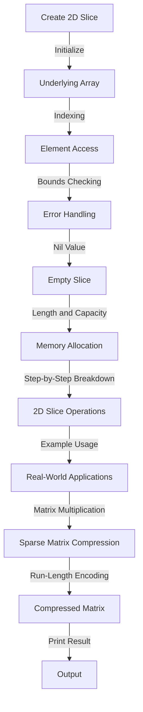

## Introduction
A **2D slice** is a two-dimensional data structure in Go, which is a collection of elements of the same data type stored in a tabular form. It is a versatile data structure that can be used to represent matrices, tables, and grids. 2D slices are essential in various fields such as linear algebra, computer graphics, and data analysis. In this section, we will delve into the world of 2D slices, exploring their core concepts, internal workings, and practical applications.

> **Note:** 2D slices are not the same as 2D arrays. While arrays have a fixed size, slices are dynamic and can grow or shrink as needed.

## Core Concepts
To work with 2D slices, it's essential to understand the following core concepts:
* **Indexing**: Each element in a 2D slice has a unique index, which is a pair of integers representing the row and column of the element.
* **Bounds**: The number of rows and columns in a 2D slice determines its bounds.
* **Capacity**: The maximum number of elements that a 2D slice can hold.
* **Length**: The number of elements currently stored in a 2D slice.

> **Tip:** When working with 2D slices, it's crucial to keep track of the indexing and bounds to avoid **index out of range** errors.

## How It Works Internally
Internally, a 2D slice is represented as a struct containing a pointer to the underlying array, the length, and the capacity. When you create a 2D slice, Go allocates memory for the underlying array and initializes the length and capacity.

Here's a step-by-step breakdown of how 2D slices work:
1. Memory allocation: Go allocates memory for the underlying array based on the specified length and capacity.
2. Initialization: The length and capacity are initialized to the specified values.
3. Indexing: When you access an element in a 2D slice, Go calculates the index based on the row and column indices.
4. Bounds checking: Go checks if the index is within the bounds of the 2D slice to prevent **index out of range** errors.

> **Warning:** When using 2D slices, be aware of the **nil** value, which represents an empty or uninitialized slice.

## Code Examples
Here are three complete and runnable examples of using 2D slices in Go:

### Example 1: Basic Usage
```go
package main

import "fmt"

func main() {
    // Create a 2D slice with 3 rows and 4 columns
    slice := make([][]int, 3)
    for i := range slice {
        slice[i] = make([]int, 4)
    }

    // Initialize the 2D slice with values
    for i := 0; i < 3; i++ {
        for j := 0; j < 4; j++ {
            slice[i][j] = i * j
        }
    }

    // Print the 2D slice
    for i := 0; i < 3; i++ {
        for j := 0; j < 4; j++ {
            fmt.Printf("%d ", slice[i][j])
        }
        fmt.Println()
    }
}
```
### Example 2: Real-World Pattern
```go
package main

import "fmt"

func main() {
    // Create a 2D slice to represent a matrix
    matrix := [][]int{
        {1, 2, 3},
        {4, 5, 6},
        {7, 8, 9},
    }

    // Perform matrix multiplication
    result := multiplyMatrices(matrix, matrix)

    // Print the result
    for i := 0; i < len(result); i++ {
        for j := 0; j < len(result[i]); j++ {
            fmt.Printf("%d ", result[i][j])
        }
        fmt.Println()
    }
}

func multiplyMatrices(a, b [][]int) [][]int {
    // Check if the matrices can be multiplied
    if len(a[0]) != len(b) {
        panic("Matrices cannot be multiplied")
    }

    // Create a new 2D slice to store the result
    result := make([][]int, len(a))
    for i := range result {
        result[i] = make([]int, len(b[0]))
    }

    // Perform matrix multiplication
    for i := 0; i < len(a); i++ {
        for j := 0; j < len(b[0]); j++ {
            for k := 0; k < len(b); k++ {
                result[i][j] += a[i][k] * b[k][j]
            }
        }
    }

    return result
}
```
### Example 3: Advanced Usage
```go
package main

import "fmt"

func main() {
    // Create a 2D slice to represent a sparse matrix
    sparseMatrix := [][]int{
        {1, 0, 0, 0},
        {0, 2, 0, 0},
        {0, 0, 3, 0},
        {0, 0, 0, 4},
    }

    // Compress the sparse matrix using run-length encoding
    compressedMatrix := compressMatrix(sparseMatrix)

    // Print the compressed matrix
    for i := 0; i < len(compressedMatrix); i++ {
        for j := 0; j < len(compressedMatrix[i]); j++ {
            fmt.Printf("%d ", compressedMatrix[i][j])
        }
        fmt.Println()
    }
}

func compressMatrix(matrix [][]int) [][]int {
    // Create a new 2D slice to store the compressed matrix
    compressedMatrix := make([][]int, len(matrix))
    for i := range compressedMatrix {
        compressedMatrix[i] = make([]int, len(matrix[i]))
    }

    // Compress the matrix using run-length encoding
    for i := 0; i < len(matrix); i++ {
        count := 0
        for j := 0; j < len(matrix[i]); j++ {
            if matrix[i][j] != 0 {
                compressedMatrix[i][count] = matrix[i][j]
                count++
            }
        }
        for j := count; j < len(compressedMatrix[i]); j++ {
            compressedMatrix[i][j] = 0
        }
    }

    return compressedMatrix
}
```
## Visual Diagram

The diagram illustrates the internal workings of 2D slices, including memory allocation, indexing, bounds checking, and error handling. It also shows the step-by-step breakdown of 2D slice operations and their applications in real-world scenarios.

> **Interview:** When asked about 2D slices, be prepared to explain their internal workings, including memory allocation and indexing. Also, be ready to provide examples of their usage in real-world applications.

## Comparison
Here's a comparison table of different data structures in Go:

| Data Structure | Time Complexity | Space Complexity | Pros | Cons |
| --- | --- | --- | --- | --- |
| 2D Slice | O(1) | O(n) | Dynamic, flexible, and efficient | Can be error-prone if not handled carefully |
| 2D Array | O(1) | O(n) | Fixed size, efficient, and easy to use | Limited flexibility and dynamicity |
| Matrix | O(n^2) | O(n^2) | Represents a mathematical concept, efficient for linear algebra operations | Can be slow for large matrices |
| Sparse Matrix | O(n) | O(n) | Efficient for sparse data, compressible | Can be slow for dense data |

## Real-world Use Cases
Here are three real-world use cases of 2D slices:

1. **Google Maps**: 2D slices can be used to represent the map data, where each element in the slice corresponds to a specific location on the map.
2. **Image Processing**: 2D slices can be used to represent images, where each element in the slice corresponds to a pixel in the image.
3. **Game Development**: 2D slices can be used to represent game boards, where each element in the slice corresponds to a specific position on the board.

> **Tip:** When working with 2D slices in real-world applications, consider using **parallel processing** to improve performance.

## Common Pitfalls
Here are four common pitfalls to watch out for when working with 2D slices:

1. **Index Out of Range**: Make sure to check the bounds of the 2D slice before accessing its elements.
2. **Nil Value**: Be aware of the **nil** value, which represents an empty or uninitialized slice.
3. **Memory Leak**: Make sure to properly clean up the memory allocated for the 2D slice to avoid memory leaks.
4. **Incorrect Initialization**: Ensure that the 2D slice is properly initialized before using it.

> **Warning:** When working with 2D slices, be careful not to introduce **off-by-one** errors, which can lead to incorrect results or crashes.

## Interview Tips
Here are three common interview questions related to 2D slices:

1. **What is the difference between a 2D slice and a 2D array?**
	* Weak answer: "A 2D slice is a dynamic array, while a 2D array is a fixed-size array."
	* Strong answer: "A 2D slice is a dynamic data structure that can grow or shrink as needed, while a 2D array is a fixed-size data structure that cannot be resized. Additionally, 2D slices have a length and capacity, while 2D arrays have a fixed size."
2. **How do you initialize a 2D slice in Go?**
	* Weak answer: "You can initialize a 2D slice using the `make` function."
	* Strong answer: "You can initialize a 2D slice using the `make` function, which allocates memory for the underlying array and initializes the length and capacity. For example, `slice := make([][]int, 3)` creates a 2D slice with 3 rows and 0 columns. You can then initialize the columns using a loop, such as `for i := range slice { slice[i] = make([]int, 4) }`."
3. **How do you perform matrix multiplication using 2D slices?**
	* Weak answer: "You can perform matrix multiplication using nested loops."
	* Strong answer: "You can perform matrix multiplication using nested loops, where the outer loop iterates over the rows of the first matrix, the middle loop iterates over the columns of the first matrix, and the inner loop iterates over the columns of the second matrix. For example, `result[i][j] += a[i][k] * b[k][j]` calculates the element at position (i, j) in the result matrix."

> **Interview:** When answering interview questions related to 2D slices, be prepared to provide detailed explanations of the internal workings of 2D slices, including memory allocation, indexing, and bounds checking. Additionally, be ready to provide examples of their usage in real-world applications.

## Key Takeaways
Here are ten key takeaways to remember when working with 2D slices:

* 2D slices are dynamic data structures that can grow or shrink as needed.
* 2D slices have a length and capacity, which can be used to optimize memory allocation.
* Indexing and bounds checking are crucial when working with 2D slices.
* 2D slices can be used to represent matrices, tables, and grids.
* Matrix multiplication can be performed using nested loops.
* 2D slices can be used in real-world applications such as Google Maps, image processing, and game development.
* Parallel processing can be used to improve performance when working with 2D slices.
* Off-by-one errors can lead to incorrect results or crashes.
* 2D slices can be initialized using the `make` function.
* 2D slices can be used to represent sparse data, which can be compressed using run-length encoding.