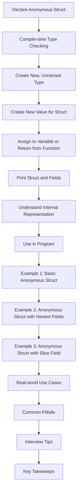

## Introduction
**Anonymous structs** in Go are a powerful feature that allows developers to create structs without declaring a named type. This feature is particularly useful when working with JSON data, configuration files, or any other scenario where the structure of the data is known at compile time but the specific type is not. In this section, we will explore what anonymous structs are, why they matter, and their real-world relevance.

Anonymous structs are essential in Go because they provide a way to create complex data structures without the need for explicit type definitions. This feature is especially useful when working with third-party libraries or APIs that return data in a specific format. By using anonymous structs, developers can easily parse and process this data without having to declare a new type for every possible data structure.

> **Note:** Anonymous structs are not unique to Go and can be found in other programming languages, such as C and C++. However, Go's implementation is particularly elegant and easy to use.

## Core Concepts
To understand anonymous structs, it's essential to grasp the following core concepts:

* **Structs**: A struct is a collection of fields, which are variables of different data types that are stored together in memory.
* **Type definitions**: In Go, a type definition is used to declare a new type, which can be a struct, interface, or other type.
* **Anonymous**: An anonymous struct is a struct that is declared without a type definition.

The key terminology to remember when working with anonymous structs is:

* **Composite literal**: A composite literal is a shorthand way to create a new value for a composite type, such as a struct or array.
* **Field names**: Field names are used to access the individual fields of a struct.

> **Warning:** When using anonymous structs, it's essential to be careful with field names, as they must match the names of the fields in the struct.

## How It Works Internally
When you declare an anonymous struct in Go, the compiler creates a new, unnamed type for the struct. This type is then used to create a new value for the struct, which can be assigned to a variable or used as a return value from a function.

Here's a step-by-step breakdown of what happens when you declare an anonymous struct:

1. The compiler parses the struct declaration and creates a new, unnamed type for the struct.
2. The compiler checks the field names and types to ensure they are valid.
3. The compiler creates a new value for the struct, which includes the fields and their values.
4. The compiler assigns the new value to a variable or returns it from a function.

> **Tip:** When working with anonymous structs, it's a good idea to use the `fmt.Println` function to print the struct and its fields, as this can help you understand the internal representation of the struct.

## Code Examples
Here are three complete, runnable examples of anonymous structs in Go:

### Example 1: Basic Anonymous Struct
```go
package main

import "fmt"

func main() {
    // Declare an anonymous struct
    person := struct {
        name string
        age  int
    }{
        name: "John",
        age:  30,
    }

    // Print the person struct
    fmt.Println(person)
}
```

### Example 2: Anonymous Struct with Nested Fields
```go
package main

import "fmt"

func main() {
    // Declare an anonymous struct with nested fields
    person := struct {
        name string
        address struct {
            street string
            city   string
            state  string
            zip    string
        }
    }{
        name: "John",
        address: struct {
            street string
            city   string
            state  string
            zip    string
        }{
            street: "123 Main St",
            city:   "Anytown",
            state:  "CA",
            zip:    "12345",
        },
    }

    // Print the person struct
    fmt.Println(person)
}
```

### Example 3: Anonymous Struct with Slice Field
```go
package main

import "fmt"

func main() {
    // Declare an anonymous struct with a slice field
    person := struct {
        name string
        interests []string
    }{
        name: "John",
        interests: []string{
            "reading",
            "hiking",
            "coding",
        },
    }

    // Print the person struct
    fmt.Println(person)
}
```

## Visual Diagram


The diagram illustrates the process of declaring an anonymous struct in Go, from compile-time type checking to using the struct in a program.

## Comparison
Here's a comparison table of anonymous structs with other data structures in Go:

| Approach | Time Complexity | Space Complexity | Pros | Cons | Best For |
|----------|----------------|-----------------|------|------|----------|
| Anonymous Struct | O(1) | O(n) | Easy to use, flexible | Can be verbose, limited type safety | JSON data, configuration files |
| Named Struct | O(1) | O(n) | Type-safe, self-documenting | Can be inflexible, requires explicit type definition | Complex data structures, performance-critical code |
| Map | O(1) | O(n) | Flexible, easy to use | Limited type safety, can be slow | Caching, memoization |
| Slice | O(1) | O(n) | Flexible, easy to use | Limited type safety, can be slow | Arrays, collections |

> **Interview:** When asked about anonymous structs in an interview, be prepared to explain the benefits and drawbacks of using them, as well as how they compare to other data structures in Go.

## Real-world Use Cases
Here are three real-world use cases for anonymous structs in Go:

1. **JSON data parsing**: Anonymous structs are particularly useful when working with JSON data, as they allow you to easily parse and process the data without having to declare a new type for every possible data structure.
2. **Configuration files**: Anonymous structs can be used to read and write configuration files, such as JSON or YAML files, without having to declare a new type for every possible configuration option.
3. **API responses**: Anonymous structs can be used to parse and process API responses, such as JSON data returned from a REST API, without having to declare a new type for every possible response structure.

> **Tip:** When working with anonymous structs in real-world use cases, it's essential to be careful with field names and types, as they must match the names and types of the fields in the struct.

## Common Pitfalls
Here are four common pitfalls to avoid when working with anonymous structs in Go:

1. **Field name typos**: Field names must match the names of the fields in the struct, so be careful with typos.
2. **Type mismatches**: Field types must match the types of the fields in the struct, so be careful with type mismatches.
3. **Nested field access**: When accessing nested fields, be careful with the dot notation, as it can be easy to get the field names wrong.
4. **Slice field initialization**: When initializing a slice field, be careful with the syntax, as it can be easy to get the initialization wrong.

> **Warning:** When working with anonymous structs, it's essential to be careful with these common pitfalls, as they can lead to runtime errors or unexpected behavior.

## Interview Tips
Here are three common interview questions related to anonymous structs in Go, along with weak and strong answers:

1. **What is an anonymous struct in Go?**
	* Weak answer: "An anonymous struct is a struct that is declared without a type definition."
	* Strong answer: "An anonymous struct is a struct that is declared without a type definition, which allows for flexible and easy-to-use data structures. However, it's essential to be careful with field names and types, as they must match the names and types of the fields in the struct."
2. **How do you declare an anonymous struct in Go?**
	* Weak answer: "You declare an anonymous struct using the `struct` keyword and a composite literal."
	* Strong answer: "You declare an anonymous struct using the `struct` keyword and a composite literal, which allows for easy and flexible creation of complex data structures. For example, `person := struct { name string; age int }{ name: "John", age: 30 }`."
3. **What are the benefits and drawbacks of using anonymous structs in Go?**
	* Weak answer: "The benefits of using anonymous structs are that they are easy to use and flexible, while the drawbacks are that they can be verbose and limited in type safety."
	* Strong answer: "The benefits of using anonymous structs are that they are easy to use and flexible, which makes them particularly useful for JSON data parsing and configuration files. However, the drawbacks are that they can be verbose and limited in type safety, which can lead to runtime errors or unexpected behavior if not used carefully."

> **Note:** When answering interview questions related to anonymous structs, be prepared to explain the benefits and drawbacks of using them, as well as how to declare and use them in Go.

## Key Takeaways
Here are ten key takeaways to remember about anonymous structs in Go:

* Anonymous structs are declared without a type definition.
* Anonymous structs are flexible and easy to use.
* Field names and types must match the names and types of the fields in the struct.
* Anonymous structs are particularly useful for JSON data parsing and configuration files.
* Anonymous structs can be verbose and limited in type safety.
* Nested field access requires careful use of dot notation.
* Slice field initialization requires careful syntax.
* Anonymous structs are not unique to Go and can be found in other programming languages.
* Anonymous structs are a powerful feature in Go that can simplify complex data structures.
* Anonymous structs require careful use to avoid common pitfalls and runtime errors.

> **Tip:** When working with anonymous structs in Go, remember to be careful with field names and types, and to use them in a way that takes advantage of their flexibility and ease of use.