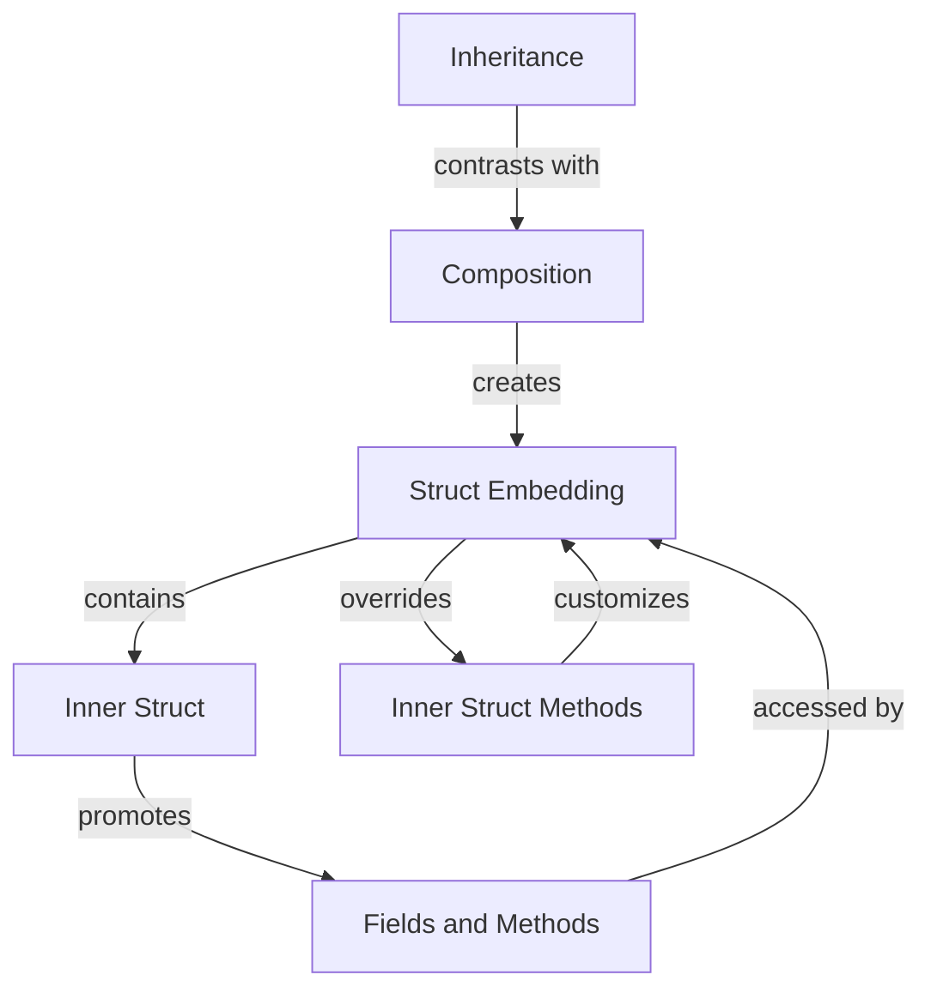

## Introduction
**Struct Embedding** is a fundamental concept in Go programming that enables developers to create complex data structures by composing smaller ones. This approach is often referred to as **composition over inheritance**, emphasizing the importance of combining existing structures rather than inheriting behavior from a parent class. In this chapter, we will delve into the world of struct embedding, exploring its benefits, core concepts, and real-world applications. As a senior software engineer, understanding struct embedding is crucial for designing efficient, scalable, and maintainable systems.

> **Note:** Go's design philosophy emphasizes simplicity, readability, and performance. Struct embedding is a key aspect of this philosophy, allowing developers to create complex data structures without the need for inheritance or complex class hierarchies.

## Core Concepts
To grasp struct embedding, it's essential to understand the following core concepts:

* **Struct**: A collection of fields, which can be of any data type, including other structs.
* **Embedding**: The process of including one struct within another, allowing the outer struct to access the fields and methods of the inner struct.
* **Composition**: The act of creating a new struct by combining existing ones, rather than inheriting behavior from a parent class.

> **Tip:** When designing data structures, consider using composition over inheritance. This approach promotes flexibility, reusability, and easier maintenance.

## How It Works Internally
When a struct is embedded within another, the following steps occur:

1. The outer struct gains access to the fields and methods of the inner struct.
2. The inner struct's fields and methods are promoted to the outer struct, allowing for direct access.
3. The outer struct can override the inner struct's methods, providing a way to customize behavior.

> **Warning:** Be cautious when overriding methods, as it can lead to unexpected behavior if not handled properly.

## Code Examples
### Example 1: Basic Struct Embedding
```go
type Person struct {
    name string
    age  int
}

type Employee struct {
    Person
    department string
}

func main() {
    emp := Employee{
        Person: Person{
            name: "John Doe",
            age:  30,
        },
        department: "Sales",
    }
    fmt.Println(emp.name) // Accessing the embedded Person struct's field
}
```
### Example 2: Real-World Pattern
```go
type Address struct {
    street string
    city   string
    state  string
    zip    string
}

type Customer struct {
    name    string
    address Address
    orders  []Order
}

type Order struct {
    id       int
    product  string
    quantity int
}

func main() {
    cust := Customer{
        name: "Jane Doe",
        address: Address{
            street: "123 Main St",
            city:   "Anytown",
            state:  "CA",
            zip:    "12345",
        },
        orders: []Order{
            {id: 1, product: "Product A", quantity: 2},
            {id: 2, product: "Product B", quantity: 1},
        },
    }
    fmt.Println(cust.address.street) // Accessing the embedded Address struct's field
}
```
### Example 3: Advanced Usage
```go
type Shape interface {
    area() float64
}

type Circle struct {
    radius float64
}

func (c *Circle) area() float64 {
    return 3.14 * c.radius * c.radius
}

type Rectangle struct {
    width  float64
    height float64
}

func (r *Rectangle) area() float64 {
    return r.width * r.height
}

type CompositeShape struct {
    shapes []Shape
}

func (c *CompositeShape) area() float64 {
    var totalArea float64
    for _, shape := range c.shapes {
        totalArea += shape.area()
    }
    return totalArea
}

func main() {
    circle := &Circle{radius: 5}
    rect := &Rectangle{width: 4, height: 6}
    composite := &CompositeShape{shapes: []Shape{circle, rect}}
    fmt.Println(composite.area()) // Calculating the total area of the composite shape
}
```
## Visual Diagram

The diagram illustrates the process of struct embedding, where an outer struct contains an inner struct, promoting its fields and methods. The outer struct can override the inner struct's methods, customizing behavior. Composition is shown as an alternative to inheritance.

> **Interview:** When asked about struct embedding, be prepared to explain the benefits of composition over inheritance and provide examples of how it's used in real-world applications.

## Comparison
| Approach | Time Complexity | Space Complexity | Pros | Cons | Best For |
| --- | --- | --- | --- | --- | --- |
| Struct Embedding | O(1) | O(1) | Flexible, reusable, easy maintenance | Limited control over inner struct | Complex data structures, reusable components |
| Inheritance | O(1) | O(1) | Code reuse, hierarchical organization | Tight coupling, fragile base class problem | Simple class hierarchies, limited reuse |
| Composition | O(1) | O(1) | Flexible, reusable, easy maintenance | More complex setup | Complex systems, high reuse requirements |
| Interfaces | O(1) | O(1) | Decoupling, polymorphism | More verbose, less efficient | Large systems, high polymorphism requirements |

## Real-world Use Cases
1. **Database Modeling**: Struct embedding can be used to model complex database relationships, such as one-to-many or many-to-many relationships.
2. **Graph Algorithms**: Composition can be applied to graph algorithms, such as Dijkstra's or Bellman-Ford, to efficiently calculate shortest paths.
3. **Game Development**: Struct embedding can be used to create complex game objects, such as characters or vehicles, by composing smaller components.

> **Tip:** When designing complex systems, consider using struct embedding to create reusable, maintainable components.

## Common Pitfalls
1. **Overriding Methods**: Be cautious when overriding methods, as it can lead to unexpected behavior if not handled properly.
2. **Tight Coupling**: Avoid tight coupling between structs, as it can make maintenance and reuse more difficult.
3. **Fragile Base Class Problem**: Be aware of the fragile base class problem, where changes to a base struct can break derived structs.
4. **Performance**: Be mindful of performance implications when using struct embedding, as it can lead to increased memory usage or slower execution.

> **Warning:** Avoid using struct embedding as a replacement for inheritance, as it can lead to tight coupling and maintenance issues.

## Interview Tips
1. **What is struct embedding?**: Be prepared to explain the concept of struct embedding and its benefits.
2. **How does composition differ from inheritance?**: Explain the differences between composition and inheritance, including the benefits and drawbacks of each approach.
3. **Provide an example of struct embedding in a real-world application**: Be prepared to provide an example of how struct embedding is used in a real-world application, such as database modeling or game development.

> **Interview:** When asked about struct embedding, focus on the benefits of composition over inheritance and provide examples of how it's used in real-world applications.

## Key Takeaways
* Struct embedding is a powerful tool for creating complex data structures in Go.
* Composition over inheritance promotes flexibility, reusability, and easier maintenance.
* Be cautious when overriding methods and avoid tight coupling between structs.
* Consider using struct embedding for complex database relationships, graph algorithms, and game development.
* Be mindful of performance implications when using struct embedding.
* Struct embedding is not a replacement for inheritance, but rather a complementary approach.
* Understanding struct embedding is crucial for designing efficient, scalable, and maintainable systems in Go.