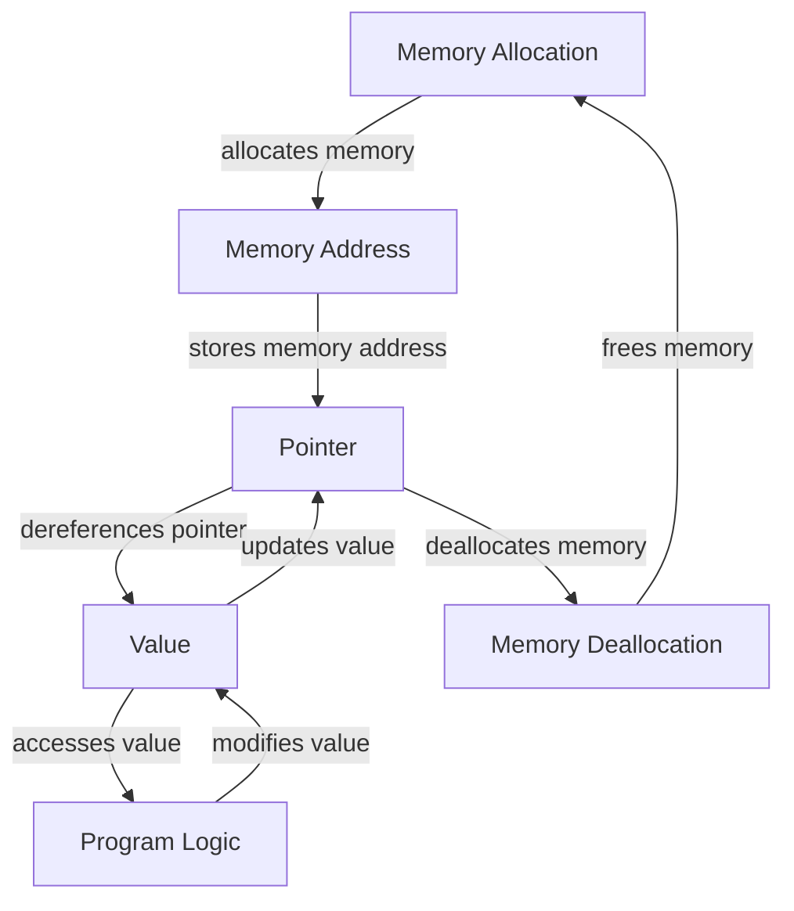

## Introduction
Pointers are a fundamental concept in programming, particularly in languages such as Go, C, and C++. They allow developers to directly manipulate memory locations, providing fine-grained control over data storage and retrieval. In this section, we will explore the importance of pointers, their real-world relevance, and why every engineer should understand how to use them effectively. 
> **Note:** Pointers are not unique to Go, but their usage and behavior may vary between languages.

In Go, pointers are used to store the memory address of a value. This allows for efficient data sharing and modification between different parts of a program. Pointers are particularly useful when working with large data structures, as they enable developers to avoid copying the entire structure, reducing memory usage and improving performance.

## Core Concepts
To understand pointers, it's essential to grasp the following core concepts:
- **Memory Address**: A unique identifier for a memory location.
- **Pointer**: A variable that stores a memory address.
- **Dereferencing**: The process of accessing the value stored at a memory address.
- **Null Pointer**: A pointer that does not point to a valid memory location.

> **Warning:** Dangling pointers, which point to memory locations that have already been freed, can cause unexpected behavior and crashes.

## How It Works Internally
When a pointer is created in Go, it is initialized with the memory address of a value. The `&` operator is used to get the memory address of a variable, while the `*` operator is used to dereference a pointer.

Here's a step-by-step breakdown of how pointers work internally:
1. Memory allocation: The Go runtime allocates memory for a value.
2. Pointer creation: A pointer is created and initialized with the memory address of the value.
3. Dereferencing: The pointer is used to access the value stored at the memory address.
4. Memory deallocation: The memory is deallocated when it is no longer needed.

## Code Examples
### Example 1: Basic Pointer Usage
```go
package main

import "fmt"

func main() {
    // Create a variable and get its memory address
    var x int = 10
    ptr := &x
    
    // Print the memory address and the value
    fmt.Println("Memory Address:", ptr)
    fmt.Println("Value:", *ptr)
}
```
This example demonstrates how to create a pointer and use it to access the value stored at a memory address.

### Example 2: Pointer Arithmetic
```go
package main

import "fmt"

func main() {
    // Create an array and get the memory address of the first element
    arr := [5]int{1, 2, 3, 4, 5}
    ptr := &arr[0]
    
    // Use pointer arithmetic to access the elements of the array
    for i := 0; i < 5; i++ {
        fmt.Println("Element", i, ":", *ptr)
        ptr++ // Increment the pointer to point to the next element
    }
}
```
This example shows how to use pointer arithmetic to access the elements of an array.

### Example 3: Pointer to a Struct
```go
package main

import "fmt"

type Person struct {
    name string
    age  int
}

func main() {
    // Create a struct and get its memory address
    person := Person{name: "John", age: 30}
    ptr := &person
    
    // Use the pointer to access and modify the struct fields
    fmt.Println("Name:", ptr.name)
    fmt.Println("Age:", ptr.age)
    ptr.age = 31
    fmt.Println("Updated Age:", ptr.age)
}
```
This example demonstrates how to use a pointer to access and modify the fields of a struct.

## Visual Diagram

This diagram illustrates the flow of pointer creation, dereferencing, and memory deallocation.

## Comparison
| Approach | Time Complexity | Space Complexity | Pros | Cons | Best For |
| --- | --- | --- | --- | --- | --- |
| Pointers | O(1) | O(1) | Efficient memory usage, fast data access | Error-prone, difficult to debug | Systems programming, performance-critical code |
| References | O(1) | O(1) | Safe, easy to use | Limited control over memory | High-level programming, scripting |
| Smart Pointers | O(1) | O(1) | Automatic memory management, exception safety | Performance overhead | Modern C++ programming, smart pointer libraries |
| Manual Memory Management | O(1) | O(1) | Fine-grained control over memory | Error-prone, time-consuming | Systems programming, embedded systems |

## Real-world Use Cases
1. **Google's Go runtime**: The Go runtime uses pointers extensively to manage memory and provide efficient data sharing between goroutines.
2. **Linux kernel**: The Linux kernel uses pointers to manage memory and implement system calls.
3. **Redis**: Redis uses pointers to implement its in-memory data store and provide fast data access.

## Common Pitfalls
1. **Dangling pointers**: Pointers that point to memory locations that have already been freed can cause unexpected behavior and crashes.
```go
package main

import "fmt"

func main() {
    var x int = 10
    ptr := &x
    // ...
    x = 20 // invalidates the pointer
    fmt.Println(*ptr) // dangling pointer
}
```
2. **Null pointer dereferences**: Attempting to access a null pointer can cause crashes and errors.
```go
package main

import "fmt"

func main() {
    var ptr *int
    fmt.Println(*ptr) // null pointer dereference
}
```
3. **Pointer aliasing**: Using multiple pointers to the same memory location can lead to unexpected behavior and bugs.
```go
package main

import "fmt"

func main() {
    var x int = 10
    ptr1 := &x
    ptr2 := &x
    *ptr1 = 20
    fmt.Println(*ptr2) // unexpected behavior
}
```
4. **Pointer arithmetic errors**: Incorrectly calculating pointer offsets can lead to memory corruption and crashes.
```go
package main

import "fmt"

func main() {
    var arr [5]int
    ptr := &arr[0]
    ptr += 10 // invalid pointer arithmetic
    fmt.Println(*ptr) // memory corruption
}
```
> **Tip:** Use the `unsafe` package in Go to perform pointer arithmetic and manipulate memory locations.

## Interview Tips
1. **What is a pointer?**: A pointer is a variable that stores a memory address.
```go
package main

import "fmt"

func main() {
    var x int = 10
    ptr := &x
    fmt.Println(ptr) // memory address
}
```
2. **How do you dereference a pointer?**: Use the `*` operator to access the value stored at a memory address.
```go
package main

import "fmt"

func main() {
    var x int = 10
    ptr := &x
    fmt.Println(*ptr) // value
}
```
3. **What is the difference between a pointer and a reference?**: A pointer is a variable that stores a memory address, while a reference is an alias for a variable.
```go
package main

import "fmt"

func main() {
    var x int = 10
    ptr := &x
    ref := x
    fmt.Println(ptr) // memory address
    fmt.Println(ref) // value
}
```
> **Interview:** Be prepared to explain the differences between pointers and references, and provide examples of how to use them correctly.

## Key Takeaways
* Pointers are variables that store memory addresses.
* Dereferencing a pointer accesses the value stored at a memory address.
* Pointers are used to manage memory and provide efficient data sharing.
* Dangling pointers, null pointer dereferences, and pointer aliasing are common pitfalls to avoid.
* Pointer arithmetic can be used to manipulate memory locations, but requires careful calculation.
* The `unsafe` package in Go provides functions for performing pointer arithmetic and manipulating memory locations.
* Pointers have a time complexity of O(1) and a space complexity of O(1).
* Smart pointers provide automatic memory management and exception safety, but may have performance overhead.
* Manual memory management provides fine-grained control over memory, but is error-prone and time-consuming.