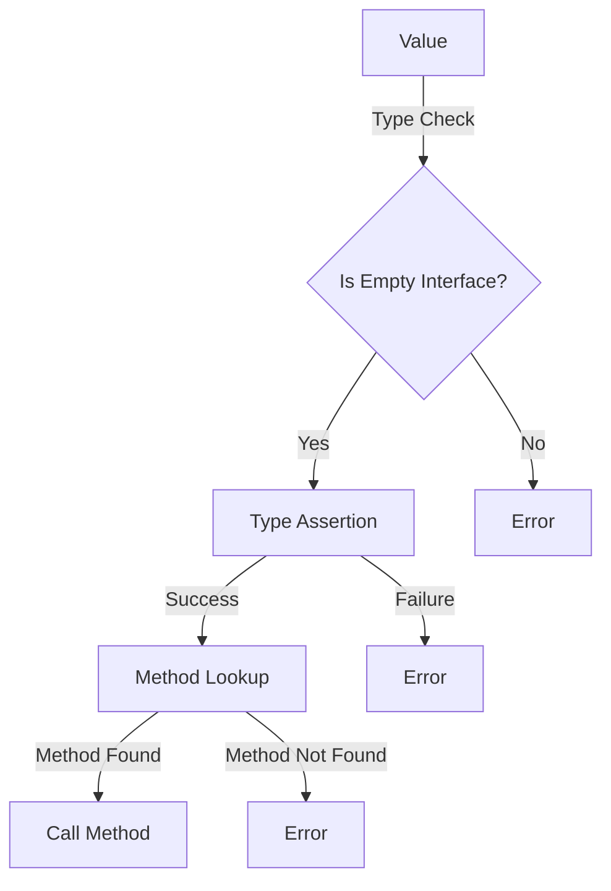

## Introduction
The **empty interface**, denoted by `interface{}` in Go, is a type that can hold any value. It is also known as the **any** type in other programming languages. This concept is crucial in Go programming, as it allows for flexibility and generality in function parameters and return types. In this section, we will delve into the world of empty interfaces, exploring their definition, use cases, and internal mechanics.

Every engineer should know about empty interfaces because they are fundamental to Go's type system. Understanding how to use them effectively can make your code more concise, readable, and maintainable. Moreover, empty interfaces are used extensively in Go's standard library, so familiarity with them is essential for working with existing codebases.

## Core Concepts
To grasp empty interfaces, we need to understand the following key concepts:

* **Type assertion**: The process of checking the type of a value at runtime.
* **Type switch**: A statement that checks the type of a value and executes different blocks of code based on the type.
* **Interface**: A type that defines a set of methods that a type can implement.

The empty interface is an interface that has no methods. This means that any type can implement the empty interface, as it does not require any specific methods to be implemented.

> **Note:** The empty interface is not the same as the `nil` type, which represents the absence of a value.

## How It Works Internally
When you use an empty interface as a function parameter or return type, Go performs a type check at runtime to ensure that the value being passed or returned is of a type that can be represented by the empty interface. This check is done using a type assertion.

Here is a step-by-step breakdown of what happens when you use an empty interface:

1. **Type checking**: Go checks the type of the value being passed or returned to ensure it is a type that can be represented by the empty interface.
2. **Type assertion**: If the type check passes, Go performs a type assertion to determine the underlying type of the value.
3. **Method lookup**: If the underlying type has methods, Go looks up the methods in the type's method set.

The time complexity of type checking and type assertion is O(1), as it involves a simple lookup in the type's method set. The space complexity is also O(1), as no additional memory is allocated during the process.

## Code Examples
### Example 1: Basic Usage
```go
package main

import "fmt"

func printValue(v interface{}) {
    fmt.Println(v)
}

func main() {
    printValue("Hello, World!")
    printValue(123)
    printValue(true)
}
```
In this example, we define a function `printValue` that takes an `interface{}` parameter. We then call this function with different types of values, demonstrating that the empty interface can hold any value.

### Example 2: Type Switch
```go
package main

import "fmt"

func printType(v interface{}) {
    switch v := v.(type) {
    case int:
        fmt.Println("Integer:", v)
    case string:
        fmt.Println("String:", v)
    default:
        fmt.Println("Unknown type:", v)
    }
}

func main() {
    printType(123)
    printType("Hello, World!")
    printType(true)
}
```
In this example, we use a type switch to determine the type of the value being passed to the `printType` function. We then print out the type and value.

### Example 3: Advanced Usage
```go
package main

import "fmt"

func printMap(m interface{}) {
    mp, ok := m.(map[string]interface{})
    if !ok {
        fmt.Println("Not a map")
        return
    }
    for key, value := range mp {
        fmt.Printf("%s: %v\n", key, value)
    }
}

func main() {
    m := map[string]interface{}{
        "name": "John",
        "age":  30,
    }
    printMap(m)
}
```
In this example, we define a function `printMap` that takes an `interface{}` parameter. We then use a type assertion to determine if the value is a map, and if so, print out its contents.

## Visual Diagram

This diagram illustrates the process of using an empty interface, from type checking to method lookup.

> **Tip:** When using empty interfaces, it's essential to handle the possibility of a type assertion failure.

## Comparison
| Approach | Time Complexity | Space Complexity | Pros | Cons | Best For |
| --- | --- | --- | --- | --- | --- |
| Empty Interface | O(1) | O(1) | Flexible, general | Slow, error-prone | General-purpose programming |
| Struct | O(1) | O(1) | Fast, efficient | Inflexible, specific | Performance-critical code |
| Interface | O(1) | O(1) | Flexible, general | Slow, error-prone | General-purpose programming |
| Type Switch | O(1) | O(1) | Flexible, general | Slow, error-prone | General-purpose programming |

## Real-world Use Cases
1. **JSON parsing**: The `encoding/json` package uses empty interfaces to represent JSON values, allowing for flexible and general parsing of JSON data.
2. **Database queries**: The `database/sql` package uses empty interfaces to represent query results, allowing for flexible and general processing of database data.
3. **Web framework**: The `net/http` package uses empty interfaces to represent HTTP request and response bodies, allowing for flexible and general handling of HTTP requests and responses.

> **Warning:** Avoid using empty interfaces as a catch-all for unknown types, as this can lead to errors and performance issues.

## Common Pitfalls
1. **Type assertion failure**: Failing to handle type assertion failures can lead to runtime errors.
```go
// Wrong
func printValue(v interface{}) {
    s := v.(string)
    fmt.Println(s)
}

// Right
func printValue(v interface{}) {
    s, ok := v.(string)
    if !ok {
        fmt.Println("Not a string")
        return
    }
    fmt.Println(s)
}
```
2. **Method lookup failure**: Failing to handle method lookup failures can lead to runtime errors.
```go
// Wrong
func printMethod(v interface{}) {
    v.Method()
}

// Right
func printMethod(v interface{}) {
    if method, ok := v.(interface{ Method() }); ok {
        method.Method()
    } else {
        fmt.Println("Method not found")
    }
}
```
3. **Inefficient type checking**: Using empty interfaces can lead to inefficient type checking, especially when dealing with large datasets.
```go
// Wrong
func printValues(vs []interface{}) {
    for _, v := range vs {
        if s, ok := v.(string); ok {
            fmt.Println(s)
        }
    }
}

// Right
func printValues(vs []string) {
    for _, s := range vs {
        fmt.Println(s)
    }
}
```
4. **Overuse of empty interfaces**: Overusing empty interfaces can lead to code that is difficult to read and maintain.
```go
// Wrong
func printValue(v interface{}) {
    if s, ok := v.(string); ok {
        fmt.Println(s)
    } else if i, ok := v.(int); ok {
        fmt.Println(i)
    } else {
        fmt.Println("Unknown type")
    }
}

// Right
func printString(s string) {
    fmt.Println(s)
}

func printInt(i int) {
    fmt.Println(i)
}
```
## Interview Tips
1. **What is an empty interface?**: An empty interface is a type that can hold any value.
2. **How does type assertion work?**: Type assertion checks the type of a value at runtime and returns a boolean indicating whether the type matches.
3. **What is the difference between an empty interface and a struct?**: An empty interface is a type that can hold any value, while a struct is a specific type that has a fixed set of fields.

> **Interview:** When asked about empty interfaces, be sure to explain the concept clearly and provide examples of how they are used in real-world scenarios.

## Key Takeaways
* Empty interfaces are a type that can hold any value.
* Type assertion is used to check the type of a value at runtime.
* Empty interfaces are flexible and general, but can be slow and error-prone.
* Structs are fast and efficient, but inflexible and specific.
* Interfaces are flexible and general, but can be slow and error-prone.
* Type switches are flexible and general, but can be slow and error-prone.
* Avoid using empty interfaces as a catch-all for unknown types.
* Handle type assertion failures and method lookup failures.
* Use empty interfaces judiciously and only when necessary.
* Prefer structs and interfaces over empty interfaces when possible.
* Use type switches when dealing with unknown types.