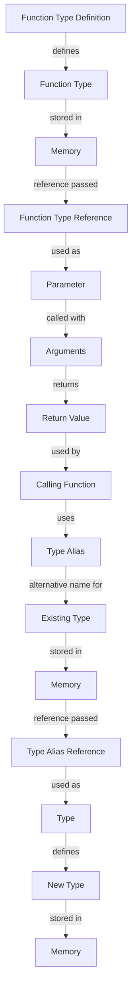

## Introduction
Function types and type aliases are essential concepts in the Go programming language. They enable developers to define reusable functions and type definitions, making their code more maintainable, efficient, and scalable. In this section, we will delve into the world of function types and type aliases, exploring their definitions, benefits, and real-world applications.

Function types allow developers to define functions as first-class citizens, which can be passed as arguments to other functions, returned from functions, or stored in data structures. This feature is particularly useful when working with higher-order functions, callbacks, and event-driven programming.

Type aliases, on the other hand, provide a way to create alternative names for existing types. They are useful when working with complex types, such as structs or interfaces, and can help improve code readability and maintainability.

> **Note:** Function types and type aliases are not unique to Go, but their implementation and usage in Go are distinct and worth exploring.

## Core Concepts
To understand function types and type aliases, it's essential to grasp the following core concepts:

* **Function type**: A function type is a type that represents a function. It defines the function's signature, including the input parameters and return types.
* **Type alias**: A type alias is an alternative name for an existing type. It does not create a new type but rather provides a new name for an existing one.
* **Type definition**: A type definition is a way to define a new type using the `type` keyword. It can be used to define a new type from an existing type or to define a new type from scratch.

The key terminology to remember is:

* **Function type**: `func` keyword
* **Type alias**: `type` keyword with the `=` operator
* **Type definition**: `type` keyword with the `struct` or `interface` keyword

> **Tip:** When working with function types and type aliases, it's essential to use meaningful names to improve code readability and maintainability.

## How It Works Internally
To understand how function types and type aliases work internally, let's dive into the under-the-hood mechanics of Go.

When a function type is defined, Go creates a new type that represents the function. This type includes the function's signature, including the input parameters and return types. The function type is then stored in memory, and a reference to it can be passed around like any other value.

When a type alias is defined, Go creates a new name for an existing type. The type alias is not a new type but rather an alternative name for an existing one. The type alias is stored in memory, and a reference to it can be used like any other type.

Here's a step-by-step breakdown of how function types and type aliases work:

1. **Function type definition**: The `func` keyword is used to define a new function type.
2. **Type alias definition**: The `type` keyword with the `=` operator is used to define a new type alias.
3. **Type definition**: The `type` keyword with the `struct` or `interface` keyword is used to define a new type.
4. **Memory allocation**: The function type, type alias, or type definition is stored in memory.
5. **Reference passing**: A reference to the function type, type alias, or type definition can be passed around like any other value.

> **Warning:** When working with function types and type aliases, it's essential to avoid circular dependencies, which can lead to compilation errors.

## Code Examples
Here are three complete and runnable examples that demonstrate the usage of function types and type aliases:

### Example 1: Basic Function Type
```go
package main

import "fmt"

// Define a function type
type greetFunc func(name string) string

func main() {
    // Create a new function that matches the function type
    greet := func(name string) string {
        return "Hello, " + name
    }

    // Use the function type as a parameter
    printGreeting(greet, "John")
}

func printGreeting(greet greetFunc, name string) {
    fmt.Println(greet(name))
}
```

### Example 2: Type Alias
```go
package main

import "fmt"

// Define a type alias for a string
type aliasString = string

func main() {
    // Use the type alias
    var name aliasString = "John"
    fmt.Println(name)
}
```

### Example 3: Advanced Function Type
```go
package main

import "fmt"

// Define a function type that takes a function as an argument
type higherOrderFunc func(func(int) int, int) int

func main() {
    // Create a new function that matches the function type
    add := func(x int) int {
        return x + 1
    }

    // Use the function type as a parameter
    result := higherOrderFunc(func(f func(int) int, x int) int {
        return f(x)
    })(add, 5)

    fmt.Println(result)
}
```

## Visual Diagram

The diagram illustrates the flow of function types, type aliases, and type definitions in Go. It shows how function types are defined, stored in memory, and used as parameters. It also shows how type aliases are defined, stored in memory, and used as alternative names for existing types.

## Comparison
| Approach | Time Complexity | Space Complexity | Pros | Cons | Best For |
| --- | --- | --- | --- | --- | --- |
| Function Type | O(1) | O(1) | Reusable, flexible | Can be complex | Higher-order functions, callbacks |
| Type Alias | O(1) | O(1) | Improves readability, maintainability | Limited flexibility | Complex types, structs, interfaces |
| Type Definition | O(1) | O(1) | Creates new type | Can be verbose | New types, structs, interfaces |
| Interface | O(1) | O(1) | Defines contract | Can be complex | Polymorphic programming, abstract data types |

## Real-world Use Cases
Here are three real-world use cases for function types and type aliases:

* **Google's Go API**: Google's Go API uses function types and type aliases to define reusable functions and types for working with APIs.
* **Kubernetes**: Kubernetes uses function types and type aliases to define reusable functions and types for working with container orchestration.
* **Netflix's Go Client**: Netflix's Go client uses function types and type aliases to define reusable functions and types for working with the Netflix API.

## Common Pitfalls
Here are four common pitfalls to avoid when working with function types and type aliases:

* **Circular dependencies**: Avoid circular dependencies between function types and type aliases, as they can lead to compilation errors.
* **Type alias confusion**: Avoid using type aliases that are too similar to existing types, as they can lead to confusion and errors.
* **Function type complexity**: Avoid defining function types that are too complex, as they can lead to errors and maintenance issues.
* **Type definition verbosity**: Avoid defining type definitions that are too verbose, as they can lead to maintenance issues and errors.

> **Interview:** When asked about function types and type aliases in an interview, be prepared to explain their definitions, benefits, and use cases. Be sure to provide examples of how they are used in real-world applications and discuss common pitfalls to avoid.

## Key Takeaways
Here are the key takeaways from this section:

* **Function types**: Define reusable functions that can be passed as arguments or returned from functions.
* **Type aliases**: Define alternative names for existing types to improve readability and maintainability.
* **Type definitions**: Define new types using the `type` keyword to create reusable and maintainable code.
* **Circular dependencies**: Avoid circular dependencies between function types and type aliases.
* **Type alias confusion**: Avoid using type aliases that are too similar to existing types.
* **Function type complexity**: Avoid defining function types that are too complex.
* **Type definition verbosity**: Avoid defining type definitions that are too verbose.
* **Real-world use cases**: Function types and type aliases are used in real-world applications such as Google's Go API, Kubernetes, and Netflix's Go client.
* **Time complexity**: Function types and type aliases have a time complexity of O(1).
* **Space complexity**: Function types and type aliases have a space complexity of O(1).