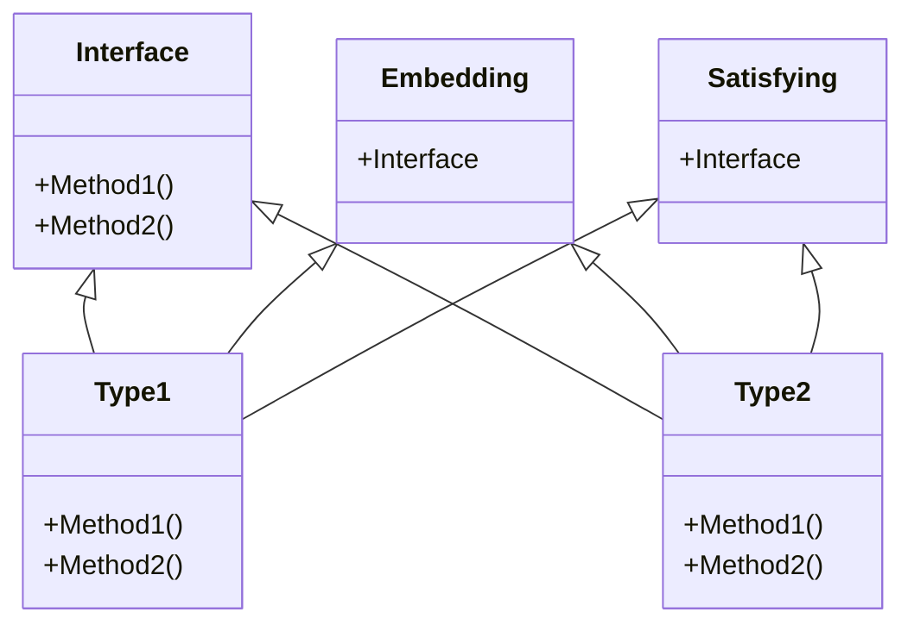

## Introduction
**Interface Composition** is a fundamental concept in Go programming that allows developers to define a set of methods that an object can implement. It is a key feature that enables Go's **multiple inheritance** behavior, where an object can satisfy multiple interfaces. In this section, we will explore why interface composition matters, its real-world relevance, and why every engineer needs to know this.

Interface composition is essential in Go because it provides a way to **decouple** objects from specific implementations, allowing for greater flexibility and testability. By defining an interface, developers can specify a contract that must be implemented by any object that wants to satisfy that interface. This approach enables **polymorphism**, where objects of different types can be treated as if they were of the same type, as long as they satisfy the same interface.

> **Note:** Interface composition is not unique to Go and is a common pattern in object-oriented programming languages. However, Go's implementation of interface composition is particularly elegant and efficient.

## Core Concepts
To understand interface composition, we need to grasp a few key concepts:

* **Interface**: a set of methods that an object can implement.
* **Type**: a specific implementation of an interface.
* **Embedding**: the process of including one interface or type within another.
* **Satisfying an interface**: the process of implementing all the methods defined in an interface.

Mental models that can help us understand interface composition include:

* Thinking of interfaces as **contracts** that must be implemented by any object that wants to satisfy that interface.
* Considering types as **implementations** of interfaces, where each type provides its own implementation of the methods defined in the interface.

Key terminology includes:

* **Interface type**: a type that represents an interface.
* **Type assertion**: the process of checking whether an object satisfies a particular interface.

## How It Works Internally
When we define an interface in Go, the compiler generates a **type descriptor** that contains information about the interface, including its methods and their signatures. When we create an object that satisfies an interface, the compiler generates a **type assertion** that checks whether the object implements all the methods defined in the interface.

The type descriptor is used by the Go runtime to perform **type checks** and **method lookups**. When we call a method on an object, the runtime checks whether the object satisfies the interface that defines the method. If it does, the runtime performs a method lookup to find the implementation of the method for the specific type of object being called.

> **Warning:** If we try to call a method on an object that does not satisfy the interface that defines the method, the Go runtime will **panic**.

## Code Examples
### Example 1: Basic Interface Composition
```go
// Define an interface
type Shape interface {
    Area() float64
}

// Define a type that satisfies the interface
type Circle struct {
    radius float64
}

func (c Circle) Area() float64 {
    return 3.14 * c.radius * c.radius
}

func main() {
    // Create an object that satisfies the interface
    circle := Circle{radius: 5}
    // Call the method on the object
    fmt.Println(circle.Area())
}
```
### Example 2: Real-World Pattern
```go
// Define an interface for a payment gateway
type PaymentGateway interface {
    ProcessPayment(amount float64) error
}

// Define a type that satisfies the interface
type Stripe struct {
    apiKey string
}

func (s Stripe) ProcessPayment(amount float64) error {
    // Implement the payment processing logic
    return nil
}

func main() {
    // Create an object that satisfies the interface
    stripe := Stripe{apiKey: "your_api_key"}
    // Call the method on the object
    err := stripe.ProcessPayment(10.99)
    if err != nil {
        fmt.Println(err)
    }
}
```
### Example 3: Advanced Interface Composition
```go
// Define an interface for a caching layer
type Cache interface {
    Get(key string) (string, error)
    Set(key string, value string) error
}

// Define a type that satisfies the interface
type RedisCache struct {
    addr string
}

func (r RedisCache) Get(key string) (string, error) {
    // Implement the caching logic using Redis
    return "", nil
}

func (r RedisCache) Set(key string, value string) error {
    // Implement the caching logic using Redis
    return nil
}

func main() {
    // Create an object that satisfies the interface
    redisCache := RedisCache{addr: "localhost:6379"}
    // Call the methods on the object
    value, err := redisCache.Get("key")
    if err != nil {
        fmt.Println(err)
    }
    err = redisCache.Set("key", "value")
    if err != nil {
        fmt.Println(err)
    }
}
```
> **Tip:** When using interface composition, it's essential to define the interfaces carefully to ensure that they are **minimal** and **complete**, meaning they contain only the necessary methods and no redundant methods.

## Visual Diagram

The diagram illustrates the relationships between interfaces, types, and embeddings. The `Interface` class represents the interface, while the `Type1` and `Type2` classes represent the types that satisfy the interface. The `Embedding` class represents the embedding of the interface within another type, and the `Satisfying` class represents the process of satisfying the interface.

## Comparison
| Approach | Time Complexity | Space Complexity | Pros | Cons | Best For |
| --- | --- | --- | --- | --- | --- |
| Interface Composition | O(1) | O(1) | Decouples objects from specific implementations, enables polymorphism | Can lead to complex interface hierarchies | Systems that require flexibility and testability |
| Type Assertions | O(1) | O(1) | Provides a way to check whether an object satisfies a particular interface | Can lead to runtime errors if not used carefully | Systems that require type safety and precision |
| Embedding | O(1) | O(1) | Provides a way to include one interface or type within another | Can lead to tight coupling between objects | Systems that require a high degree of modularity |
| Satisfying an Interface | O(1) | O(1) | Provides a way to implement all the methods defined in an interface | Can lead to boilerplate code if not used carefully | Systems that require a high degree of flexibility and testability |

## Real-world Use Cases
1. **Google's Go kit**: uses interface composition to define a set of interfaces for building microservices.
2. **Netflix's Hystrix**: uses interface composition to define a set of interfaces for building resilient systems.
3. **Amazon's DynamoDB**: uses interface composition to define a set of interfaces for building scalable and flexible data storage systems.

> **Interview:** How would you design a system that uses interface composition to provide a flexible and testable architecture?

## Common Pitfalls
1. **Tight Coupling**: when objects are tightly coupled to specific implementations, making it difficult to change or replace them.
2. **Interface Pollution**: when interfaces are defined with too many methods, making it difficult to implement them.
3. **Type Assertion Errors**: when type assertions are used incorrectly, leading to runtime errors.
4. **Boilerplate Code**: when interface composition is used incorrectly, leading to boilerplate code.

> **Warning:** When using interface composition, it's essential to avoid common pitfalls such as tight coupling, interface pollution, type assertion errors, and boilerplate code.

## Interview Tips
1. **Design a system that uses interface composition**: be prepared to design a system that uses interface composition to provide a flexible and testable architecture.
2. **Explain the benefits of interface composition**: be prepared to explain the benefits of interface composition, including decoupling objects from specific implementations and enabling polymorphism.
3. **Implement an interface**: be prepared to implement an interface, including defining the methods and their signatures.

> **Tip:** When answering interview questions, be prepared to provide specific examples and explain the trade-offs and benefits of different approaches.

## Key Takeaways
* Interface composition is a fundamental concept in Go programming that allows developers to define a set of methods that an object can implement.
* Interface composition provides a way to decouple objects from specific implementations, enabling polymorphism and flexibility.
* When using interface composition, it's essential to define interfaces carefully to ensure they are minimal and complete.
* Interface composition can lead to complex interface hierarchies, tight coupling, and boilerplate code if not used carefully.
* Type assertions and embeddings are essential concepts in interface composition.
* Interface composition is used in real-world systems such as Google's Go kit, Netflix's Hystrix, and Amazon's DynamoDB.
* When designing a system that uses interface composition, it's essential to consider the trade-offs and benefits of different approaches.