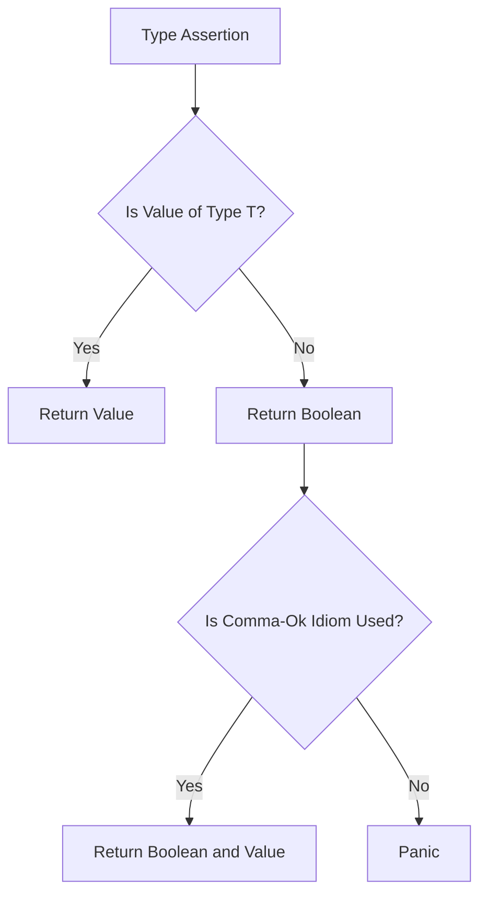

## Introduction
Type assertions in Go are a way to assert that a value is of a certain type, allowing you to access its underlying type and use its methods. This is particularly useful when working with interfaces, as it allows you to access the underlying concrete type. The syntax for type assertions is `v.(T)`, where `v` is the value being asserted and `T` is the type being asserted to. Type assertions are a fundamental concept in Go, and understanding how to use them effectively is crucial for any Go developer.

> **Note:** Type assertions are not the same as type casting, which is a concept found in other programming languages. Type assertions are a way to assert that a value is of a certain type, whereas type casting is a way to convert a value from one type to another.

## Core Concepts
The core concept of type assertions in Go is the idea that a value can be asserted to be of a certain type. This is done using the `v.(T)` syntax, where `v` is the value being asserted and `T` is the type being asserted to. There are two types of type assertions in Go: type assertions with a comma-ok idiom, and type assertions without a comma-ok idiom.

*   Type assertions with a comma-ok idiom: This type of type assertion returns two values: the asserted value and a boolean indicating whether the assertion was successful. The syntax for this type of type assertion is `v, ok := v.(T)`.
*   Type assertions without a comma-ok idiom: This type of type assertion panics if the assertion is not successful. The syntax for this type of type assertion is `v := v.(T)`.

> **Warning:** Type assertions without a comma-ok idiom can panic if the assertion is not successful, so it's generally safer to use type assertions with a comma-ok idiom.

## How It Works Internally
When you use a type assertion, Go checks whether the value being asserted is of the type being asserted to. If the assertion is successful, the value is returned; otherwise, a boolean indicating whether the assertion was successful is returned. The type assertion is implemented as a runtime check, which means that it's performed at runtime rather than at compile time.

Here's a step-by-step breakdown of how type assertions work internally:

1.  The type assertion is evaluated at runtime.
2.  The value being asserted is checked to see if it's of the type being asserted to.
3.  If the assertion is successful, the value is returned.
4.  If the assertion is not successful, a boolean indicating whether the assertion was successful is returned.

> **Tip:** Use type assertions with a comma-ok idiom to avoid panics and make your code safer.

## Code Examples
### Example 1: Basic Type Assertion
```go
package main

import "fmt"

func main() {
    var i interface{} = "hello"
    s, ok := i.(string)
    if ok {
        fmt.Println(s) // prints "hello"
    } else {
        fmt.Println("i is not a string")
    }
}
```
This example demonstrates a basic type assertion using the comma-ok idiom. The `i` variable is an interface that holds a string value, and the type assertion checks whether `i` is a string. If the assertion is successful, the string value is printed; otherwise, a message indicating that `i` is not a string is printed.

### Example 2: Type Assertion with a Struct
```go
package main

import "fmt"

type Person struct {
    Name string
    Age  int
}

func main() {
    var i interface{} = Person{"John", 30}
    p, ok := i.(Person)
    if ok {
        fmt.Printf("Name: %s, Age: %d\n", p.Name, p.Age) // prints "Name: John, Age: 30"
    } else {
        fmt.Println("i is not a Person")
    }
}
```
This example demonstrates a type assertion with a struct. The `i` variable is an interface that holds a `Person` struct, and the type assertion checks whether `i` is a `Person`. If the assertion is successful, the `Person` struct is printed; otherwise, a message indicating that `i` is not a `Person` is printed.

### Example 3: Advanced Type Assertion with a Slice
```go
package main

import "fmt"

func main() {
    var i interface{} = []int{1, 2, 3}
    s, ok := i.([]int)
    if ok {
        fmt.Println(s) // prints "[1 2 3]"
    } else {
        fmt.Println("i is not a slice of ints")
    }
}
```
This example demonstrates an advanced type assertion with a slice. The `i` variable is an interface that holds a slice of integers, and the type assertion checks whether `i` is a slice of integers. If the assertion is successful, the slice is printed; otherwise, a message indicating that `i` is not a slice of integers is printed.

## Visual Diagram

This diagram illustrates the flow of a type assertion in Go. The type assertion checks whether a value is of a certain type, and if the assertion is successful, the value is returned. If the assertion is not successful, a boolean indicating whether the assertion was successful is returned. If the comma-ok idiom is used, the boolean and value are returned; otherwise, a panic occurs.

## Comparison
| Approach | Time Complexity | Space Complexity | Pros | Cons | Best For |
| --- | --- | --- | --- | --- | --- |
| Type Assertion with Comma-Ok Idiom | O(1) | O(1) | Safe, returns boolean and value | More verbose | General use cases |
| Type Assertion without Comma-Ok Idiom | O(1) | O(1) | Less verbose | Panics if assertion fails | Performance-critical code |
| Type Switch | O(1) | O(1) | More expressive, can handle multiple types | More verbose | Handling multiple types |
| Type Conversion | O(1) | O(1) | Can convert between types | Can lose information | Converting between types |

> **Interview:** What is the difference between a type assertion and a type conversion? A type assertion checks whether a value is of a certain type, whereas a type conversion converts a value from one type to another.

## Real-world Use Cases
1.  **Error Handling:** Type assertions can be used to handle errors in a more expressive way. For example, you can use a type assertion to check whether an error is of a certain type and handle it accordingly.
2.  **JSON Unmarshaling:** Type assertions can be used to unmarshal JSON data into a specific struct type. For example, you can use a type assertion to check whether a JSON value is a string or an integer and unmarshal it accordingly.
3.  **Database Querying:** Type assertions can be used to query a database and retrieve data of a specific type. For example, you can use a type assertion to check whether a database row is of a certain type and retrieve its values accordingly.

## Common Pitfalls
1.  **Panic on Failure:** Type assertions without a comma-ok idiom can panic if the assertion fails. To avoid this, use type assertions with a comma-ok idiom.
2.  **Type Confusion:** Type assertions can lead to type confusion if not used carefully. For example, if you use a type assertion to check whether a value is of a certain type, but the value is actually of a different type, you may end up with unexpected behavior.
3.  **Performance:** Type assertions can affect performance if used excessively. To avoid this, use type assertions judiciously and only when necessary.
4.  **Code Readability:** Type assertions can make code less readable if used excessively. To avoid this, use type assertions judiciously and only when necessary, and consider using type switches or type conversions instead.

> **Warning:** Type assertions can lead to type confusion if not used carefully. Always use type assertions with a comma-ok idiom to avoid panics and ensure code safety.

## Interview Tips
1.  **Type Assertion vs Type Conversion:** Be prepared to explain the difference between a type assertion and a type conversion. A type assertion checks whether a value is of a certain type, whereas a type conversion converts a value from one type to another.
2.  **Type Assertion with Comma-Ok Idiom:** Be prepared to explain how to use a type assertion with a comma-ok idiom. This involves using the `v, ok := v.(T)` syntax and checking the `ok` boolean to determine whether the assertion was successful.
3.  **Type Switch:** Be prepared to explain how to use a type switch to handle multiple types. This involves using the `switch v := v.(type)` syntax and handling each type case accordingly.

## Key Takeaways
*   Type assertions in Go are used to assert that a value is of a certain type.
*   Type assertions can be used with a comma-ok idiom to avoid panics and ensure code safety.
*   Type assertions can affect performance if used excessively.
*   Type assertions can lead to type confusion if not used carefully.
*   Type switches can be used to handle multiple types in a more expressive way.
*   Type conversions can be used to convert a value from one type to another.
*   Type assertions have a time complexity of O(1) and a space complexity of O(1).
*   Type assertions are generally safe to use, but can panic if the assertion fails and the comma-ok idiom is not used.