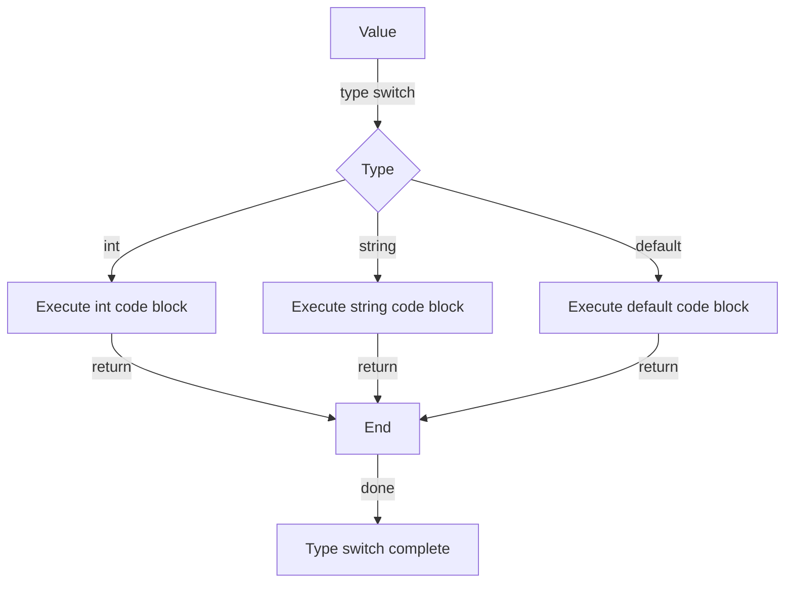

## Introduction
Type switches are a fundamental concept in the Go programming language, allowing developers to perform different actions based on the type of a value. This feature is especially useful when working with interfaces and generic types. In this section, we will explore the importance of type switches, their real-world relevance, and why every engineer should understand this concept.

Type switches are essential in Go because they enable developers to write more generic and flexible code. By using type switches, developers can handle different types of data in a single function or method, making the code more reusable and maintainable. For example, a function that needs to handle both integers and strings can use a type switch to perform different actions based on the type of the input value.

> **Note:** Type switches are not unique to Go and can be found in other programming languages, such as Java and C#. However, Go's type system and syntax make type switches particularly useful and expressive.

## Core Concepts
A type switch is a statement that performs different actions based on the type of a value. The general syntax of a type switch is:
```go
switch x := x.(type) {
case type1:
    // code to handle type1
case type2:
    // code to handle type2
default:
    // code to handle default case
}
```
In this syntax, `x` is the value to be switched on, and `type1` and `type2` are the types to be matched. The `default` case is optional and is executed if the value does not match any of the specified types.

> **Tip:** When using type switches, it's essential to understand the concept of type assertion. Type assertion is the process of checking the type of a value at runtime. In Go, type assertion is performed using the `.(type)` syntax.

## How It Works Internally
When a type switch is executed, the Go runtime performs the following steps:

1. Evaluate the expression `x.(type)`, which returns the type of the value `x`.
2. Compare the returned type with the types specified in the `case` clauses.
3. If a match is found, execute the corresponding code block.
4. If no match is found, execute the `default` code block if present.

The time complexity of a type switch is O(1), meaning that the execution time is constant and does not depend on the number of cases. However, the space complexity can vary depending on the number of cases and the complexity of the code blocks.

## Code Examples
### Example 1: Basic Type Switch
```go
package main

import "fmt"

func main() {
    var x interface{} = 5
    switch x := x.(type) {
    case int:
        fmt.Println("x is an integer")
    case string:
        fmt.Println("x is a string")
    default:
        fmt.Println("x is of unknown type")
    }
}
```
This example demonstrates a basic type switch that checks the type of a value and prints a message accordingly.

### Example 2: Type Switch with Multiple Cases
```go
package main

import "fmt"

func main() {
    var x interface{} = "hello"
    switch x := x.(type) {
    case int, float64:
        fmt.Println("x is a number")
    case string:
        fmt.Println("x is a string")
    case bool:
        fmt.Println("x is a boolean")
    default:
        fmt.Println("x is of unknown type")
    }
}
```
This example shows a type switch with multiple cases, where a single code block is executed for multiple types.

### Example 3: Type Switch with Struct Type
```go
package main

import "fmt"

type Person struct {
    Name string
    Age  int
}

func main() {
    var x interface{} = Person{"John", 30}
    switch x := x.(type) {
    case Person:
        fmt.Printf("x is a Person: %+v\n", x)
    default:
        fmt.Println("x is of unknown type")
    }
}
```
This example demonstrates a type switch with a struct type, where the code block is executed only if the value is of type `Person`.

## Visual Diagram

This diagram illustrates the flow of a type switch, where the value is checked against different types and the corresponding code block is executed.

## Comparison
| Approach | Time Complexity | Space Complexity | Pros | Cons | Best For |
| --- | --- | --- | --- | --- | --- |
| Type Switch | O(1) | variable | flexible, expressive | complex, error-prone | handling multiple types |
| Type Assertion | O(1) | variable | simple, efficient | limited, error-prone | handling single type |
| Interface | O(1) | fixed | flexible, reusable | complex, overhead | handling multiple types with common interface |
| Reflection | O(n) | variable | flexible, dynamic | complex, slow | handling unknown types or complex data structures |

## Real-world Use Cases
1. **Google's Go Language**: The Go language itself uses type switches to handle different types of values in the `fmt` package.
2. **Kubernetes**: Kubernetes uses type switches to handle different types of resources, such as pods, services, and deployments.
3. **Docker**: Docker uses type switches to handle different types of containers, such as Linux and Windows containers.

## Common Pitfalls
1. **Incorrect Type**: Using an incorrect type in a type switch can lead to unexpected behavior or runtime errors.
```go
// wrong
switch x := x.(type) {
case int:
    // code to handle int
case string:
    // code to handle string
}

// right
switch x := x.(type) {
case int:
    // code to handle int
case string:
    // code to handle string
default:
    // code to handle default case
}
```
2. **Missing Default Case**: Failing to include a default case in a type switch can lead to unexpected behavior or runtime errors.
```go
// wrong
switch x := x.(type) {
case int:
    // code to handle int
case string:
    // code to handle string
}

// right
switch x := x.(type) {
case int:
    // code to handle int
case string:
    // code to handle string
default:
    // code to handle default case
}
```
3. **Type Assertion Error**: Using type assertion incorrectly can lead to runtime errors.
```go
// wrong
x := x.(int)

// right
x, ok := x.(int)
if !ok {
    // handle type assertion error
}
```
4. **Complex Type Switch**: Using complex type switches with many cases can lead to performance issues and make the code harder to maintain.
```go
// wrong
switch x := x.(type) {
case int:
    // code to handle int
case string:
    // code to handle string
case bool:
    // code to handle bool
case float64:
    // code to handle float64
}

// right
switch x := x.(type) {
case int, float64:
    // code to handle numbers
case string:
    // code to handle string
case bool:
    // code to handle bool
}
```
> **Warning:** Complex type switches can lead to performance issues and make the code harder to maintain.

## Interview Tips
1. **What is a type switch?**: A type switch is a statement that performs different actions based on the type of a value.
2. **How does a type switch work?**: A type switch works by evaluating the expression `x.(type)` and comparing the returned type with the types specified in the `case` clauses.
3. **What is the time complexity of a type switch?**: The time complexity of a type switch is O(1), meaning that the execution time is constant and does not depend on the number of cases.

> **Interview:** When answering questions about type switches, be sure to explain the concept clearly and provide examples to illustrate the point.

## Key Takeaways
* Type switches are a fundamental concept in Go that enable developers to perform different actions based on the type of a value.
* The general syntax of a type switch is `switch x := x.(type) { ... }`.
* Type switches have a time complexity of O(1) and a variable space complexity.
* Type switches can be used to handle multiple types, but complex type switches can lead to performance issues and make the code harder to maintain.
* Type assertion is the process of checking the type of a value at runtime, and it is performed using the `.(type)` syntax.
* The `default` case is optional and is executed if the value does not match any of the specified types.
* Type switches are useful in handling different types of data in a single function or method, making the code more reusable and maintainable.