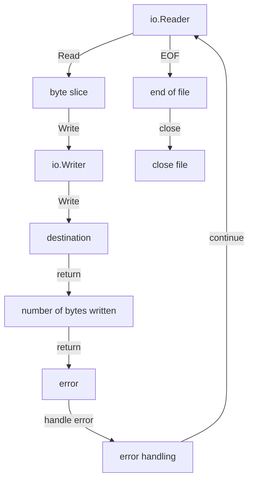

## Introduction
The **io.Reader** and **io.Writer** interfaces are fundamental components of the Go programming language's input/output (I/O) system. They provide a standardized way to read and write data, allowing developers to work with various data sources and destinations, such as files, networks, and memory buffers. Understanding these interfaces is crucial for building robust and efficient I/O operations in Go applications. In this article, we will delve into the details of **io.Reader** and **io.Writer**, exploring their definitions, internal mechanics, and usage examples.

## Core Concepts
The **io.Reader** interface defines a single method, **Read(p []byte) (n int, err error)**, which reads up to **len(p)** bytes from the underlying data source into the provided byte slice **p**. The method returns the number of bytes read **(n)** and an error **(err)**, if any. The **io.Writer** interface, on the other hand, defines a single method, **Write(p []byte) (n int, err error)**, which writes the contents of the provided byte slice **p** to the underlying data destination. The method returns the number of bytes written **(n)** and an error **(err)**, if any.

> **Note:** The **io.Reader** and **io.Writer** interfaces are designed to be used together, allowing developers to create pipelines of data processing operations. For example, reading data from a file, processing it, and then writing the result to another file.

## How It Works Internally
When you call the **Read** method on an **io.Reader**, the following steps occur:

1. The **Read** method is called on the underlying data source, such as a file or network connection.
2. The data source returns a byte slice containing the requested data.
3. The **Read** method returns the number of bytes read and an error, if any.

Similarly, when you call the **Write** method on an **io.Writer**, the following steps occur:

1. The **Write** method is called on the underlying data destination, such as a file or network connection.
2. The data destination writes the provided byte slice to its internal buffer.
3. The **Write** method returns the number of bytes written and an error, if any.

The time complexity of the **Read** and **Write** methods is O(n), where n is the number of bytes being read or written. The space complexity is O(1), as the methods only use a fixed amount of memory to store the byte slice and error values.

## Code Examples
### Example 1: Basic Usage
```go
package main

import (
	"fmt"
	"io"
	"strings"
)

func main() {
	// Create an io.Reader from a string
	reader := strings.NewReader("Hello, World!")

	// Create an io.Writer to write to the console
	writer := io.Writer(&fmt.Printf)

	// Read from the reader and write to the writer
	io.Copy(writer, reader)
}
```
### Example 2: Real-World Pattern
```go
package main

import (
	"fmt"
	"io"
	"log"
	"net/http"
)

func main() {
	// Create an HTTP client to read from a URL
	resp, err := http.Get("https://example.com")
	if err != nil {
		log.Fatal(err)
	}
	defer resp.Body.Close()

	// Create an io.Writer to write to a file
	file, err := os.Create("example.html")
	if err != nil {
		log.Fatal(err)
	}
	defer file.Close()

	// Read from the HTTP response and write to the file
	io.Copy(file, resp.Body)
}
```
### Example 3: Advanced Usage
```go
package main

import (
	"fmt"
	"io"
	"log"
	"os"
)

func main() {
	// Create an io.Reader from a file
	file, err := os.Open("example.txt")
	if err != nil {
		log.Fatal(err)
	}
	defer file.Close()

	// Create an io.Writer to write to another file
	dest, err := os.Create("example_copy.txt")
	if err != nil {
		log.Fatal(err)
	}
	defer dest.Close()

	// Read from the file and write to the destination file
	buf := make([]byte, 1024)
	for {
		n, err := file.Read(buf)
		if err != nil {
			if err != io.EOF {
				log.Fatal(err)
			}
			break
		}
		_, err = dest.Write(buf[:n])
		if err != nil {
			log.Fatal(err)
		}
	}
}
```
> **Tip:** When working with **io.Reader** and **io.Writer**, it's essential to handle errors properly to avoid data corruption or loss.

## Visual Diagram

The diagram illustrates the flow of data from an **io.Reader** to an **io.Writer**, including error handling and end-of-file detection.

## Comparison
| Approach | Time Complexity | Space Complexity | Pros | Cons | Best For |
| --- | --- | --- | --- | --- | --- |
| **io.Reader** and **io.Writer** | O(n) | O(1) | Flexible, efficient, and easy to use | Limited control over underlying data source or destination | Most I/O operations |
| **bufio.Reader** and **bufio.Writer** | O(n) | O(n) | Provides buffering for efficient I/O operations | More complex and heavier than **io.Reader** and **io.Writer** | Large-scale I/O operations |
| **ioutil.ReadAll** and **ioutil.WriteFile** | O(n) | O(n) | Convenient and easy to use | Less flexible and less efficient than **io.Reader** and **io.Writer** | Small-scale I/O operations |

> **Warning:** When using **io.Reader** and **io.Writer**, be aware of the potential for data corruption or loss if errors are not handled properly.

## Real-world Use Cases
1. **Google's Cloud Storage**: Uses **io.Reader** and **io.Writer** to read and write data to and from cloud storage.
2. **Amazon's S3**: Uses **io.Reader** and **io.Writer** to read and write data to and from S3 buckets.
3. **Apache Kafka**: Uses **io.Reader** and **io.Writer** to read and write data to and from Kafka topics.

## Common Pitfalls
1. **Not handling errors properly**: Failing to handle errors properly can lead to data corruption or loss.
2. **Not checking for EOF**: Failing to check for end-of-file can lead to infinite loops or unexpected behavior.
3. **Not closing files**: Failing to close files can lead to file descriptor leaks or unexpected behavior.
4. **Using **ioutil.ReadAll** and **ioutil.WriteFile** for large-scale I/O operations**: These functions are less efficient and less flexible than **io.Reader** and **io.Writer** for large-scale I/O operations.

## Interview Tips
1. **What is the difference between **io.Reader** and **io.Writer****?**: The interviewer is looking for a clear understanding of the **io.Reader** and **io.Writer** interfaces and their roles in I/O operations.
2. **How do you handle errors when using **io.Reader** and **io.Writer****?**: The interviewer is looking for a demonstration of proper error handling techniques when using **io.Reader** and **io.Writer**.
3. **What are some common pitfalls when using **io.Reader** and **io.Writer****?**: The interviewer is looking for a demonstration of awareness of common pitfalls and how to avoid them.

> **Interview:** When answering interview questions, be sure to provide clear and concise explanations, and demonstrate a deep understanding of the subject matter.

## Key Takeaways
* **io.Reader** and **io.Writer** are fundamental interfaces in Go's I/O system.
* **io.Reader** reads data from an underlying data source, while **io.Writer** writes data to an underlying data destination.
* **io.Reader** and **io.Writer** are designed to be used together to create pipelines of data processing operations.
* **io.Reader** and **io.Writer** have a time complexity of O(n) and a space complexity of O(1).
* **bufio.Reader** and **bufio.Writer** provide buffering for efficient I/O operations, but are more complex and heavier than **io.Reader** and **io.Writer**.
* **ioutil.ReadAll** and **ioutil.WriteFile** are convenient and easy to use, but less flexible and less efficient than **io.Reader** and **io.Writer**.
* Proper error handling and end-of-file detection are crucial when using **io.Reader** and **io.Writer**.
* Common pitfalls include not handling errors properly, not checking for EOF, not closing files, and using **ioutil.ReadAll** and **ioutil.WriteFile** for large-scale I/O operations.