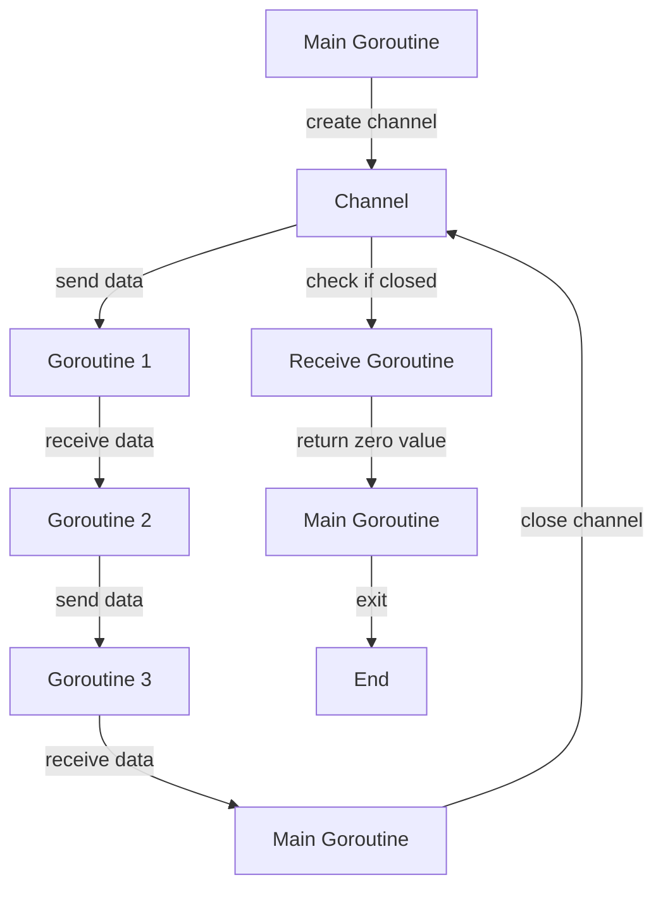

## Introduction
In the world of concurrent programming, **channels** play a crucial role in enabling safe and efficient communication between goroutines. In Go, channels are created using the `make(chan T)` function, where `T` is the type of data that will be sent and received through the channel. Channels can be either **unbuffered** or **buffered**, each with its own strengths and use cases. Understanding the differences between these two types of channels is essential for writing efficient and concurrent code. 
> **Note:** In this section, we will introduce the basic concepts of channels and their importance in concurrent programming.

## Core Concepts
A **channel** is a communication mechanism that allows goroutines to exchange data. It is a **FIFO (First-In-First-Out)** data structure, meaning that the data is received in the same order it was sent. When a goroutine sends data to a channel, it blocks until another goroutine receives the data. Similarly, when a goroutine receives data from a channel, it blocks until data is available. 
> **Warning:** If a channel is not properly closed, it can lead to memory leaks and unexpected behavior.

The **capacity** of a channel refers to the maximum number of elements that can be stored in the channel at any given time. An **unbuffered channel** has a capacity of 0, meaning that a send operation will block until a receive operation is performed. A **buffered channel**, on the other hand, has a capacity greater than 0, allowing multiple send operations to be performed without blocking.

## How It Works Internally
When a channel is created, Go allocates a **hchan** struct to represent the channel. The **hchan** struct contains several fields, including the **qcount** field, which represents the number of elements in the queue, and the **dataqsiz** field, which represents the capacity of the channel.

When a goroutine sends data to a channel, the following steps occur:

1. The goroutine checks if the channel is closed. If it is, the goroutine panics.
2. The goroutine checks if the channel has available capacity. If it does, the data is added to the channel's queue.
3. If the channel does not have available capacity, the goroutine blocks until a receive operation is performed.

When a goroutine receives data from a channel, the following steps occur:

1. The goroutine checks if the channel is closed. If it is, the goroutine returns a zero value.
2. The goroutine checks if the channel has available data. If it does, the data is removed from the channel's queue and returned to the goroutine.
3. If the channel does not have available data, the goroutine blocks until a send operation is performed.

## Code Examples
### Example 1: Basic Unbuffered Channel
```go
package main

import (
	"fmt"
)

func main() {
	ch := make(chan int)
	go func() {
		ch <- 1
	}()
	fmt.Println(<-ch)
}
```
This example demonstrates the basic usage of an unbuffered channel. The `main` goroutine creates a channel and starts a new goroutine that sends the value 1 to the channel. The `main` goroutine then receives the value from the channel and prints it to the console.

### Example 2: Buffered Channel
```go
package main

import (
	"fmt"
)

func main() {
	ch := make(chan int, 5)
	ch <- 1
	ch <- 2
	ch <- 3
	fmt.Println(<-ch)
	fmt.Println(<-ch)
	fmt.Println(<-ch)
}
```
This example demonstrates the usage of a buffered channel. The `main` goroutine creates a channel with a capacity of 5 and sends three values to the channel. The goroutine then receives the values from the channel and prints them to the console.

### Example 3: Advanced Channel Usage
```go
package main

import (
	"fmt"
	"time"
)

func producer(ch chan int) {
	for i := 0; i < 10; i++ {
		ch <- i
		time.Sleep(500 * time.Millisecond)
	}
	close(ch)
}

func consumer(ch chan int) {
	for {
		select {
		case msg, ok := <-ch:
			if !ok {
				return
			}
			fmt.Println(msg)
		}
	}
}

func main() {
	ch := make(chan int)
	go producer(ch)
	go consumer(ch)
	time.Sleep(6 * time.Second)
}
```
This example demonstrates the advanced usage of channels. The `producer` goroutine sends values to the channel at a rate of one value every 500 milliseconds. The `consumer` goroutine receives values from the channel and prints them to the console. The `main` goroutine starts the `producer` and `consumer` goroutines and waits for 6 seconds before exiting.

## Visual Diagram

This diagram illustrates the flow of data between goroutines using channels. The `Main Goroutine` creates a channel and starts several goroutines that send and receive data through the channel. The channel is closed when all data has been sent, and the receiving goroutines return a zero value.

## Comparison
| Channel Type | Time Complexity | Space Complexity | Pros | Cons | Best For |
| --- | --- | --- | --- | --- | --- |
| Unbuffered | O(1) | O(1) | Simple, lightweight | Blocking | Simple communication between goroutines |
| Buffered | O(1) | O(n) | Non-blocking, efficient | More complex, higher memory usage | High-throughput communication between goroutines |
| Closed Channel | O(1) | O(1) | Safe, efficient | Limited use cases | Signal the end of data transmission |

## Real-world Use Cases
1. **Google's Go Concurrency Model**: Google's Go language uses channels as a fundamental concurrency mechanism. The language's concurrency model is based on the idea of goroutines communicating with each other through channels.
2. **Netflix's Goroutine Pool**: Netflix uses a goroutine pool to manage a large number of concurrent connections. The pool uses channels to communicate between goroutines and to manage the lifecycle of connections.
3. **Kubernetes' Channel-based Communication**: Kubernetes uses channels to communicate between components. The `kubelet` component uses channels to receive and process updates from the `apiserver`.

## Common Pitfalls
1. **Not closing channels**: Failing to close channels can lead to memory leaks and unexpected behavior.
2. **Using unbuffered channels incorrectly**: Unbuffered channels can block if not used correctly, leading to deadlocks and performance issues.
3. **Not handling channel errors**: Failing to handle channel errors can lead to crashes and unexpected behavior.
4. **Using channels as a substitute for mutexes**: Channels should not be used as a substitute for mutexes, as they can lead to performance issues and unexpected behavior.

## Interview Tips
1. **What is the difference between an unbuffered and buffered channel?**: An unbuffered channel has a capacity of 0, while a buffered channel has a capacity greater than 0.
2. **How do you close a channel?**: A channel is closed using the `close()` function.
3. **What happens when a goroutine sends data to a closed channel?**: The goroutine panics when sending data to a closed channel.
> **Interview:** Be prepared to answer questions about the differences between unbuffered and buffered channels, how to close channels, and what happens when sending data to a closed channel.

## Key Takeaways
* Channels are a fundamental concurrency mechanism in Go.
* Unbuffered channels have a capacity of 0, while buffered channels have a capacity greater than 0.
* Channels can be closed using the `close()` function.
* Sending data to a closed channel panics.
* Receiving data from a closed channel returns a zero value.
* Channels should be used instead of mutexes for communication between goroutines.
* Channels can be used to implement producer-consumer patterns.
* Channels can be used to implement request-response patterns.
* Channels can be used to implement publish-subscribe patterns.
> **Tip:** Use channels to implement concurrency patterns in your Go programs. Channels are a powerful and efficient way to communicate between goroutines.