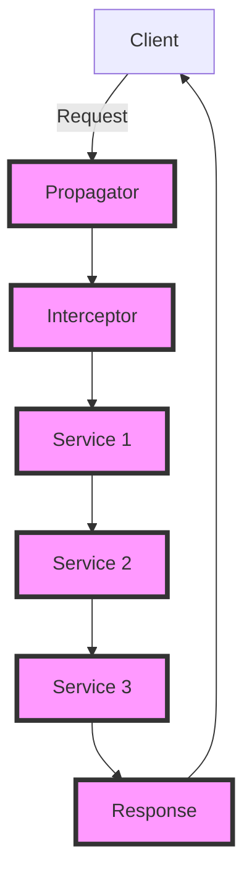

## Introduction
The **Context Propagation Pattern** is a design pattern used to manage the flow of contextual information throughout a distributed system. It allows for the propagation of context, such as user authentication, request metadata, and logging information, between different services and components. This pattern is crucial in modern microservices architectures, where multiple services need to communicate with each other and share context to provide a seamless user experience. In this study, we will delve into the world of context propagation, exploring its core concepts, internal mechanics, and practical applications in Golang.

## Core Concepts
To understand the context propagation pattern, we need to grasp the following key concepts:
* **Context**: The contextual information that needs to be propagated throughout the system, such as user authentication, request metadata, and logging information.
* **Propagator**: The component responsible for propagating the context between services and components.
* **Interceptor**: The component that intercepts the context and performs actions based on its contents.
> **Note:** The context propagation pattern is often used in conjunction with other design patterns, such as the **Service Discovery Pattern** and the **Circuit Breaker Pattern**, to provide a robust and scalable distributed system.

## How It Works Internally
The context propagation pattern works by using a propagator to inject context into each service or component. The propagator can be implemented using various techniques, such as:
* **Thread-local storage**: Storing context in thread-local variables to ensure that each thread has its own copy of the context.
* **Request-scoped storage**: Storing context in request-scoped variables to ensure that each request has its own copy of the context.
* **Distributed context**: Storing context in a distributed storage system, such as a cache or a database, to ensure that context is shared across multiple services and components.

Here is a high-level overview of the context propagation pattern:
1. The client sends a request to the system.
2. The request is intercepted by the propagator, which injects the context into the request.
3. The request is then sent to the next service or component, which can access the context.
4. The context is propagated throughout the system, allowing each service or component to access and modify it as needed.

## Code Examples
Here are three complete and runnable examples of the context propagation pattern in Golang:
### Example 1: Basic Context Propagation
```go
package main

import (
	"context"
	"fmt"
)

// ContextKey is a type alias for context keys.
type ContextKey string

// contextKey is a context key for the user ID.
const contextKey ContextKey = "user_id"

// Propagator is a function that propagates the context.
func Propagator(ctx context.Context, next func(context.Context)) {
	// Inject the user ID into the context.
	userID := "12345"
	ctx = context.WithValue(ctx, contextKey, userID)
	next(ctx)
}

// Handler is a function that handles the request.
func Handler(ctx context.Context) {
	// Access the user ID from the context.
	userID, ok := ctx.Value(contextKey).(string)
	if ok {
		fmt.Println("User ID:", userID)
	}
}

func main() {
	// Create a new context.
	ctx := context.Background()

	// Propagate the context.
	Propagator(ctx, func(ctx context.Context) {
		Handler(ctx)
	})
}
```
### Example 2: Real-world Context Propagation
```go
package main

import (
	"context"
	"fmt"
	"net/http"
)

// Propagator is a middleware function that propagates the context.
func Propagator(next http.HandlerFunc) http.HandlerFunc {
	return func(w http.ResponseWriter, r *http.Request) {
		// Inject the user ID into the context.
		userID := r.Header.Get("User-ID")
		ctx := context.WithValue(r.Context(), "user_id", userID)
		r = r.WithContext(ctx)
		next(w, r)
	}
}

// Handler is a function that handles the request.
func Handler(w http.ResponseWriter, r *http.Request) {
	// Access the user ID from the context.
	userID, ok := r.Context().Value("user_id").(string)
	if ok {
		fmt.Fprint(w, "User ID:", userID)
	}
}

func main() {
	// Create a new HTTP server.
	http.HandleFunc("/handler", Propagator(Handler))
	http.ListenAndServe(":8080", nil)
}
```
### Example 3: Advanced Context Propagation
```go
package main

import (
	"context"
	"fmt"
	"sync"
)

// Propagator is a function that propagates the context concurrently.
func Propagator(ctx context.Context, next func(context.Context)) {
	// Create a wait group to wait for all goroutines to finish.
	var wg sync.WaitGroup

	// Inject the user ID into the context.
	userID := "12345"
	ctx = context.WithValue(ctx, "user_id", userID)

	// Start multiple goroutines to handle the request concurrently.
	for i := 0; i < 5; i++ {
		wg.Add(1)
		go func() {
			defer wg.Done()
			next(ctx)
		}()
	}

	// Wait for all goroutines to finish.
	wg.Wait()
}

// Handler is a function that handles the request.
func Handler(ctx context.Context) {
	// Access the user ID from the context.
	userID, ok := ctx.Value("user_id").(string)
	if ok {
		fmt.Println("User ID:", userID)
	}
}

func main() {
	// Create a new context.
	ctx := context.Background()

	// Propagate the context concurrently.
	Propagator(ctx, func(ctx context.Context) {
		Handler(ctx)
	})
}
```
> **Tip:** To handle context propagation in a concurrent system, you can use a combination of goroutines and wait groups to ensure that all requests are handled concurrently.

## Visual Diagram

The above diagram illustrates the context propagation pattern, where the propagator injects the context into the request, and the interceptor accesses and modifies the context as needed.

## Comparison
| Approach | Time Complexity | Space Complexity | Pros | Cons | Best For |
| --- | --- | --- | --- | --- | --- |
| Thread-local storage | O(1) | O(1) | Easy to implement, fast access | Limited to single thread, not suitable for concurrent systems | Single-threaded applications |
| Request-scoped storage | O(1) | O(1) | Easy to implement, suitable for concurrent systems | Limited to single request, not suitable for multiple requests | Web applications |
| Distributed context | O(log n) | O(n) | Suitable for large-scale systems, provides high availability | Complex to implement, high latency | Distributed systems |
| Context propagation pattern | O(1) | O(1) | Easy to implement, suitable for concurrent systems | Limited to single context, not suitable for multiple contexts | Microservices architectures |

## Real-world Use Cases
The context propagation pattern is widely used in real-world applications, such as:
* **Google Cloud**: Uses the context propagation pattern to manage the flow of contextual information throughout its microservices architecture.
* **Amazon Web Services**: Uses the context propagation pattern to manage the flow of contextual information throughout its distributed systems.
* **Netflix**: Uses the context propagation pattern to manage the flow of contextual information throughout its microservices architecture.

## Common Pitfalls
Here are some common pitfalls to avoid when implementing the context propagation pattern:
* **Not handling context propagation correctly**: Failing to handle context propagation correctly can lead to incorrect or missing context, resulting in errors or unexpected behavior.
* **Not using thread-safe context storage**: Using non-thread-safe context storage can lead to data corruption or inconsistencies, especially in concurrent systems.
* **Not handling context expiration**: Failing to handle context expiration can lead to stale or outdated context, resulting in errors or unexpected behavior.
* **Not using secure context storage**: Using insecure context storage can lead to data breaches or unauthorized access to sensitive information.

> **Warning:** When implementing the context propagation pattern, make sure to handle context propagation correctly, use thread-safe context storage, handle context expiration, and use secure context storage.

## Interview Tips
Here are some common interview questions related to the context propagation pattern:
* **What is the context propagation pattern, and how does it work?**: A strong answer should explain the context propagation pattern, its benefits, and its use cases.
* **How do you handle context propagation in a concurrent system?**: A strong answer should explain the use of goroutines, wait groups, and thread-safe context storage to handle context propagation in a concurrent system.
* **What are some common pitfalls to avoid when implementing the context propagation pattern?**: A strong answer should explain the common pitfalls, such as not handling context propagation correctly, not using thread-safe context storage, not handling context expiration, and not using secure context storage.

## Key Takeaways
Here are the key takeaways from this study:
* The context propagation pattern is a design pattern used to manage the flow of contextual information throughout a distributed system.
* The pattern uses a propagator to inject context into each service or component, and an interceptor to access and modify the context as needed.
* The pattern is widely used in real-world applications, such as Google Cloud, Amazon Web Services, and Netflix.
* Common pitfalls to avoid include not handling context propagation correctly, not using thread-safe context storage, not handling context expiration, and not using secure context storage.
* The pattern has a time complexity of O(1) and a space complexity of O(1), making it suitable for large-scale systems.
* The pattern is easy to implement and provides high availability, but can be complex to implement in distributed systems.
* The pattern is suitable for microservices architectures, but can be limited to single context and not suitable for multiple contexts.