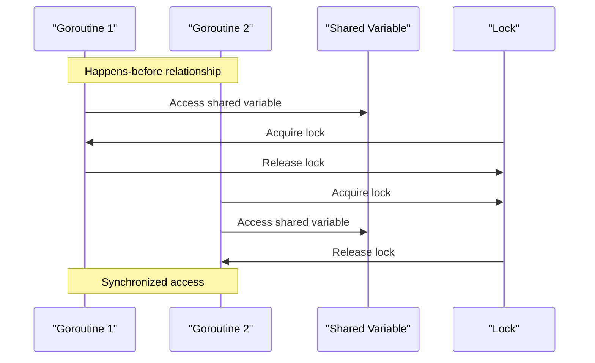

## Introduction
The Go memory model is a set of rules that define how memory is accessed and updated in a concurrent program. It is essential to understand these rules to write correct and efficient concurrent code in Go. The memory model provides **happens-before guarantees**, which ensure that certain operations are executed in a specific order, even in the presence of concurrency. In this section, we will introduce the Go memory model, its importance, and its real-world relevance.

The Go memory model is crucial in concurrent programming because it helps prevent common issues like **data races** and **deadlocks**. A data race occurs when multiple goroutines access the same variable simultaneously, leading to unexpected behavior. The happens-before guarantees provided by the Go memory model help prevent data races by ensuring that certain operations are executed in a specific order.

> **Note:** The Go memory model is based on the concept of **happens-before** relationships, which define the order in which operations are executed. This is different from other programming languages, which may use locks or other synchronization mechanisms to manage concurrency.

In real-world applications, the Go memory model is used in various scenarios, such as **web servers**, **databases**, and **file systems**. For example, a web server may use multiple goroutines to handle incoming requests concurrently, and the Go memory model ensures that the data is accessed and updated correctly.

## Core Concepts
The Go memory model defines several core concepts that are essential to understand:

* **Happens-before**: A happens-before relationship between two operations means that the first operation must be executed before the second operation.
* **Synchronization**: Synchronization is the process of coordinating access to shared resources to prevent data races and other concurrency issues.
* **Goroutine**: A goroutine is a lightweight thread that runs concurrently with other goroutines.
* **Channel**: A channel is a communication mechanism that allows goroutines to exchange data safely.

> **Warning:** Failing to understand the Go memory model can lead to subtle bugs and concurrency issues that are difficult to debug.

## How It Works Internally
The Go memory model works internally by using a combination of **locks**, **barriers**, and **happens-before** relationships to manage concurrency. When a goroutine accesses a shared variable, the Go runtime checks if the access is synchronized using a lock or a happens-before relationship. If the access is not synchronized, the Go runtime will **block** the goroutine until the access is safe.

Here is a step-by-step breakdown of how the Go memory model works internally:

1. A goroutine accesses a shared variable.
2. The Go runtime checks if the access is synchronized using a lock or a happens-before relationship.
3. If the access is not synchronized, the Go runtime blocks the goroutine until the access is safe.
4. Once the access is safe, the Go runtime allows the goroutine to proceed.

> **Tip:** Using **channels** and **mutexes** can help simplify concurrent programming in Go and reduce the risk of data races.

## Code Examples
Here are three complete and runnable examples that demonstrate the Go memory model:

### Example 1: Basic Happens-Before Guarantee
```go
package main

import (
	"fmt"
	"sync"
)

func main() {
	var x int
	var wg sync.WaitGroup

	wg.Add(2)

	go func() {
		x = 1
		wg.Done()
	}()

	go func() {
		wg.Wait()
		fmt.Println(x) // prints 1
		wg.Done()
	}()

	wg.Wait()
}
```
This example demonstrates a basic happens-before guarantee using a **WaitGroup** to synchronize access to the shared variable `x`.

### Example 2: Channel-Based Synchronization
```go
package main

import (
	"fmt"
)

func main() {
	ch := make(chan int)

	go func() {
		x := 1
		ch <- x
	}()

	x := <-ch
	fmt.Println(x) // prints 1
}
```
This example demonstrates channel-based synchronization using a **channel** to exchange data between two goroutines.

### Example 3: Mutex-Based Synchronization
```go
package main

import (
	"fmt"
	"sync"
)

func main() {
	var x int
	var mu sync.Mutex

	go func() {
		mu.Lock()
		x = 1
		mu.Unlock()
	}()

	mu.Lock()
	fmt.Println(x) // prints 1
	mu.Unlock()
}
```
This example demonstrates mutex-based synchronization using a **mutex** to protect access to the shared variable `x`.

## Visual Diagram

This diagram illustrates the happens-before guarantee and synchronization mechanisms used in the Go memory model.

> **Interview:** Can you explain the difference between a **happens-before** relationship and **synchronization** in the context of the Go memory model?

## Comparison
Here is a comparison of different synchronization mechanisms in Go:

| Approach | Time Complexity | Space Complexity | Pros | Cons | Best For |
| --- | --- | --- | --- | --- | --- |
| Locks | O(1) | O(1) | Simple to use, efficient | Can lead to deadlocks | Protecting shared variables |
| Channels | O(1) | O(1) | Safe, efficient, flexible | Can be complex to use | Exchanging data between goroutines |
| Mutexes | O(1) | O(1) | Simple to use, efficient | Can lead to deadlocks | Protecting shared variables |
| WaitGroups | O(1) | O(1) | Simple to use, efficient | Limited flexibility | Synchronizing goroutines |

> **Warning:** Using **locks** and **mutexes** can lead to **deadlocks** if not used carefully.

## Real-world Use Cases
Here are three real-world use cases that demonstrate the Go memory model:

1. **Google's Go-based web server**: Google's web server uses the Go memory model to manage concurrency and ensure efficient access to shared resources.
2. **CockroachDB**: CockroachDB uses the Go memory model to manage concurrency and ensure consistent access to shared data.
3. **Netflix's Go-based API gateway**: Netflix's API gateway uses the Go memory model to manage concurrency and ensure efficient access to shared resources.

## Common Pitfalls
Here are four common pitfalls to avoid when using the Go memory model:

1. **Data races**: Failing to synchronize access to shared variables can lead to data races and unexpected behavior.
2. **Deadlocks**: Using locks and mutexes incorrectly can lead to deadlocks and program crashes.
3. **Livelocks**: Using channels and mutexes incorrectly can lead to livelocks and program crashes.
4. **Starvation**: Failing to release locks and mutexes can lead to starvation and program crashes.

> **Tip:** Using **channels** and **mutexes** can help simplify concurrent programming in Go and reduce the risk of data races and deadlocks.

## Interview Tips
Here are three common interview questions related to the Go memory model:

1. **What is the difference between a happens-before relationship and synchronization in the context of the Go memory model?**
	* Weak answer: "I'm not sure, but I think they're related to concurrency."
	* Strong answer: "A happens-before relationship defines the order in which operations are executed, while synchronization is the process of coordinating access to shared resources to prevent data races and other concurrency issues."
2. **How do you use channels to synchronize access to shared variables in Go?**
	* Weak answer: "I'm not sure, but I think you use channels to send and receive data."
	* Strong answer: "You can use channels to synchronize access to shared variables by sending and receiving data through the channel, which ensures that the access is safe and efficient."
3. **What is the difference between a lock and a mutex in the context of the Go memory model?**
	* Weak answer: "I'm not sure, but I think they're both used for synchronization."
	* Strong answer: "A lock is a more general term that refers to any synchronization mechanism, while a mutex is a specific type of lock that is used to protect shared variables in Go."

## Key Takeaways
Here are ten key takeaways to remember when using the Go memory model:

* The Go memory model provides happens-before guarantees to ensure correct access to shared variables.
* Synchronization is essential to prevent data races and other concurrency issues.
* Channels are a safe and efficient way to exchange data between goroutines.
* Mutexes are used to protect shared variables in Go.
* Locks can lead to deadlocks if not used carefully.
* WaitGroups are used to synchronize goroutines.
* The Go memory model is based on the concept of happens-before relationships.
* Failing to understand the Go memory model can lead to subtle bugs and concurrency issues.
* Using channels and mutexes can help simplify concurrent programming in Go.
* The Go memory model is essential for writing correct and efficient concurrent code in Go.