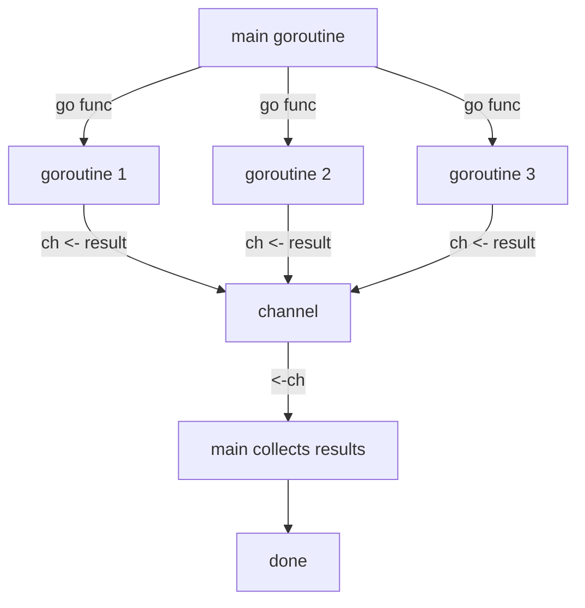

## Introduction

Goroutines and channels are Go's built-in concurrency primitives — and they are what make Go genuinely different from other languages. A goroutine is a lightweight thread managed by the Go runtime (not the OS), costing only ~2KB of stack space at startup. Channels are typed conduits for communication between goroutines, following Go's core philosophy: **"Do not communicate by sharing memory; instead, share memory by communicating."**

> **Note:** Go's concurrency model is based on CSP (Communicating Sequential Processes), a formal model by Tony Hoare. Channels enforce safe data passing between goroutines without explicit locks in most cases.

## Core Concepts

### Goroutines

A goroutine is started with the `go` keyword before a function call. It runs concurrently with the calling goroutine — the runtime schedules thousands of goroutines onto a small pool of OS threads using an M:N scheduler.

```go
// Start a goroutine — fire and forget
go fmt.Println("I run concurrently")

// Start a goroutine with an anonymous function
go func(msg string) {
    fmt.Println(msg)
}("hello from goroutine")
```

### Channels

A channel is created with `make(chan T)`. You send with `<-` and receive with `<-`:

```go
ch := make(chan int)      // unbuffered channel
ch <- 42                  // send (blocks until receiver is ready)
val := <-ch               // receive (blocks until sender sends)

bch := make(chan int, 5)  // buffered channel — holds up to 5 values without blocking
```

**Unbuffered**: sender blocks until receiver is ready — synchronisation point.  
**Buffered**: sender only blocks when the buffer is full — decouples sender and receiver.

## Goroutine Lifecycle



## Code Examples

### Example 1: Basic Goroutine + WaitGroup

```go
package main

import (
    "fmt"
    "sync"
)

func worker(id int, wg *sync.WaitGroup) {
    defer wg.Done() // signal completion when function returns
    fmt.Printf("Worker %d starting\n", id)
    // simulate work
    fmt.Printf("Worker %d done\n", id)
}

func main() {
    var wg sync.WaitGroup

    for i := 1; i <= 5; i++ {
        wg.Add(1)
        go worker(i, &wg)
    }

    wg.Wait() // block until all workers call Done()
    fmt.Println("All workers finished")
}
```

### Example 2: Channel for Result Collection (Fan-out / Fan-in)

```go
package main

import (
    "fmt"
    "math/rand"
    "time"
)

func fetchPrice(symbol string, ch chan<- string) {
    // simulate API call
    time.Sleep(time.Duration(rand.Intn(100)) * time.Millisecond)
    ch <- fmt.Sprintf("%s: $%.2f", symbol, rand.Float64()*1000)
}

func main() {
    symbols := []string{"AAPL", "GOOG", "MSFT", "AMZN"}
    ch := make(chan string, len(symbols)) // buffered — all goroutines can send without blocking

    for _, sym := range symbols {
        go fetchPrice(sym, ch)
    }

    // Collect all results
    for range symbols {
        fmt.Println(<-ch)
    }
}
```

### Example 3: Select — Multiplexing Channels

```go
package main

import (
    "fmt"
    "time"
)

func main() {
    ch1 := make(chan string)
    ch2 := make(chan string)

    go func() {
        time.Sleep(1 * time.Second)
        ch1 <- "one"
    }()
    go func() {
        time.Sleep(2 * time.Second)
        ch2 <- "two"
    }()

    // select blocks until one of the cases is ready
    for i := 0; i < 2; i++ {
        select {
        case msg := <-ch1:
            fmt.Println("Received from ch1:", msg)
        case msg := <-ch2:
            fmt.Println("Received from ch2:", msg)
        case <-time.After(3 * time.Second):
            fmt.Println("Timeout!")
        }
    }
}
```

### Example 4: Done Channel Pattern (Cancellation)

```go
package main

import (
    "fmt"
    "time"
)

func generator(done <-chan struct{}) <-chan int {
    out := make(chan int)
    go func() {
        defer close(out)
        for i := 0; ; i++ {
            select {
            case out <- i:
            case <-done: // caller signals cancellation
                fmt.Println("generator: cancelled")
                return
            }
        }
    }()
    return out
}

func main() {
    done := make(chan struct{})
    nums := generator(done)

    for i := 0; i < 5; i++ {
        fmt.Println(<-nums)
    }

    close(done) // cancel the generator goroutine
    time.Sleep(10 * time.Millisecond) // let it clean up
}
```

## Comparison: Goroutines vs OS Threads

| Feature | Goroutine | OS Thread |
|---------|-----------|-----------|
| Stack size | ~2KB (grows dynamically) | ~1–8MB fixed |
| Creation cost | Microseconds | Milliseconds |
| Scheduling | Go runtime (cooperative + preemptive) | OS kernel |
| Typical count | Millions | Thousands |
| Communication | Channels | Shared memory + locks |
| Context switch | Very cheap | Expensive |

## Real-world Use Cases

- **HTTP servers** — Go's `net/http` spawns a goroutine per request automatically
- **Pipeline processing** — chain goroutines with channels: read → transform → write
- **Worker pools** — fixed number of goroutines consuming from a job channel
- **Timeouts** — `select` with `time.After` or `context.WithTimeout`
- **Pub/sub** — fan-out results from one goroutine to many subscribers

```go
// Worker pool pattern
func workerPool(jobs <-chan int, results chan<- int, numWorkers int) {
    var wg sync.WaitGroup
    for i := 0; i < numWorkers; i++ {
        wg.Add(1)
        go func() {
            defer wg.Done()
            for job := range jobs { // range over channel — exits when closed
                results <- job * job // process job
            }
        }()
    }
    go func() {
        wg.Wait()
        close(results) // signal no more results
    }()
}
```

## Common Pitfalls & How to Avoid Them

- **Goroutine leak** — always ensure goroutines can exit. Use `done` channels or `context.Context` for cancellation.
- **Closing a channel twice** — panics at runtime. Only the sender should close; use `sync.Once` if multiple senders.
- **Sending on a closed channel** — panics. Close only when you're certain no more sends will happen.
- **Race conditions** — run `go test -race ./...` to detect data races. Use channels or `sync.Mutex` for shared state.
- **Forgetting `wg.Add(1)` before `go`** — if you call `Add` inside the goroutine, `Wait` may return before the goroutine starts.

```go
// ❌ Race condition
counter := 0
for i := 0; i < 1000; i++ {
    go func() { counter++ }() // concurrent writes — undefined behaviour
}

// ✅ Use atomic or mutex
var counter int64
for i := 0; i < 1000; i++ {
    go func() { atomic.AddInt64(&counter, 1) }()
}
```

## Summary / Key Takeaways

- Goroutines are cheap (~2KB), multiplexed onto OS threads by the Go runtime — you can run millions
- Channels are typed, safe conduits for goroutine communication — prefer them over shared memory
- **Unbuffered channels** synchronise sender and receiver; **buffered channels** decouple them
- `select` lets a goroutine wait on multiple channel operations simultaneously
- Always provide a cancellation mechanism (`done` channel or `context.Context`) to avoid goroutine leaks
- Use `go test -race` to catch data races during development

> **Tip:** For most concurrency patterns in Go, reach for `context.Context` + channels first. Only use `sync.Mutex` when you genuinely need to protect a shared data structure that channels would make awkward (e.g., a shared cache map).
