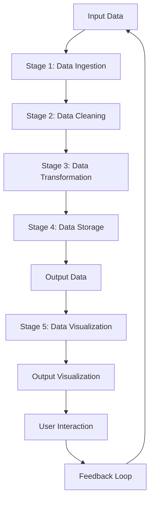

## Introduction
The **Pipeline Pattern** is a design pattern that allows for the processing of data in a series of stages, where each stage performs a specific operation on the data. This pattern is useful when dealing with complex data processing tasks that can be broken down into smaller, independent steps. In real-world applications, the Pipeline Pattern is used in data processing pipelines, where data is ingested, processed, and transformed before being stored or visualized. For example, a data processing pipeline might consist of stages for data ingestion, data cleaning, data transformation, and data storage. Every engineer should know this pattern because it allows for the creation of scalable, maintainable, and efficient data processing systems.

## Core Concepts
The Pipeline Pattern consists of the following key components:
* **Stages**: These are the individual processing steps that make up the pipeline. Each stage performs a specific operation on the data, such as data ingestion, data cleaning, or data transformation.
* **Data**: This is the input data that is processed by the pipeline. It can be in the form of a stream, a file, or a database.
* **Pipeline**: This is the sequence of stages that process the data. The pipeline can be linear or non-linear, depending on the specific use case.

> **Note:** The Pipeline Pattern is often used in conjunction with other design patterns, such as the **Factory Pattern** and the **Observer Pattern**.

## How It Works Internally
The Pipeline Pattern works by creating a series of stages that process the data in a sequential manner. Each stage receives the output from the previous stage and performs its specific operation on the data. The output from the final stage is then returned as the result of the pipeline.

Here is a step-by-step breakdown of how the Pipeline Pattern works:
1. The pipeline is initialized with a set of stages.
2. The input data is passed to the first stage in the pipeline.
3. Each stage processes the data and passes the output to the next stage.
4. The output from the final stage is returned as the result of the pipeline.

> **Warning:** One common pitfall when using the Pipeline Pattern is to assume that the pipeline will always process the data in a linear fashion. However, this is not always the case, and the pipeline may need to handle non-linear processing flows.

## Code Examples
### Example 1: Basic Pipeline
```go
package main

import "fmt"

// Stage represents a single stage in the pipeline
type Stage func(int) int

// Pipeline represents a sequence of stages
type Pipeline struct {
    stages []Stage
}

// NewPipeline returns a new pipeline
func NewPipeline() *Pipeline {
    return &Pipeline{stages: make([]Stage, 0)}
}

// AddStage adds a new stage to the pipeline
func (p *Pipeline) AddStage(stage Stage) {
    p.stages = append(p.stages, stage)
}

// Process processes the input data through the pipeline
func (p *Pipeline) Process(data int) int {
    result := data
    for _, stage := range p.stages {
        result = stage(result)
    }
    return result
}

func main() {
    pipeline := NewPipeline()
    pipeline.AddStage(func(x int) int { return x * 2 })
    pipeline.AddStage(func(x int) int { return x + 1 })
    result := pipeline.Process(5)
    fmt.Println(result) // Output: 11
}
```

### Example 2: Real-World Pipeline
```go
package main

import (
    "encoding/json"
    "fmt"
    "io/ioutil"
    "net/http"
)

// Stage represents a single stage in the pipeline
type Stage func([]byte) ([]byte, error)

// Pipeline represents a sequence of stages
type Pipeline struct {
    stages []Stage
}

// NewPipeline returns a new pipeline
func NewPipeline() *Pipeline {
    return &Pipeline{stages: make([]Stage, 0)}
}

// AddStage adds a new stage to the pipeline
func (p *Pipeline) AddStage(stage Stage) {
    p.stages = append(p.stages, stage)
}

// Process processes the input data through the pipeline
func (p *Pipeline) Process(data []byte) ([]byte, error) {
    result := data
    for _, stage := range p.stages {
        result, err := stage(result)
        if err != nil {
            return nil, err
        }
    }
    return result, nil
}

func main() {
    pipeline := NewPipeline()
    pipeline.AddStage(func(data []byte) ([]byte, error) {
        // Stage 1: Download data from API
        resp, err := http.Get("https://api.example.com/data")
        if err != nil {
            return nil, err
        }
        defer resp.Body.Close()
        return ioutil.ReadAll(resp.Body)
    })
    pipeline.AddStage(func(data []byte) ([]byte, error) {
        // Stage 2: Unmarshal JSON data
        var jsonData map[string]interface{}
        err := json.Unmarshal(data, &jsonData)
        if err != nil {
            return nil, err
        }
        return json.Marshal(jsonData)
    })
    result, err := pipeline.Process(nil)
    if err != nil {
        fmt.Println(err)
        return
    }
    fmt.Println(string(result))
}
```

### Example 3: Advanced Pipeline
```go
package main

import (
    "context"
    "fmt"
    "sync"
)

// Stage represents a single stage in the pipeline
type Stage func(context.Context, int) (int, error)

// Pipeline represents a sequence of stages
type Pipeline struct {
    stages []Stage
}

// NewPipeline returns a new pipeline
func NewPipeline() *Pipeline {
    return &Pipeline{stages: make([]Stage, 0)}
}

// AddStage adds a new stage to the pipeline
func (p *Pipeline) AddStage(stage Stage) {
    p.stages = append(p.stages, stage)
}

// Process processes the input data through the pipeline
func (p *Pipeline) Process(ctx context.Context, data int) (int, error) {
    result := data
    var wg sync.WaitGroup
    for _, stage := range p.stages {
        wg.Add(1)
        go func(stage Stage) {
            defer wg.Done()
            result, err := stage(ctx, result)
            if err != nil {
                fmt.Println(err)
                return
            }
            fmt.Println(result)
        }(stage)
    }
    wg.Wait()
    return result, nil
}

func main() {
    pipeline := NewPipeline()
    pipeline.AddStage(func(ctx context.Context, x int) (int, error) {
        // Stage 1: Simulate long-running task
        select {
        case <-ctx.Done():
            return 0, ctx.Err()
        case <-time.After(5 * time.Second):
            return x * 2, nil
        }
    })
    pipeline.AddStage(func(ctx context.Context, x int) (int, error) {
        // Stage 2: Simulate long-running task
        select {
        case <-ctx.Done():
            return 0, ctx.Err()
        case <-time.After(3 * time.Second):
            return x + 1, nil
        }
    })
    result, err := pipeline.Process(context.Background(), 5)
    if err != nil {
        fmt.Println(err)
        return
    }
    fmt.Println(result)
}
```

## Visual Diagram

The diagram above illustrates a pipeline with five stages: data ingestion, data cleaning, data transformation, data storage, and data visualization. The pipeline processes the input data through each stage and produces output data that is then visualized and interacted with by the user.

> **Tip:** When designing a pipeline, it's essential to consider the dependencies between stages and the flow of data through the pipeline.

## Comparison
| Approach | Time Complexity | Space Complexity | Pros | Cons | Best For |
| --- | --- | --- | --- | --- | --- |
| Linear Pipeline | O(n) | O(n) | Easy to implement, scalable | Not suitable for complex workflows | Simple data processing tasks |
| Non-Linear Pipeline | O(n^2) | O(n^2) | Flexible, can handle complex workflows | Difficult to implement, may have performance issues | Complex data processing tasks |
| Distributed Pipeline | O(n/m) | O(n/m) | Scalable, fault-tolerant | Requires distributed infrastructure, may have communication overhead | Large-scale data processing tasks |
| Real-Time Pipeline | O(1) | O(1) | Fast, low-latency | Requires real-time infrastructure, may have high resource requirements | Real-time data processing tasks |

## Real-world Use Cases
1. **Apache Beam**: Apache Beam is a unified programming model for both batch and streaming data processing. It uses a pipeline-based approach to process data and provides a flexible and scalable way to handle large-scale data processing tasks.
2. **Apache Spark**: Apache Spark is an in-memory data processing engine that provides high-performance data processing capabilities. It uses a pipeline-based approach to process data and provides a flexible and scalable way to handle large-scale data processing tasks.
3. **Google Cloud Dataflow**: Google Cloud Dataflow is a fully-managed service for processing and analyzing large datasets. It uses a pipeline-based approach to process data and provides a flexible and scalable way to handle large-scale data processing tasks.

## Common Pitfalls
1. **Inconsistent Data Formats**: One common pitfall when using the Pipeline Pattern is to assume that the data formats will be consistent throughout the pipeline. However, this is not always the case, and the pipeline may need to handle different data formats.
2. **Inadequate Error Handling**: Another common pitfall is to neglect error handling in the pipeline. This can lead to unexpected behavior and errors that are difficult to debug.
3. **Insufficient Resource Allocation**: Insufficient resource allocation can lead to performance issues and slow down the pipeline.
4. **Inadequate Monitoring and Logging**: Inadequate monitoring and logging can make it difficult to debug and troubleshoot issues in the pipeline.

> **Interview:** When asked about the Pipeline Pattern in an interview, be prepared to discuss the benefits and trade-offs of using this pattern, as well as common pitfalls and best practices.

## Interview Tips
1. **Be prepared to discuss the benefits and trade-offs of using the Pipeline Pattern**. The interviewer may ask you to explain the advantages and disadvantages of using this pattern, and how it can be applied to real-world problems.
2. **Be prepared to discuss common pitfalls and best practices**. The interviewer may ask you to explain common mistakes that can be made when using the Pipeline Pattern, and how to avoid them.
3. **Be prepared to discuss real-world applications of the Pipeline Pattern**. The interviewer may ask you to explain how the Pipeline Pattern is used in real-world applications, such as data processing pipelines or machine learning workflows.

## Key Takeaways
* The Pipeline Pattern is a design pattern that allows for the processing of data in a series of stages.
* Each stage performs a specific operation on the data, and the output from one stage is passed to the next stage.
* The Pipeline Pattern is useful for complex data processing tasks that can be broken down into smaller, independent steps.
* The pattern provides a flexible and scalable way to handle large-scale data processing tasks.
* Common pitfalls include inconsistent data formats, inadequate error handling, insufficient resource allocation, and inadequate monitoring and logging.
* Best practices include using a consistent data format, handling errors properly, allocating sufficient resources, and monitoring and logging the pipeline.
* The Pipeline Pattern is widely used in real-world applications, such as data processing pipelines, machine learning workflows, and scientific computing.
* The pattern can be applied to a wide range of problems, including data processing, machine learning, and scientific computing.
* The Pipeline Pattern provides a high degree of flexibility and scalability, making it suitable for large-scale data processing tasks.
* The pattern can be used in conjunction with other design patterns, such as the Factory Pattern and the Observer Pattern.