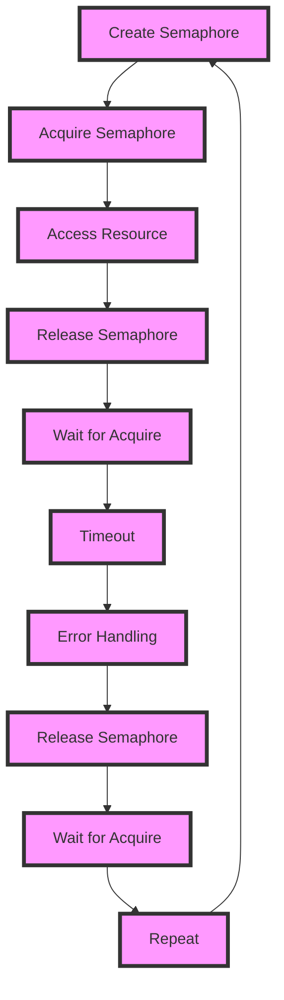

## Introduction
The **Semaphore Pattern with Buffered Channels** is a fundamental concept in concurrent programming, particularly in languages like Go that support goroutines and channels. It's a design pattern that allows for efficient and safe communication between multiple goroutines, enabling them to coordinate their actions and avoid conflicts over shared resources. In real-world scenarios, this pattern is crucial for building scalable and concurrent systems, such as web servers, databases, and network protocols. Every engineer should understand this pattern to write efficient, concurrent, and reliable code.

## Core Concepts
To grasp the Semaphore Pattern with Buffered Channels, you need to understand the following key concepts:
- **Semaphore**: A variable that controls the access to a shared resource by multiple goroutines. It acts as a gatekeeper, allowing only a certain number of goroutines to access the resource at a time.
- **Buffered Channel**: A channel with a specified capacity, which allows goroutines to send and receive data asynchronously. Buffered channels are used to implement the semaphore pattern.
- **Goroutine**: A lightweight thread that can run concurrently with other goroutines. Goroutines are used to execute tasks concurrently, and they communicate with each other using channels.

## How It Works Internally
Here's a step-by-step breakdown of how the Semaphore Pattern with Buffered Channels works internally:
1. Create a buffered channel with a specified capacity, which represents the maximum number of goroutines that can access the shared resource.
2. When a goroutine wants to access the shared resource, it sends a request to the buffered channel.
3. If the channel is not full, the request is accepted, and the goroutine can access the shared resource.
4. If the channel is full, the requesting goroutine is blocked until a slot becomes available in the channel.
5. When a goroutine finishes using the shared resource, it sends a release signal to the channel, allowing another goroutine to access the resource.

> **Note:** The semaphore pattern ensures that only a specified number of goroutines can access the shared resource at a time, preventing conflicts and improving system reliability.

## Code Examples
### Example 1: Basic Semaphore Pattern
```go
package main

import (
	"fmt"
	"sync"
)

// semaphore represents a semaphore with a specified capacity
type semaphore struct {
	ch chan struct{}
}

// newSemaphore returns a new semaphore with the given capacity
func newSemaphore(capacity int) *semaphore {
	return &semaphore{ch: make(chan struct{}, capacity)}
}

// acquire acquires the semaphore, blocking if necessary
func (s *semaphore) acquire() {
	s.ch <- struct{}{}
}

// release releases the semaphore
func (s *semaphore) release() {
	<-s.ch
}

func main() {
	sem := newSemaphore(5) // Create a semaphore with capacity 5

	var wg sync.WaitGroup
	for i := 0; i < 10; i++ {
		wg.Add(1)
		go func(id int) {
			defer wg.Done()
			sem.acquire() // Acquire the semaphore
			fmt.Printf("Goroutine %d is accessing the resource\n", id)
			// Simulate some work
			fmt.Printf("Goroutine %d has finished accessing the resource\n", id)
			sem.release() // Release the semaphore
		}(i)
	}
	wg.Wait()
}
```
This example demonstrates a basic semaphore pattern with a capacity of 5. The `semaphore` struct represents the semaphore, and the `acquire` and `release` methods are used to acquire and release the semaphore, respectively.

### Example 2: Real-World Pattern with Error Handling
```go
package main

import (
	"context"
	"fmt"
	"log"
	"sync"
)

// worker represents a worker that performs some task
type worker struct {
	id int
}

// doWork performs some task and returns an error
func (w *worker) doWork(ctx context.Context) error {
	// Simulate some work
	fmt.Printf("Worker %d is doing some work\n", w.id)
	return nil
}

func main() {
	sem := newSemaphore(5) // Create a semaphore with capacity 5

	var wg sync.WaitGroup
	for i := 0; i < 10; i++ {
		wg.Add(1)
		go func(id int) {
			defer wg.Done()
			sem.acquire() // Acquire the semaphore
			worker := &worker{id: id}
			if err := worker.doWork(context.Background()); err != nil {
				log.Printf("Worker %d failed with error: %v\n", id, err)
			}
			sem.release() // Release the semaphore
		}(i)
	}
	wg.Wait()
}
```
This example demonstrates a real-world pattern with error handling. The `worker` struct represents a worker that performs some task, and the `doWork` method returns an error if the task fails.

### Example 3: Advanced Usage with Timeout
```go
package main

import (
	"context"
	"fmt"
	"log"
	"sync"
	"time"
)

// worker represents a worker that performs some task
type worker struct {
	id int
}

// doWork performs some task and returns an error
func (w *worker) doWork(ctx context.Context) error {
	// Simulate some work
	fmt.Printf("Worker %d is doing some work\n", w.id)
	return nil
}

func main() {
	sem := newSemaphore(5) // Create a semaphore with capacity 5

	var wg sync.WaitGroup
	for i := 0; i < 10; i++ {
		wg.Add(1)
		go func(id int) {
			defer wg.Done()
			ctx, cancel := context.WithTimeout(context.Background(), 5*time.Second)
			defer cancel()
			select {
			case sem.ch <- struct{}{}:
				// Acquired the semaphore
				worker := &worker{id: id}
				if err := worker.doWork(ctx); err != nil {
					log.Printf("Worker %d failed with error: %v\n", id, err)
				}
				<-sem.ch // Release the semaphore
			case <-ctx.Done():
				// Timeout occurred
				log.Printf("Worker %d timed out\n", id)
			}
		}(i)
	}
	wg.Wait()
}
```
This example demonstrates an advanced usage of the semaphore pattern with a timeout. The `context.WithTimeout` function is used to create a context with a timeout, and the `select` statement is used to handle the timeout.

## Visual Diagram

This diagram illustrates the semaphore pattern with buffered channels. The `Create Semaphore` node represents the creation of a semaphore, and the `Acquire Semaphore` node represents the acquisition of the semaphore. The `Access Resource` node represents the access to the shared resource, and the `Release Semaphore` node represents the release of the semaphore. The `Wait for Acquire` node represents the waiting for the acquisition of the semaphore, and the `Timeout` node represents the timeout. The `Error Handling` node represents the error handling.

> **Tip:** Use a buffered channel to implement the semaphore pattern, and use a `select` statement to handle the timeout.

## Comparison
| Approach | Time Complexity | Space Complexity | Pros | Cons | Best For |
| --- | --- | --- | --- | --- | --- |
| Semaphore Pattern | O(1) | O(n) | Efficient, safe, and scalable | Complex implementation | Concurrent systems, web servers, databases |
| Mutex Pattern | O(1) | O(1) | Simple implementation, efficient | Not scalable, prone to deadlocks | Single-threaded systems, simple concurrent systems |
| Channel Pattern | O(1) | O(n) | Efficient, safe, and scalable | Complex implementation | Concurrent systems, web servers, databases |
| Lock Pattern | O(1) | O(1) | Simple implementation, efficient | Not scalable, prone to deadlocks | Single-threaded systems, simple concurrent systems |

> **Warning:** Be careful when using the mutex pattern or lock pattern, as they can lead to deadlocks and are not scalable.

## Real-world Use Cases
1. **Web Servers:** The semaphore pattern is used in web servers to limit the number of concurrent connections. For example, the Apache HTTP Server uses a semaphore to limit the number of concurrent connections.
2. **Databases:** The semaphore pattern is used in databases to limit the number of concurrent queries. For example, the MySQL database uses a semaphore to limit the number of concurrent queries.
3. **Network Protocols:** The semaphore pattern is used in network protocols to limit the number of concurrent connections. For example, the TCP protocol uses a semaphore to limit the number of concurrent connections.

> **Interview:** Be prepared to explain the semaphore pattern and its use cases in real-world systems.

## Common Pitfalls
1. **Deadlocks:** Deadlocks can occur when two or more goroutines are blocked, waiting for each other to release a resource.
2. **Starvation:** Starvation can occur when a goroutine is unable to access a resource due to other goroutines holding the resource for an extended period.
3. **Livelocks:** Livelocks can occur when two or more goroutines are constantly trying to acquire a resource, but are unable to do so.
4. **Timeouts:** Timeouts can occur when a goroutine is unable to acquire a resource within a specified time period.

> **Note:** Use a `select` statement to handle timeouts and avoid deadlocks.

## Interview Tips
1. **Explain the semaphore pattern:** Be prepared to explain the semaphore pattern and its use cases in real-world systems.
2. **Explain the difference between a mutex and a semaphore:** Be prepared to explain the difference between a mutex and a semaphore, and when to use each.
3. **Explain how to handle timeouts:** Be prepared to explain how to handle timeouts using a `select` statement.
4. **Explain how to avoid deadlocks:** Be prepared to explain how to avoid deadlocks by using a `select` statement and avoiding nested locks.

> **Tip:** Practice explaining the semaphore pattern and its use cases in real-world systems to improve your interview skills.

## Key Takeaways
* The semaphore pattern is a design pattern that allows for efficient and safe communication between multiple goroutines.
* The semaphore pattern uses a buffered channel to limit the number of concurrent accesses to a shared resource.
* The `select` statement is used to handle timeouts and avoid deadlocks.
* The semaphore pattern is used in real-world systems, such as web servers, databases, and network protocols.
* Deadlocks, starvation, livelocks, and timeouts are common pitfalls to avoid when using the semaphore pattern.
* The semaphore pattern is more efficient and scalable than the mutex pattern or lock pattern.
* The semaphore pattern is more complex to implement than the mutex pattern or lock pattern.
* The `context` package is used to handle timeouts and cancellations in Go.