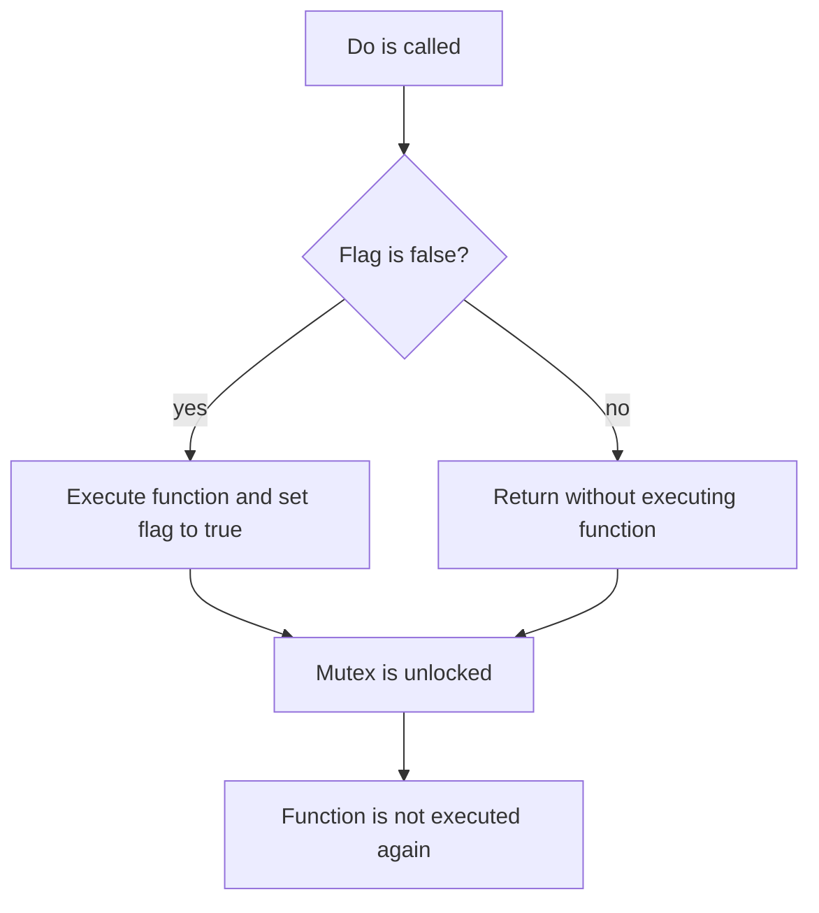

## Introduction
**sync.Once** is a synchronization primitive in Go that ensures a function is executed exactly once, even in the presence of concurrent access. This is particularly useful in scenarios where initialization or setup needs to occur only once, such as loading configuration files, connecting to databases, or initializing singleton objects. In real-world applications, **sync.Once** can be used to prevent duplicate initialization, which can lead to bugs, performance issues, or even crashes. For example, in a distributed system, **sync.Once** can be used to ensure that a shared resource is initialized only once, even if multiple nodes try to access it concurrently.

> **Note:** The **sync.Once** type is a simple yet powerful tool that can help prevent common concurrency-related issues in Go programs.

## Core Concepts
The **sync.Once** type has a single method, **Do**, which takes a function as an argument. This function is executed exactly once, even if **Do** is called multiple times concurrently. The **sync.Once** type uses an internal flag to track whether the function has been executed. If the function has not been executed, **Do** will execute it and set the flag. If the function has already been executed, **Do** will simply return without executing the function again.

**Key Terminology:**

* **sync.Once**: a synchronization primitive that ensures a function is executed exactly once.
* **Do**: the method of **sync.Once** that executes a function exactly once.

> **Tip:** When using **sync.Once**, make sure to pass a function that has no side effects, as it may be executed only once.

## How It Works Internally
The **sync.Once** type uses a combination of a mutex and a flag to ensure that the function is executed exactly once. The mutex is used to protect access to the flag, which is used to track whether the function has been executed. When **Do** is called, it first checks the flag to see if the function has been executed. If the flag is false, **Do** will execute the function and set the flag to true. If the flag is already true, **Do** will simply return without executing the function again.

Here is a step-by-step breakdown of how **sync.Once** works:

1. **Do** is called with a function as an argument.
2. The mutex is locked to protect access to the flag.
3. The flag is checked to see if the function has been executed.
4. If the flag is false, the function is executed and the flag is set to true.
5. The mutex is unlocked.
6. If the flag is already true, the function is not executed and the mutex is unlocked.

> **Warning:** If the function passed to **Do** panics, the **sync.Once** type will not be able to ensure that the function is executed exactly once.

## Code Examples
### Example 1: Basic Usage
```go
package main

import (
	"fmt"
	"sync"
)

func main() {
	var once sync.Once
	once.Do(func() {
		fmt.Println("Initialized")
	})
	once.Do(func() {
		fmt.Println("Not initialized again")
	})
}
```
In this example, the **Do** method is called twice, but the function is only executed once.

### Example 2: Real-World Pattern
```go
package main

import (
	"fmt"
	"sync"
)

type Config struct {
	// configuration fields
}

var config *Config
var once sync.Once

func GetConfig() *Config {
	once.Do(func() {
		config = &Config{
			// initialize configuration fields
		}
	})
	return config
}

func main() {
	config := GetConfig()
	fmt.Println(config)
}
```
In this example, the **GetConfig** function uses **sync.Once** to ensure that the configuration is initialized only once, even if the function is called multiple times concurrently.

### Example 3: Advanced Usage
```go
package main

import (
	"fmt"
	"sync"
)

type Singleton struct {
	// singleton fields
}

var singleton *Singleton
var once sync.Once

func GetSingleton() *Singleton {
	once.Do(func() {
		singleton = &Singleton{
			// initialize singleton fields
		}
	})
	return singleton
}

func main() {
	singleton := GetSingleton()
	fmt.Println(singleton)
}
```
In this example, the **GetSingleton** function uses **sync.Once** to ensure that the singleton is initialized only once, even if the function is called multiple times concurrently.

## Visual Diagram

This diagram shows the flow of the **Do** method, including the check of the flag, the execution of the function, and the unlocking of the mutex.

> **Interview:** Can you explain how **sync.Once** ensures that a function is executed exactly once, even in the presence of concurrent access?

## Comparison
| Approach | Time Complexity | Space Complexity | Pros | Cons | Best For |
| --- | --- | --- | --- | --- | --- |
| **sync.Once** | O(1) | O(1) | Ensures function is executed exactly once, even in the presence of concurrent access | May panic if function passed to **Do** panics | Initializing shared resources, loading configuration files |
| **sync.Mutex** | O(1) | O(1) | Provides mutual exclusion, ensuring that only one goroutine can access a resource at a time | May deadlock if not used carefully | Protecting shared resources, synchronizing access to data |
| **sync.RWMutex** | O(1) | O(1) | Provides mutual exclusion, allowing multiple readers to access a resource simultaneously | May deadlock if not used carefully | Protecting shared resources, synchronizing access to data |
| **atomic** | O(1) | O(1) | Provides atomic operations, ensuring that updates to shared variables are visible to all goroutines | May be slower than **sync.Once** or **sync.Mutex** | Updating shared variables, ensuring visibility of changes |

## Real-world Use Cases
1. **Google's Go Runtime**: The Go runtime uses **sync.Once** to initialize the runtime's internal data structures, ensuring that they are initialized only once, even in the presence of concurrent access.
2. **Redis**: Redis uses **sync.Once** to initialize its internal data structures, ensuring that they are initialized only once, even in the presence of concurrent access.
3. **Apache Kafka**: Apache Kafka uses **sync.Once** to initialize its internal data structures, ensuring that they are initialized only once, even in the presence of concurrent access.

## Common Pitfalls
1. **Panic in function passed to **Do****: If the function passed to **Do** panics, the **sync.Once** type will not be able to ensure that the function is executed exactly once.
```go
package main

import (
	"fmt"
	"sync"
)

func main() {
	var once sync.Once
	once.Do(func() {
		fmt.Println("Initialized")
		panic("Something went wrong")
	})
	once.Do(func() {
		fmt.Println("Not initialized again")
	})
}
```
In this example, the function passed to **Do** panics, causing the **sync.Once** type to fail to ensure that the function is executed exactly once.

2. **Not using **sync.Once****: Not using **sync.Once** can lead to duplicate initialization, which can cause bugs, performance issues, or even crashes.
```go
package main

import (
	"fmt"
)

func main() {
	var config *Config
	config = &Config{
		// initialize configuration fields
	}
	config = &Config{
		// initialize configuration fields again
	}
	fmt.Println(config)
}
```
In this example, the configuration is initialized twice, which can cause bugs or performance issues.

3. **Using **sync.Mutex** instead of **sync.Once****: Using **sync.Mutex** instead of **sync.Once** can lead to unnecessary synchronization overhead.
```go
package main

import (
	"fmt"
	"sync"
)

func main() {
	var mutex sync.Mutex
	var config *Config
	mutex.Lock()
	config = &Config{
		// initialize configuration fields
	}
	mutex.Unlock()
	mutex.Lock()
	config = &Config{
		// initialize configuration fields again
	}
	mutex.Unlock()
	fmt.Println(config)
}
```
In this example, the **sync.Mutex** type is used instead of **sync.Once**, which can lead to unnecessary synchronization overhead.

## Interview Tips
1. **What is **sync.Once****: **sync.Once** is a synchronization primitive that ensures a function is executed exactly once, even in the presence of concurrent access.
2. **How does **sync.Once** work****: **sync.Once** uses a combination of a mutex and a flag to ensure that the function is executed exactly once.
3. **What are the benefits of using **sync.Once****: The benefits of using **sync.Once** include ensuring that a function is executed exactly once, even in the presence of concurrent access, and providing a simple and efficient way to initialize shared resources.

> **Interview:** Can you explain the benefits of using **sync.Once** in a concurrent program?

## Key Takeaways
* **sync.Once** ensures that a function is executed exactly once, even in the presence of concurrent access.
* **sync.Once** uses a combination of a mutex and a flag to ensure that the function is executed exactly once.
* The benefits of using **sync.Once** include ensuring that a function is executed exactly once, even in the presence of concurrent access, and providing a simple and efficient way to initialize shared resources.
* **sync.Once** is useful for initializing shared resources, loading configuration files, and connecting to databases.
* **sync.Once** can help prevent duplicate initialization, which can cause bugs, performance issues, or even crashes.
* **sync.Once** has a time complexity of O(1) and a space complexity of O(1).
* **sync.Once** is a simple yet powerful tool that can help prevent common concurrency-related issues in Go programs.