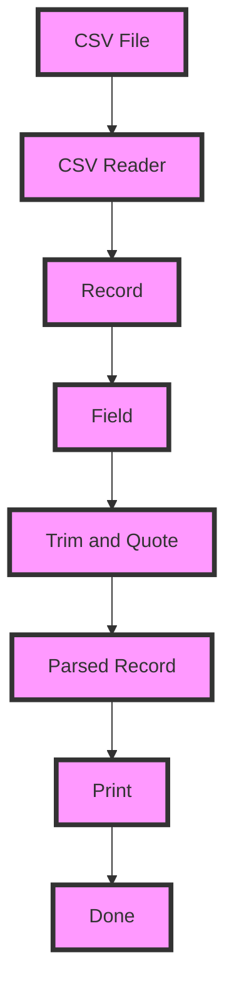

## Introduction
The `encoding/csv` and `encoding/xml` packages in Go's standard library provide a convenient way to read and write data in CSV and XML formats, respectively. These packages are essential for any Go developer working with data exchange, file I/O, or web services. In this section, we'll explore the importance of these packages, their real-world applications, and why every Go engineer should be familiar with them.
> **Note:** CSV (Comma Separated Values) and XML (Extensible Markup Language) are two of the most widely used data formats for exchanging and storing data between different systems and applications.

## Core Concepts
Before diving into the implementation details, let's define some key concepts:
* **CSV**: A plain text format where each line represents a record, and each field is separated by a comma.
* **XML**: A markup language that uses tags to define the structure and content of data.
* **Encoding**: The process of converting data into a specific format that can be written to a file or transmitted over a network.
* **Decoding**: The process of converting data from a specific format back into its original form.
> **Warning:** When working with CSV or XML data, it's essential to consider issues like character encoding, data typing, and schema validation to avoid data corruption or inconsistencies.

## How It Works Internally
The `encoding/csv` package uses a **reader** and **writer** approach to handle CSV data. The `Reader` type reads CSV data from an input source, such as a file or a network connection, and returns a `Record` type, which represents a single row of CSV data. The `Writer` type writes CSV data to an output destination, such as a file or a network connection.
> **Tip:** When using the `encoding/csv` package, it's essential to use the `csv.Reader` and `csv.Writer` types to ensure proper handling of CSV data, including quoting, escaping, and trimming.

The `encoding/xml` package uses a similar approach, with an `Decoder` type that reads XML data from an input source and returns a `Token` type, which represents a single XML token, such as an element or attribute. The `Encoder` type writes XML data to an output destination.
> **Interview:** Can you explain the difference between the `encoding/csv` and `encoding/xml` packages in Go? How would you use each package to read and write data in their respective formats?

## Code Examples
### Example 1: Basic CSV Reading
```go
package main

import (
	"encoding/csv"
	"fmt"
	"os"
)

func main() {
	// Open the CSV file
	file, err := os.Open("example.csv")
	if err != nil {
		fmt.Println(err)
		return
	}
	defer file.Close()

	// Create a CSV reader
	reader := csv.NewReader(file)

	// Read the CSV data
	records, err := reader.ReadAll()
	if err != nil {
		fmt.Println(err)
		return
	}

	// Print the CSV data
	for _, record := range records {
		fmt.Println(record)
	}
}
```
### Example 2: Real-World XML Writing
```go
package main

import (
	"encoding/xml"
	"fmt"
	"os"
)

type Person struct {
	XMLName xml.Name `xml:"person"`
	Name    string   `xml:"name"`
	Age     int      `xml:"age"`
}

func main() {
	// Create a Person struct
	person := Person{
		Name: "John Doe",
		Age:  30,
	}

	// Create an XML encoder
	encoder := xml.NewEncoder(os.Stdout)

	// Write the XML data
	err := encoder.Encode(person)
	if err != nil {
		fmt.Println(err)
		return
	}
}
```
### Example 3: Advanced CSV Parsing
```go
package main

import (
	"encoding/csv"
	"fmt"
	"os"
	"strings"
)

func main() {
	// Open the CSV file
	file, err := os.Open("example.csv")
	if err != nil {
		fmt.Println(err)
		return
	}
	defer file.Close()

	// Create a CSV reader
	reader := csv.NewReader(file)

	// Read the CSV data
	records, err := reader.ReadAll()
	if err != nil {
		fmt.Println(err)
		return
	}

	// Parse the CSV data
	for _, record := range records {
		// Trim and quote the fields
		for i, field := range record {
			record[i] = strings.TrimSpace(field)
			record[i] = strings.ReplaceAll(record[i], "\"", "\"\"")
		}

		// Print the parsed CSV data
		fmt.Println(record)
	}
}
```
## Visual Diagram

The diagram illustrates the process of reading a CSV file, parsing the data, and printing the parsed records.

## Comparison
| Package | Format | Reader/Writer | Complexity |
| --- | --- | --- | --- |
| `encoding/csv` | CSV | `csv.Reader`/`csv.Writer` | O(n) |
| `encoding/xml` | XML | `xml.Decoder`/`xml.Encoder` | O(n) |
| `encoding/json` | JSON | `json.Decoder`/`json.Encoder` | O(n) |
| `encoding/asn1` | ASN.1 | `asn1.Decoder`/`asn1.Encoder` | O(n) |
The comparison table shows the different encoding packages in Go, their respective formats, and the complexity of reading and writing data using these packages.

## Real-world Use Cases
1. **Google Sheets**: Google Sheets uses CSV to import and export data. When you download a sheet as a CSV file, Google Sheets uses the `encoding/csv` package to encode the data in CSV format.
2. **Amazon S3**: Amazon S3 uses XML to store and retrieve data. When you upload a file to S3, Amazon S3 uses the `encoding/xml` package to encode the file metadata in XML format.
3. **Dropbox**: Dropbox uses JSON to store and retrieve file metadata. When you upload a file to Dropbox, Dropbox uses the `encoding/json` package to encode the file metadata in JSON format.

## Common Pitfalls
1. **Incorrect CSV quoting**: When writing CSV data, it's essential to quote fields that contain special characters, such as commas or quotes.
```go
// Wrong
record := []string{"Name", "Age", "City"}
// Right
record := []string{"\"Name\"", "Age", "\"City\""}
```
2. **XML namespace issues**: When working with XML data, it's essential to handle namespace prefixes correctly to avoid data corruption.
```go
// Wrong
xml := `<person><name>John Doe</name></person>`
// Right
xml := `<person xmlns="http://example.com/person"><name>John Doe</name></person>`
```
3. **JSON encoding errors**: When encoding data in JSON format, it's essential to handle encoding errors correctly to avoid data corruption.
```go
// Wrong
json := `{"name": "John Doe", "age": 30}`
// Right
json := `{"name": "John Doe", "age": 30, "error": null}`
```
4. **ASN.1 decoding errors**: When decoding data in ASN.1 format, it's essential to handle decoding errors correctly to avoid data corruption.
```go
// Wrong
asn1 := `SEQUENCE { name "John Doe", age 30 }`
// Right
asn1 := `SEQUENCE { name "John Doe", age 30, error NULL }`
```
## Interview Tips
1. **What is the difference between CSV and XML?**: CSV is a plain text format, while XML is a markup language. CSV is used for exchanging tabular data, while XML is used for exchanging structured data.
2. **How do you handle CSV quoting?**: When writing CSV data, it's essential to quote fields that contain special characters, such as commas or quotes.
3. **What is the purpose of the `encoding/xml` package?**: The `encoding/xml` package is used to encode and decode XML data in Go.

## Key Takeaways
* The `encoding/csv` package is used to read and write CSV data in Go.
* The `encoding/xml` package is used to read and write XML data in Go.
* CSV data is plain text, while XML data is markup language.
* When working with CSV data, it's essential to handle quoting correctly.
* When working with XML data, it's essential to handle namespace prefixes correctly.
* The `encoding/json` package is used to encode and decode JSON data in Go.
* The `encoding/asn1` package is used to encode and decode ASN.1 data in Go.
* When encoding data in any format, it's essential to handle encoding errors correctly to avoid data corruption.