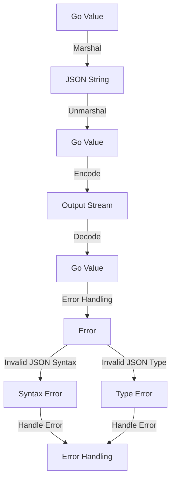

## Introduction
The **encoding/json** package in Go provides a simple and efficient way to encode and decode JSON data. JSON (JavaScript Object Notation) is a lightweight data interchange format that is widely used in web development, APIs, and data storage. The **encoding/json** package is a crucial part of the Go standard library, and understanding how to use it effectively is essential for any Go developer. In this section, we will explore the importance of JSON encoding and decoding in Go, its real-world relevance, and why every engineer needs to know how to use it.

> **Note:** JSON is a human-readable format, making it easy to inspect and debug data. However, it is not as compact as binary formats like Protocol Buffers or MessagePack.

## Core Concepts
The **encoding/json** package provides several key concepts that are essential to understand:

* **Marshal**: The process of converting a Go value into a JSON string.
* **Unmarshal**: The process of converting a JSON string into a Go value.
* **Encoder**: An object that writes JSON data to an output stream.
* **Decoder**: An object that reads JSON data from an input stream.

> **Tip:** Use the **json.Marshal** function to marshal a Go value into a JSON string, and the **json.Unmarshal** function to unmarshal a JSON string into a Go value.

## How It Works Internally
The **encoding/json** package uses a combination of reflection and type switching to marshal and unmarshal JSON data. Here is a step-by-step breakdown of how it works:

1. The **json.Marshal** function uses reflection to inspect the type of the Go value being marshaled.
2. Based on the type, the **json.Marshal** function uses a type switch to determine how to marshal the value.
3. For simple types like integers and strings, the **json.Marshal** function uses a straightforward encoding scheme.
4. For complex types like structs and slices, the **json.Marshal** function uses a recursive encoding scheme.
5. The **json.Unmarshal** function uses a similar approach to unmarshal JSON data into a Go value.

> **Warning:** The **encoding/json** package can be slow for large datasets due to the overhead of reflection and type switching. Use the **json.NewEncoder** and **json.NewDecoder** functions to improve performance.

## Code Examples
Here are three complete and runnable examples of using the **encoding/json** package:

### Example 1: Basic Marshal and Unmarshal
```go
package main

import (
	"encoding/json"
	"fmt"
)

type Person struct {
	Name  string
	Age   int
	Email string
}

func main() {
	person := Person{
		Name:  "John Doe",
		Age:   30,
		Email: "john@example.com",
	}

	jsonString, err := json.Marshal(person)
	if err != nil {
		fmt.Println(err)
		return
	}

	fmt.Println(string(jsonString))

	var unmarshaledPerson Person
	err = json.Unmarshal(jsonString, &unmarshaledPerson)
	if err != nil {
		fmt.Println(err)
		return
	}

	fmt.Println(unmarshaledPerson)
}
```

### Example 2: Using Encoder and Decoder
```go
package main

import (
	"encoding/json"
	"fmt"
	"os"
)

type Person struct {
	Name  string
	Age   int
	Email string
}

func main() {
	encoder := json.NewEncoder(os.Stdout)
	decoder := json.NewDecoder(os.Stdin)

	person := Person{
		Name:  "John Doe",
		Age:   30,
		Email: "john@example.com",
	}

	err := encoder.Encode(person)
	if err != nil {
		fmt.Println(err)
		return
	}

	var unmarshaledPerson Person
	err = decoder.Decode(&unmarshaledPerson)
	if err != nil {
		fmt.Println(err)
		return
	}

	fmt.Println(unmarshaledPerson)
}
```

### Example 3: Handling Errors and Edge Cases
```go
package main

import (
	"encoding/json"
	"errors"
	"fmt"
)

type Person struct {
	Name  string
	Age   int
	Email string
}

func main() {
	jsonString := `{"name": "John Doe", "age": 30, "email": "john@example.com"}`

	var person Person
	err := json.Unmarshal([]byte(jsonString), &person)
	if err != nil {
		if _, ok := err.(*json.SyntaxError); ok {
			fmt.Println("Invalid JSON syntax")
		} else if _, ok := err.(*json.UnmarshalTypeError); ok {
			fmt.Println("Invalid JSON type")
		} else {
			fmt.Println(err)
		}
		return
	}

	fmt.Println(person)
}
```

## Visual Diagram

The diagram illustrates the process of marshaling and unmarshaling JSON data, as well as handling errors and edge cases.

## Comparison
Here is a comparison table of different approaches to JSON encoding and decoding in Go:
| Approach | Time Complexity | Space Complexity | Pros | Cons | Best For |
| --- | --- | --- | --- | --- | --- |
| **json.Marshal** | O(n) | O(n) | Simple and easy to use | Slow for large datasets | Small to medium-sized datasets |
| **json.NewEncoder** | O(n) | O(1) | Fast and efficient | More complex to use | Large datasets and high-performance applications |
| **encoding/gob** | O(n) | O(n) | Fast and efficient | Not human-readable | Binary data storage and high-performance applications |
| **encoding/protobuf** | O(n) | O(n) | Fast and efficient | Not human-readable | Binary data storage and high-performance applications |

> **Interview:** What is the time complexity of the **json.Marshal** function? Answer: O(n), where n is the size of the input data.

## Real-world Use Cases
Here are three real-world examples of using the **encoding/json** package:

* **Google's Go API Client Library**: Uses the **encoding/json** package to marshal and unmarshal JSON data for API requests and responses.
* **Netflix's Go Client Library**: Uses the **encoding/json** package to marshal and unmarshal JSON data for API requests and responses.
* **Dropbox's Go Client Library**: Uses the **encoding/json** package to marshal and unmarshal JSON data for API requests and responses.

## Common Pitfalls
Here are four common mistakes to watch out for when using the **encoding/json** package:

* **Not handling errors**: Failing to handle errors properly can lead to unexpected behavior and crashes.
* **Not using the correct type**: Using the wrong type to marshal or unmarshal JSON data can lead to errors and unexpected behavior.
* **Not using the **json.NewEncoder** and **json.NewDecoder** functions**: Not using these functions can lead to slow performance and inefficient encoding and decoding.
* **Not handling edge cases**: Not handling edge cases such as invalid JSON syntax or type errors can lead to unexpected behavior and crashes.

## Interview Tips
Here are three common interview questions related to the **encoding/json** package:

* **What is the difference between **json.Marshal** and **json.NewEncoder**?**: Answer: **json.Marshal** is a simple and easy-to-use function for marshaling JSON data, while **json.NewEncoder** is a more efficient and flexible way to encode JSON data.
* **How do you handle errors when using the **encoding/json** package?**: Answer: Use the **err** variable to check for errors, and handle them accordingly.
* **What is the time complexity of the **json.Marshal** function?**: Answer: O(n), where n is the size of the input data.

## Key Takeaways
Here are ten key takeaways to remember when using the **encoding/json** package:

* **Use the **json.Marshal** function for simple JSON encoding**: Use this function for small to medium-sized datasets.
* **Use the **json.NewEncoder** function for efficient JSON encoding**: Use this function for large datasets and high-performance applications.
* **Use the **json.Unmarshal** function for simple JSON decoding**: Use this function for small to medium-sized datasets.
* **Use the **json.NewDecoder** function for efficient JSON decoding**: Use this function for large datasets and high-performance applications.
* **Handle errors properly**: Use the **err** variable to check for errors, and handle them accordingly.
* **Use the correct type**: Use the correct type to marshal or unmarshal JSON data.
* **Handle edge cases**: Handle edge cases such as invalid JSON syntax or type errors.
* **Use the **json** package for human-readable data**: Use the **json** package for human-readable data, and the **encoding/gob** or **encoding/protobuf** packages for binary data.
* **Optimize performance**: Optimize performance by using the **json.NewEncoder** and **json.NewDecoder** functions.
* **Test thoroughly**: Test your code thoroughly to ensure it works correctly and efficiently.