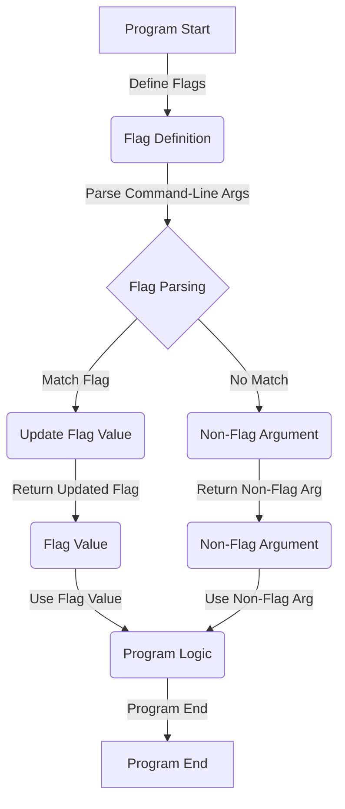

## Introduction
The **flag** package in Go's standard library provides a simple way to parse command-line flags. It is a crucial component of any command-line interface (CLI) application, allowing users to customize the behavior of the program. In this section, we will explore the importance of flag parsing, its real-world relevance, and why every engineer needs to know about it. 
> **Note:** Flag parsing is a fundamental aspect of building CLI applications, and understanding how it works is essential for any software engineer.

Flag parsing is essential in CLI applications because it allows users to pass arguments to the program, which can then be used to customize its behavior. For example, a user may want to specify the input file, output file, or the level of verbosity. Without flag parsing, the program would have to rely on hardcoded values or manual configuration, which can be inflexible and error-prone.

## Core Concepts
To understand flag parsing, we need to define some key concepts:
* **Flags**: These are the command-line arguments that are parsed by the program. Flags can be either boolean (e.g., `-v` for verbose mode) or non-boolean (e.g., `-o` for output file).
* **Flag sets**: These are collections of flags that can be parsed together. Flag sets can be used to group related flags or to define a set of default flags.
* **Parsing**: This is the process of analyzing the command-line arguments and extracting the flags and their values.

Mental models for flag parsing include thinking of flags as a way to customize the program's behavior, similar to how function arguments customize the behavior of a function. Key terminology includes **flag**, **flag set**, and **parsing**.

## How It Works Internally
The **flag** package in Go's standard library uses a simple and efficient algorithm to parse flags. Here's a step-by-step breakdown of how it works:
1. The program defines a set of flags using the `flag` package's functions, such as `flag.Bool()` or `flag.String()`.
2. The program calls the `flag.Parse()` function to parse the command-line arguments.
3. The `flag.Parse()` function iterates through the command-line arguments and checks each one against the defined flags.
4. If a match is found, the corresponding flag value is updated.
5. The `flag.Parse()` function returns a slice of non-flag arguments, which can be used by the program.

The time complexity of the flag parsing algorithm is O(n), where n is the number of command-line arguments. The space complexity is O(m), where m is the number of defined flags.

## Code Examples
Here are three complete and runnable examples of using the **flag** package in Go:

### Example 1: Basic Flag Parsing
```go
package main

import (
	"flag"
	"fmt"
)

func main() {
	// Define a boolean flag
	verbose := flag.Bool("v", false, "verbose mode")

	// Parse the command-line arguments
	flag.Parse()

	// Print the flag value
	fmt.Println("Verbose mode:", *verbose)
}
```
This example defines a simple boolean flag `-v` and prints its value to the console.

### Example 2: Non-Boolean Flag Parsing
```go
package main

import (
	"flag"
	"fmt"
)

func main() {
	// Define a string flag
	outputFile := flag.String("o", "output.txt", "output file")

	// Parse the command-line arguments
	flag.Parse()

	// Print the flag value
	fmt.Println("Output file:", *outputFile)
}
```
This example defines a string flag `-o` and prints its value to the console.

### Example 3: Advanced Flag Parsing
```go
package main

import (
	"flag"
	"fmt"
)

func main() {
	// Define a flag set
	var flagSet flag.FlagSet

	// Define a boolean flag
	verbose := flagSet.Bool("v", false, "verbose mode")

	// Define a string flag
	outputFile := flagSet.String("o", "output.txt", "output file")

	// Parse the command-line arguments
	flagSet.Parse([]string{"-v", "-o", "custom_output.txt"})

	// Print the flag values
	fmt.Println("Verbose mode:", *verbose)
	fmt.Println("Output file:", *outputFile)
}
```
This example defines a flag set and uses it to parse a set of command-line arguments.

## Visual Diagram

This diagram illustrates the flow of the flag parsing process.

## Comparison
Here's a comparison of different flag parsing libraries in Go:
| Library | Time Complexity | Space Complexity | Pros | Cons | Best For |
| --- | --- | --- | --- | --- | --- |
| flag | O(n) | O(m) | Simple, efficient | Limited customization | Simple CLI applications |
| pflag | O(n) | O(m) | More customizable | Steeper learning curve | Complex CLI applications |
| kingpin | O(n) | O(m) | Highly customizable | Large dependency | Large-scale CLI applications |
| cobra | O(n) | O(m) | Highly customizable, large community | Large dependency | Large-scale CLI applications |

> **Tip:** Choose a flag parsing library based on the complexity of your CLI application and the level of customization you need.

## Real-world Use Cases
Here are three real-world examples of flag parsing in Go:
* **docker**: Docker uses the **flag** package to parse command-line arguments for its CLI application.
* **kubectl**: kubectl uses the **pflag** package to parse command-line arguments for its CLI application.
* **git**: Git uses a custom flag parsing implementation to parse command-line arguments for its CLI application.

## Common Pitfalls
Here are four common mistakes to watch out for when using flag parsing in Go:
* **Not checking for flag errors**: Failing to check for errors when parsing flags can lead to unexpected behavior.
* **Not handling non-flag arguments**: Failing to handle non-flag arguments can lead to unexpected behavior.
* **Using the wrong flag type**: Using the wrong flag type (e.g., using a boolean flag for a non-boolean value) can lead to unexpected behavior.
* **Not documenting flags**: Failing to document flags can make it difficult for users to understand how to use the CLI application.

> **Warning:** Always check for flag errors and handle non-flag arguments to ensure robust flag parsing.

## Interview Tips
Here are three common interview questions related to flag parsing in Go:
* **What is flag parsing, and why is it important in CLI applications?**: A strong answer should explain the concept of flag parsing and its importance in CLI applications.
* **How does the flag package in Go's standard library work internally?**: A strong answer should explain the step-by-step process of flag parsing and the time and space complexity of the algorithm.
* **What are some common pitfalls to watch out for when using flag parsing in Go?**: A strong answer should explain the common mistakes to watch out for when using flag parsing in Go and how to avoid them.

## Key Takeaways
Here are ten key takeaways to remember when working with flag parsing in Go:
* Flag parsing is a fundamental aspect of building CLI applications.
* The **flag** package in Go's standard library provides a simple and efficient way to parse flags.
* The time complexity of the flag parsing algorithm is O(n), and the space complexity is O(m).
* Always check for flag errors and handle non-flag arguments to ensure robust flag parsing.
* Choose a flag parsing library based on the complexity of your CLI application and the level of customization you need.
* Always document flags to make it easy for users to understand how to use the CLI application.
* Use the correct flag type (e.g., boolean, string, etc.) to avoid unexpected behavior.
* Use a flag set to group related flags and define a set of default flags.
* Use the `flag.Parse()` function to parse the command-line arguments and update the flag values.
* Use the `flag.Args()` function to get the non-flag arguments and use them in the program logic.