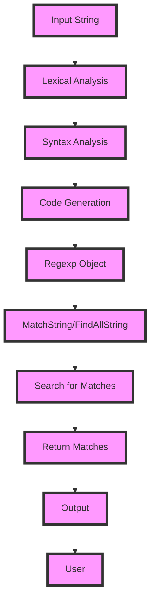

## Introduction
Regular expressions, commonly referred to as **regexp**, are a sequence of characters that define a search pattern used for string matching. In the context of the Go programming language, the `regexp` package provides support for regular expressions. The `Compile`, `MatchString`, and `FindAllString` functions are essential components of this package. 
> **Note:** These functions enable developers to compile regular expressions, match strings against compiled regular expressions, and find all substrings within a given string that match a regular expression.

In real-world scenarios, regular expressions are crucial for tasks such as data validation, text processing, and pattern recognition. For instance, a web application might use regular expressions to validate user input, such as email addresses or phone numbers. 
> **Warning:** Poorly written regular expressions can lead to performance issues or incorrect results, making it essential to understand how to use them effectively.

Every engineer should be familiar with regular expressions because they are a fundamental tool in many programming languages and are widely used in various applications, including text editors, compilers, and validation frameworks.

## Core Concepts
The `regexp` package in Go provides several key functions for working with regular expressions:
- **Compile**: Compiles a regular expression into a `Regexp` object, which can be used for matching.
- **MatchString**: Reports whether the regular expression matches a given string.
- **FindAllString**: Finds all substrings within a given string that match the regular expression.
> **Tip:** Compiling a regular expression before using it for matching can improve performance when the same regular expression is used multiple times.

Key terminology includes:
- **Pattern**: The regular expression itself.
- **Matcher**: The `Regexp` object returned by `Compile`.
- **Match**: A substring that matches the regular expression.

## How It Works Internally
The `regexp` package in Go uses a recursive descent parser to compile regular expressions. When `Compile` is called, the parser breaks down the regular expression into a binary tree, which is then used to generate the `Regexp` object.
> **Interview:** Can you explain the difference between a recursive descent parser and a top-down parser?

Here's a step-by-step breakdown of the compilation process:
1. **Lexical Analysis**: The input regular expression is broken down into tokens.
2. **Syntax Analysis**: The tokens are parsed into an abstract syntax tree (AST).
3. **Code Generation**: The AST is used to generate the `Regexp` object.

When `MatchString` or `FindAllString` is called, the `Regexp` object is used to search for matches in the input string. The search process involves iterating over the input string and checking each character against the regular expression.
> **Warning:** The time complexity of regular expression matching can be exponential in the worst case, making it essential to use efficient regular expressions.

## Code Examples
### Example 1: Basic Usage
```go
package main

import (
	"regexp"
	"fmt"
)

func main() {
	// Compile a regular expression
	re := regexp.MustCompile(`\d+`)

	// Match a string against the regular expression
	match := re.MatchString("123")

	// Print the result
	fmt.Println(match)  // Output: true
}
```
### Example 2: Real-World Pattern
```go
package main

import (
	"regexp"
	"fmt"
)

func main() {
	// Compile a regular expression for email addresses
	re := regexp.MustCompile(`^[a-zA-Z0-9._%+-]+@[a-zA-Z0-9.-]+\.[a-zA-Z]{2,}$`)

	// Match a string against the regular expression
	match := re.MatchString("user@example.com")

	// Print the result
	fmt.Println(match)  // Output: true
}
```
### Example 3: Advanced Usage
```go
package main

import (
	"regexp"
	"fmt"
)

func main() {
	// Compile a regular expression for finding all substrings
	re := regexp.MustCompile(`\d+`)

	// Find all substrings that match the regular expression
	matches := re.FindAllString("123abc456def789", -1)

	// Print the matches
	for _, match := range matches {
		fmt.Println(match)
	}
	// Output:
	// 123
	// 456
	// 789
}
```
## Visual Diagram

The diagram illustrates the process of compiling a regular expression and using it to search for matches in an input string.

## Comparison
| Approach | Time Complexity | Space Complexity | Pros | Cons | Best For |
|----------|----------------|-----------------|------|------|----------|
| Recursive Descent | O(2^n) | O(n) | Easy to implement, supports complex regular expressions | Can be slow for large inputs | Small to medium-sized inputs |
| Top-Down Parsing | O(n) | O(n) | Fast and efficient, supports complex regular expressions | Can be difficult to implement | Large inputs, performance-critical applications |
| Finite State Machine | O(n) | O(1) | Fast and efficient, supports simple regular expressions | Limited support for complex regular expressions | Simple regular expressions, embedded systems |
| Dynamic Programming | O(n^2) | O(n^2) | Supports complex regular expressions, can be optimized | Can be slow and memory-intensive | Large inputs, complex regular expressions |

## Real-world Use Cases
1. **Data Validation**: Regular expressions are widely used for data validation in web applications, such as validating email addresses, phone numbers, and passwords.
2. **Text Processing**: Regular expressions are used in text editors and word processors to search for and replace text patterns.
3. **Log Analysis**: Regular expressions are used in log analysis tools to extract relevant information from log files.
4. **Network Security**: Regular expressions are used in network security tools to detect and prevent malicious activity.
5. **Search Engines**: Regular expressions are used in search engines to improve search results and filter out irrelevant content.

## Common Pitfalls
1. **Catastrophic Backtracking**: Regular expressions can suffer from catastrophic backtracking, which occurs when the regular expression engine takes an exponential amount of time to match a string.
2. **Inefficient Regular Expressions**: Regular expressions can be inefficient if not written correctly, leading to slow performance and high memory usage.
3. **Incorrect Matching**: Regular expressions can match incorrect patterns if not written correctly, leading to incorrect results.
4. **Lack of Error Handling**: Regular expressions can fail to match if the input string is malformed or if the regular expression is invalid.

## Interview Tips
1. **Can you explain the difference between a recursive descent parser and a top-down parser?**
	* Weak answer: "I'm not sure, but I think they're similar."
	* Strong answer: "Yes, a recursive descent parser is a type of parser that uses recursive functions to parse the input, whereas a top-down parser uses a more traditional parsing approach."
2. **How do you optimize regular expressions for performance?**
	* Weak answer: "I'm not sure, but I think you can use caching or memoization."
	* Strong answer: "Yes, there are several ways to optimize regular expressions for performance, including using possessive quantifiers, avoiding catastrophic backtracking, and using efficient regular expression engines."
3. **Can you write a regular expression to match a specific pattern?**
	* Weak answer: "I'm not sure, but I think it would be something like `.*`."
	* Strong answer: "Yes, I can write a regular expression to match a specific pattern. For example, to match a string that starts with 'abc' and ends with 'def', I would use the regular expression `^abc.*def$`."

## Key Takeaways
* Regular expressions are a powerful tool for pattern matching and text processing.
* The `regexp` package in Go provides support for regular expressions, including the `Compile`, `MatchString`, and `FindAllString` functions.
* Regular expressions can be optimized for performance using possessive quantifiers, avoiding catastrophic backtracking, and using efficient regular expression engines.
* Regular expressions can be used for data validation, text processing, log analysis, network security, and search engines.
* Common pitfalls include catastrophic backtracking, inefficient regular expressions, incorrect matching, and lack of error handling.
* Time complexity for regular expression matching can be exponential in the worst case, making it essential to use efficient regular expressions.
* Space complexity for regular expression matching can be high, making it essential to use efficient regular expression engines.