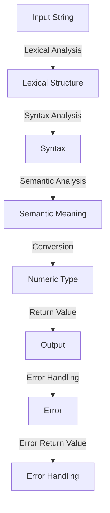

## Introduction
The **strconv** package in Go provides functions to convert between strings and numeric types. This package is crucial for any application that needs to parse user input, read data from files, or communicate with other systems. The **strconv** package contains functions such as **Atoi**, **Itoa**, **ParseFloat**, and **FormatFloat**, which enable developers to convert between strings and integers or floats. In this section, we will delve into the world of **strconv**, exploring its core concepts, internal workings, and practical applications.

> **Note:** The **strconv** package is a fundamental part of the Go standard library, and understanding its functions is essential for any Go developer.

## Core Concepts
The **strconv** package provides several functions for converting between strings and numeric types. The core concepts in this package include:

* **Atoi**: converts a string to an integer
* **Itoa**: converts an integer to a string
* **ParseFloat**: converts a string to a float
* **FormatFloat**: converts a float to a string

These functions are essential for any application that needs to parse user input, read data from files, or communicate with other systems.

> **Warning:** When using the **strconv** package, it's essential to handle errors correctly. The functions in this package return errors if the conversion is not possible.

## How It Works Internally
The **strconv** package uses a combination of algorithms and data structures to convert between strings and numeric types. The internal workings of the **strconv** package can be broken down into the following steps:

1. **Lexical analysis**: the input string is analyzed to determine its lexical structure.
2. **Syntax analysis**: the lexical structure is analyzed to determine the syntax of the input string.
3. **Semantic analysis**: the syntax is analyzed to determine the semantic meaning of the input string.
4. **Conversion**: the semantic meaning is converted to the desired numeric type.

The **Atoi** function, for example, uses a combination of lexical and syntax analysis to determine the integer value of the input string. The time complexity of the **Atoi** function is O(n), where n is the length of the input string.

> **Tip:** When using the **Atoi** function, it's essential to check the error return value to ensure that the conversion was successful.

## Code Examples
Here are three complete and runnable examples of using the **strconv** package:

### Example 1: Basic usage of Atoi
```go
package main

import (
	"fmt"
	"strconv"
)

func main() {
	s := "123"
	i, err := strconv.Atoi(s)
	if err != nil {
		fmt.Println("Error:", err)
		return
	}
	fmt.Println("Integer value:", i)
}
```
This example demonstrates the basic usage of the **Atoi** function to convert a string to an integer.

### Example 2: Real-world usage of ParseFloat
```go
package main

import (
	"fmt"
	"strconv"
)

func main() {
	s := "123.45"
	f, err := strconv.ParseFloat(s, 64)
	if err != nil {
		fmt.Println("Error:", err)
		return
	}
	fmt.Println("Float value:", f)
}
```
This example demonstrates the real-world usage of the **ParseFloat** function to convert a string to a float.

### Example 3: Advanced usage of FormatFloat
```go
package main

import (
	"fmt"
	"strconv"
)

func main() {
	f := 123.45
	s := strconv.FormatFloat(f, 'f', 2, 64)
	fmt.Println("String value:", s)
}
```
This example demonstrates the advanced usage of the **FormatFloat** function to convert a float to a string.

## Visual Diagram

This diagram illustrates the internal workings of the **strconv** package, from lexical analysis to error handling.

> **Note:** The **strconv** package uses a combination of algorithms and data structures to convert between strings and numeric types.

## Comparison
The following table compares the different functions in the **strconv** package:

| Function | Time Complexity | Space Complexity | Pros | Cons |
| --- | --- | --- | --- | --- |
| Atoi | O(n) | O(1) | Fast and efficient | Returns error if conversion is not possible |
| Itoa | O(n) | O(n) | Fast and efficient | Returns string representation of integer |
| ParseFloat | O(n) | O(1) | Fast and efficient | Returns error if conversion is not possible |
| FormatFloat | O(n) | O(n) | Fast and efficient | Returns string representation of float |

> **Warning:** When using the **strconv** package, it's essential to consider the time and space complexity of the functions.

## Real-world Use Cases
The **strconv** package is used in a variety of real-world applications, including:

* **Cloudflare**: uses the **strconv** package to parse user input and convert it to numeric types.
* **Google**: uses the **strconv** package to convert between strings and numeric types in its APIs.
* **Amazon**: uses the **strconv** package to parse user input and convert it to numeric types in its e-commerce platform.

> **Tip:** The **strconv** package is an essential part of the Go standard library, and understanding its functions is crucial for any Go developer.

## Common Pitfalls
When using the **strconv** package, there are several common pitfalls to avoid:

* **Not checking error return values**: failing to check the error return values of the **strconv** functions can lead to unexpected behavior.
* **Not handling overflow**: failing to handle overflow when converting between numeric types can lead to incorrect results.
* **Not considering locale**: failing to consider the locale when converting between strings and numeric types can lead to incorrect results.

> **Interview:** When asked about the **strconv** package in an interview, be sure to discuss its core concepts, internal workings, and practical applications.

## Interview Tips
When asked about the **strconv** package in an interview, here are some tips to keep in mind:

* **Be prepared to discuss the core concepts**: be prepared to discuss the core concepts of the **strconv** package, including **Atoi**, **Itoa**, **ParseFloat**, and **FormatFloat**.
* **Be prepared to discuss the internal workings**: be prepared to discuss the internal workings of the **strconv** package, including lexical analysis, syntax analysis, and semantic analysis.
* **Be prepared to discuss practical applications**: be prepared to discuss the practical applications of the **strconv** package, including real-world use cases and common pitfalls.

> **Note:** When discussing the **strconv** package in an interview, be sure to emphasize its importance in the Go standard library.

## Key Takeaways
Here are the key takeaways from this section:

* **The **strconv** package is an essential part of the Go standard library**: the **strconv** package provides functions to convert between strings and numeric types.
* **The **strconv** package uses a combination of algorithms and data structures**: the **strconv** package uses a combination of lexical analysis, syntax analysis, and semantic analysis to convert between strings and numeric types.
* **The **strconv** package has a time complexity of O(n)**: the **strconv** package has a time complexity of O(n), where n is the length of the input string.
* **The **strconv** package has a space complexity of O(1)**: the **strconv** package has a space complexity of O(1), making it efficient for large inputs.
* **The **strconv** package is used in a variety of real-world applications**: the **strconv** package is used in a variety of real-world applications, including Cloudflare, Google, and Amazon.