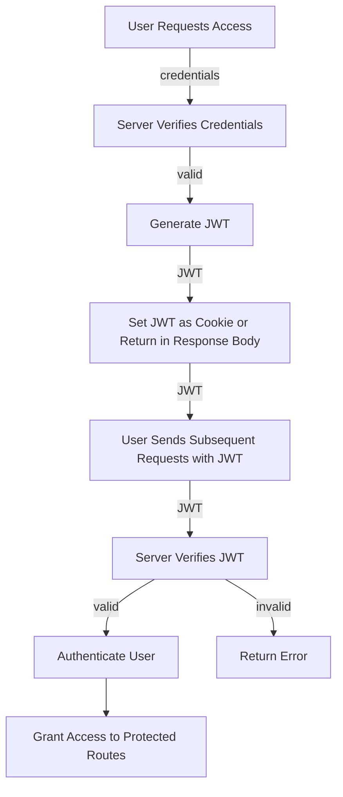

## Introduction
**JSON Web Tokens (JWT)** are a widely used authentication mechanism in web development, and the `golang-jwt/jwt` library is a popular choice for implementing JWT authentication in Go applications. In this section, we will explore what JWT is, why it matters, and its real-world relevance. 
> **Note:** JWT is a compact, URL-safe means of representing claims to be transferred between two parties. 
JWT is a token-based authentication mechanism that allows users to access protected routes without having to re-enter their credentials. 
> **Warning:** JWT is not a replacement for session-based authentication, but rather a complement to it.

## Core Concepts
To understand how JWT works, we need to grasp some core concepts:
* **Header**: The header is the first part of the JWT, and it contains the algorithm used to sign the token.
* **Payload**: The payload is the second part of the JWT, and it contains the claims or data that the token is asserting.
* **Signature**: The signature is the third part of the JWT, and it is generated by signing the header and payload with a secret key.
> **Tip:** The `golang-jwt/jwt` library provides a simple way to generate and verify JWTs in Go applications.
Key terminology includes:
* **Claims**: The data that the JWT is asserting, such as the user's ID or role.
* **Secret key**: The key used to sign the JWT.

## How It Works Internally
Here's a step-by-step breakdown of how JWT works internally:
1. The user sends a request to the server with their credentials.
2. The server verifies the credentials and generates a JWT if they are valid.
3. The server sets the JWT as a cookie or returns it in the response body.
4. The user sends subsequent requests with the JWT included in the `Authorization` header.
5. The server verifies the JWT by checking its signature and payload.
> **Interview:** How does JWT authentication work, and what are the benefits of using it?
Under-the-hood mechanics include the use of the **HMAC-SHA256** algorithm to sign the JWT, which has a time complexity of O(1) and a space complexity of O(1).

## Code Examples
### Example 1: Basic JWT Generation
```go
package main

import (
	"fmt"
	"time"

	"github.com/golang-jwt/jwt/v4"
)

func main() {
	// Set the secret key
	secretKey := "my-secret-key"

	// Set the claims
	claims := jwt.MapClaims{
		"username": "john",
		"exp":      time.Now().Add(time.Hour * 72).Unix(),
	}

	// Generate the JWT
	token := jwt.NewWithClaims(jwt.SigningMethodHS256, claims)
	tokenString, err := token.SignedString([]byte(secretKey))
	if err != nil {
		fmt.Println(err)
		return
	}

	fmt.Println(tokenString)
}
```
### Example 2: Real-World JWT Verification
```go
package main

import (
	"fmt"
	"net/http"

	"github.com/golang-jwt/jwt/v4"
)

func verifyJWT(w http.ResponseWriter, r *http.Request) {
	// Get the JWT from the Authorization header
	tokenString := r.Header.Get("Authorization")

	// Set the secret key
	secretKey := "my-secret-key"

	// Verify the JWT
	token, err := jwt.ParseWithClaims(tokenString, jwt.MapClaims{}, func(token *jwt.Token) (interface{}, error) {
		return []byte(secretKey), nil
	})
	if err != nil {
		http.Error(w, "Invalid JWT", http.StatusUnauthorized)
		return
	}

	// Get the claims
	claims, ok := token.Claims.(jwt.MapClaims)
	if !ok || !token.Valid {
		http.Error(w, "Invalid JWT", http.StatusUnauthorized)
		return
	}

	// Use the claims to authenticate the user
	username := claims["username"].(string)
	fmt.Println(username)
}
```
### Example 3: Advanced JWT Generation with Custom Claims
```go
package main

import (
	"fmt"
	"time"

	"github.com/golang-jwt/jwt/v4"
)

type CustomClaims struct {
	Username string `json:"username"`
	Roles    []string `json:"roles"`
	jwt.RegisteredClaims
}

func main() {
	// Set the secret key
	secretKey := "my-secret-key"

	// Set the custom claims
	claims := CustomClaims{
		Username: "john",
		Roles:   []string{"admin", "moderator"},
		RegisteredClaims: jwt.RegisteredClaims{
			Expiration: jwt.NewNumericDate(time.Now().Add(time.Hour * 72)),
		},
	}

	// Generate the JWT
	token := jwt.NewWithClaims(jwt.SigningMethodHS256, claims)
	tokenString, err := token.SignedString([]byte(secretKey))
	if err != nil {
		fmt.Println(err)
		return
	}

	fmt.Println(tokenString)
}
```

## Visual Diagram

The diagram illustrates the JWT authentication flow, from the user requesting access to the server verifying the JWT and granting access to protected routes.

## Comparison
| Approach | Time Complexity | Space Complexity | Pros | Cons | Best For |
| --- | --- | --- | --- | --- | --- |
| JWT | O(1) | O(1) | Compact, URL-safe, and secure | Can be vulnerable to token theft or tampering | Real-time web applications, mobile apps |
| Session-based Authentication | O(1) | O(n) | Simple to implement, widely supported | Can be vulnerable to session fixation attacks, requires server-side storage | Traditional web applications, legacy systems |
| OAuth 2.0 | O(1) | O(1) | Flexible, secure, and widely adopted | Can be complex to implement, requires additional infrastructure | APIs, microservices, and distributed systems |
| Basic Authentication | O(1) | O(1) | Simple to implement, widely supported | Can be vulnerable to password sniffing, not suitable for production | Development, testing, and legacy systems |

## Real-world Use Cases
1. **GitHub**: GitHub uses JWT to authenticate users and authorize access to protected routes.
2. **Amazon Web Services (AWS)**: AWS uses JWT to authenticate and authorize access to AWS services, such as AWS Lambda and AWS API Gateway.
3. **Google**: Google uses JWT to authenticate users and authorize access to protected routes, such as Google Drive and Google Docs.

## Common Pitfalls
1. **Token theft or tampering**: JWTs can be stolen or tampered with if not properly secured.
> **Warning:** Use HTTPS to encrypt JWTs in transit, and store them securely on the client-side.
2. **Invalid or expired tokens**: JWTs can become invalid or expired if not properly validated or updated.
> **Tip:** Use a library like `golang-jwt/jwt` to validate and update JWTs.
3. **Insufficient secret key**: A weak or insufficient secret key can compromise the security of the JWT.
> **Note:** Use a strong and unique secret key for each JWT.
4. **Lack of token blacklisting**: Failing to blacklist invalid or expired tokens can allow attackers to reuse them.
> **Interview:** How would you implement token blacklisting in a JWT authentication system?

## Interview Tips
1. **What is JWT, and how does it work?**: Be prepared to explain the basics of JWT, including its structure, signing, and verification.
> **Note:** JWT is a compact, URL-safe means of representing claims to be transferred between two parties.
2. **How do you handle token expiration and invalidation?**: Be prepared to explain how you would handle token expiration and invalidation, including the use of token blacklisting.
> **Tip:** Use a library like `golang-jwt/jwt` to validate and update JWTs, and implement token blacklisting to prevent reuse of invalid or expired tokens.
3. **What are some common pitfalls when implementing JWT authentication?**: Be prepared to discuss common pitfalls, such as token theft or tampering, insufficient secret key, and lack of token blacklisting.

## Key Takeaways
* JWT is a compact, URL-safe means of representing claims to be transferred between two parties.
* JWT has a time complexity of O(1) and a space complexity of O(1).
* Use a strong and unique secret key for each JWT.
* Implement token blacklisting to prevent reuse of invalid or expired tokens.
* Use HTTPS to encrypt JWTs in transit, and store them securely on the client-side.
* Validate and update JWTs using a library like `golang-jwt/jwt`.
* Be aware of common pitfalls, such as token theft or tampering, insufficient secret key, and lack of token blacklisting.
* Use JWT in real-time web applications, mobile apps, APIs, microservices, and distributed systems.
* Consider using OAuth 2.0 for APIs, microservices, and distributed systems.