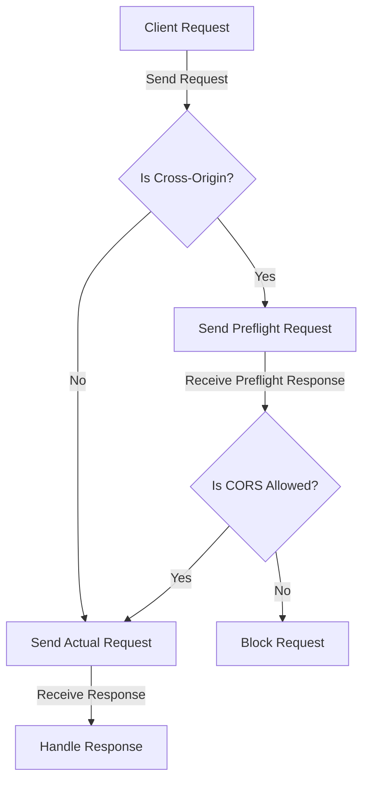

## Introduction
**CORS (Cross-Origin Resource Sharing)** is a security feature implemented in web browsers to prevent web pages from making requests to a different origin (domain, protocol, or port) than the one the web page was loaded from. This is a critical security mechanism to prevent malicious scripts from making unauthorized requests on behalf of the user. In real-world scenarios, CORS handling is crucial when building APIs that need to be accessed by web applications from different domains. For instance, a web application hosted on `https://example.com` may need to make API calls to `https://api.example.net`. Without proper CORS handling, the browser would block these requests, leading to errors and broken functionality.

> **Note:** CORS is not a security feature that protects the server, but rather a feature that protects the user by preventing malicious scripts from making unauthorized requests.

## Core Concepts
To understand CORS handling, it's essential to grasp the following core concepts:
* **Origin**: The domain, protocol, and port of a web page.
* **Cross-origin request**: A request made from a web page to a different origin than the one the web page was loaded from.
* **CORS preflight request**: An optional request sent by the browser to the server before making the actual request to check if the server supports CORS.
* **CORS headers**: HTTP headers that the server includes in its response to indicate which origins are allowed to make requests.

Mental models and analogies can help make these concepts more accessible. Think of CORS as a bouncer at a nightclub. The bouncer (browser) checks the ID (origin) of each guest (request) before letting them in. If the ID is not on the list (allowed origins), the bouncer will not let the guest in, even if they have a valid ticket (API key).

## How It Works Internally
Here's a step-by-step breakdown of how CORS handling works:
1. The client (web application) makes a request to the server.
2. The browser checks if the request is a cross-origin request.
3. If it is, the browser sends a CORS preflight request to the server to check if the server supports CORS.
4. The server responds with CORS headers indicating which origins are allowed to make requests.
5. The browser checks the CORS headers and determines if the request is allowed.
6. If the request is allowed, the browser sends the actual request to the server.

> **Warning:** Failing to handle CORS correctly can lead to security vulnerabilities and broken functionality in web applications.

## Code Examples
### Example 1: Basic CORS Handling in Go
```go
package main

import (
	"fmt"
	"net/http"
)

func corsHandler(w http.ResponseWriter, r *http.Request) {
	// Set CORS headers
	w.Header().Set("Access-Control-Allow-Origin", "*")
	w.Header().Set("Access-Control-Allow-Methods", "GET, POST, PUT, DELETE")
	w.Header().Set("Access-Control-Allow-Headers", "Content-Type, Authorization")

	// Handle the request
	fmt.Fprint(w, "Hello, World!")
}

func main() {
	http.HandleFunc("/", corsHandler)
	http.ListenAndServe(":8080", nil)
}
```
This example demonstrates basic CORS handling in Go by setting the `Access-Control-Allow-Origin` header to `*`, allowing requests from all origins.

### Example 2: Advanced CORS Handling with Preflight Requests
```go
package main

import (
	"fmt"
	"net/http"
)

func corsHandler(w http.ResponseWriter, r *http.Request) {
	// Handle CORS preflight requests
	if r.Method == "OPTIONS" {
		w.Header().Set("Access-Control-Allow-Origin", "*")
		w.Header().Set("Access-Control-Allow-Methods", "GET, POST, PUT, DELETE")
		w.Header().Set("Access-Control-Allow-Headers", "Content-Type, Authorization")
		w.WriteHeader(http.StatusOK)
		return
	}

	// Handle the request
	fmt.Fprint(w, "Hello, World!")
}

func main() {
	http.HandleFunc("/", corsHandler)
	http.ListenAndServe(":8080", nil)
}
```
This example demonstrates how to handle CORS preflight requests by checking the `OPTIONS` method and setting the CORS headers accordingly.

### Example 3: CORS Handling with Custom Origins
```go
package main

import (
	"fmt"
	"net/http"
)

func corsHandler(w http.ResponseWriter, r *http.Request) {
	// Set custom origins
	allowedOrigins := []string{"https://example.com", "https://example.net"}

	// Check if the request origin is allowed
	origin := r.Header.Get("Origin")
	for _, allowedOrigin := range allowedOrigins {
		if origin == allowedOrigin {
			w.Header().Set("Access-Control-Allow-Origin", origin)
			break
		}
	}

	// Handle the request
	fmt.Fprint(w, "Hello, World!")
}

func main() {
	http.HandleFunc("/", corsHandler)
	http.ListenAndServe(":8080", nil)
}
```
This example demonstrates how to set custom origins and check if the request origin is allowed.

## Visual Diagram

This diagram illustrates the CORS handling flow, including preflight requests and custom origin checking.

## Comparison
| Approach | Time Complexity | Space Complexity | Pros | Cons | Best For |
| --- | --- | --- | --- | --- | --- |
| Basic CORS Handling | O(1) | O(1) | Easy to implement, allows requests from all origins | Security risks, no control over allowed origins | Simple web applications |
| Advanced CORS Handling with Preflight Requests | O(1) | O(1) | Allows requests from specific origins, handles preflight requests | More complex to implement, may require additional server configuration | Web applications with specific origin requirements |
| Custom Origin CORS Handling | O(n) | O(n) | Allows requests from specific origins, custom origin checking | More complex to implement, may require additional server configuration | Web applications with complex origin requirements |

> **Tip:** Choose the approach that best fits your web application's requirements, considering security, complexity, and performance.

## Real-world Use Cases
1. **Google Maps**: Google Maps uses CORS handling to allow web applications to make requests to its API from different origins.
2. **Facebook API**: Facebook's API uses CORS handling to allow web applications to make requests to its API from different origins.
3. **AWS API Gateway**: AWS API Gateway uses CORS handling to allow web applications to make requests to its API from different origins.

## Common Pitfalls
1. **Failing to handle CORS preflight requests**: Failing to handle CORS preflight requests can lead to broken functionality in web applications.
2. **Setting incorrect CORS headers**: Setting incorrect CORS headers can lead to security vulnerabilities and broken functionality in web applications.
3. **Not checking the request origin**: Not checking the request origin can lead to security vulnerabilities and broken functionality in web applications.
4. **Not handling CORS errors**: Not handling CORS errors can lead to broken functionality in web applications.

> **Interview:** What is the difference between a simple CORS request and a preflight request? How do you handle CORS preflight requests in your web application?

## Interview Tips
1. **What is CORS and why is it important?**: A strong answer should explain the purpose of CORS, its importance in web security, and its impact on web application functionality.
2. **How do you handle CORS preflight requests?**: A strong answer should explain how to handle CORS preflight requests, including setting CORS headers and handling the `OPTIONS` method.
3. **What are the common pitfalls in CORS handling?**: A strong answer should explain the common pitfalls in CORS handling, including failing to handle CORS preflight requests, setting incorrect CORS headers, and not checking the request origin.

## Key Takeaways
* CORS handling is a critical security feature in web applications.
* CORS preflight requests are used to check if the server supports CORS.
* Custom origin checking can be used to allow requests from specific origins.
* CORS handling can be implemented using various approaches, including basic CORS handling, advanced CORS handling with preflight requests, and custom origin CORS handling.
* Choosing the right approach depends on the web application's requirements, considering security, complexity, and performance.
* Common pitfalls in CORS handling include failing to handle CORS preflight requests, setting incorrect CORS headers, and not checking the request origin.
* Handling CORS errors is crucial to prevent broken functionality in web applications.