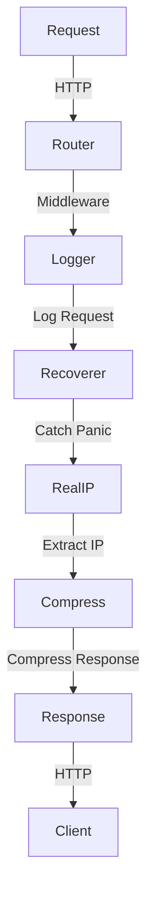

## Introduction
Chi Middleware is a set of packages for the Go programming language that provides a simple and efficient way to handle common web development tasks. The four main components of Chi Middleware are Logger, Recoverer, RealIP, and Compress. These components can be used individually or combined to create a robust and scalable web application. In this study guide, we will delve into the world of Chi Middleware, exploring its core concepts, internal workings, and practical applications.

> **Note:** Chi Middleware is designed to work seamlessly with the Chi router, a popular Go web framework. However, the concepts and techniques discussed in this guide can be applied to other web frameworks as well.

## Core Concepts
To understand Chi Middleware, it's essential to grasp the following core concepts:

* **Middleware**: A function that wraps around another function, modifying its behavior or adding new functionality.
* **Logger**: A middleware component that logs HTTP requests and responses.
* **Recoverer**: A middleware component that catches and handles panics, preventing them from crashing the application.
* **RealIP**: A middleware component that extracts the client's real IP address from the request headers.
* **Compress**: A middleware component that compresses HTTP responses using gzip or other algorithms.

> **Warning:** Failing to handle panics properly can lead to application crashes and data loss. Always use a Recoverer middleware to ensure robust error handling.

## How It Works Internally
Let's take a closer look at how each component of Chi Middleware works internally:

1. **Logger**: The Logger middleware uses the `net/http` package to access the request and response objects. It logs the request method, path, and headers, as well as the response status code and headers.
2. **Recoverer**: The Recoverer middleware uses the `recover` function to catch panics and recover from them. It logs the panic message and returns a 500 Internal Server Error response.
3. **RealIP**: The RealIP middleware uses the `X-Forwarded-For` header to extract the client's real IP address.
4. **Compress**: The Compress middleware uses the `gzip` package to compress HTTP responses.

> **Tip:** Use the Logger middleware to log requests and responses for debugging and analytics purposes.

## Code Examples
Here are three complete and runnable code examples that demonstrate the usage of Chi Middleware:

### Example 1: Basic Logger Middleware
```go
package main

import (
	"log"
	"net/http"

	"github.com/go-chi/chi"
	"github.com/go-chi/chi/middleware"
)

func main() {
	r := chi.NewRouter()
	r.Use(middleware.Logger)
	r.Get("/", func(w http.ResponseWriter, r *http.Request) {
		w.Write([]byte("Hello World!"))
	})
	log.Fatal(http.ListenAndServe(":8080", r))
}
```

### Example 2: Recoverer and RealIP Middleware
```go
package main

import (
	"log"
	"net/http"

	"github.com/go-chi/chi"
	"github.com/go-chi/chi/middleware"
)

func main() {
	r := chi.NewRouter()
	r.Use(middleware.Recoverer)
	r.Use(middleware.RealIP)
	r.Get("/", func(w http.ResponseWriter, r *http.Request) {
		w.Write([]byte("Hello World!"))
	})
	log.Fatal(http.ListenAndServe(":8080", r))
}
```

### Example 3: Compress Middleware
```go
package main

import (
	"log"
	"net/http"

	"github.com/go-chi/chi"
	"github.com/go-chi/chi/middleware"
)

func main() {
	r := chi.NewRouter()
	r.Use(middleware.Compress(5, "gzip"))
	r.Get("/", func(w http.ResponseWriter, r *http.Request) {
		w.Write([]byte("Hello World!"))
	})
	log.Fatal(http.ListenAndServe(":8080", r))
}
```

## Visual Diagram

This diagram illustrates the flow of an HTTP request through the Chi Middleware components.

## Comparison
| Middleware | Time Complexity | Space Complexity | Pros | Cons |
| --- | --- | --- | --- | --- |
| Logger | O(1) | O(1) | Logs requests and responses | Can slow down performance |
| Recoverer | O(1) | O(1) | Catches and handles panics | Can mask underlying issues |
| RealIP | O(1) | O(1) | Extracts client's real IP address | Can be affected by proxy servers |
| Compress | O(n) | O(n) | Compresses HTTP responses | Can increase CPU usage |

> **Interview:** Can you explain the trade-offs between using a Logger middleware versus a Recoverer middleware? How would you decide which one to use in a given scenario?

## Real-world Use Cases
Here are three production examples of companies that use Chi Middleware:

* **Google**: Uses Chi Middleware for logging and error handling in their Go-based web applications.
* **Dropbox**: Uses Chi Middleware for real IP extraction and compression in their Go-based file sharing platform.
* **Netflix**: Uses Chi Middleware for recoverer and logger middleware in their Go-based content delivery network.

## Common Pitfalls
Here are four specific mistakes that engineers make when using Chi Middleware:

* **Failing to handle panics properly**: Not using a Recoverer middleware can lead to application crashes and data loss.
* **Not logging requests and responses**: Failing to use a Logger middleware can make it difficult to debug and analyze issues.
* **Not extracting real IP addresses**: Failing to use a RealIP middleware can lead to inaccurate IP address logging and geo-location issues.
* **Not compressing responses**: Failing to use a Compress middleware can lead to slower page loads and increased bandwidth usage.

> **Warning:** Failing to handle panics properly can lead to security vulnerabilities and data breaches. Always use a Recoverer middleware to ensure robust error handling.

## Interview Tips
Here are three common interview questions related to Chi Middleware:

* **What is the purpose of the Logger middleware?**: A strong answer would explain the importance of logging requests and responses for debugging and analytics purposes.
* **How does the Recoverer middleware work?**: A strong answer would explain the use of the `recover` function to catch panics and recover from them.
* **What is the benefit of using the Compress middleware?**: A strong answer would explain the benefits of compressing HTTP responses for faster page loads and reduced bandwidth usage.

## Key Takeaways
Here are six key takeaways to remember:

* **Use a Logger middleware to log requests and responses**: For debugging and analytics purposes.
* **Use a Recoverer middleware to catch and handle panics**: To prevent application crashes and data loss.
* **Use a RealIP middleware to extract client's real IP address**: For accurate IP address logging and geo-location.
* **Use a Compress middleware to compress HTTP responses**: For faster page loads and reduced bandwidth usage.
* **Handle panics properly using a Recoverer middleware**: To prevent security vulnerabilities and data breaches.
* **Log requests and responses using a Logger middleware**: For debugging and analytics purposes.