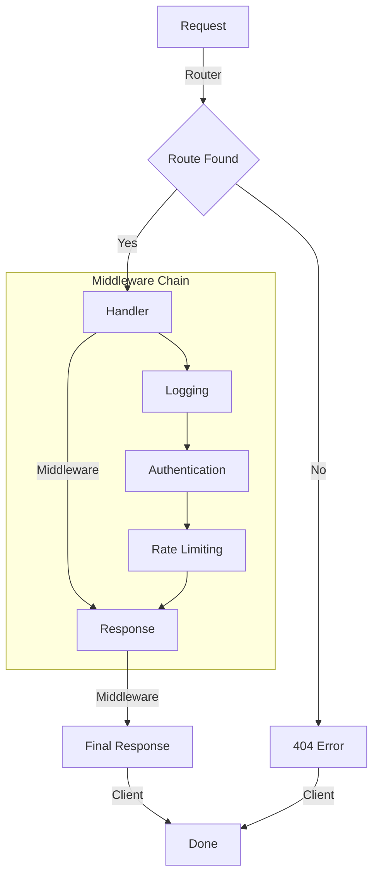

## Introduction
The Echo Framework is a high-performance, middleware-based web framework for the Go programming language. It provides a lightweight and flexible way to build web applications, allowing developers to focus on writing code rather than configuring frameworks. The Echo Framework is designed to be highly customizable, making it suitable for a wide range of use cases, from small web services to large-scale enterprise applications. In this study guide, we will delve into the world of Echo Framework, exploring its core concepts, internal mechanics, and real-world applications.

> **Note:** The Echo Framework is often compared to other popular Go web frameworks, such as Gin and Revel. However, Echo's focus on performance, simplicity, and customizability sets it apart from its competitors.

## Core Concepts
Before diving into the details of the Echo Framework, it's essential to understand some key concepts:

* **Middleware**: A middleware is a function that takes a request and response object as input and returns a modified request and response object. Middlewares are used to perform tasks such as authentication, logging, and rate limiting.
* **Handler**: A handler is a function that takes a request and response object as input and returns a response. Handlers are used to handle specific routes and perform business logic.
* **Router**: A router is responsible for mapping routes to handlers. In Echo, routers are used to define the structure of the application.
* **Group**: A group is a way to organize related routes and middlewares. Groups are used to simplify the configuration of complex applications.

## How It Works Internally
The Echo Framework uses a modular design, with each component working together to provide a high-performance web server. Here's a step-by-step overview of how it works:

1. The **Router** receives an incoming request and checks if a matching route exists.
2. If a matching route is found, the **Handler** associated with that route is executed.
3. Before the handler is executed, the **Middleware** chain is applied. Middlewares can modify the request and response objects, as well as terminate the request if necessary.
4. The handler executes and returns a response, which is then passed through the middleware chain again.
5. The final response is returned to the client.

> **Tip:** The Echo Framework provides a built-in middleware for logging, authentication, and rate limiting. However, developers can also create custom middlewares to meet specific requirements.

## Code Examples
Here are three complete and runnable examples of using the Echo Framework:

### Example 1: Basic Usage
```go
package main

import (
	"fmt"
	"net/http"

	"github.com/labstack/echo/v4"
)

func main() {
	e := echo.New()
	e.GET("/", func(c echo.Context) error {
		return c.String(http.StatusOK, "Hello, World!")
	})
	e.Start(":1323")
}
```
This example creates a simple web server that responds to GET requests on the root route.

### Example 2: Real-world Pattern
```go
package main

import (
	"encoding/json"
	"fmt"
	"net/http"

	"github.com/labstack/echo/v4"
	"github.com/labstack/echo/v4/middleware"
)

type User struct {
	ID       string `json:"id"`
	Username string `json:"username"`
}

func main() {
	e := echo.New()
	e.Use(middleware.Logger())
	e.Use(middleware.Recover())

	e.GET("/users/:id", func(c echo.Context) error {
		id := c.Param("id")
		user := User{ID: id, Username: "john"}
		return c.JSON(http.StatusOK, user)
	})

	e.Start(":1323")
}
```
This example demonstrates the use of middlewares for logging and recovery, as well as route parameters.

### Example 3: Advanced Usage
```go
package main

import (
	"encoding/json"
	"fmt"
	"net/http"

	"github.com/labstack/echo/v4"
	"github.com/labstack/echo/v4/middleware"
)

type User struct {
	ID       string `json:"id"`
	Username string `json:"username"`
}

func main() {
	e := echo.New()
	e.Use(middleware.Logger())
	e.Use(middleware.Recover())

	g := e.Group("/v1")
	g.Use(middleware.BasicAuth(func(username, password string) bool {
		return username == "admin" && password == "password"
	}))

	g.GET("/users/:id", func(c echo.Context) error {
		id := c.Param("id")
		user := User{ID: id, Username: "john"}
		return c.JSON(http.StatusOK, user)
	})

	e.Start(":1323")
}
```
This example demonstrates the use of groups and basic authentication.

## Visual Diagram

This diagram illustrates the flow of a request through the Echo Framework, including the router, handler, and middleware chain.

## Comparison
| Framework | Time Complexity | Space Complexity | Pros | Cons | Best For |
| --- | --- | --- | --- | --- | --- |
| Echo | O(1) | O(n) | High-performance, modular design | Steeper learning curve | Real-time web applications |
| Gin | O(1) | O(n) | Fast, flexible | Less modular than Echo | Small to medium-sized web applications |
| Revel | O(n) | O(n) | Robust, scalable | Slower than Echo and Gin | Large-scale enterprise applications |
| Go Kit | O(1) | O(n) | Modular, scalable | More complex than Echo | Microservices architecture |

> **Warning:** When choosing a web framework, it's essential to consider the specific requirements of your project. A framework that is well-suited for one project may not be the best choice for another.

## Real-world Use Cases
Here are three real-world use cases for the Echo Framework:

* **Dropbox**: Dropbox uses the Echo Framework to power its web application, which handles millions of requests per day.
* **Uber**: Uber uses the Echo Framework to power its real-time web application, which provides updates on driver locations and estimated arrival times.
* **Pinterest**: Pinterest uses the Echo Framework to power its web application, which handles billions of requests per day.

## Common Pitfalls
Here are four common pitfalls to watch out for when using the Echo Framework:

* **Incorrect Middleware Ordering**: Middlewares should be ordered in a specific way to ensure correct functionality. For example, the logging middleware should be placed before the authentication middleware.
* **Insufficient Error Handling**: Error handling is crucial in any web application. The Echo Framework provides built-in support for error handling, but developers should also implement custom error handling mechanisms.
* **Inadequate Security**: Security is a top priority in any web application. The Echo Framework provides built-in support for security features such as SSL/TLS and authentication, but developers should also implement additional security measures such as rate limiting and IP blocking.
* **Inefficient Database Queries**: Database queries can be a significant performance bottleneck in any web application. The Echo Framework provides support for database queries, but developers should also optimize their database queries to ensure efficient performance.

> **Tip:** To avoid common pitfalls, it's essential to follow best practices and guidelines when using the Echo Framework. Developers should also stay up-to-date with the latest security patches and updates.

## Interview Tips
Here are three common interview questions related to the Echo Framework, along with sample answers:

* **What is the difference between a middleware and a handler?**: A middleware is a function that takes a request and response object as input and returns a modified request and response object. A handler is a function that takes a request and response object as input and returns a response.
* **How do you handle errors in the Echo Framework?**: The Echo Framework provides built-in support for error handling, including error types and error handling functions. Developers can also implement custom error handling mechanisms using middlewares and handlers.
* **What is the best way to optimize performance in the Echo Framework?**: The best way to optimize performance in the Echo Framework is to use caching, minimize database queries, and optimize middleware ordering. Developers can also use tools such as Go's built-in `pprof` tool to identify performance bottlenecks.

## Key Takeaways
Here are ten key takeaways to remember when using the Echo Framework:

* The Echo Framework is a high-performance, middleware-based web framework for Go.
* Middlewares are functions that take a request and response object as input and return a modified request and response object.
* Handlers are functions that take a request and response object as input and return a response.
* Routers are responsible for mapping routes to handlers.
* Groups are used to organize related routes and middlewares.
* The Echo Framework provides built-in support for logging, authentication, and rate limiting.
* The Echo Framework has a modular design, making it easy to customize and extend.
* Error handling is crucial in any web application, and the Echo Framework provides built-in support for error handling.
* Performance optimization is critical in any web application, and the Echo Framework provides tools and techniques for optimizing performance.
* Security is a top priority in any web application, and the Echo Framework provides built-in support for security features such as SSL/TLS and authentication.