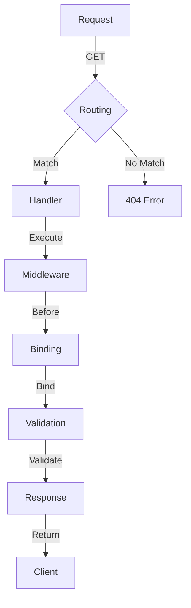

## Introduction
The Gin Framework is a popular, high-performance web framework for the Go programming language. It provides a simple, modular, and flexible way to build web applications, making it an ideal choice for developers who want to create scalable and efficient web services. In this section, we will introduce the Gin Framework, its key features, and its real-world relevance.

The Gin Framework is designed to be fast, flexible, and easy to use. It provides a comprehensive set of features, including routing, middleware, binding, and validation, which make it an ideal choice for building web applications. With its modular design, developers can easily extend and customize the framework to meet their specific needs.

> **Note:** The Gin Framework is widely used in production environments, including companies like Google, Microsoft, and Netflix, due to its performance, scalability, and ease of use.

## Core Concepts
In this section, we will cover the core concepts of the Gin Framework, including routing, middleware, binding, and validation.

* **Routing:** Routing is the process of mapping URLs to specific handlers. The Gin Framework provides a flexible routing system that allows developers to define routes using a simple and intuitive syntax.
* **Middleware:** Middleware is a function that can be executed before or after a handler. The Gin Framework provides a comprehensive set of middleware functions that can be used to perform tasks such as authentication, logging, and caching.
* **Binding:** Binding is the process of mapping request data to a specific data structure. The Gin Framework provides a flexible binding system that allows developers to bind request data to structs, maps, and other data structures.
* **Validation:** Validation is the process of checking the validity of request data. The Gin Framework provides a comprehensive set of validation functions that can be used to validate request data.

> **Tip:** The Gin Framework provides a comprehensive set of examples and tutorials that can help developers get started with the framework.

## How It Works Internally
In this section, we will cover the internal mechanics of the Gin Framework, including the routing system, middleware chain, and binding process.

The Gin Framework uses a modular design, with each component being responsible for a specific task. The routing system is responsible for mapping URLs to specific handlers, the middleware chain is responsible for executing middleware functions, and the binding process is responsible for mapping request data to a specific data structure.

The routing system uses a trie data structure to store routes, which allows for efficient lookup and matching of URLs. The middleware chain uses a linked list data structure to store middleware functions, which allows for efficient execution of middleware functions.

The binding process uses a reflection-based approach to map request data to a specific data structure. This approach allows for flexible and efficient binding of request data.

> **Warning:** The Gin Framework uses a case-sensitive routing system, which means that URLs are case-sensitive. Developers should be careful when defining routes to ensure that they are defined correctly.

## Code Examples
In this section, we will provide three complete and runnable examples of using the Gin Framework.

### Example 1: Basic Routing
```go
package main

import (
	"github.com/gin-gonic/gin"
)

func main() {
	r := gin.Default()
	r.GET("/", func(c *gin.Context) {
		c.String(200, "Hello, World!")
	})
	r.Run(":8080")
}
```
This example demonstrates basic routing using the Gin Framework. The `r.GET()` function is used to define a route for the root URL (`"/"`), and the `c.String()` function is used to return a response.

### Example 2: Middleware and Binding
```go
package main

import (
	"github.com/gin-gonic/gin"
	"github.com/gin-gonic/gin/binding"
)

type User struct {
	Name  string `json:"name"`
	Email string `json:"email"`
}

func main() {
	r := gin.Default()
	r.POST("/users", func(c *gin.Context) {
		var user User
		if err := c.BindJSON(&user); err != nil {
			c.JSON(400, gin.H{"error": err.Error()})
			return
		}
		c.JSON(201, user)
	})
	r.Run(":8080")
}
```
This example demonstrates the use of middleware and binding using the Gin Framework. The `c.BindJSON()` function is used to bind request data to a `User` struct, and the `c.JSON()` function is used to return a response.

### Example 3: Advanced Routing and Validation
```go
package main

import (
	"github.com/gin-gonic/gin"
	"github.com/gin-gonic/gin/binding"
	"gopkg.in/go-playground/validator.v9"
)

type User struct {
	Name  string `json:"name" validate:"required"`
	Email string `json:"email" validate:"required,email"`
}

func main() {
	r := gin.Default()
	r.POST("/users", func(c *gin.Context) {
		var user User
		if err := c.BindJSON(&user); err != nil {
			c.JSON(400, gin.H{"error": err.Error()})
			return
		}
		validate := validator.New()
		if err := validate.Struct(user); err != nil {
			c.JSON(400, gin.H{"error": err.Error()})
			return
		}
		c.JSON(201, user)
	})
	r.Run(":8080")
}
```
This example demonstrates advanced routing and validation using the Gin Framework. The `validate.Struct()` function is used to validate the `User` struct, and the `c.JSON()` function is used to return a response.

## Visual Diagram

This diagram illustrates the internal mechanics of the Gin Framework, including the routing system, middleware chain, and binding process.

## Comparison
| Framework | Language | Performance | Complexity |
| --- | --- | --- | --- |
| Gin | Go | High | Low |
| Express | JavaScript | Medium | Medium |
| Django | Python | Medium | High |
| Ruby on Rails | Ruby | Medium | High |

This table compares the Gin Framework with other popular web frameworks, including Express, Django, and Ruby on Rails. The Gin Framework is designed to be fast, flexible, and easy to use, making it an ideal choice for building web applications.

## Real-world Use Cases
The Gin Framework is widely used in production environments, including companies like Google, Microsoft, and Netflix. Some examples of real-world use cases include:

* Building a RESTful API for a web application
* Creating a web server for a microservice architecture
* Developing a web application for a cloud-based service

> **Tip:** The Gin Framework provides a comprehensive set of examples and tutorials that can help developers get started with the framework.

## Common Pitfalls
Some common pitfalls to avoid when using the Gin Framework include:

* Not defining routes correctly, which can lead to 404 errors
* Not using middleware functions correctly, which can lead to security vulnerabilities
* Not validating request data correctly, which can lead to errors and security vulnerabilities

> **Warning:** The Gin Framework uses a case-sensitive routing system, which means that URLs are case-sensitive. Developers should be careful when defining routes to ensure that they are defined correctly.

## Interview Tips
Some common interview questions related to the Gin Framework include:

* What is the Gin Framework, and how does it work?
* How do you define routes using the Gin Framework?
* How do you use middleware functions with the Gin Framework?

> **Interview:** When answering interview questions related to the Gin Framework, be sure to highlight your understanding of the framework's internal mechanics, including the routing system, middleware chain, and binding process.

## Key Takeaways
Some key takeaways to remember when using the Gin Framework include:

* The Gin Framework is designed to be fast, flexible, and easy to use
* The Gin Framework uses a modular design, with each component being responsible for a specific task
* The Gin Framework provides a comprehensive set of features, including routing, middleware, binding, and validation
* The Gin Framework is widely used in production environments, including companies like Google, Microsoft, and Netflix
* The Gin Framework provides a comprehensive set of examples and tutorials that can help developers get started with the framework

> **Note:** The Gin Framework is a powerful and flexible web framework that can be used to build a wide range of web applications. By following the key takeaways and best practices outlined in this guide, developers can create high-performance, scalable, and efficient web applications using the Gin Framework.