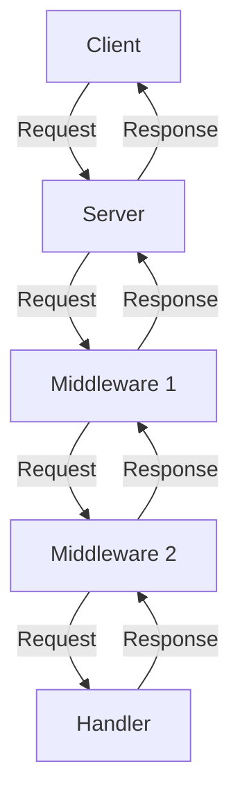

## Introduction
The **Middleware Pattern** is a fundamental concept in software development that allows for the extension of existing systems without modifying their underlying structure. In the context of web development, middleware functions as a bridge between the client and server, enabling the processing of incoming requests and outgoing responses. In **Go**, the middleware pattern is particularly useful for building scalable and maintainable web applications. Every engineer should understand this pattern, as it is essential for creating robust, efficient, and flexible systems.

> **Note:** The middleware pattern is not exclusive to web development; it can be applied to various domains, such as database interactions, file I/O, and more.

## Core Concepts
To grasp the middleware pattern, it's essential to understand the following key concepts:

*   **Middleware function**: A middleware function is a function that takes another function as an argument and returns a new function that "wraps" the original function. This wrapping function can perform additional tasks before or after calling the original function.
*   **Handler function**: A handler function is the primary function that handles incoming requests and returns responses. In the context of web development, a handler function is typically an HTTP handler.
*   **Chain of middleware**: A chain of middleware refers to a series of middleware functions that are composed together to form a pipeline. Each middleware function in the chain processes the request and/or response before passing it to the next function in the chain.

> **Tip:** When designing middleware functions, it's crucial to ensure that they are composable, meaning they can be combined in various ways to create different pipelines.

## How It Works Internally
Here's a step-by-step breakdown of how the middleware pattern works internally:

1.  The client sends a request to the server.
2.  The server receives the request and passes it to the first middleware function in the chain.
3.  The first middleware function processes the request and/or response. It may modify the request, add headers to the response, or perform other tasks.
4.  The first middleware function calls the next middleware function in the chain, passing the modified request and/or response.
5.  Steps 3 and 4 repeat until the last middleware function in the chain is reached.
6.  The last middleware function calls the handler function, passing the final request and/or response.
7.  The handler function processes the request and returns a response.
8.  The response is passed back through the chain of middleware functions, allowing each function to perform any necessary post-processing.
9.  The final response is returned to the client.

> **Warning:** When implementing middleware functions, be cautious not to introduce unnecessary complexity or overhead. Each middleware function should have a specific, well-defined purpose.

## Code Examples
Here are three complete, runnable examples demonstrating the middleware pattern in Go:

### Example 1: Basic Middleware
```go
package main

import (
    "fmt"
    "net/http"
)

// Middleware function that logs the request method and URL
func loggingMiddleware(next http.Handler) http.Handler {
    return http.HandlerFunc(func(w http.ResponseWriter, r *http.Request) {
        fmt.Printf("Request: %s %s\n", r.Method, r.URL)
        next.ServeHTTP(w, r)
    })
}

// Handler function that returns a simple response
func helloHandler(w http.ResponseWriter, r *http.Request) {
    fmt.Fprint(w, "Hello, World!")
}

func main() {
    // Create a new HTTP handler
    handler := http.HandlerFunc(helloHandler)

    // Wrap the handler with the logging middleware
    handler = loggingMiddleware(handler)

    // Start the HTTP server
    http.ListenAndServe(":8080", handler)
}
```

### Example 2: Authentication Middleware
```go
package main

import (
    "encoding/json"
    "errors"
    "net/http"
)

// User struct to represent a user
type User struct {
    Username string `json:"username"`
    Password string `json:"password"`
}

// Authentication middleware function
func authMiddleware(next http.Handler) http.Handler {
    return http.HandlerFunc(func(w http.ResponseWriter, r *http.Request) {
        // Check if the request has a valid authentication token
        token := r.Header.Get("Authorization")
        if token != "secret-token" {
            http.Error(w, "Unauthorized", http.StatusUnauthorized)
            return
        }

        // If authenticated, call the next handler
        next.ServeHTTP(w, r)
    })
}

// Handler function that returns a protected resource
func protectedHandler(w http.ResponseWriter, r *http.Request) {
    user := User{Username: "john", Password: "hello"}
    json.NewEncoder(w).Encode(user)
}

func main() {
    // Create a new HTTP handler
    handler := http.HandlerFunc(protectedHandler)

    // Wrap the handler with the authentication middleware
    handler = authMiddleware(handler)

    // Start the HTTP server
    http.ListenAndServe(":8080", handler)
}
```

### Example 3: Error Handling Middleware
```go
package main

import (
    "errors"
    "net/http"
)

// Error handling middleware function
func errorHandler(next http.Handler) http.Handler {
    return http.HandlerFunc(func(w http.ResponseWriter, r *http.Request) {
        defer func() {
            if err := recover(); err != nil {
                http.Error(w, "Internal Server Error", http.StatusInternalServerError)
            }
        }()

        // Call the next handler
        next.ServeHTTP(w, r)
    })
}

// Handler function that may panic
func panicHandler(w http.ResponseWriter, r *http.Request) {
    // Simulate a panic
    panic(errors.New("Something went wrong"))
}

func main() {
    // Create a new HTTP handler
    handler := http.HandlerFunc(panicHandler)

    // Wrap the handler with the error handling middleware
    handler = errorHandler(handler)

    // Start the HTTP server
    http.ListenAndServe(":8080", handler)
}
```

## Visual Diagram

This diagram illustrates the flow of a request through a chain of middleware functions and a handler function.

## Comparison
| Approach | Time Complexity | Space Complexity | Pros | Cons | Best For |
| --- | --- | --- | --- | --- | --- |
| Middleware Pattern | O(n) | O(1) | Flexible, scalable, maintainable | Can introduce complexity | Web development, API design |
| Decorator Pattern | O(1) | O(1) | Simple, easy to implement | Limited flexibility | Small-scale applications |
| Proxy Pattern | O(1) | O(1) | Easy to implement, flexible | Can introduce overhead | Small-scale applications, caching |

## Real-world Use Cases
Here are three real-world examples of the middleware pattern in use:

*   **Authentication and Authorization**: Many web applications use middleware functions to authenticate and authorize incoming requests. For example, a middleware function might check if a user is logged in before allowing them to access a protected resource.
*   **Caching**: Middleware functions can be used to cache frequently accessed resources, reducing the load on the server and improving performance.
*   **Error Handling**: Middleware functions can be used to catch and handle errors that occur during the execution of a handler function. This can help prevent crashes and provide a better user experience.

## Common Pitfalls
Here are four common pitfalls to watch out for when implementing the middleware pattern:

*   **Overusing Middleware**: While middleware functions can be very useful, overusing them can introduce unnecessary complexity and overhead. Make sure each middleware function has a specific, well-defined purpose.
*   **Incorrect Ordering**: The order in which middleware functions are composed can affect the behavior of the application. Make sure to test and validate the ordering of middleware functions.
*   **Lack of Error Handling**: Middleware functions can introduce new error handling challenges. Make sure to implement robust error handling mechanisms to prevent crashes and provide a good user experience.
*   **Inadequate Testing**: Middleware functions can be difficult to test, but it's essential to ensure they are working correctly. Make sure to write comprehensive tests for each middleware function.

## Interview Tips
Here are three common interview questions related to the middleware pattern, along with some tips for answering them:

*   **What is the middleware pattern, and how does it work?**: This question is designed to test your understanding of the middleware pattern and its internal mechanics. Make sure to provide a clear, concise explanation of the pattern and its benefits.
*   **Can you give an example of a middleware function?**: This question is designed to test your ability to implement a middleware function. Make sure to provide a simple, well-structured example that demonstrates your understanding of the pattern.
*   **How do you handle errors in a middleware function?**: This question is designed to test your understanding of error handling mechanisms in middleware functions. Make sure to provide a clear, concise explanation of how you would handle errors in a middleware function.

> **Interview:** When answering questions about the middleware pattern, make sure to emphasize your understanding of the pattern's benefits, such as flexibility, scalability, and maintainability. Also, be prepared to provide examples of how you have implemented middleware functions in the past.

## Key Takeaways
Here are ten key takeaways to remember about the middleware pattern:

*   The middleware pattern is a fundamental concept in software development that allows for the extension of existing systems without modifying their underlying structure.
*   Middleware functions can be composed together to form a pipeline, enabling the processing of incoming requests and outgoing responses.
*   The order in which middleware functions are composed can affect the behavior of the application.
*   Middleware functions can introduce new error handling challenges, requiring robust error handling mechanisms.
*   The middleware pattern is particularly useful for building scalable and maintainable web applications.
*   Middleware functions can be used to authenticate and authorize incoming requests.
*   Middleware functions can be used to cache frequently accessed resources, reducing the load on the server and improving performance.
*   The middleware pattern can be applied to various domains, such as database interactions, file I/O, and more.
*   When implementing middleware functions, make sure to test and validate their behavior thoroughly.
*   The middleware pattern is a powerful tool for building flexible, scalable, and maintainable systems, but it requires careful planning and implementation to avoid introducing unnecessary complexity and overhead.