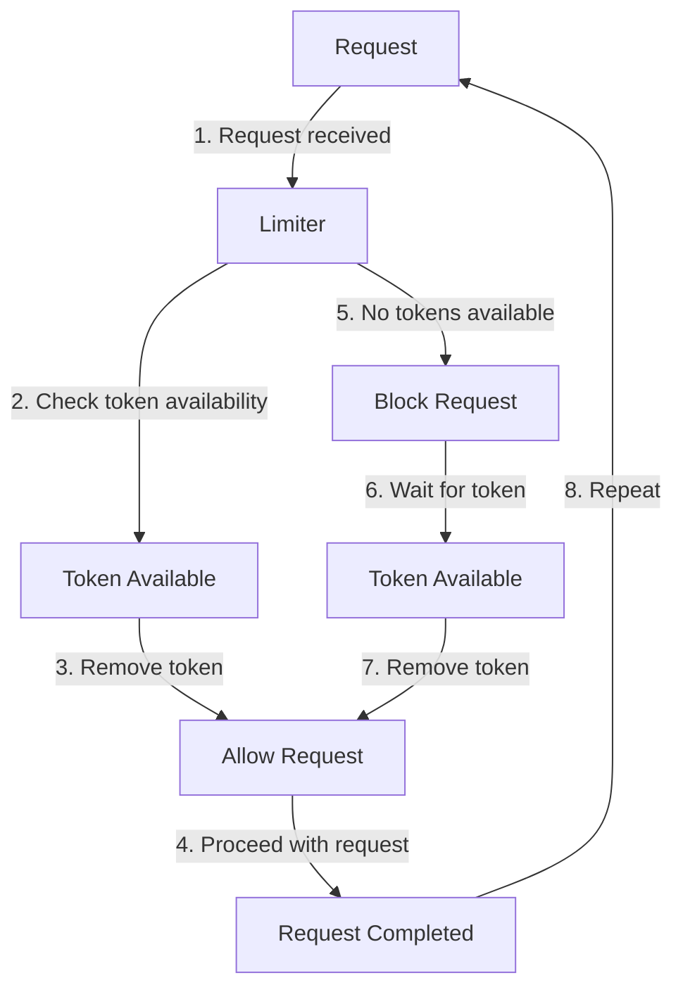

## Introduction
Rate limiting is a crucial concept in web development, as it helps prevent abuse, denial-of-service (DoS) attacks, and ensures fair usage of resources. In Go, the `golang.org/x/time/rate` package provides a robust and efficient way to implement rate limiting. In this study guide, we'll delve into the world of rate limiting with `golang.org/x/time/rate`, exploring its core concepts, internal mechanics, and real-world applications.

> **Note:** Rate limiting is not only essential for web development but also for other areas, such as API design, network security, and system administration.

## Core Concepts
To understand rate limiting with `golang.org/x/time/rate`, we need to grasp the following core concepts:

* **Token bucket algorithm**: A widely used algorithm for rate limiting, which works by maintaining a bucket of tokens. Each token represents a unit of work (e.g., a request). The bucket is filled at a constant rate, and when a request is made, a token is removed from the bucket. If the bucket is empty, the request is blocked until a token is available.
* **Limiter**: A struct that implements the `Limiter` interface, which provides methods for limiting the rate of requests.
* **Token**: A unit of work that represents a single request.

> **Tip:** The token bucket algorithm is a simple yet effective way to implement rate limiting. It's widely used in many systems, including network protocols and operating systems.

## How It Works Internally
The `golang.org/x/time/rate` package uses the token bucket algorithm to implement rate limiting. Here's a step-by-step breakdown of how it works:

1. **Initialization**: A `Limiter` struct is created with a specified rate and burst size. The rate represents the number of tokens added to the bucket per second, while the burst size represents the maximum number of tokens in the bucket.
2. **Token addition**: Tokens are added to the bucket at a constant rate, based on the specified rate.
3. **Request handling**: When a request is made, the `Limiter` checks if there are available tokens in the bucket. If there are, a token is removed from the bucket, and the request is allowed to proceed.
4. **Blocking**: If there are no available tokens in the bucket, the request is blocked until a token is available.

> **Warning:** If the burst size is too small, it can lead to performance issues, as requests may be blocked for an extended period.

## Code Examples
Here are three complete and runnable code examples that demonstrate the usage of `golang.org/x/time/rate`:

### Example 1: Basic Rate Limiting
```go
package main

import (
	"context"
	"fmt"
	"golang.org/x/time/rate"
	"time"
)

func main() {
	// Create a limiter with a rate of 5 requests per second and a burst size of 10
	limiter := rate.NewLimiter(5, 10)

	// Make 10 requests in a row
	for i := 0; i < 10; i++ {
		if err := limiter.Wait(context.Background()); err != nil {
			fmt.Println(err)
		}
		fmt.Println("Request", i, "allowed")
		time.Sleep(100 * time.Millisecond)
	}
}
```

### Example 2: Real-World Pattern
```go
package main

import (
	"context"
	"fmt"
	"golang.org/x/time/rate"
	"net/http"
	"time"
)

func main() {
	// Create a limiter with a rate of 10 requests per second and a burst size of 20
	limiter := rate.NewLimiter(10, 20)

	// Create an HTTP handler that uses the limiter
	http.HandleFunc("/", func(w http.ResponseWriter, r *http.Request) {
		if err := limiter.Wait(context.Background()); err != nil {
			http.Error(w, err.Error(), http.StatusTooManyRequests)
			return
		}
		fmt.Fprint(w, "Hello, world!")
	})

	// Start the HTTP server
	http.ListenAndServe(":8080", nil)
}
```

### Example 3: Advanced Rate Limiting
```go
package main

import (
	"context"
	"fmt"
	"golang.org/x/time/rate"
	"sync"
	"time"
)

func main() {
	// Create a limiter with a rate of 5 requests per second and a burst size of 10
	limiter := rate.NewLimiter(5, 10)

	// Create a WaitGroup to wait for all goroutines to finish
	var wg sync.WaitGroup

	// Start 10 goroutines that make requests in a loop
	for i := 0; i < 10; i++ {
		wg.Add(1)
		go func(i int) {
			defer wg.Done()
			for {
				if err := limiter.Wait(context.Background()); err != nil {
					fmt.Println(err)
				}
				fmt.Println("Request", i, "allowed")
				time.Sleep(100 * time.Millisecond)
			}
		}(i)
	}

	// Wait for all goroutines to finish
	wg.Wait()
}
```

## Visual Diagram

This diagram illustrates the token bucket algorithm used by `golang.org/x/time/rate`. It shows the steps involved in handling a request, from receiving the request to allowing or blocking it based on token availability.

> **Tip:** This diagram helps visualize the internal mechanics of the `golang.org/x/time/rate` package and how it implements rate limiting.

## Comparison
Here's a comparison of different rate limiting approaches:

| Approach | Time Complexity | Space Complexity | Pros | Cons | Best For |
| --- | --- | --- | --- | --- | --- |
| Token Bucket | O(1) | O(1) | Simple, efficient, and flexible | Can be vulnerable to bursty traffic | Web development, API design |
| Leaky Bucket | O(1) | O(1) | Similar to token bucket, but with a "leaky" bucket | Can be less efficient than token bucket | Network protocols, system administration |
| Fixed Window | O(1) | O(1) | Simple and easy to implement | Can be less effective than token bucket or leaky bucket | Simple web applications, prototyping |
| Sliding Window | O(1) | O(1) | More effective than fixed window, but more complex | Can be harder to implement and optimize | Real-time systems, high-traffic web applications |

> **Interview:** What is the time complexity of the token bucket algorithm? (Answer: O(1))

## Real-world Use Cases
Here are three real-world examples of rate limiting in production:

* **GitHub**: GitHub uses rate limiting to prevent abuse and ensure fair usage of its API. It uses a combination of token bucket and leaky bucket algorithms to limit requests.
* **Twitter**: Twitter uses rate limiting to prevent spam and ensure fair usage of its API. It uses a token bucket algorithm to limit requests based on user authentication and IP address.
* **AWS**: AWS uses rate limiting to prevent abuse and ensure fair usage of its services. It uses a combination of token bucket and fixed window algorithms to limit requests based on user authentication and IP address.

> **Note:** Rate limiting is a crucial aspect of web development and API design. It helps prevent abuse, ensures fair usage of resources, and improves overall system performance.

## Common Pitfalls
Here are four common mistakes to avoid when implementing rate limiting:

* **Insufficient burst size**: If the burst size is too small, it can lead to performance issues, as requests may be blocked for an extended period.
* **Incorrect token bucket configuration**: If the token bucket is not configured correctly, it can lead to incorrect rate limiting behavior.
* **Inadequate monitoring**: If rate limiting is not monitored correctly, it can lead to unexpected behavior and performance issues.
* **Inconsistent rate limiting**: If rate limiting is not applied consistently across all requests, it can lead to inconsistent behavior and performance issues.

> **Warning:** Incorrect rate limiting configuration can lead to performance issues, security vulnerabilities, and other problems.

## Interview Tips
Here are three common interview questions related to rate limiting:

* **What is rate limiting, and why is it important?** (Answer: Rate limiting is a technique used to limit the number of requests made to a system within a certain time period. It's important to prevent abuse, ensure fair usage of resources, and improve overall system performance.)
* **How does the token bucket algorithm work?** (Answer: The token bucket algorithm works by maintaining a bucket of tokens. Each token represents a unit of work, and the bucket is filled at a constant rate. When a request is made, a token is removed from the bucket. If the bucket is empty, the request is blocked until a token is available.)
* **How would you implement rate limiting in a web application?** (Answer: I would use a combination of token bucket and leaky bucket algorithms to limit requests based on user authentication and IP address. I would also monitor rate limiting behavior and adjust the configuration as needed to ensure optimal performance and security.)

> **Tip:** When answering interview questions, be sure to provide clear and concise explanations, and use examples to illustrate your points.

## Key Takeaways
Here are 10 key takeaways to remember:

* Rate limiting is a crucial aspect of web development and API design.
* The token bucket algorithm is a simple and effective way to implement rate limiting.
* The leaky bucket algorithm is similar to the token bucket algorithm, but with a "leaky" bucket.
* Fixed window and sliding window algorithms are also used for rate limiting.
* Rate limiting can be used to prevent abuse, ensure fair usage of resources, and improve overall system performance.
* Incorrect rate limiting configuration can lead to performance issues, security vulnerabilities, and other problems.
* Monitoring rate limiting behavior is crucial to ensure optimal performance and security.
* Rate limiting can be applied consistently across all requests to ensure consistent behavior.
* The time complexity of the token bucket algorithm is O(1).
* The space complexity of the token bucket algorithm is O(1).

> **Note:** These key takeaways summarize the most important points to remember when implementing rate limiting with `golang.org/x/time/rate`.