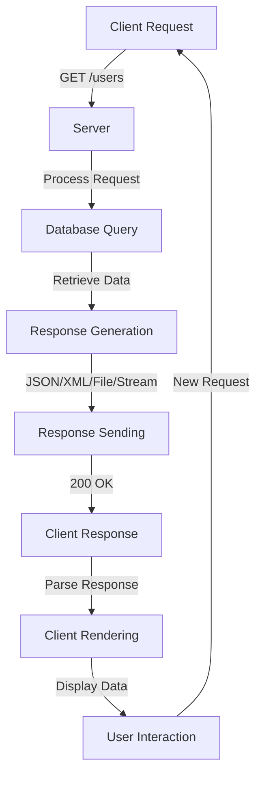

## Introduction
Response formats are a crucial aspect of web development, as they determine how data is sent from the server to the client. **JSON (JavaScript Object Notation)**, **XML (Extensible Markup Language)**, **File**, and **Stream** are the most common response formats used in web development. Understanding these formats is essential for every web developer, as it directly impacts the performance, scalability, and maintainability of web applications. In this section, we will explore the importance of response formats, their real-world relevance, and why every engineer needs to know about them.

> **Note:** Response formats are not limited to web development; they are also used in other areas, such as mobile app development, game development, and IoT (Internet of Things) development.

## Core Concepts
To understand response formats, it's essential to define some key terms:

* **JSON (JavaScript Object Notation)**: a lightweight, text-based data interchange format that is easy to read and write.
* **XML (Extensible Markup Language)**: a markup language that defines a set of rules for encoding documents in a format that is both human-readable and machine-readable.
* **File**: a collection of data stored in a single unit, such as a text file, image file, or video file.
* **Stream**: a sequence of data that is transmitted continuously, such as a video stream or audio stream.

> **Tip:** When choosing a response format, consider the trade-offs between data size, processing time, and complexity.

## How It Works Internally
When a client sends a request to a server, the server processes the request and generates a response. The response is then sent back to the client in a specific format, such as JSON, XML, File, or Stream. Here's a step-by-step breakdown of how it works:

1. **Request**: The client sends a request to the server, specifying the requested resource and any additional parameters.
2. **Server Processing**: The server processes the request, retrieves the requested data, and generates a response.
3. **Response Generation**: The server generates a response in the specified format, such as JSON, XML, File, or Stream.
4. **Response Sending**: The server sends the response back to the client.

> **Warning:** When sending large files or streams, consider using chunked encoding to avoid overwhelming the client.

## Code Examples
Here are three complete and runnable examples in Go, demonstrating how to work with different response formats:

### Example 1: JSON Response
```go
package main

import (
	"encoding/json"
	"fmt"
	"net/http"
)

type User struct {
	Name  string `json:"name"`
	Email string `json:"email"`
}

func handler(w http.ResponseWriter, r *http.Request) {
	user := User{
		Name:  "John Doe",
		Email: "johndoe@example.com",
	}
	json.NewEncoder(w).Encode(user)
}

func main() {
	http.HandleFunc("/", handler)
	http.ListenAndServe(":8080", nil)
}
```

### Example 2: XML Response
```go
package main

import (
	"encoding/xml"
	"fmt"
	"net/http"
)

type User struct {
	XMLName xml.Name `xml:"user"`
	Name    string   `xml:"name"`
	Email   string   `xml:"email"`
}

func handler(w http.ResponseWriter, r *http.Request) {
	user := User{
		Name:  "John Doe",
		Email: "johndoe@example.com",
	}
	w.Header().Set("Content-Type", "application/xml")
	xml.NewEncoder(w).Encode(user)
}

func main() {
	http.HandleFunc("/", handler)
	http.ListenAndServe(":8080", nil)
}
```

### Example 3: File Response
```go
package main

import (
	"fmt"
	"io"
	"net/http"
	"os"
)

func handler(w http.ResponseWriter, r *http.Request) {
	file, err := os.Open("example.txt")
	if err != nil {
		http.Error(w, err.Error(), http.StatusInternalServerError)
		return
	}
	defer file.Close()

	w.Header().Set("Content-Disposition", "attachment; filename=example.txt")
	w.Header().Set("Content-Type", "text/plain")
	io.Copy(w, file)
}

func main() {
	http.HandleFunc("/", handler)
	http.ListenAndServe(":8080", nil)
}
```

## Visual Diagram

This diagram illustrates the flow of a client request, server processing, and response sending.

## Comparison
| Response Format | Time Complexity | Space Complexity | Pros | Cons | Best For |
| --- | --- | --- | --- | --- | --- |
| JSON | O(n) | O(n) | Lightweight, easy to read and write | Limited support for complex data structures | Web development, mobile app development |
| XML | O(n) | O(n) | Human-readable, machine-readable | Verbose, slow parsing | Data exchange, configuration files |
| File | O(1) | O(n) | Easy to store and retrieve | Large file sizes, slow transfer | File sharing, backup systems |
| Stream | O(1) | O(1) | Continuous data transmission, low latency | High bandwidth requirements, complex implementation | Video streaming, live updates |

## Real-world Use Cases
* **JSON**: Used by Twitter to return user data in a lightweight and easy-to-parse format.
* **XML**: Used by Amazon Web Services to return configuration data for their cloud services.
* **File**: Used by Google Drive to store and retrieve files in a cloud-based storage system.
* **Stream**: Used by Netflix to stream video content to their users in real-time.

> **Interview:** Can you explain the trade-offs between using JSON and XML in a web application?

## Common Pitfalls
* **Incorrect JSON syntax**: Using single quotes instead of double quotes can lead to parsing errors.
* **XML namespace conflicts**: Failing to define unique namespaces can cause conflicts and parsing errors.
* **File corruption**: Failing to handle file uploads and downloads correctly can lead to corrupted files.
* **Stream buffering**: Failing to handle stream buffering correctly can lead to slow performance and high latency.

## Interview Tips
* **What is the difference between JSON and XML?**: A strong answer should explain the differences in syntax, parsing, and use cases.
* **How do you handle large file uploads?**: A strong answer should explain the use of chunked encoding, file streaming, and handling errors.
* **What are the benefits of using streams?**: A strong answer should explain the benefits of continuous data transmission, low latency, and high throughput.

## Key Takeaways
* **JSON is lightweight and easy to parse**, but limited in its support for complex data structures.
* **XML is human-readable and machine-readable**, but verbose and slow to parse.
* **Files are easy to store and retrieve**, but can be large and slow to transfer.
* **Streams are continuous and low-latency**, but require high bandwidth and complex implementation.
* **Response formats should be chosen based on the specific use case and requirements**.
* **Understanding the trade-offs between response formats is crucial for building scalable and maintainable web applications**.