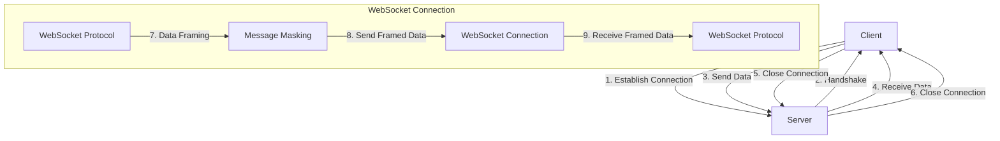

## Introduction
**WebSockets** is a protocol that enables bidirectional, real-time communication between a client (usually a web browser) and a server over the web. This allows for efficient, low-latency communication, making it ideal for applications that require real-time updates, such as live updates, collaborative editing, and gaming. The **gorilla/websocket** package is a popular Go library for working with WebSockets, providing a simple and efficient way to establish and manage WebSocket connections.

> **Note:** WebSockets are a crucial component in modern web development, enabling developers to build responsive, interactive applications that provide a seamless user experience.

In real-world scenarios, WebSockets are used in various applications, such as:

* Live updates: Twitter, Facebook, and other social media platforms use WebSockets to provide real-time updates to their users.
* Collaborative editing: Google Docs, Microsoft Office Online, and other collaborative editing tools use WebSockets to enable real-time collaboration.
* Gaming: Many online gaming platforms use WebSockets to provide low-latency, real-time communication between clients and servers.

## Core Concepts
To understand how WebSockets work, it's essential to grasp the following core concepts:

* **Connection establishment**: The process of establishing a WebSocket connection between a client and a server.
* **Handshake**: A protocol-level handshake that occurs between the client and server to establish the WebSocket connection.
* **Data framing**: The process of breaking down data into smaller frames for transmission over the WebSocket connection.
* **Message masking**: A security feature that masks the payload of WebSocket messages to prevent them from being intercepted and read by unauthorized parties.

> **Warning:** Failing to properly implement message masking can lead to security vulnerabilities in your application.

Key terminology includes:

* **ws**: The WebSocket protocol scheme.
* **wss**: The secure WebSocket protocol scheme (similar to HTTPS).
* **WebSocket connection**: A persistent, bidirectional communication channel between a client and a server.

## How It Works Internally
When a client initiates a WebSocket connection, the following steps occur:

1. The client sends an HTTP request to the server with a `Connection: Upgrade` header and a `Upgrade: websocket` header.
2. The server responds with a `101 Switching Protocols` status code and a `Sec-WebSocket-Accept` header.
3. The client and server perform a handshake to establish the WebSocket connection.
4. Once the connection is established, the client and server can send data to each other using the WebSocket protocol.

```go
// Establish a WebSocket connection
package main

import (
    "fmt"
    "github.com/gorilla/websocket"
    "net/http"
)

var upgrader = websocket.Upgrader{
    ReadBufferSize:  1024,
    WriteBufferSize: 1024,
}

func homeHandler(w http.ResponseWriter, r *http.Request) {
    c, err := upgrader.Upgrade(w, r, nil)
    if err != nil {
        fmt.Println(err)
        return
    }
    defer c.Close()

    for {
        _, message, err := c.ReadMessage()
        if err != nil {
            fmt.Println(err)
            break
        }
        fmt.Println(string(message))
    }
}

func main() {
    http.HandleFunc("/", homeHandler)
    http.ListenAndServe(":8080", nil)
}
```

## Code Examples
Here are three complete, runnable examples that demonstrate the use of WebSockets with the gorilla/websocket package:

### Example 1: Basic WebSocket Connection
This example establishes a basic WebSocket connection between a client and a server.

```go
// Client-side code
package main

import (
    "fmt"
    "github.com/gorilla/websocket"
    "net/http"
)

func main() {
    u := "ws://localhost:8080/"
    c, _, err := websocket.DefaultDialer.Dial(u, nil)
    if err != nil {
        fmt.Println(err)
        return
    }
    defer c.Close()

    for {
        _, message, err := c.ReadMessage()
        if err != nil {
            fmt.Println(err)
            break
        }
        fmt.Println(string(message))
    }
}
```

### Example 2: Real-time Chat Application
This example demonstrates a real-time chat application using WebSockets.

```go
// Server-side code
package main

import (
    "fmt"
    "github.com/gorilla/websocket"
    "net/http"
)

var upgrader = websocket.Upgrader{
    ReadBufferSize:  1024,
    WriteBufferSize: 1024,
}

func homeHandler(w http.ResponseWriter, r *http.Request) {
    c, err := upgrader.Upgrade(w, r, nil)
    if err != nil {
        fmt.Println(err)
        return
    }
    defer c.Close()

    for {
        _, message, err := c.ReadMessage()
        if err != nil {
            fmt.Println(err)
            break
        }
        fmt.Println(string(message))

        // Broadcast the message to all connected clients
        for _, client := range clients {
            err := client.WriteMessage(websocket.TextMessage, message)
            if err != nil {
                fmt.Println(err)
                break
            }
        }
    }
}

func main() {
    http.HandleFunc("/", homeHandler)
    http.ListenAndServe(":8080", nil)
}
```

### Example 3: Advanced WebSocket Application with Authentication
This example demonstrates an advanced WebSocket application with authentication.

```go
// Server-side code
package main

import (
    "fmt"
    "github.com/gorilla/websocket"
    "net/http"
)

var upgrader = websocket.Upgrader{
    ReadBufferSize:  1024,
    WriteBufferSize: 1024,
}

func homeHandler(w http.ResponseWriter, r *http.Request) {
    // Authenticate the client
    token := r.Header.Get("Authorization")
    if token != "secret-token" {
        http.Error(w, "Unauthorized", http.StatusUnauthorized)
        return
    }

    c, err := upgrader.Upgrade(w, r, nil)
    if err != nil {
        fmt.Println(err)
        return
    }
    defer c.Close()

    for {
        _, message, err := c.ReadMessage()
        if err != nil {
            fmt.Println(err)
            break
        }
        fmt.Println(string(message))

        // Broadcast the message to all connected clients
        for _, client := range clients {
            err := client.WriteMessage(websocket.TextMessage, message)
            if err != nil {
                fmt.Println(err)
                break
            }
        }
    }
}

func main() {
    http.HandleFunc("/", homeHandler)
    http.ListenAndServe(":8080", nil)
}
```

## Visual Diagram

This diagram illustrates the WebSocket connection establishment process and the data transmission process.

> **Tip:** Use the `gorilla/websocket` package to establish and manage WebSocket connections in your Go applications.

## Comparison
| Approach | Time Complexity | Space Complexity | Pros | Cons | Best For |
| --- | --- | --- | --- | --- | --- |
| WebSockets | O(1) | O(1) | Real-time communication, bi-directional | Complexity in implementation, security concerns | Real-time applications, live updates |
| HTTP Polling | O(n) | O(n) | Simple implementation, widely supported | Inefficient, latency issues | Simple applications, occasional updates |
| Server-Sent Events (SSE) | O(1) | O(1) | Unidirectional communication, simple implementation | Limited browser support, no bi-directional communication | Live updates, one-way communication |
| Long Polling | O(n) | O(n) | Simple implementation, widely supported | Inefficient, latency issues | Simple applications, occasional updates |

## Real-world Use Cases
Here are three production examples of WebSockets in use:

* **Twitter**: Twitter uses WebSockets to provide real-time updates to its users.
* **Facebook**: Facebook uses WebSockets to provide real-time updates to its users, including live updates and notifications.
* **Google Docs**: Google Docs uses WebSockets to enable real-time collaboration between multiple users.

> **Interview:** What are some common use cases for WebSockets? How do you establish a WebSocket connection in a Go application?

## Common Pitfalls
Here are four specific mistakes to avoid when working with WebSockets:

* **Failing to properly handle disconnections**: Failing to properly handle disconnections can lead to memory leaks and other issues.
* **Not implementing message masking**: Failing to implement message masking can lead to security vulnerabilities in your application.
* **Not handling errors properly**: Failing to handle errors properly can lead to crashes and other issues in your application.
* **Not using the correct WebSocket protocol version**: Using the incorrect WebSocket protocol version can lead to compatibility issues and errors.

```go
// WRONG way: Failing to properly handle disconnections
func homeHandler(w http.ResponseWriter, r *http.Request) {
    c, err := upgrader.Upgrade(w, r, nil)
    if err != nil {
        fmt.Println(err)
        return
    }

    for {
        _, message, err := c.ReadMessage()
        if err != nil {
            fmt.Println(err)
            break
        }
        fmt.Println(string(message))
    }
}

// RIGHT way: Properly handling disconnections
func homeHandler(w http.ResponseWriter, r *http.Request) {
    c, err := upgrader.Upgrade(w, r, nil)
    if err != nil {
        fmt.Println(err)
        return
    }
    defer c.Close()

    for {
        _, message, err := c.ReadMessage()
        if err != nil {
            fmt.Println(err)
            break
        }
        fmt.Println(string(message))
    }
}
```

## Interview Tips
Here are three common interview questions related to WebSockets:

* **What are the advantages and disadvantages of using WebSockets?**: Be prepared to discuss the benefits and drawbacks of using WebSockets, including real-time communication, bi-directional communication, and security concerns.
* **How do you establish a WebSocket connection in a Go application?**: Be prepared to explain the process of establishing a WebSocket connection in a Go application, including the use of the `gorilla/websocket` package.
* **What are some common use cases for WebSockets?**: Be prepared to discuss common use cases for WebSockets, including real-time updates, live updates, and collaborative editing.

> **Note:** Be prepared to provide specific examples and code snippets to demonstrate your understanding of WebSockets.

## Key Takeaways
Here are six key takeaways to remember when working with WebSockets:

* **WebSockets provide real-time, bi-directional communication**: WebSockets enable real-time communication between a client and a server, allowing for efficient and low-latency communication.
* **Use the `gorilla/websocket` package to establish and manage WebSocket connections**: The `gorilla/websocket` package provides a simple and efficient way to establish and manage WebSocket connections in Go applications.
* **Implement message masking to ensure security**: Message masking is a security feature that masks the payload of WebSocket messages to prevent them from being intercepted and read by unauthorized parties.
* **Handle disconnections properly to prevent memory leaks**: Failing to properly handle disconnections can lead to memory leaks and other issues in your application.
* **Use the correct WebSocket protocol version**: Using the incorrect WebSocket protocol version can lead to compatibility issues and errors in your application.
* **WebSockets have a time complexity of O(1) and a space complexity of O(1)**: WebSockets have a constant time complexity and space complexity, making them efficient for real-time communication.