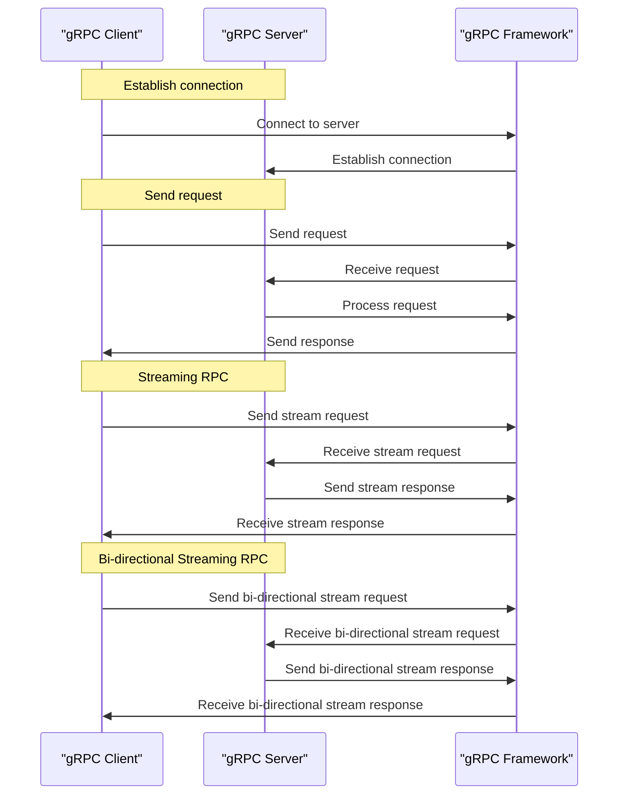

## Introduction
**gRPC** is a high-performance **Remote Procedure Call (RPC)** framework developed by Google. It allows developers to define service interfaces using **Protocol Buffers (protobuf)** and generate client and server code in various programming languages, including **Go**. gRPC is designed to work efficiently in distributed systems, providing features like load balancing, authentication, and error handling. In the context of **Go web development**, gRPC is an attractive choice for building scalable and efficient APIs.

> **Tip:** When building microservices, gRPC can help reduce the overhead of HTTP requests and improve overall system performance.

Real-world companies like **Google**, **Netflix**, and **Dropbox** use gRPC in their production environments. For example, Google uses gRPC to communicate between its services, such as Google Cloud and Google Ads.

## Core Concepts
Here are some key concepts related to gRPC in Go:

* **Protocol Buffers (protobuf)**: A language-agnostic data serialization format developed by Google. It's used to define the structure of data exchanged between gRPC services.
* **gRPC Server**: A server that exposes a set of services, each with its own set of methods. The server handles incoming requests and returns responses.
* **gRPC Client**: A client that connects to a gRPC server and invokes its methods.
* **Service Interface**: A definition of a service, including its methods and parameters, written in protobuf.

> **Note:** protobuf is a critical component of gRPC, as it allows for efficient data serialization and deserialization.

Key terminology includes:

* **Unary RPC**: A simple request-response interaction between a client and a server.
* **Streaming RPC**: A type of interaction where the client or server (or both) can send multiple messages.
* **Bi-directional Streaming RPC**: A type of interaction where both the client and server can send multiple messages.

## How It Works Internally
Here's a step-by-step overview of how gRPC works internally:

1. **Service Definition**: The service interface is defined using protobuf.
2. **Code Generation**: The `protoc` compiler generates client and server code in the desired programming language (in this case, Go).
3. **Server Implementation**: The server implements the service interface, handling incoming requests and returning responses.
4. **Client Implementation**: The client connects to the server and invokes its methods.
5. **gRPC Framework**: The gRPC framework handles the underlying communication, including connection establishment, data serialization, and error handling.

> **Warning:** When using gRPC, it's essential to handle errors properly to avoid crashes or unexpected behavior.

## Code Examples
Here are three complete and runnable examples of using gRPC in Go:

### Example 1: Basic Unary RPC
```go
// greeter.proto
syntax = "proto3";
package greeter;

service Greeter {
  rpc SayHello (HelloRequest) returns (HelloReply) {}
}

message HelloRequest {
  string name = 1;
}

message HelloReply {
  string message = 1;
}
```

```go
// server.go
package main

import (
	"context"
	"log"
	"net"

	"google.golang.org/grpc"

	pb "example/greeter"
)

const (
	port = ":50051"
)

// server is used to implement helloworld.Greeter.
type server struct{}

// SayHello implements helloworld.Greeter.
func (s *server) SayHello(ctx context.Context, in *pb.HelloRequest) (*pb.HelloReply, error) {
	log.Printf("Received: %v\n", in.GetName())
	return &pb.HelloReply{Message: "Hello " + in.GetName()}, nil
}

func main() {
	lis, err := net.Listen("tcp", port)
	if err != nil {
		log.Fatalf("failed to listen: %v", err)
	}
	s := grpc.NewServer()
	pb.RegisterGreeterServer(s, &server{})
	log.Printf("server listening at %v", lis.Addr())
	if err := s.Serve(lis); err != nil {
		log.Fatalf("failed to serve: %v", err)
	}
}
```

```go
// client.go
package main

import (
	"context"
	"log"

	"google.golang.org/grpc"

	pb "example/greeter"
)

const (
	address = "localhost:50051"
)

func main() {
	// Set up a connection to the server.
	conn, err := grpc.Dial(address, grpc.WithInsecure(), grpc.WithBlock())
	if err != nil {
		log.Fatalf("did not connect: %v", err)
	}
	defer conn.Close()
	client := pb.NewGreeterClient(conn)

	// Contact the server and print out its response.
	name := "world"
	r, err := client.SayHello(context.Background(), &pb.HelloRequest{Name: name})
	if err != nil {
		log.Fatalf("could not greet: %v", err)
	}
	log.Printf("Greeting: %s\n", r.GetMessage())
}
```

### Example 2: Streaming RPC
```go
// chat.proto
syntax = "proto3";
package chat;

service Chat {
  rpc SendMessage (stream Message) returns (stream Message) {}
}

message Message {
  string text = 1;
}
```

```go
// server.go
package main

import (
	"context"
	"log"

	"google.golang.org/grpc"

	pb "example/chat"
)

const (
	port = ":50052"
)

// server is used to implement chat.Chat.
type server struct{}

// SendMessage implements chat.Chat.
func (s *server) SendMessage(stream pb.Chat_SendMessageServer) error {
	log.Println("Server started")
	for {
		in, err := stream.Recv()
		if err != nil {
			log.Println("Error receiving message:", err)
			return err
		}
		log.Println("Received message:", in.GetText())
		if err := stream.Send(&pb.Message{Text: "Server response"}); err != nil {
			log.Println("Error sending message:", err)
			return err
		}
	}
}

func main() {
	lis, err := net.Listen("tcp", port)
	if err != nil {
		log.Fatalf("failed to listen: %v", err)
	}
	s := grpc.NewServer()
	pb.RegisterChatServer(s, &server{})
	log.Printf("server listening at %v", lis.Addr())
	if err := s.Serve(lis); err != nil {
		log.Fatalf("failed to serve: %v", err)
	}
}
```

```go
// client.go
package main

import (
	"context"
	"log"

	"google.golang.org/grpc"

	pb "example/chat"
)

const (
	address = "localhost:50052"
)

func main() {
	// Set up a connection to the server.
	conn, err := grpc.Dial(address, grpc.WithInsecure(), grpc.WithBlock())
	if err != nil {
		log.Fatalf("did not connect: %v", err)
	}
	defer conn.Close()
	client := pb.NewChatClient(conn)

	// Contact the server and print out its response.
	stream, err := client.SendMessage(context.Background())
	if err != nil {
		log.Fatalf("could not send message: %v", err)
	}
	if err := stream.Send(&pb.Message{Text: "Hello"}); err != nil {
		log.Fatalf("could not send message: %v", err)
	}
	for {
		in, err := stream.Recv()
		if err != nil {
			log.Println("Error receiving message:", err)
			break
		}
		log.Println("Received message:", in.GetText())
	}
}
```

### Example 3: Bi-directional Streaming RPC
```go
// chat.proto
syntax = "proto3";
package chat;

service Chat {
  rpc ChatStream (stream Message) returns (stream Message) {}
}

message Message {
  string text = 1;
}
```

```go
// server.go
package main

import (
	"context"
	"log"

	"google.golang.org/grpc"

	pb "example/chat"
)

const (
	port = ":50053"
)

// server is used to implement chat.Chat.
type server struct{}

// ChatStream implements chat.Chat.
func (s *server) ChatStream(stream pb.Chat_ChatStreamServer) error {
	log.Println("Server started")
	go func() {
		for {
			in, err := stream.Recv()
			if err != nil {
				log.Println("Error receiving message:", err)
				return
			}
			log.Println("Received message:", in.GetText())
		}
	}()
	for {
		if err := stream.Send(&pb.Message{Text: "Server response"}); err != nil {
			log.Println("Error sending message:", err)
			return err
		}
	}
}

func main() {
	lis, err := net.Listen("tcp", port)
	if err != nil {
		log.Fatalf("failed to listen: %v", err)
	}
	s := grpc.NewServer()
	pb.RegisterChatServer(s, &server{})
	log.Printf("server listening at %v", lis.Addr())
	if err := s.Serve(lis); err != nil {
		log.Fatalf("failed to serve: %v", err)
	}
}
```

```go
// client.go
package main

import (
	"context"
	"log"

	"google.golang.org/grpc"

	pb "example/chat"
)

const (
	address = "localhost:50053"
)

func main() {
	// Set up a connection to the server.
	conn, err := grpc.Dial(address, grpc.WithInsecure(), grpc.WithBlock())
	if err != nil {
		log.Fatalf("did not connect: %v", err)
	}
	defer conn.Close()
	client := pb.NewChatClient(conn)

	// Contact the server and print out its response.
	stream, err := client.ChatStream(context.Background())
	if err != nil {
		log.Fatalf("could not send message: %v", err)
	}
	go func() {
		for {
			in, err := stream.Recv()
			if err != nil {
				log.Println("Error receiving message:", err)
				break
			}
			log.Println("Received message:", in.GetText())
		}
	}()
	for {
		if err := stream.Send(&pb.Message{Text: "Hello"}); err != nil {
			log.Fatalf("could not send message: %v", err)
		}
	}
}
```

## Visual Diagram

The diagram illustrates the interaction between the gRPC client, server, and framework, including connection establishment, request sending, and response receiving.

## Comparison
| Approach | Time Complexity | Space Complexity | Pros | Cons | Best For |
| --- | --- | --- | --- | --- | --- |
| gRPC | O(1) | O(1) | High-performance, efficient, scalable | Steep learning curve, requires protobuf | Distributed systems, microservices |
| REST | O(n) | O(n) | Simple, easy to implement, widely adopted | Limited performance, not suitable for real-time communication | Web APIs, simple services |
| GraphQL | O(n) | O(n) | Flexible, efficient, scalable | Complex, requires significant infrastructure | Complex, data-driven applications |
| WebSocket | O(1) | O(1) | Real-time communication, efficient | Limited support, not suitable for all use cases | Real-time web applications, gaming |

## Real-world Use Cases
Here are some real-world examples of companies using gRPC in production:

* **Google**: Google uses gRPC to communicate between its services, such as Google Cloud and Google Ads.
* **Netflix**: Netflix uses gRPC to handle communication between its microservices.
* **Dropbox**: Dropbox uses gRPC to handle communication between its services, such as file upload and download.

## Common Pitfalls
Here are some common mistakes to avoid when using gRPC:

* **Incorrectly handling errors**: Failing to handle errors properly can lead to crashes or unexpected behavior.
* **Not using protobuf**: Using a different serialization format can lead to performance issues and compatibility problems.
* **Not using streaming RPC**: Failing to use streaming RPC can lead to performance issues and limited scalability.
* **Not handling bi-directional streaming**: Failing to handle bi-directional streaming can lead to performance issues and limited scalability.

## Interview Tips
Here are some common interview questions related to gRPC:

* **What is gRPC and how does it work?**: A strong answer should include a brief overview of gRPC, its components, and how it works.
* **How does gRPC handle errors?**: A strong answer should include a description of how gRPC handles errors, including error codes and error messages.
* **What is the difference between unary and streaming RPC?**: A strong answer should include a description of the differences between unary and streaming RPC, including use cases and performance implications.

## Key Takeaways
Here are some key takeaways to remember:

* **gRPC is a high-performance RPC framework**: gRPC is designed to work efficiently in distributed systems, providing features like load balancing and authentication.
* **protobuf is a critical component of gRPC**: protobuf is used to define the structure of data exchanged between gRPC services.
* **gRPC supports unary and streaming RPC**: gRPC supports both unary and streaming RPC, allowing for flexible and efficient communication.
* **gRPC has a steep learning curve**: gRPC requires a significant amount of knowledge and expertise to use effectively.
* **gRPC is widely adopted in industry**: gRPC is used in production by companies like Google, Netflix, and Dropbox.