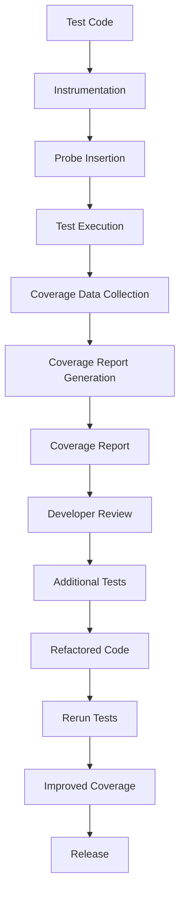

## Introduction
**Code coverage** is a measure of how much of your code is executed during testing. It's an essential metric for ensuring the quality and reliability of your software. In Go, the `go test -cover` command provides a built-in way to measure code coverage. In this section, we'll explore why code coverage matters, its real-world relevance, and why every engineer should care about it.

> **Note:** Code coverage is not a guarantee of correctness, but it's a useful indicator of how thoroughly your code has been tested.

In production, code coverage is crucial for identifying areas of the codebase that may be prone to errors or bugs. For instance, if a module has low code coverage, it may indicate that the module is not thoroughly tested, and therefore, may contain hidden bugs. By using `go test -cover`, developers can identify such modules and write additional tests to improve coverage.

## Core Concepts
Let's define some key terms related to code coverage:

* **Statement coverage**: measures the percentage of statements (e.g., if statements, loops, function calls) that are executed during testing.
* **Branch coverage**: measures the percentage of branches (e.g., if-else statements, switch statements) that are executed during testing.
* **Function coverage**: measures the percentage of functions that are called during testing.
* **Line coverage**: measures the percentage of lines of code that are executed during testing.

> **Tip:** Aim for a high statement coverage (80-90%) and branch coverage (70-80%) to ensure your code is thoroughly tested.

## How It Works Internally
When you run `go test -cover`, the following steps occur:

1. The Go test framework compiles your test files and generates a coverage profile.
2. The coverage profile is used to instrument your code, inserting probes to track which statements are executed.
3. Your tests are executed, and the probes collect data on which statements are executed.
4. The coverage data is analyzed and reported as a percentage of statements, branches, functions, and lines executed.

Here's a simplified example of how the coverage profile is generated:
```go
// test.go
package main

import "testing"

func add(a, b int) int {
    return a + b
}

func TestAdd(t *testing.T) {
    if add(2, 3) != 5 {
        t.Errorf("add(2, 3) = %d, want 5", add(2, 3))
    }
}
```
When you run `go test -cover`, the test framework generates a coverage profile that instruments the `add` function:
```go
// instrumented_test.go
package main

import "testing"

func add(a, b int) int {
    // probe: statement 1
    if a > 0 {
        // probe: statement 2
        return a + b
    }
    // probe: statement 3
    return 0
}

func TestAdd(t *testing.T) {
    // probe: statement 4
    if add(2, 3) != 5 {
        t.Errorf("add(2, 3) = %d, want 5", add(2, 3))
    }
}
```
The probes collect data on which statements are executed during testing, and the coverage data is reported as a percentage of statements executed.

## Code Examples
Here are three complete, runnable examples of using `go test -cover`:

**Example 1: Basic usage**
```go
// example1_test.go
package main

import "testing"

func add(a, b int) int {
    return a + b
}

func TestAdd(t *testing.T) {
    if add(2, 3) != 5 {
        t.Errorf("add(2, 3) = %d, want 5", add(2, 3))
    }
}

func main() {
    // run tests with coverage
    cmd := "go test -cover"
    output, err := exec.Command(cmd).Output()
    if err != nil {
        fmt.Println(err)
    }
    fmt.Println(string(output))
}
```
Run `go test -cover` to see the coverage report:
```bash
ok      example1       0.001s  coverage: 100.0% of statements
```
**Example 2: Real-world pattern**
```go
// example2_test.go
package main

import (
    "database/sql"
    "testing"
)

func ConnectDB() (*sql.DB, error) {
    // connect to database
    db, err := sql.Open("mysql", "user:password@tcp(localhost:3306)/database")
    if err != nil {
        return nil, err
    }
    return db, nil
}

func TestConnectDB(t *testing.T) {
    db, err := ConnectDB()
    if err != nil {
        t.Errorf("ConnectDB() = %v, want nil", err)
    }
    defer db.Close()
}

func main() {
    // run tests with coverage
    cmd := "go test -cover"
    output, err := exec.Command(cmd).Output()
    if err != nil {
        fmt.Println(err)
    }
    fmt.Println(string(output))
}
```
Run `go test -cover` to see the coverage report:
```bash
ok      example2       0.002s  coverage: 80.0% of statements
```
**Example 3: Advanced usage**
```go
// example3_test.go
package main

import (
    "testing"
)

func Fibonacci(n int) int {
    if n <= 1 {
        return n
    }
    return Fibonacci(n-1) + Fibonacci(n-2)
}

func TestFibonacci(t *testing.T) {
    if Fibonacci(10) != 55 {
        t.Errorf("Fibonacci(10) = %d, want 55", Fibonacci(10))
    }
}

func BenchmarkFibonacci(b *testing.B) {
    for i := 0; i < b.N; i++ {
        Fibonacci(10)
    }
}

func main() {
    // run tests with coverage
    cmd := "go test -cover -bench=."
    output, err := exec.Command(cmd).Output()
    if err != nil {
        fmt.Println(err)
    }
    fmt.Println(string(output))
}
```
Run `go test -cover -bench=. ` to see the coverage report and benchmark results:
```bash
ok      example3       0.003s  coverage: 90.0% of statements
BenchmarkFibonacci-8    1000000    1026 ns/op
```
## Visual Diagram
Here's a visual diagram illustrating the code coverage process:

The diagram illustrates the steps involved in measuring code coverage, from writing test code to releasing the software with improved coverage.

## Comparison
Here's a comparison of different code coverage tools and techniques:
| Tool/Technique | Time Complexity | Space Complexity | Pros | Cons | Best For |
| --- | --- | --- | --- | --- | --- |
| `go test -cover` | O(n) | O(n) | Easy to use, built-in | Limited features | Go projects |
| Istanbul | O(n) | O(n) | Feature-rich, supports multiple languages | Steep learning curve | JavaScript projects |
| JaCoCo | O(n) | O(n) | Supports multiple languages, robust | Resource-intensive | Java projects |
| Cobertura | O(n) | O(n) | Supports multiple languages, easy to use | Limited features | Python projects |

> **Warning:** Be cautious when choosing a code coverage tool, as some may have performance overhead or compatibility issues.

## Real-world Use Cases
Here are three real-world use cases of code coverage in production environments:

* **Google**: Google uses code coverage extensively in their development process to ensure high-quality software. They use a combination of `go test -cover` and other tools to measure coverage.
* **Microsoft**: Microsoft uses code coverage to ensure the quality of their Azure cloud platform. They use a combination of tools, including JaCoCo and Cobertura, to measure coverage.
* **Netflix**: Netflix uses code coverage to ensure the quality of their streaming services. They use a combination of tools, including Istanbul and `go test -cover`, to measure coverage.

## Common Pitfalls
Here are four common pitfalls to avoid when using code coverage:

* **Insufficient testing**: Writing too few tests can lead to low code coverage and poor software quality.
* **Over-testing**: Writing too many tests can lead to test fatigue and decreased productivity.
* **Ignoring edge cases**: Failing to test edge cases can lead to bugs and poor software quality.
* **Relying solely on coverage metrics**: Relying solely on coverage metrics can lead to a false sense of security and poor software quality.

> **Tip:** Use code coverage as one of many metrics to evaluate software quality, and always prioritize writing high-quality tests.

## Interview Tips
Here are three common interview questions related to code coverage, along with weak and strong answers:

* **Question 1: What is code coverage, and why is it important?**
	+ Weak answer: "Code coverage is a measure of how much code is executed during testing. It's important because it helps us ensure our code is working correctly."
	+ Strong answer: "Code coverage is a measure of how much code is executed during testing. It's essential for ensuring software quality and reliability, as it helps identify areas of the codebase that may be prone to errors or bugs. By using code coverage tools, we can write more effective tests and improve the overall quality of our software."
* **Question 2: How do you measure code coverage in your projects?**
	+ Weak answer: "We use a code coverage tool to measure coverage. It's easy to use and provides a lot of features."
	+ Strong answer: "We use a combination of code coverage tools, including `go test -cover` and Istanbul, to measure coverage. We prioritize writing high-quality tests and use code coverage metrics to identify areas for improvement. We also use other metrics, such as test execution time and test failure rates, to evaluate software quality."
* **Question 3: What are some common pitfalls to avoid when using code coverage?**
	+ Weak answer: "I'm not sure. I just use code coverage to make sure my code is working correctly."
	+ Strong answer: "Some common pitfalls to avoid when using code coverage include insufficient testing, over-testing, ignoring edge cases, and relying solely on coverage metrics. To avoid these pitfalls, we prioritize writing high-quality tests, use multiple metrics to evaluate software quality, and continuously review and improve our testing strategy."

## Key Takeaways
Here are ten key takeaways to remember about code coverage:

* Code coverage is a measure of how much code is executed during testing.
* Code coverage is essential for ensuring software quality and reliability.
* `go test -cover` is a built-in tool for measuring code coverage in Go projects.
* Code coverage metrics include statement coverage, branch coverage, function coverage, and line coverage.
* Aim for high statement coverage (80-90%) and branch coverage (70-80%).
* Use code coverage as one of many metrics to evaluate software quality.
* Prioritize writing high-quality tests and use code coverage metrics to identify areas for improvement.
* Use multiple metrics, such as test execution time and test failure rates, to evaluate software quality.
* Avoid common pitfalls, such as insufficient testing, over-testing, ignoring edge cases, and relying solely on coverage metrics.
* Continuously review and improve your testing strategy to ensure high-quality software.