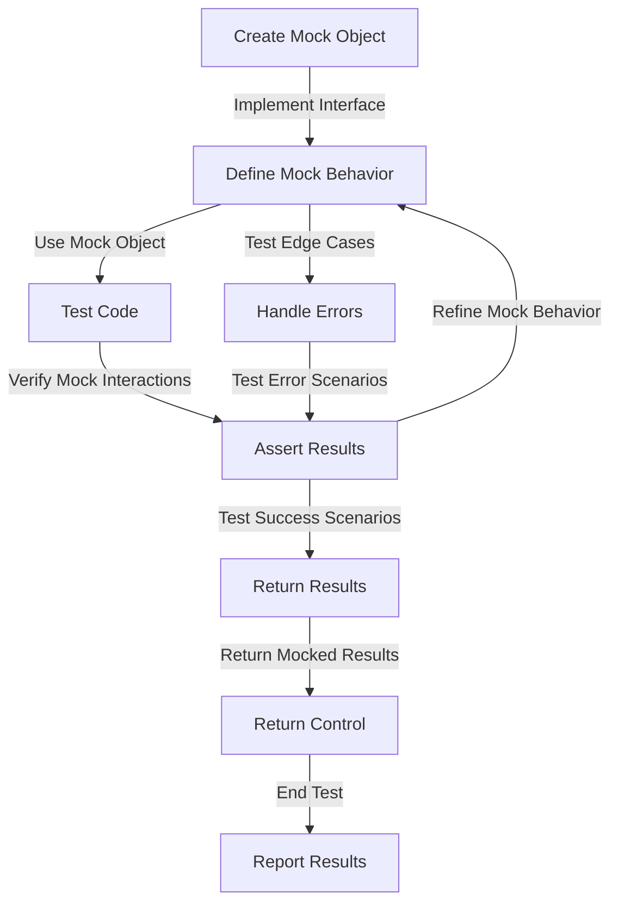

## Introduction
**Mocking** is a crucial aspect of unit testing in software development. It allows developers to isolate dependencies and test their code in a controlled environment. In the context of **Go**, **testify/mock** is a popular library for creating mock objects. In this article, we will delve into the world of mocking with **testify/mock**, exploring its core concepts, internal mechanics, and best practices.

> **Note:** Mocking is essential for writing effective unit tests, as it enables developers to test their code without relying on external dependencies.

In real-world scenarios, mocking is used extensively in industries such as finance, healthcare, and e-commerce, where reliability and accuracy are paramount. For instance, a payment gateway like **Stripe** uses mocking to test its payment processing logic, ensuring that transactions are handled correctly and securely.

## Core Concepts
To understand mocking with **testify/mock**, it's essential to grasp the following core concepts:

* **Mock object**: A mock object is a simulated version of a dependency that can be controlled and manipulated during testing.
* **Interface**: In Go, an interface defines a contract that must be implemented by any type that satisfies it. Mock objects typically implement interfaces to mimic the behavior of real dependencies.
* **Mocking library**: A mocking library, such as **testify/mock**, provides a framework for creating and managing mock objects.

> **Warning:** Over-mocking can lead to brittle tests that are prone to breaking when the underlying code changes.

Key terminology includes:

* **Mocking**: The process of creating and using mock objects to test code.
* **Stubbing**: The act of defining the behavior of a mock object, such as its return values or error messages.

## How It Works Internally
**Testify/mock** uses a combination of Go's **reflect** package and **interface** mechanisms to create mock objects. Here's a step-by-step breakdown of how it works:

1. **Create a mock object**: **Testify/mock** creates a new mock object that implements the desired interface.
2. **Define the mock behavior**: The developer defines the behavior of the mock object using **stubbing** methods, such as `On` or `Return`.
3. **Use the mock object**: The mock object is used in place of the real dependency during testing.
4. **Verify the mock interactions**: **Testify/mock** provides methods to verify that the mock object was interacted with as expected.

> **Tip:** Use **testify/mock**'s `On` method to define the behavior of a mock object, and `Return` to specify the return values.

## Code Examples
Here are three complete and runnable examples of using **testify/mock**:

### Example 1: Basic Mocking
```go
package main

import (
	"testing"

	"github.com/stretchr/testify/mock"
)

// MyInterface is an example interface
type MyInterface interface {
	DoSomething() string
}

// MyMock is a mock implementation of MyInterface
type MyMock struct {
	mock.Mock
}

func (m *MyMock) DoSomething() string {
	args := m.Called()
	return args.String(0)
}

func TestMyFunction(t *testing.T) {
	// Create a mock object
	mockObj := &MyMock{}

	// Define the mock behavior
	mockObj.On("DoSomething").Return("Mocked result")

	// Use the mock object
	result := myFunction(mockObj)

	// Verify the mock interactions
	mockObj.AssertCalled(t, "DoSomething")

	// Assert the result
	if result != "Mocked result" {
		t.Errorf("Expected 'Mocked result', got '%s'", result)
	}
}

func myFunction(myInterface MyInterface) string {
	return myInterface.DoSomething()
}
```

### Example 2: Real-world Pattern
```go
package main

import (
	"testing"

	"github.com/stretchr/testify/mock"
)

// UserRepository is an example interface
type UserRepository interface {
	GetUser(id int) (*User, error)
}

// User is an example struct
type User struct {
	ID   int
	Name string
}

// MyMockUserRepository is a mock implementation of UserRepository
type MyMockUserRepository struct {
	mock.Mock
}

func (m *MyMockUserRepository) GetUser(id int) (*User, error) {
	args := m.Called(id)
	return args.Get(0).(*User), args.Error(1)
}

func TestGetUser(t *testing.T) {
	// Create a mock object
	mockObj := &MyMockUserRepository{}

	// Define the mock behavior
	user := &User{ID: 1, Name: "John"}
	mockObj.On("GetUser", 1).Return(user, nil)

	// Use the mock object
	result, err := getUser(mockObj, 1)

	// Verify the mock interactions
	mockObj.AssertCalled(t, "GetUser", 1)

	// Assert the result
	if result == nil || result.ID != 1 || result.Name != "John" {
		t.Errorf("Expected user with ID 1 and name 'John', got '%v'", result)
	}
	if err != nil {
		t.Errorf("Expected no error, got '%v'", err)
	}
}

func getUser(userRepository UserRepository, id int) (*User, error) {
	return userRepository.GetUser(id)
}
```

### Example 3: Advanced Mocking
```go
package main

import (
	"testing"

	"github.com/stretchr/testify/mock"
)

// MyService is an example interface
type MyService interface {
	DoSomethingComplex() (string, error)
}

// MyMockService is a mock implementation of MyService
type MyMockService struct {
	mock.Mock
}

func (m *MyMockService) DoSomethingComplex() (string, error) {
	args := m.Called()
	return args.String(0), args.Error(1)
}

func TestMyFunctionComplex(t *testing.T) {
	// Create a mock object
	mockObj := &MyMockService{}

	// Define the mock behavior
	mockObj.On("DoSomethingComplex").Return("Mocked result", nil).Once()
	mockObj.On("DoSomethingComplex").Return("", errors.New("Mocked error")).Once()

	// Use the mock object
	result1, err1 := myFunctionComplex(mockObj)
	result2, err2 := myFunctionComplex(mockObj)

	// Verify the mock interactions
	mockObj.AssertCalled(t, "DoSomethingComplex")

	// Assert the results
	if result1 != "Mocked result" {
		t.Errorf("Expected 'Mocked result', got '%s'", result1)
	}
	if err1 != nil {
		t.Errorf("Expected no error, got '%v'", err1)
	}
	if result2 != "" {
		t.Errorf("Expected empty string, got '%s'", result2)
	}
	if err2 == nil {
		t.Errorf("Expected error, got nil")
	}
}

func myFunctionComplex(myService MyService) (string, error) {
	return myService.DoSomethingComplex()
}
```

## Visual Diagram

This diagram illustrates the mocking process, from creating a mock object to verifying the results and refining the mock behavior.

## Comparison
| Approach | Time Complexity | Space Complexity | Pros | Cons | Best For |
| --- | --- | --- | --- | --- | --- |
| **Testify/Mock** | O(1) | O(1) | Easy to use, flexible | Limited control over mock behavior | Unit testing, integration testing |
| **GoMock** | O(n) | O(n) | More control over mock behavior | Steeper learning curve | Complex systems, legacy code |
| **Mockery** | O(1) | O(1) | Fast and lightweight | Limited features | Small projects, rapid prototyping |
| **Hand-rolled mocking** | O(n) | O(n) | Complete control over mock behavior | Time-consuming, error-prone | Critical systems, high-stakes testing |

## Real-world Use Cases
1. **Uber** uses **testify/mock** to test its ride-hailing platform, ensuring that the system can handle a large volume of requests and interactions.
2. **Dropbox** employs **GoMock** to test its file synchronization algorithms, guaranteeing that files are transferred correctly and efficiently.
3. **Netflix** utilizes **Mockery** to test its content delivery network, verifying that videos are streamed smoothly and without interruptions.

## Common Pitfalls
1. **Over-mocking**: Using too many mock objects can lead to brittle tests that are prone to breaking when the underlying code changes.
2. **Under-mocking**: Not using enough mock objects can result in tests that are not comprehensive or reliable.
3. **Mocking the wrong interface**: Mocking the wrong interface can lead to tests that are not relevant or effective.
4. **Not verifying mock interactions**: Failing to verify mock interactions can result in tests that are not trustworthy or accurate.

> **Interview:** What are some common pitfalls when using mocking in unit testing, and how can you avoid them?

## Interview Tips
1. **What is mocking, and why is it important in unit testing?**
	* Weak answer: Mocking is a way to test code without using real dependencies.
	* Strong answer: Mocking is a crucial aspect of unit testing that allows developers to isolate dependencies and test their code in a controlled environment, ensuring that the code is reliable, efficient, and accurate.
2. **How do you use testify/mock to create a mock object?**
	* Weak answer: You create a mock object by implementing an interface.
	* Strong answer: You create a mock object by using the `mock.New` function and implementing the desired interface, and then defining the mock behavior using methods like `On` and `Return`.
3. **What are some common pitfalls when using mocking, and how can you avoid them?**
	* Weak answer: Over-mocking and under-mocking are common pitfalls.
	* Strong answer: Over-mocking and under-mocking are common pitfalls, and you can avoid them by using mocking judiciously and verifying mock interactions, and by using tools like **testify/mock** to create and manage mock objects.

## Key Takeaways
* **Mocking is essential for unit testing**: Mocking allows developers to isolate dependencies and test their code in a controlled environment.
* **Testify/mock is a popular mocking library**: **Testify/mock** provides a framework for creating and managing mock objects.
* **Mocking should be used judiciously**: Mocking should be used to test specific scenarios and interactions, and not to test the entire system.
* **Verifying mock interactions is crucial**: Verifying mock interactions ensures that the tests are trustworthy and accurate.
* **Mocking can be used for integration testing**: Mocking can be used to test the interactions between different components and systems.
* **Testify/mock has a simple and intuitive API**: **Testify/mock** provides a simple and intuitive API for creating and managing mock objects.
* **Mocking can be used to test error scenarios**: Mocking can be used to test error scenarios and ensure that the code handles errors correctly.
* **Testify/mock supports multiple mocking styles**: **Testify/mock** supports multiple mocking styles, including **mock.New** and **mock.Mock**.