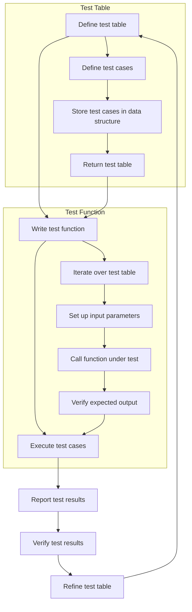

## Introduction
The **Table-driven Tests Pattern** is a software testing technique used to write unit tests in a concise and efficient manner. This approach involves defining a set of test cases in a table or a data structure, where each row represents a test case with its input parameters and expected output. The pattern is particularly useful when dealing with complex logic or algorithms that require multiple test cases to cover different scenarios. In this section, we will explore the importance of table-driven tests and their real-world relevance.

In production environments, table-driven tests are commonly used to test database interactions, API endpoints, or complex business logic. For example, when testing a payment processing system, you might want to test different payment methods (e.g., credit card, PayPal), different payment amounts, and different currencies. Without table-driven tests, you would need to write multiple test functions, each covering a specific scenario. With table-driven tests, you can define a single test function that iterates over a table of test cases, making your test code more concise and easier to maintain.

> **Note:** Table-driven tests are not limited to unit tests; they can also be applied to integration tests, end-to-end tests, or any other type of test that requires multiple test cases.

## Core Concepts
To understand the table-driven tests pattern, you need to grasp the following core concepts:

* **Test case**: A test case is a set of input parameters and expected output that defines a specific scenario to be tested.
* **Test table**: A test table is a data structure that stores multiple test cases, where each row represents a test case.
* **Test function**: A test function is a function that iterates over a test table and executes each test case.

Mental models and analogies can help you understand these concepts better. Think of a test table as a spreadsheet, where each row represents a test case. The test function is like a script that iterates over the spreadsheet, executing each row (test case) and verifying the expected output.

Key terminology includes:

* **Test-driven development (TDD)**: A software development process that relies on writing automated tests before writing the actual code.
* **Behavior-driven development (BDD)**: A software development process that focuses on defining the desired behavior of the system through automated tests.

## How It Works Internally
The table-driven tests pattern works internally as follows:

1. Define a test table: Create a data structure (e.g., array, slice, or map) that stores multiple test cases.
2. Write a test function: Create a function that iterates over the test table and executes each test case.
3. Execute test cases: For each test case, the test function sets up the input parameters, calls the function under test, and verifies the expected output.
4. Report test results: The test function reports the test results, indicating whether each test case passed or failed.

Under-the-hood mechanics involve using a programming language's built-in data structures and control flow statements to implement the test table and test function.

> **Tip:** When implementing table-driven tests, consider using a programming language's built-in testing framework, such as Go's `testing` package, to simplify the process of writing and running tests.

## Code Examples
Here are three complete and runnable code examples in Go that demonstrate the table-driven tests pattern:

### Example 1: Basic Usage
```go
package main

import (
	"testing"
)

func add(x, y int) int {
	return x + y
}

func TestAdd(t *testing.T) {
	tests := []struct {
		x    int
		y    int
		want int
	}{
		{1, 2, 3},
		{2, 3, 5},
		{0, 0, 0},
	}

	for _, tt := range tests {
		if got := add(tt.x, tt.y); got != tt.want {
			t.Errorf("add(%d, %d) = %d, want %d", tt.x, tt.y, got, tt.want)
		}
	}
}
```

### Example 2: Real-world Pattern
```go
package main

import (
	"testing"
)

type PaymentMethod int

const (
	CreditCard PaymentMethod = iota
	PayPal
)

func processPayment(amount float64, method PaymentMethod) (float64, error) {
	// Simulate payment processing
	if method == CreditCard {
		return amount * 0.9, nil
	} else if method == PayPal {
		return amount * 0.8, nil
	}
	return 0, nil
}

func TestProcessPayment(t *testing.T) {
	tests := []struct {
		amount float64
		method  PaymentMethod
		want    float64
	}{
		{10.0, CreditCard, 9.0},
		{20.0, PayPal, 16.0},
		{0.0, CreditCard, 0.0},
	}

	for _, tt := range tests {
		got, err := processPayment(tt.amount, tt.method)
		if err != nil {
			t.Errorf("processPayment(%f, %d) = %v, want no error", tt.amount, tt.method, err)
		} else if got != tt.want {
			t.Errorf("processPayment(%f, %d) = %f, want %f", tt.amount, tt.method, got, tt.want)
		}
	}
}
```

### Example 3: Advanced Usage
```go
package main

import (
	"testing"
)

func fibonacci(n int) int {
	if n <= 1 {
		return n
	}
	return fibonacci(n-1) + fibonacci(n-2)
}

func TestFibonacci(t *testing.T) {
	tests := []struct {
		n    int
		want int
	}{
		{0, 0},
		{1, 1},
		{2, 1},
		{3, 2},
		{4, 3},
		{5, 5},
	}

	for _, tt := range tests {
		if got := fibonacci(tt.n); got != tt.want {
			t.Errorf("fibonacci(%d) = %d, want %d", tt.n, got, tt.want)
		}
	}
}
```

## Visual Diagram

The diagram illustrates the table-driven tests pattern, showing the relationships between defining a test table, writing a test function, executing test cases, and reporting test results. The subgraphs highlight the internal mechanics of the test function and test table.

## Comparison
| Approach | Time Complexity | Space Complexity | Pros | Cons | Best For |
| --- | --- | --- | --- | --- | --- |
| Table-driven tests | O(n) | O(n) | Concise, efficient, easy to maintain | Limited flexibility, requires upfront planning | Unit tests, integration tests |
| Test-driven development (TDD) | O(n) | O(n) | Ensures test coverage, promotes good design | Time-consuming, requires discipline | Software development, legacy code |
| Behavior-driven development (BDD) | O(n) | O(n) | Focuses on desired behavior, promotes collaboration | Requires training, can be slow | Agile development, complex systems |

## Real-world Use Cases
Here are three real-world examples of table-driven tests in production environments:

1. **Google's testing framework**: Google's testing framework uses table-driven tests to test its complex algorithms and data structures.
2. **Amazon's payment processing system**: Amazon's payment processing system uses table-driven tests to test its payment processing logic, ensuring that different payment methods and amounts are handled correctly.
3. **Dropbox's file synchronization system**: Dropbox's file synchronization system uses table-driven tests to test its file synchronization logic, ensuring that files are synchronized correctly across different devices and platforms.

> **Warning:** Table-driven tests can become cumbersome if not managed properly. Make sure to keep your test tables organized, and use clear and concise naming conventions.

## Common Pitfalls
Here are four common mistakes to watch out for when using table-driven tests:

1. **Insufficient test coverage**: Failing to cover all possible scenarios or edge cases can lead to false positives or false negatives.
2. **Inconsistent test data**: Using inconsistent or invalid test data can lead to incorrect test results or test failures.
3. **Overly complex test tables**: Using overly complex test tables can make it difficult to maintain or understand the tests.
4. **Inadequate test reporting**: Failing to report test results clearly or concisely can make it difficult to diagnose issues or identify trends.

> **Tip:** Use a testing framework's built-in features, such as test filtering or test grouping, to simplify the process of writing and running table-driven tests.

## Interview Tips
Here are three common interview questions related to table-driven tests, along with weak and strong answers:

1. **What is the purpose of table-driven tests?**
	* Weak answer: "Table-driven tests are used to test code."
	* Strong answer: "Table-driven tests are used to write concise and efficient unit tests by defining a set of test cases in a table or data structure."
2. **How do you ensure test coverage with table-driven tests?**
	* Weak answer: "I just write a lot of tests."
	* Strong answer: "I use a combination of test-driven development and table-driven tests to ensure that all possible scenarios and edge cases are covered."
3. **What are some common pitfalls to watch out for when using table-driven tests?**
	* Weak answer: "I'm not sure."
	* Strong answer: "Some common pitfalls include insufficient test coverage, inconsistent test data, overly complex test tables, and inadequate test reporting."

## Key Takeaways
Here are ten key takeaways to remember when using table-driven tests:

* Table-driven tests are a concise and efficient way to write unit tests.
* Define a test table with clear and concise naming conventions.
* Use a testing framework's built-in features to simplify the process of writing and running table-driven tests.
* Ensure test coverage by using a combination of test-driven development and table-driven tests.
* Use consistent and valid test data to avoid incorrect test results or test failures.
* Keep test tables organized and easy to maintain.
* Report test results clearly and concisely to diagnose issues or identify trends.
* Use test filtering or test grouping to simplify the process of writing and running table-driven tests.
* Avoid overly complex test tables or test logic.
* Use table-driven tests to test complex algorithms or data structures.

> **Interview:** When interviewing for a software engineering position, be prepared to answer questions about table-driven tests, such as how to ensure test coverage or how to avoid common pitfalls. Show that you understand the benefits and limitations of table-driven tests and can apply them effectively in a production environment.